# 🏛️ AcademiaNeiva — Plataforma Integral de Gestión Académica, Curricular y Convivencial

<div align="center">


**Sistema de Información Misional de Alto Rendimiento para Instituciones Educativas Oficiales y Privadas del Municipio de Neiva, Huila, Colombia.**

[🚀 Puesta en Marcha](#-puesta-en-marcha-y-despliegue-local) • [📐 Arquitectura Técnica](#-arquitectura-técnica-y-stack-tecnológico) • [🧩 Catálogo de Módulos (21)](#-catálogo-integral-de-módulos-21) • [⚖️ Marco Normativo MEN](#️-cumplimiento-normativo-y-legal-colombiano) • [🔒 Seguridad y RBAC](#-seguridad-control-de-acceso-y-auditoría) • [📖 Portal de Documentación Web](#-portal-de-documentación-web-docs)

</div>

---

## 🌟 1. Visión General del Proyecto

**AcademiaNeiva** es una solución tecnológica integral diseñada para resolver la fragmentación operativa, la inconsistencia de datos y la sobrecarga administrativa en los colegios de educación básica y media. 

A diferencia de los sistemas tradicionales de notas que operan como simples hojas de cálculo web, **AcademiaNeiva** implementa un modelo de **Gobierno Académico Estricto**:
- **Alineación Curricular Nacional:** Integra el catálogo oficial de **Derechos Básicos de Aprendizaje (DBA)** del Ministerio de Educación Nacional (MEN) con matrices de competencias y evidencias evaluables.
- **Inmutabilidad y Auditoría:** Registro de calificaciones con cierre formal de periodos académicos, evitando adulteraciones extemporáneas sin autorización directiva formal.
- **Trazabilidad del Estudiante 360°:** Hoja de vida unificada con matrículas históricas, traslados inter-colegiales, inasistencias justificadas/injustificadas, observador digital de convivencia y emisión de boletines oficiales PDF con firmas digitales y códigos de verificación.
- **Supervisión Centralizada:** Panel de control para el Administrador General (Secretaría de Educación / Auditoría) con capacidad de supervisión temporal en modo solo-lectura o edición controlada sobre cualquier colegio adscrito.

---

## 📐 2. Arquitectura Técnica y Stack Tecnológico

El sistema opera bajo un monorepositorio estructurado en capas desacopladas con tipado estricto de extremo a extremo:

```
┌─────────────────────────────────────────────────────────────────────────────┐
│                          CAPA DE PRESENTACIÓN (SPA)                         │
│   • Vue 3 (Composition API <script setup lang="ts">) + Vite                 │
│   • TailwindCSS + Clases de Utilidad Personalizadas (Glassmorphism / Dark) │
│   • Pinia (Gestión de Estado Reactivo) + Vue Router (Guardias RBAC)         │
│   • Lucide Icons + Mermaid.js (Diagramas SVG) + Marked.js (Markdown Engine) │
└──────────────────────────────────────┬──────────────────────────────────────┘
                                       │ HTTP / REST / JSON (JWT + JTI)
┌──────────────────────────────────────▼──────────────────────────────────────┐
│                         CAPA DE SERVICIOS API (Backend)                     │
│   • Node.js + Express + TypeScript (Arquitectura Limpia en Controladores)   │
│   • Kysely QueryBuilder (Consultas SQL tipadas con db.types.ts)             │
│   • Zod Schema Validator (Validación estricta de payloads en runtime)       │
│   • Nodemailer / Brevo API (Transaccionalidad de correos y tokens OTP)      │
│   • PDFKit / Puppeteer (Generación de boletines, carnets y certificados)    │
└──────────────────────────────────────┬──────────────────────────────────────┘
                                       │ Conexiones Pool / Transacciones ACID
┌──────────────────────────────────────▼──────────────────────────────────────┐
│                       CAPA DE PERSISTENCIA (PostgreSQL)                     │
│   • PostgreSQL 16+ Relacional (62 Tablas Maestras y Relacionales)           │
│   • Triggers PL/pgSQL (Inmutabilidad de auditoría, recálculo de promedios) │
│   • Índices B-Tree optimizados para filtros escolares multi-colegio         │
└─────────────────────────────────────────────────────────────────────────────┘
```

### Tecnologías Principales:
| Área | Tecnologías | Propósito |
|---|---|---|
| **Frontend** | `Vue 3`, `Vite`, `TypeScript`, `TailwindCSS`, `Pinia`, `Lucide Vue Next` | Interfaz reactiva, rápida, responsiva con temas visuales oscuros y modales accesibles. |
| **Backend** | `Node.js`, `Express`, `TypeScript`, `Kysely`, `Zod`, `Bcrypt` | API REST robusta, tipado estático completo, validación de esquemas y transacciones ACID. |
| **Base de Datos** | `PostgreSQL 16`, `PL/pgSQL Triggers`, `pg-pool` | 62 tablas normalizadas, consistencia relacional y control de concurrencia. |
| **Seguridad** | `JWT (HMAC-SHA256)`, `JTI Blacklist`, `OTP 6 dígitos`, `Signed URLs Anti-IDOR` | Autenticación blindada, revocación inmediata de sesiones y protección de documentos. |
| **Documentación** | `Marked.js`, `Mermaid.js`, `DocsRelationshipGraph (SVG Bézier)` | Portal web vivo `/docs` sobre archivos Markdown como Fuente Única de Verdad. |

---

## 🧩 3. Catálogo Integral de Módulos (21)

La plataforma organiza sus 21 módulos en un **Pipeline de 6 Dominios de Negocio**:

```mermaid
graph LR
    subgraph D1["1. Identidad y Gobernanza"]
        M01["01. Autenticación"]
        M02["02. Gestión Colegios"]
        M03["03. Usuarios y Directivos"]
        M15["15. Supervisión y Auditoría"]
        M21["21. Flujo Correos y OTP"]
    end
    subgraph D2["2. Estructura Escolar"]
        M04["04. Estructura Escolar"]
        M05["05. Asignación Docente"]
    end
    subgraph D3["3. Admisiones y Matrículas"]
        M06["06. Matrículas"]
        M07["07. Estudiantes y Estados"]
        M17["17. Gestión de Padres"]
        M18["18. Traslados"]
    end
    subgraph D4["4. Diseño Curricular"]
        M08["08. Config. Académica"]
        M09["09. Competencias MEN"]
        M10["10. Catálogo DBA"]
    end
    subgraph D5["5. Evaluación y Aula"]
        M11["11. Calificaciones"]
        M12["12. Observador Convivencia"]
        M13["13. Control Asistencia"]
    end
    subgraph D6["6. Cierre y Promoción"]
        M14["14. Cierre y Boletines PDF"]
        M19["19. Seguimiento y Promoción"]
        M20["20. Alertas Directivas"]
        M16["16. Mesa de Soporte"]
    end

    M01 --> M02 --> M03 --> M04 --> M05 --> M06 --> M07 --> M08 --> M09 --> M10 --> M11 --> M12 --> M13 --> M14 --> M19 --> M20
    M06 -.-> M18
    M06 -.-> M17
    M01 -.-> M21
    M03 -.-> M15
    M06 -.-> M16
```



### Tabla Resumen de Módulos:
| # | Módulo | Dominio | Actores Clave | Tablas SQL Principales |
|---|---|---|---|---|
| **01** | **Autenticación y Seguridad** | Identidad | Todos los roles | `usuario`, `roles`, `usuario_roles`, `token_blacklist` |
| **02** | **Gestión de Colegios** | Gobernanza | Admin General | `colegio`, `usuario_colegio`, `registro_institucional` |
| **03** | **Usuarios y Directivos** | Gobernanza | Admin, Directivo | `usuario`, `directivo`, `secretaria` |
| **04** | **Estructura Escolar** | Estructura | Directivo | `sedes`, `nivel_escolar`, `tipo_grado`, `grupos`, `jornada`, `secciones` |
| **05** | **Gestión y Asignación Docente**| Estructura | Directivo, Docente | `docente`, `detalle_grados`, `asignacion_docente` |
| **06** | **Matrículas y Documentos** | Admisiones | Directivo, Acudiente | `matricula`, `documento_matriculas`, `renovacion_matricula` |
| **07** | **Estudiantes y Estados** | Admisiones | Directivo, Docente | `estudiante`, `sancion`, `tipo_sancion`, `registro_graduados` |
| **08** | **Configuración Académica** | Curricular | Directivo | `materias`, `areas`, `periodo_academico`, `anio_lectivo` |
| **09** | **Competencias y Sincronización**| Curricular | Directivo, Docente | `competencias`, `logros`, `eje_tematico` |
| **10** | **Catálogo DBA (MEN)** | Curricular | Directivo, Docente | `dba`, `evidencias_dba`, `lineamientos_men` |
| **11** | **Calificaciones y Evaluación** | Aula | Docente, Estudiante | `notas_actividad`, `actividad_materia`, `resultado_academico` |
| **12** | **Observador del Alumno** | Aula | Docente, Directivo | `observacion_estudiante`, `compromiso_convivencia` |
| **13** | **Control de Asistencia** | Aula | Docente, Acudiente | `registro_asistencia`, `justificacion_asistencia` |
| **14** | **Cierre y Boletines PDF** | Promoción | Directivo, Acudiente | `boletin_generado`, `cierre_periodo`, `plantilla_boletin` |
| **15** | **Supervisión y Auditoría** | Gobernanza | Admin General | `supervision_acceso`, `auditoria_acciones_realizadas` |
| **16** | **Mesa de Soporte y Tickets** | Soporte | Todos los roles | `tickets_soporte`, `mensajes_soporte`, `adjunto_ticket` |
| **17** | **Gestión de Padres de Familia**| Admisiones | Acudiente, Directivo| `padre_familia`, `detalle_padrefamilia`, `citacion_padres` |
| **18** | **Gestión de Traslados** | Admisiones | Directivo, Acudiente | `solicitud_traslado`, `historial_traslados` |
| **19** | **Promoción y Cierre Anual** | Promoción | Directivo, Comisión | `consolidado_anual`, `decision_promocion_directivo` |
| **20** | **Seguimiento Directivo** | Promoción | Directivo, Coordinador| `alertas_academicas`, `indicadores_reprobacion` |
| **21** | **Correos y Verificaciones OTP**| Identidad | Sistema, Usuario | `verificacion_email`, `registro_notificaciones` |

---

## ⚖️ 4. Cumplimiento Normativo y Legal Colombiano

El sistema fue diseñado acatando la normatividad educativa expedida por el Congreso de la República y el Ministerio de Educación Nacional de Colombia:

1. **Ley 115 de 1994 (Ley General de Educación):**
   - Garantiza la estructura formal en niveles: Preescolar (Transición), Básica Primaria (1°-5°), Básica Secundaria (6°-9°) y Media Académica/Técnica (10°-11°).
   - Cobertura de las 9 áreas fundamentales y obligatorias del conocimiento.
2. **Decreto 1290 de 2009 (SIEE — Evaluación del Aprendizaje y Promoción):**
   - **Escala de Valoración Nacional:** 
     - 🌟 **Desempeño Superior:** `4.6 a 5.0`
     - 📈 **Desempeño Alto:** `4.0 a 4.5`
     - ⚖️ **Desempeño Básico:** `3.0 a 3.9` *(Nivel de Aprobación Mínimo)*
     - ⚠️ **Desempeño Bajo:** `1.0 a 2.9` *(Reprobación)*
   - **Informes Periódicos Claves:** Generación de boletines descriptivos y cuantitativos al término de cada periodo con fortalezas, recomendaciones y registro de inasistencias.
   - **Comisiones de Evaluación y Promoción:** Registro de decisiones de superación, actas de recuperación y actas de grado en Undécimo (`ONCE`).
3. **Decreto 1075 de 2015 (Decreto Único Reglamentario del Sector Educación):**
   - Gestión estricta de calendarios académicos, jornadas escolares (Mañana, Tarde, Única, Nocturna) y formalización de traslados interinstitucionales.
4. **Derechos Básicos de Aprendizaje (DBA):**
   - Estructuración pedagógica de grados 1° a 11° con enunciados oficiales del MEN y sus respectivas evidencias de aprendizaje articuladas a las asignaturas.

---

## 🔒 5. Seguridad, Control de Acceso y Auditoría

La seguridad en **AcademiaNeiva** se articula en 5 capas defensivas:

```
┌─────────────────────────────────────────────────────────────────────────────┐
│ 1. AUTENTICACIÓN: JWT (HMAC-SHA256) + Identificador Único JTI               │
│ 2. CONTROL DE SESIÓN: Blacklist en Base de Datos para Cierre Forzoso         │
│ 3. DOBLE FACTOR OTP: Código numérico de 6 dígitos (Vigencia: 15 minutos)     │
│ 4. PRIVACIDAD ANTI-IDOR: Tokens criptográficos efímeros para ver Documentos  │
│ 5. AUDITORÍA FORENSE: Registro inmutable en auditoria_acciones_realizadas    │
└─────────────────────────────────────────────────────────────────────────────┘
```

- **Jerarquía de Roles (RBAC):**
  - `admin_general`: Supervisión integral, creación de colegios y auditoría del sistema.
  - `directivo` (Rector / Coordinador): Gestión académica, matrículas, cierres de periodo, asignación docente y reportes.
  - `docente`: Planeación pedagógica, registro de notas, asistencia y observador de grupo.
  - `estudiante`: Consulta de calificaciones, asistencias, observador y descarga de boletines.
  - `padre_familia`: Seguimiento académico de sus acudidos, citaciones y trámites de matrícula.
- **Auditoría Forense Inmutable:**
  - Cada modificación sensible (cambio de notas, traslados, graduaciones, anulaciones) registra: usuario ejecutor, colegio, módulo, acción, valor anterior (JSON), valor nuevo (JSON) y motivo de cambio.

---

## 📖 6. Portal de Documentación Web (`/docs`)

El sistema incluye un portal de ingeniería web integrado y navegable en la ruta pública `/docs`, diseñado como una **Capa de Inteligencia Interactiva sobre la Fuente Única de Verdad en Markdown**:

1. **📖 Modo Lectura Técnica:** Renderizado con tipografía de alto contraste, bloques de código, alertas GitHub (`[!NOTE]`, `[!WARNING]`, `[!TIP]`, `[!IMPORTANT]`), diagramas Mermaid oscuros y tablas con desplazamiento horizontal adaptable.
2. **🧠 Ficha Ejecutiva ("Entender este Módulo"):** Radiografía de 30 segundos con propósito, actores, dependencias entrantes/salientes, tablas SQL y reglas aplicables.
3. **🧬 Grafo Topológico Interactivo (SVG Bézier):** Canvas interactivo que visualiza los 21 módulos organizados en 6 capas verticales, con aristas Bézier animadas que iluminan las dependencias (`Requiere` en ámbar, `Alimenta` en esmeralda).
4. **📊 Dashboard de Métricas Globales:** Resumen visual de los 21 módulos, 62 tablas SQL, 34 reglas de negocio transversales y 11 Decisiones de Arquitectura (ADRs).
5. **🔍 Búsqueda Rápida Facetada (`Ctrl + K`):** Localización instantánea de conceptos, reglas, historias de usuario y esquemas de base de datos.

---

## 🚀 7. Puesta en Marcha y Despliegue Local

### Requisitos del Sistema
- **Node.js**: v18.0.0 o superior
- **npm**: v9.0.0 o superior
- **PostgreSQL**: v14.0 o superior
- **Git**: v2.30 o superior

### Paso 1: Clonar el Repositorio
```bash
git clone https://github.com/DanExl24/AcademiaNeiva.git
cd AcademiaNeiva
```

### Paso 2: Configurar la Base de Datos PostgreSQL
Crea una base de datos en tu servidor PostgreSQL local:
```sql
CREATE DATABASE "AcademiaNeiva" WITH ENCODING 'UTF8';
```

### Paso 3: Configurar Variables de Entorno en el Backend
Crea el archivo `backend/.env` con la siguiente estructura:
```env
PORT=3000
DB_HOST=localhost
DB_PORT=5432
DB_NAME=AcademiaNeiva
DB_USER=postgres
DB_PASSWORD=tu_contraseña_aqui
JWT_SECRET=super_secreto_para_jwt_academianeiva_2026
EMAIL_SERVICE=smtp
EMAIL_USER=soporte@academianeiva.edu.co
EMAIL_PASSWORD=password_smtp
FRONTEND_URL=http://localhost:5173
```

### Paso 4: Instalar Dependencias y Sembrar Datos de Prueba (Seeder)
Ejecuta el pipeline de inicialización automatizada en la carpeta del backend:
```bash
cd backend
npm install

# Inicializa el esquema, corre migraciones y siembra 5 colegios con datos realistas
npm run seed:reset
```

> [!TIP]
> Al finalizar el seeder, el sistema generará automáticamente el archivo de credenciales de prueba con todas las contraseñas para los diferentes roles en:
> **[`backend/generated/seed-credentials.md`](file:///c:/Users/alejo/Downloads/segundoProyecto/backend/generated/seed-credentials.md)**

### Paso 5: Levantar Servidores de Desarrollo

**Terminal 1 — Backend (API REST):**
```bash
cd backend
npm run dev
# Servidor escuchando en: http://localhost:3000
```

**Terminal 2 — Frontend (SPA Vue 3):**
```bash
cd frontend
npm install
npm run dev
# Aplicación web disponible en: http://localhost:5173
```

---

## 📂 8. Estructura del Proyecto

```
segundoProyecto/
├── backend/                               # Servidor API REST
│   ├── src/
│   │   ├── config/                        # Conexiones PostgreSQL, Kysely y variables
│   │   ├── controllers/                   # 21 Controladores funcionales y docsController
│   │   ├── middleware/                    # JWT, RBAC, auditoría y seguridad de documentos
│   │   ├── routes/                        # Enrutador Express modular
│   │   ├── services/                      # Servicios de notificaciones, PDFs y seeder
│   │   ├── types/                         # Tipos generados de Kysely (db.types.ts)
│   │   └── utils/                         # Validadores Zod, helpers y formateadores
│   ├── package.json
│   └── tsconfig.json
│
├── frontend/                              # Cliente Web SPA
│   ├── src/
│   │   ├── components/                    # Componentes UI (boletines, docs graph, modales)
│   │   ├── router/                        # Rutas públicas y privadas con guardias
│   │   ├── services/                      # Clientes Axios y metadatos de documentación
│   │   ├── stores/                        # Stores Pinia (auth, theme, notifications)
│   │   └── views/                         # Vistas por rol (admin, directivo, docente, etc.)
│   ├── package.json
│   └── vite.config.ts
│
├── guides/                                # Base de Conocimiento (Fuente Única de Verdad)
│   ├── MAESTRO_DE_INFORMACION.md          # Documento Rector Maestro del Sistema
│   ├── ARQUITECTURA_PORTAL_DOCUMENTACION.md # Guía técnica de la vista /docs
│   ├── dic/diccionario_datos.md           # DDL de las 62 tablas
│   ├── normativa_y_legal/                 # Ley 115, Dec 1290, Dec 1075
│   └── modules/                           # 21 Módulos (01_ a 21_) con reglas y HUs
│
└── README.md                              # Este documento general
```

---

## 🤝 9. Estándares y Reglas de Desarrollo

Para contribuir o extender funcionalidades en **AcademiaNeiva**, se deben respetar los siguientes principios de ingeniería:

1. **Consultas SQL Tipadas con Kysely:** No utilizar consultas SQL crudas en texto sin tipar. Emplear siempre el QueryBuilder de Kysely (`db.selectFrom`, `db.insertInto`, `db.updateTable`, `db.deleteFrom`) para garantizar validación en tiempo de compilación.
2. **Validación de Payloads con Zod:** Validar todo dato de entrada proveniente de clientes HTTP antes de tocar la base de datos.
3. **Inmutabilidad de Periodos Cerrados:** Ninguna operación de escritura en calificaciones o asistencia puede realizarse si el periodo o año lectivo correspondiente se encuentra en estado `CERRADO`.
4. **Commits y Sincronización Git:** Todo cambio funcional verificado debe acompañarse de `git add .`, `git commit -m "..."` y `git push` para mantener los entornos sincronizados.

---

<div align="center">

**AcademiaNeiva** — Excelencia, Trazabilidad y Rigor en la Educación de Neiva.  
*Desarrollado con pasión para transformar la gestión escolar.*

</div>
