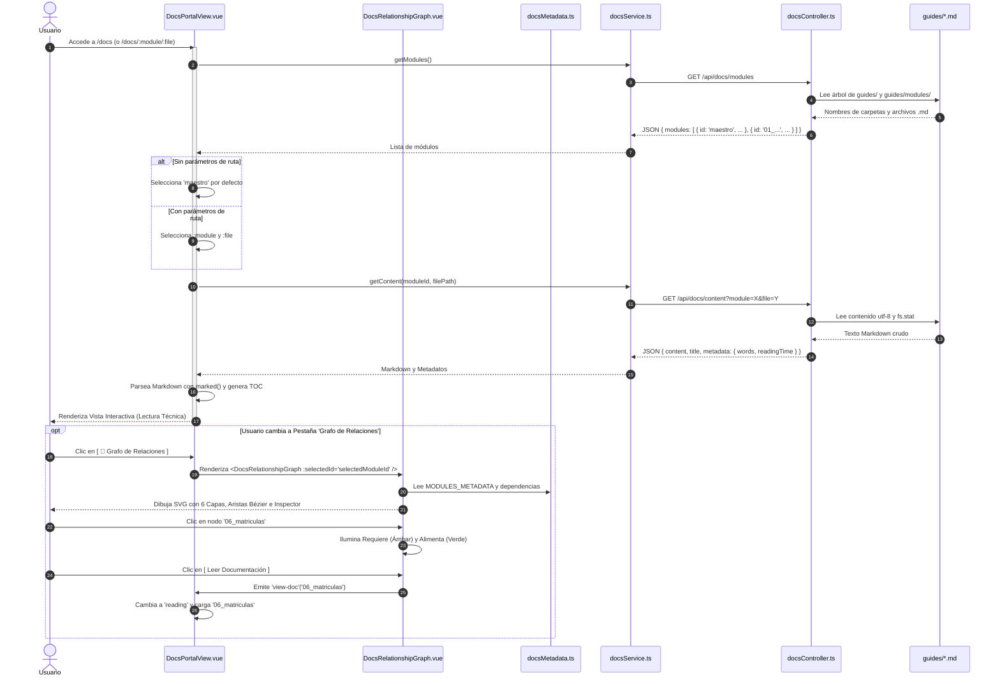

# 🏛️ ARQUITECTURA DEL PORTAL DE DOCUMENTACIÓN WEB — ACADEMIANEIVA
## Guía Técnica Integral de Construcción, Estructura, Conectividad y Trazabilidad

---

## 1. Visión General y Filosofía de Diseño

El apartado de documentación de **AcademiaNeiva** (`/docs`) no es un visor estático de archivos ni una duplicación de bases de datos de conocimiento. Se diseñó bajo el principio fundamental de **Capa de Inteligencia sobre Fuente Única de Verdad**:

> **"Los archivos `.md` en el repositorio son y seguirán siendo la única fuente canónica de verdad. El frontend web construye una capa de ingeniería interactiva encima: parseo enriquecido, fichas ejecutivas de síntesis, un grafo de dependencias arquitectónicas vivas y métricas de salud del sistema."**

```
┌────────────────────────────────────────────────────────────────────────┐
│               ARCHIVOS MARKDOWN EN DISCO (guides/)                     │
│  • MAESTRO_DE_INFORMACION.md                                           │
│  • 21 Módulos (guides/modules/01_ a 21_)                               │
│  • Diccionario de Datos (guides/dic/diccionario_datos.md)              │
│  • Marco Legal (Ley 115, Dec 1290, Dec 1075)                           │
└───────────────────────────────────┬────────────────────────────────────┘
                                    │
                                    ▼  (Lectura directa vía API REST)
┌────────────────────────────────────────────────────────────────────────┐
│                   BACKEND (Express + TypeScript)                       │
│  • docsController.ts: /api/docs/modules, /api/docs/content, /search    │
└───────────────────────────────────┬────────────────────────────────────┘
                                    │
                                    ▼  (Consumo reactivo SPA)
┌────────────────────────────────────────────────────────────────────────┐
│                   FRONTEND (Vue 3 + Tailwind CSS + Lucide)             │
│  ┌──────────────────────────────────────────────────────────────────┐  │
│  │                    DocsPortalView.vue                            │  │
│  │  ┌───────────────┬─────────────────┬──────────────┬───────────┐  │  │
│  │  │  📖 Lectura   │  🧠 Ficha       │  🧬 Grafo    │ 📊 Métricas│  │  │
│  │  │  Técnica      │  Ejecutiva      │  Relaciones  │ Dashboard │  │  │
│  │  └───────────────┴─────────────────┴──────────────┴───────────┘  │  │
│  └──────────────────────────────────────────────────────────────────┘  │
│                                   │                                    │
│         ┌─────────────────────────┴─────────────────────────┐          │
│         ▼                                                   ▼          │
│  ┌────────────────────────────────┐       ┌─────────────────────────┐  │
│  │ DocsRelationshipGraph.vue      │       │ docsMetadata.ts         │  │
│  │ (Canvas SVG, Bézier, 6 Capas)  │       │ (Catálogo Arquitectura) │  │
│  └────────────────────────────────┘       └─────────────────────────┘  │
└────────────────────────────────────────────────────────────────────────┘
```

---

## 2. Evolución Histórica: ¿Cómo se construyó desde cero?

El portal de documentación ha evolucionado a través de cuatro fases iterativas de ingeniería:

### Fase 0: Documentación Base en Markdown
- Existencia de 21 carpetas modulares (`guides/modules/01_` a `21_`), cada una con archivos `[modulo].md`, `reglas_negocio.md`, `casos_uso.md`, `historias_usuario.md` y submódulos.
- Documentos normativos y diccionario de datos de 62 tablas en PostgreSQL.

### Fase 1: Creación del Portal Web Inicial (`/docs`)
- **Backend (`docsController.ts`):** Escaneo recursivo de la carpeta `guides/modules/`, extracción de títulos amigables y endpoint de búsqueda textual.
- **Frontend (`DocsPortalView.vue`):** Renderizador con `marked.js`, soporte para alertas GitHub Flavored Markdown (`[!NOTE]`, `[!WARNING]`, `[!TIP]`, `[!IMPORTANT]`, `[!CAUTION]`), tabla de contenidos (TOC) reactiva con scroll espía y modal de búsqueda con atajo de teclado `Ctrl + K`.

### Fase 2: Incorporación del Documento Rector Maestro
- Creación de `guides/MAESTRO_DE_INFORMACION.md` (16 secciones canónicas del dominio escolar).
- Modificación de `docsController.ts` para servir `MAESTRO_DE_INFORMACION.md` en el tope absoluto (`🏛️ 00. Maestro de Información`) y seleccionarlo por defecto al abrir `/docs`.

### Fase 3: Capa de Inteligencia y Ficha Ejecutiva
- Creación de `frontend/src/services/docsMetadata.ts`: un catálogo estructurado con los metadatos de los 21 módulos (propósito, actores, dependencias entrantes/salientes, tablas SQL, reglas y HUs).
- Creación de la pestaña **🧠 Ficha Ejecutiva ("Entender este Módulo")**: Onboarding acelerado en 30 segundos.
- Creación de la pestaña **📊 Dashboard Global**: Resumen de 21 módulos, 62 tablas, 34 reglas globales, 11 ADRs y 6 dominios.
- Creación del **Footer de Trazabilidad y Recursos Relacionados** al pie de cada documento Markdown.
- Incorporación de **Filtros Facetados** en el modal de búsqueda `Ctrl + K` (`Todos`, `Reglas`, `HUs`, `BD`, `Maestro`).

### Fase 4: Grafo Interactivo de Dependencias y Topología
- Creación de `frontend/src/components/docs/DocsRelationshipGraph.vue`.
- Organización de los 21 módulos en un **Pipeline de Negocio de 6 Capas**.
- Trazado de conexiones vectoriales SVG con curvas Bézier dinámicas y flechas direccionales.
- Iluminación reactiva al hacer clic en un nodo: enlaces ámbar para dependencias requeridas (`Requiere`) y enlaces esmeralda para módulos receptores (`Alimenta`).
- Inspector lateral sincronizado que permite saltar entre módulos o abrir su documentación con 1 clic.

---

## 3. Mapa de Archivos y Responsabilidades del Sistema

```
segundoProyecto/
├── guides/                                            # [FUENTE ÚNICA DE VERDAD]
│   ├── MAESTRO_DE_INFORMACION.md                     # Documento Rector del Sistema
│   ├── ARQUITECTURA_PORTAL_DOCUMENTACION.md          # Esta guía de arquitectura
│   ├── README.md                                     # Índice del repositorio
│   ├── dic/diccionario_datos.md                      # DDL de las 62 tablas SQL
│   ├── normativa_y_legal/                            # Ley 115, Dec 1290, Dec 1075
│   └── modules/                                      # 21 Módulos Funcionales
│       ├── mapa_documentacion.md                     # Índice modular
│       └── 01_autenticacion/ ... 21_flujo_correos/
│
├── backend/src/                                       # [CAPA SERVIDORA DE CONTENIDO]
│   ├── controllers/docsController.ts                 # Controlador de lectura de guides/
│   └── routes/docs.routes.ts                         # Endpoints /api/docs/*
│
└── frontend/src/                                      # [CAPA INTERACTIVA CLIENTE]
    ├── services/
    │   ├── docsService.ts                            # Cliente Axios para /api/docs
    │   └── docsMetadata.ts                           # Catálogo de metadatos y dependencias
    ├── components/docs/
    │   └── DocsRelationshipGraph.vue                 # Componente del Grafo SVG interactivo
    └── views/public/
        └── DocsPortalView.vue                        # Vista principal del portal web
```

---

## 4. Flujo de Datos y Conexión End-to-End

### 4.1 Ciclo de Vida de una Petición



---

## 5. Arquitectura Detallada de Componentes

### 5.1 Backend: `backend/src/controllers/docsController.ts`
- **`getGuidesBasePath()`**: Resuelve dinámicamente la ruta a la carpeta `guides/` tanto en desarrollo local como en contenedores Docker (`process.cwd()/guides`, `../guides`, `/app/guides`).
- **`getDocsModules(req, res)`**: 
  1. Verifica la existencia de `MAESTRO_DE_INFORMACION.md` en `guides/` y lo inserta como el módulo `🏛️ 00. Maestro de Información`.
  2. Verifica `mapa_documentacion.md` y lo inserta como `🗺️ 00. Mapa General`.
  3. Lee los directorios `01_` a `21_`, mapea archivos `.md` y detecta submódulos en la subcarpeta `submodules/`.
- **`getDocContent(req, res)`**: 
  - Protege contra ataques de *Path Traversal* (`..`, rutas absolutas).
  - Resuelve archivos en la raíz (`maestro`) o dentro de `modules/[modulo]/`.
  - Calcula palabras totales y tiempo estimado de lectura ($palabras / 200$).
- **`searchDocs(req, res)`**:
  - Escaneo en memoria línea a línea sobre todos los archivos `.md` del sistema.
  - Genera extractos (*snippets*) de texto con número de línea y título del documento.

---

### 5.2 Frontend: `frontend/src/services/docsMetadata.ts`
Define la interfaz `ModuleSummary` y exporta el catálogo canónico `MODULES_METADATA`:
- **`id` / `num` / `name` / `shortName`**: Identificadores y títulos formateados.
- **`domain`**: Uno de los 6 dominios del negocio.
- **`purpose` / `description`**: Síntesis ejecutiva de alto nivel.
- **`roles`**: Array de actores que participan en el módulo.
- **`dependsOn`**: Array con los IDs de los módulos previos necesarios.
- **`affects`**: Array con los IDs de los módulos que consumen sus salidas.
- **`tables`**: Tablas de PostgreSQL asociadas.
- **`rules`**: Reglas de negocio representativas.
- **`hus`**: Historias de usuario del módulo.
- **`SYSTEM_METRICS`**: Objeto con los KPIs consolidados de la plataforma.

---

### 5.3 Frontend: `frontend/src/views/public/DocsPortalView.vue`
Es el contenedor orquestador principal. Gestiona los siguientes estados y vistas:

#### A. Estado de Vista (`activeViewTab`)
- `'reading'`: Modo lectura técnica con parseo de Markdown, GitHub alerts, contenedor con scroll horizontal para tablas anchas (`docs-table-wrapper`), badges HTTP (`GET`, `POST`, `PUT`, `DELETE`), TOC derecho con scroll spy y footer de trazabilidad.
- `'summary'`: Modo Ficha Ejecutiva ("Entender este Módulo") que renderiza la ficha de 1 página con tarjetas de dependencias clickeables, tablas de BD y actores.
- `'graph'`: Modo Grafo Interactivo que incrusta `DocsRelationshipGraph.vue`.
- `'metrics'`: Modo Dashboard que despliega tarjetas de KPIs, gráfico de distribución por dominios y ranking de centralidad.

#### B. Modal de Búsqueda Facetada (`Ctrl + K`)
- Filtros por chips reactivos: `Todos`, `📜 Reglas de Negocio`, `👤 Historias (HUs)`, `🗄️ Base de Datos`, `🏛️ Documento Rector`.

---

### 5.4 Frontend: `frontend/src/components/docs/DocsRelationshipGraph.vue`
Componente de renderizado vectorial SVG con topología de 6 capas:

1. **Cálculo de Coordenadas (`nodePositions`):**
   - Dispone los 21 módulos en 6 columnas verticales según la fase del ciclo de vida del negocio escolar:
     - **Capa 1 (x: 80px):** `01_autenticacion`, `02_gestion_colegios`, `21_flujo_correos_y_verificaciones`
     - **Capa 2 (x: 260px):** `03_usuarios_y_directivos`, `04_estructura_escolar`, `08_configuracion_academica`
     - **Capa 3 (x: 440px):** `05_docentes`, `06_matriculas`, `10_catalogo_dba`
     - **Capa 4 (x: 620px):** `07_estudiantes_y_estados`, `17_gestion_padres`, `09_competencias_y_sincronizacion`
     - **Capa 5 (x: 800px):** `11_calificaciones`, `12_observaciones`, `13_asistencia`, `18_gestion_traslados`
     - **Capa 6 (x: 980px):** `14_cierre_y_boletines`, `19_seguimiento_y_promocion_academica`, `20_seguimiento_academico_directivo`, `15_supervision_y_auditoria`, `16_soporte_y_tickets`

2. **Cálculo de Aristas Bézier (`edges` & `generateBezierPath`):**
   - Traza curvas Bézier suaves: `M x1 y1 C (x1+dx) y1, (x2-dx) y2, x2 y2` con marcadores de flecha en el extremo.
   - Aplica estilos dinámicos según el nodo enfocado (`focusedModuleId`):
     - **Arista Ámbar Punteada:** Entrada requerida (`isIncomingToFocused`).
     - **Arista Esmeralda Sólida:** Salida generada (`isOutgoingFromFocused`).
     - **Atenuación al 8%:** Aristas que no tocan el módulo activo.

3. **Inspector Lateral:**
   - Radiografía reactiva del nodo seleccionado con botones de acción directa (`Leer Documentación`, `Ver Ficha Ejecutiva`, navegar a dependencias).

---

## 6. Guía para Futuros Agentes de IA y Desarrolladores

Cuando un nuevo agente o desarrollador deba extender, modificar o auditar esta sección, debe seguir las siguientes reglas:

### 1. ¿Cómo agregar un nuevo módulo o documento?
1. **Crear el archivo Markdown:** Guárdalo en `guides/modules/[numero]_[nombre]/[archivo].md`.
2. **Actualizar Metadatos:** Abre `frontend/src/services/docsMetadata.ts` y agrega la entrada correspondiente en `MODULES_METADATA` con sus dependencias (`dependsOn`, `affects`, `tables`, `rules`, `hus`).
3. **El backend lo descubrirá automáticamente:** `docsController.ts` lee el sistema de archivos en tiempo de ejecución, por lo que no requiere re-compilar el backend para listar nuevos `.md`.

### 2. ¿Cómo modificar dependencias o tablas de un módulo?
- Edita únicamente `frontend/src/services/docsMetadata.ts`.
- Automáticamente se actualizarán: la **Ficha Ejecutiva**, el **Grafo de Relaciones**, el **Dashboard de Métricas** y el **Footer de Trazabilidad** sin tocar el código de los componentes.

### 3. Invariantes de Calidad que NO se deben romper:
- **No duplicar contenido textual:** El contenido detallado debe residir en los archivos `.md`.
- **Mantener compatibilidad con Docker:** Las rutas de archivo en el backend deben usar siempre `getGuidesBasePath()`.
- **Preservar estilos tipográficos Markdown:** Mantener las reglas CSS en `<style>` de `DocsPortalView.vue` para que las tablas tengan scroll horizontal (`.docs-table-wrapper`) y no desborden en pantallas pequeñas.
- **Auto-Commit y Push:** Según las reglas del proyecto (`.agents/AGENTS.md`), cualquier cambio funcional debe acompañarse de su respectivo commit y push a `origin/main`.

---

## 7. Dictamen Final de Arquitectura
La implementación actual logra el equilibrio óptimo entre **rigor documental estático** (fuente en Markdown versionada en Git) y **experiencia de usuario viva** (SPA interactiva en Vue 3 con grafo topológico, búsqueda facetada y paneles ejecutivos). Esto permite que tanto directivos, evaluadores, auditores como nuevos desarrolladores comprendan el sistema en segundos.
