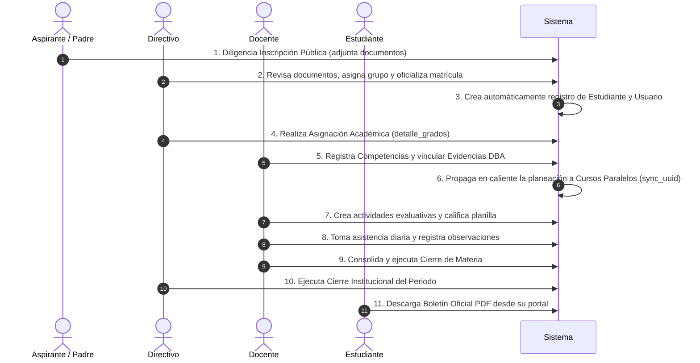
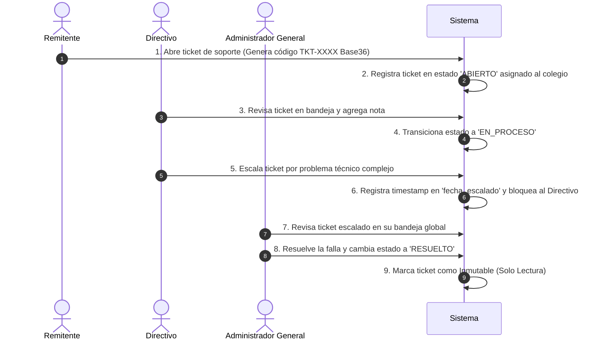

# 📘 AcademiaNeiva — Documento Funcional del Sistema

---

## Portada

**Sistema de Gestión Académica Institucional Multitenant — AcademiaNeiva**  
**Manual de Negocio, Dominio Educativo y Procesos Operativos (Volumen 1: Funcional)**  
**Versión:** 2.0.0  
**Fecha:** 21 de Julio de 2026  
**Autor:** Arquitecto de Software Senior & Lead Functional Analyst  
**Estado:** Aprobado — Documento Maestro Funcional  

---

## Historial de Versiones

| Versión | Fecha | Autor | Cambios y Descripciones |
|---|---|---|---|
| 1.0.0 | 2026-01-15 | Equipo de Análisis | Documentación inicial de procesos de matrícula y estructura escolar. |
| 1.5.0 | 2026-04-10 | Equipo de Análisis | Incorporación de la guía del dominio del Catálogo DBA del MEN y reglamentación preescolar. |
| 2.0.0 | 2026-07-21 | Arquitecto Senior | Consolidación y enriquecimiento de la Base de Conocimiento Funcional en 16 módulos con trazabilidad a Historias de Usuario e Indicadores de Negocio. |

---

## Tabla de Contenido

- [1. Introducción](#1-introducción)
- [2. AcademiaNeiva: Propuesta de Valor y Negocio](#2-academianeiva-propuesta-de-valor-y-negocio)
- [3. Conocimiento del Dominio Educativo](#3-conocimiento-del-dominio-educativo)
- [4. Módulos del Sistema (Visión de Negocio)](#4-módulos-del-sistema-visión-de-negocio)
- [5. Reglas de Negocio Globales](#5-reglas-de-negocio-globales)
- [6. Flujos Completos de Operación Escolar](#6-flujos-completos-de-operación-escolar)
- [7. Glosario Funcional y Referencias](#7-glosario-funcional-y-referencias)

---

## 1. Introducción

### Objetivo
Este documento constituye el **Manual Funcional y de Negocio Maestro** de **AcademiaNeiva**. Su objetivo es brindar a analistas funcionales, coordinadores académicos, auditores y nuevos miembros del equipo una comprensión exhaustiva de **qué es el sistema, qué problemas resuelve, por qué fue diseñado con estas reglas y cómo operan los procesos del dominio educativo colombiano** sin necesidad de consultar al autor original de la plataforma.

### Alcance
Abarca el ciclo de vida operativo completo de las instituciones educativas inscritas: inscripción y matrícula de alumnos, gestión de la planta docente, estructuración de asignaturas y grupos, planeación pedagógica alineada con el Ministerio de Educación Nacional (MEN), toma de asistencias, registro de notas, seguimiento comportamental, cierres institucionales de periodos, emisión de boletines oficiales PDF, supervisiones administrativas externas y la mesa de soporte para la gestión de incidencias.

### Público Objetivo
- **Directivos y Administradores Educativos**: Para conocer las capacidades, controles y reglas de gobierno escolar que ofrece la plataforma.
- **Analistas Funcionales y Product Owners**: Para verificar la alineación entre las reglas del negocio educativo y los casos de uso implementados.
- **Nuevos Desarrolladores y Testers (QA)**: Para comprender el modelo del dominio escolar colombiano antes de inspeccionar el código técnico.

---

## 2. AcademiaNeiva: Propuesta de Valor y Negocio

### ¿Qué problema resuelve?
Tradicionalmente, las instituciones educativas operan con herramientas fragmentadas (hojas de cálculo aisladas, planillas en papel o softwares locales desconectados). Esto genera múltiples ineficiencias:
1. **Pérdida de trazabilidad**: Falta de auditoría sobre quién modificó una calificación o cuándo se justificó una falta.
2. **Duplicidad de esfuerzos en cursos paralelos**: Profesores del mismo grado (ej. 1-A y 1-B) teniendo que transcribir manualmente los mismos planes de estudio.
3. **Complejidad en la rendición de cuentas al MEN**: Dificultad para demostrar que los contenidos impartidos en el aula cumplen con los Derechos Básicos de Aprendizaje (DBA).
4. **Falta de comunicación con Acudientes**: Padres desinformados sobre fallas o notas hasta el final del trimestre.

### ¿Por qué fue construido?
**AcademiaNeiva** fue concebido como un ecosistema en la nube bajo modelo **Multi-Tenant (Multi-Colegio)** que unifica la administración académica, la evaluación pedagógica y la comunicación institucional en una sola plataforma segura, garantizando la inmutabilidad de los registros históricos una vez cerrado el periodo escolar.

### ¿Quiénes utilizan el sistema?

```
                               ┌──────────────────────────┐
                               │   ADMINISTRADOR GENERAL  │ (Gobierno Global & Auditoría)
                               └────────────┬─────────────┘
                                            │
                                            ▼
                                ┌───────────────────────┐
                                │       DIRECTIVO       │ (Rectoría & Coordinaciones)
                                └───────────┬───────────┘
                                            │
         ┌──────────────────────────────────┼──────────────────────────────────┐
         ▼                                  ▼                                  ▼
┌─────────────────┐                ┌─────────────────┐                ┌─────────────────┐
│     DOCENTE     │                │   ESTUDIANTE    │                │ PADRE DE FAMILIA│
└─────────────────┘                └─────────────────┘                └─────────────────┘
```

1. **Administrador General**: Gestiona colegios, otorga licencias, mantiene el catálogo nacional de DBA y atiende soporte o supervisiones técnicas escaladas.
2. **Directivo (Rector / Coordinador)**: Administra la estructura escolar del colegio, vincula docentes, autoriza matrículas extraordinarias, supervisa la coherencia de los profesores, cierra periodos y autoriza la expedición de boletines.
3. **Docente**: Diseña la planeación curricular (competencias y evidencias), registra actividades evaluativas, toma asistencia diaria y escribe observaciones formativas sobre sus alumnos.
4. **Estudiante**: Ingresa a su portal para revisar sus tareas, calificaciones por actividad, fallas acumuladas y boletines de periodos pasados.
5. **Padre de Familia / Acudiente**: Monitorea el progreso académico y disciplinario de todos sus hijos matriculados desde un único usuario.

---

## 3. Conocimiento del Dominio Educativo

Para interpretar correctamente el funcionamiento del sistema, es indispensable dominar los siguientes 16 conceptos del ámbito escolar colombiano:

1. **Colegio (Inquilino / Tenant)**: Establecimiento educativo autónomo que posee su propia planta de estudiantes, docentes, calendarios y branding visual independiente.
2. **Año Lectivo**: Periodo de un año calendario (ej. 2026) bajo el cual se rige la matrícula escolar y la promoción de los estudiantes.
3. **Periodo Académico (Trimestre / Semestre)**: Subdivisión temporal del año lectivo (típicamente 3 o 4 periodos). Posee un porcentaje de peso sobre la nota final del año y estados de control (`PENDIENTE`, `ABIERTO`, `CERRADO`).
4. **Nivel Escolar**: Clasificación del sistema educativo colombiano: Preescolar, Primaria, Secundaria y Media.
5. **Tipo de Grado**: Nivel cuantitativo de enseñanza (ej. Transición, Primero, Segundo... Once).
6. **Grupo Escolar (Salón / Curso)**: La unidad física donde se matricularán los alumnos (ej. Primero A, Primero B). Posee un límite estricto de cupos máximos.
7. **Cursos Paralelos (Peer Groups)**: Grupos que pertenecen al mismo tipo de grado dentro del mismo colegio en el mismo año lectivo (ej. 1-A y 1-B son cursos paralelos).
8. **Competencia Curricular**: Meta de aprendizaje o capacidad que el estudiante debe desarrollar en una materia durante un periodo académico.
9. **Evidencia de Aprendizaje**: Entregable, producto o manifestación concreta que demuestra el logro de una competencia.
10. **DBA (Derechos Básicos de Aprendizaje)**: Conjunto de aprendizajes estructurados publicados por el Ministerio de Educación Nacional (MEN) de Colombia para cada grado y área del conocimiento.
11. **Dimensiones de Preescolar**: En el grado Transición no existen asignaturas académicas tradicionales (Matemáticas, Historia); el desarrollo se evalúa a través de 7 Dimensiones (Comunicativa, Cognitiva, Corporal, Socioafectiva, Estética, Ética y Valores).
12. **Actividad Evaluativa**: Tarea, examen, taller o exposición creada por el docente para calificar una evidencia en el aula.
13. **Criterio de Evaluación**: Sub-desglose porcentual dentro de una actividad evaluativa (ej. una exposición desglosada en: Presentación 40% y Contenido 60%).
14. **Escala de Valoración**: Rango cualitativo oficial asignado a la nota numérica del estudiante (Bajo, Básico, Alto, Superior).
15. **Boletín de Calificaciones**: Informe oficial impreso en PDF que consolida las notas, fallas de asistencia, desempeño en la escala y observaciones de un estudiante en un periodo cerrado.
16. **Supervisión y Auditoría Externa**: Proceso mediante el cual el Administrador General asume temporalmente la identidad de la Rectoría de un colegio (bajo previa aprobación con contraseña del Rector) para realizar correcciones o auditorías técnicas.

---

## 4. Módulos del Sistema (Visión de Negocio)

### 🔐 01. Autenticación y Sesiones
- **Descripción:** Punto de entrada de seguridad para los 5 roles.
- **Responsabilidad:** Autenticar usuarios con correo/código, gestionar el directorio institucional y manejar revocaciones de sesión.
- **Actor Principal:** Todos los roles.
- **Documentación Completa:** [Módulo 01 — Autenticación](file:///c:/Users/alejo/Downloads/segundoProyecto/guides/modules/01_autenticacion/autenticacion.md) | [Historias de Usuario](file:///c:/Users/alejo/Downloads/segundoProyecto/guides/modules/01_autenticacion/historias_usuario.md) | [Reglas de Negocio](file:///c:/Users/alejo/Downloads/segundoProyecto/guides/modules/01_autenticacion/reglas_negocio.md)

---

### 🏫 02. Gestión de Colegios
- **Descripción:** Administración del catálogo institucional.
- **Responsabilidad:** Registro global de colegios por el Admin General y personalización del branding visual (escudo y colores) por directivos.
- **Actor Principal:** Administrador General / Directivo.
- **Documentación Completa:** [Módulo 02 — Colegios](file:///c:/Users/alejo/Downloads/segundoProyecto/guides/modules/02_gestion_colegios/gestion_colegios.md) | [Historias de Usuario](file:///c:/Users/alejo/Downloads/segundoProyecto/guides/modules/02_gestion_colegios/historias_usuario.md) | [Reglas de Negocio](file:///c:/Users/alejo/Downloads/segundoProyecto/guides/modules/02_gestion_colegios/reglas_negocio.md)

---

### 👥 03. Usuarios y Directivos
- **Descripción:** Gobierno de personal administrativo.
- **Responsabilidad:** Registro y vinculación de Rectores y Coordinadores a colegios. Trazabilidad de cambios de credenciales exigiendo un ticket resuelto.
- **Actor Principal:** Administrador General.
- **Documentación Completa:** [Módulo 03 — Usuarios](file:///c:/Users/alejo/Downloads/segundoProyecto/guides/modules/03_usuarios_y_directivos/usuarios_y_directivos.md) | [Historias de Usuario](file:///c:/Users/alejo/Downloads/segundoProyecto/guides/modules/03_usuarios_y_directivos/historias_usuario.md) | [Reglas de Negocio](file:///c:/Users/alejo/Downloads/segundoProyecto/guides/modules/03_usuarios_y_directivos/reglas_negocio.md)

---

### 🏗️ 04. Estructura Escolar
- **Descripción:** Definición organizacional del plantel.
- **Responsabilidad:** Gestión de niveles, tipos de grado, grupos (control de cupos) y materias del catálogo institucional.
- **Actor Principal:** Directivo.
- **Documentación Completa:** [Módulo 04 — Estructura Escolar](file:///c:/Users/alejo/Downloads/segundoProyecto/guides/modules/04_estructura_escolar/estructura_escolar.md) | [Historias de Usuario](file:///c:/Users/alejo/Downloads/segundoProyecto/guides/modules/04_estructura_escolar/historias_usuario.md) | [Reglas de Negocio](file:///c:/Users/alejo/Downloads/segundoProyecto/guides/modules/04_estructura_escolar/reglas_negocio.md)

---

### 👩‍🏫 05. Docentes
- **Descripción:** Administración de la planta de profesores y asignación académica.
- **Responsabilidad:** Registro de docentes, envío de credenciales por email y vinculación de cursos en `detalle_grados`.
- **Actor Principal:** Directivo / Docente.
- **Documentación Completa:** [Módulo 05 — Docentes](file:///c:/Users/alejo/Downloads/segundoProyecto/guides/modules/05_docentes/docentes.md) | [Historias de Usuario](file:///c:/Users/alejo/Downloads/segundoProyecto/guides/modules/05_docentes/historias_usuario.md) | [Reglas de Negocio](file:///c:/Users/alejo/Downloads/segundoProyecto/guides/modules/05_docentes/reglas_negocio.md)

---

### 📋 06. Matrículas e Inscripciones
- **Descripción:** Admisiones públicas y oficialización de estudiantes.
- **Responsabilidad:** Formulario de inscripción pública, seguimiento con token UUID, validación individual de documentos adjuntos y matrículas extraordinarias.
- **Actor Principal:** Público / Directivo.
- **Documentación Completa:** [Módulo 06 — Matrículas](file:///c:/Users/alejo/Downloads/segundoProyecto/guides/modules/06_matriculas/matriculas.md) | [Historias de Usuario](file:///c:/Users/alejo/Downloads/segundoProyecto/guides/modules/06_matriculas/historias_usuario.md) | [Reglas de Negocio](file:///c:/Users/alejo/Downloads/segundoProyecto/guides/modules/06_matriculas/reglas_negocio.md) | [Casos de Uso](file:///c:/Users/alejo/Downloads/segundoProyecto/guides/modules/06_matriculas/casos_uso.md)

---

### 🎓 07. Estudiantes y Estados
- **Descripción:** Ciclo de vida escolar del alumno y control disciplinario.
- **Responsabilidad:** Administración de estados (`ACTIVO`, `RETIRADO`, `EXPULSADO`), suspensiones automáticas y portales de consulta para alumnos y acudientes.
- **Actor Principal:** Directivo / Estudiante / Padre.
- **Documentación Completa:** [Módulo 07 — Estudiantes](file:///c:/Users/alejo/Downloads/segundoProyecto/guides/modules/07_estudiantes_y_estados/estudiantes_y_estados.md) | [Historias de Usuario](file:///c:/Users/alejo/Downloads/segundoProyecto/guides/modules/07_estudiantes_y_estados/historias_usuario.md) | [Reglas de Negocio](file:///c:/Users/alejo/Downloads/segundoProyecto/guides/modules/07_estudiantes_y_estados/reglas_negocio.md)

---

### ⚙️ 08. Configuración Académica
- **Descripción:** Parametrización del calendario escolar.
- **Responsabilidad:** Gestión de años lectivos, periodos académicos, escalas de notas (manual/automática) y congelamiento de escrituras en periodos cerrados.
- **Actor Principal:** Directivo.
- **Documentación Completa:** [Módulo 08 — Configuración Académica](file:///c:/Users/alejo/Downloads/segundoProyecto/guides/modules/08_configuracion_academica/configuracion_academica.md) | [Historias de Usuario](file:///c:/Users/alejo/Downloads/segundoProyecto/guides/modules/08_configuracion_academica/historias_usuario.md) | [Reglas de Negocio](file:///c:/Users/alejo/Downloads/segundoProyecto/guides/modules/08_configuracion_academica/reglas_negocio.md)

---

### 🔄 09. Competencias y Sincronización
- **Descripción:** Planeación curricular y cursos paralelos.
- **Responsabilidad:** Registro de múltiples competencias por periodo y propagación en caliente a los cursos paralelos del mismo grado escolar mediante `sync_uuid`.
- **Actor Principal:** Directivo / Docente.
- **Documentación Completa:** [Módulo 09 — Competencias](file:///c:/Users/alejo/Downloads/segundoProyecto/guides/modules/09_competencias_y_sincronizacion/competencias_y_sincronizacion.md) | [Historias de Usuario](file:///c:/Users/alejo/Downloads/segundoProyecto/guides/modules/09_competencias_y_sincronizacion/historias_usuario.md) | [Reglas de Negocio](file:///c:/Users/alejo/Downloads/segundoProyecto/guides/modules/09_competencias_y_sincronizacion/reglas_negocio.md)

---

### 📚 10. Catálogo DBA y Coherencia Curricular
- **Descripción:** Alineación pedagógica con los estándares del MEN colombiano.
- **Responsabilidad:** Administración del catálogo oficial de Derechos Básicos de Aprendizaje, exclusividad 1-to-1 de evidencias, reglas de preescolar y reportes de Coherencia y Cobertura.
- **Actor Principal:** Admin General / Directivo / Docente.
- **Documentación Completa:** [Módulo 10 — Catálogo DBA](file:///c:/Users/alejo/Downloads/segundoProyecto/guides/modules/10_catalogo_dba/catalogo_dba.md) | [Historias de Usuario](file:///c:/Users/alejo/Downloads/segundoProyecto/guides/modules/10_catalogo_dba/historias_usuario.md) | [Reglas de Negocio](file:///c:/Users/alejo/Downloads/segundoProyecto/guides/modules/10_catalogo_dba/reglas_negocio.md) | [Casos de Uso](file:///c:/Users/alejo/Downloads/segundoProyecto/guides/modules/10_catalogo_dba/casos_uso.md)

---

### 📊 11. Calificaciones y Actividades
- **Descripción:** Evaluación continua del rendimiento estudiantil.
- **Responsabilidad:** Planilla interactiva del docente, creación de actividades y criterios ponderados, y cálculo de notas parciales.
- **Actor Principal:** Docente / Estudiante / Padre.
- **Documentación Completa:** [Módulo 11 — Calificaciones](file:///c:/Users/alejo/Downloads/segundoProyecto/guides/modules/11_calificaciones/calificaciones.md) | [Historias de Usuario](file:///c:/Users/alejo/Downloads/segundoProyecto/guides/modules/11_calificaciones/historias_usuario.md) | [Reglas de Negocio](file:///c:/Users/alejo/Downloads/segundoProyecto/guides/modules/11_calificaciones/reglas_negocio.md)

---

### 📝 12. Observaciones del Estudiante
- **Descripción:** Seguimiento formativo y comportamental del observador del alumno.
- **Responsabilidad:** Registro de anotaciones (Académica, Convivencia, Disciplinaria, Otro) y concatenación obligatoria de la observación académica en boletines.
- **Actor Principal:** Docente / Directivo / Padre.
- **Documentación Completa:** [Módulo 12 — Observaciones](file:///c:/Users/alejo/Downloads/segundoProyecto/guides/modules/12_observaciones/observaciones.md) | [Historias de Usuario](file:///c:/Users/alejo/Downloads/segundoProyecto/guides/modules/12_observaciones/historias_usuario.md) | [Reglas de Negocio](file:///c:/Users/alejo/Downloads/segundoProyecto/guides/modules/12_observaciones/reglas_negocio.md)

---

### 📅 13. Asistencia Escolar
- **Descripción:** Control diario de fallas y ausentismo escolar.
- **Responsabilidad:** Registro diario de asistencia con límite físico estricto de máximo 7 bloques de clase al día por estudiante.
- **Actor Principal:** Docente / Padre.
- **Documentación Completa:** [Módulo 13 — Asistencia](file:///c:/Users/alejo/Downloads/segundoProyecto/guides/modules/13_asistencia/asistencia.md) | [Historias de Usuario](file:///c:/Users/alejo/Downloads/segundoProyecto/guides/modules/13_asistencia/historias_usuario.md) | [Reglas de Negocio](file:///c:/Users/alejo/Downloads/segundoProyecto/guides/modules/13_asistencia/reglas_negocio.md)

---

### 📄 14. Cierre de Periodo y Boletines
- **Descripción:** Consolidación final del trimestre y emisión de informes oficiales.
- **Responsabilidad:** Cierre por materia del docente, cierre institucional del periodo, consolidación de promedios e impresión masiva de boletines PDF.
- **Actor Principal:** Docente / Directivo / Estudiante.
- **Documentación Completa:** [Módulo 14 — Cierre y Boletines](file:///c:/Users/alejo/Downloads/segundoProyecto/guides/modules/14_cierre_y_boletines/cierre_y_boletines.md) | [Historias de Usuario](file:///c:/Users/alejo/Downloads/segundoProyecto/guides/modules/14_cierre_y_boletines/historias_usuario.md) | [Reglas de Negocio](file:///c:/Users/alejo/Downloads/segundoProyecto/guides/modules/14_cierre_y_boletines/reglas_negocio.md) | [Casos de Uso](file:///c:/Users/alejo/Downloads/segundoProyecto/guides/modules/14_cierre_y_boletines/casos_uso.md)

---

### 🕵️ 15. Supervisión y Auditoría
- **Descripción:** Acceso extraordinario del Administrador General a la consola de un colegio.
- **Responsabilidad:** Solicitud con motivo, aprobación obligatoria del Rector con re-autenticación por contraseña, temporizadores de sesión y bitácora de auditoría inmutable.
- **Actor Principal:** Admin General / Directivo.
- **Documentación Completa:** [Módulo 15 — Supervisión](file:///c:/Users/alejo/Downloads/segundoProyecto/guides/modules/15_supervision_y_auditoria/supervision_y_auditoria.md) | [Historias de Usuario](file:///c:/Users/alejo/Downloads/segundoProyecto/guides/modules/15_supervision_y_auditoria/historias_usuario.md) | [Reglas de Negocio](file:///c:/Users/alejo/Downloads/segundoProyecto/guides/modules/15_supervision_y_auditoria/reglas_negocio.md) | [Casos de Uso](file:///c:/Users/alejo/Downloads/segundoProyecto/guides/modules/15_supervision_y_auditoria/casos_uso.md)

---

### 🎟️ 16. Soporte y Gestión de Tickets
- **Descripción:** Mesa de ayuda e incidencias institucionales.
- **Responsabilidad:** Apertura pública de tickets con código Base36 ofuscado, regla de turnos de respuesta (ping-pong) y escalamiento exclusivo al Administrador General.
- **Actor Principal:** Todos los roles.
- **Documentación Completa:** [Módulo 16 — Soporte y Tickets](file:///c:/Users/alejo/Downloads/segundoProyecto/guides/modules/16_soporte_y_tickets/soporte_y_tickets.md) | [Historias de Usuario](file:///c:/Users/alejo/Downloads/segundoProyecto/guides/modules/16_soporte_y_tickets/historias_usuario.md) | [Reglas de Negocio](file:///c:/Users/alejo/Downloads/segundoProyecto/guides/modules/16_soporte_y_tickets/reglas_negocio.md) | [Casos de Uso](file:///c:/Users/alejo/Downloads/segundoProyecto/guides/modules/16_soporte_y_tickets/casos_uso.md)

---

### 👨‍👩‍👧‍👦 17. Gestión de Padres de Familia
- **Descripción:** Consola administrativa para la gestión, auditoría y monitoreo en tiempo real de los acudientes y familias del colegio.
- **Responsabilidad:** Tarjetas métricas de control, filtros de alertas estudiantiles, visualización en drawer del acudiente e hijos asociados, identificación de doble rol (`Padre + Docente`), activación/inactivación de cuenta con revocación de sesión (`logged_out_at`) y seguimiento remoto en Modo Monitoreo Espejo.
- **Actor Principal:** Directivo.
- **Documentación Completa:** [Módulo 17 — Gestión de Padres de Familia](file:///c:/Users/alejo/Downloads/segundoProyecto/guides/modules/17_gestion_padres/gestion_padres.md) | [Historias de Usuario](file:///c:/Users/alejo/Downloads/segundoProyecto/guides/modules/17_gestion_padres/historias_usuario.md) | [Reglas de Negocio](file:///c:/Users/alejo/Downloads/segundoProyecto/guides/modules/17_gestion_padres/reglas_negocio.md)

---

### 🔀 18. Gestión de Traslados
- **Descripción:** Módulo administrativo y público para gestionar traslados de matrícula de estudiantes entre sedes o colegios distintos y cambio de colegio de usuarios.
- **Responsabilidad:** Creación de solicitudes de traslado, flujo de aprobación institucional (colegio origen y colegio destino), cancelación, ejecución del traslado e historial de trazabilidad de cambios.
- **Actor Principal:** Directivo, Admin General, Padre de Familia.
- **Documentación Completa:** [Módulo 18 — Gestión de Traslados](file:///c:/Users/alejo/Downloads/segundoProyecto/guides/modules/18_gestion_traslados/gestion_traslados.md) | [Historias de Usuario](file:///c:/Users/alejo/Downloads/segundoProyecto/guides/modules/18_gestion_traslados/historias_usuario.md) | [Reglas de Negocio](file:///c:/Users/alejo/Downloads/segundoProyecto/guides/modules/18_gestion_traslados/reglas_negocio.md) | [Casos de Uso](file:///c:/Users/alejo/Downloads/segundoProyecto/guides/modules/18_gestion_traslados/casos_uso.md)

---

### 🏅 19. Seguimiento Académico, Promoción y Reprobación Anual
- **Descripción:** Módulo para la gestión integral del estado académico de los estudiantes en cada período (individual y acumulativo hasta el período N), consolidación del resultado anual y soporte de decisiones institucionales de promoción.
- **Responsabilidad:** Seguimiento por período acumulado (P1..PN), promedio ponderado por asignatura cotejado con la escala institucional, consolidación anual (Promovido, No Promovido, Pendiente), advertencias informativas en el proceso de matrícula e historial de decisiones tomadas por directivos.
- **Actor Principal:** Directivo.
- **Documentación Completa:** [Módulo 19 — Seguimiento y Promoción Académica](file:///c:/Users/alejo/Downloads/segundoProyecto/guides/modules/19_seguimiento_y_promocion_academica/seguimiento_y_promocion_academica.md) | [Historias de Usuario](file:///c:/Users/alejo/Downloads/segundoProyecto/guides/modules/19_seguimiento_y_promocion_academica/historias_usuario.md) | [Reglas de Negocio](file:///c:/Users/alejo/Downloads/segundoProyecto/guides/modules/19_seguimiento_y_promocion_academica/reglas_negocio.md) | [Casos de Uso](file:///c:/Users/alejo/Downloads/segundoProyecto/guides/modules/19_seguimiento_y_promocion_academica/casos_uso.md)

---

---

## 5. Reglas de Negocio Globales

1. **Aislamiento Multi-Tenant Absoluto**: Toda consulta o modificación sobre la base de datos debe estar aislada por el campo `id_colegio`. Un colegio jamás puede acceder a la información de otro plantel.
2. **Inmutabilidad por Periodo CERRADO**: Una vez que un periodo académico ha sido institucionalmente cerrado por el Rector, se congela de forma inmutable la edición de calificaciones, observaciones de observador e inasistencias.
3. **Regla de Límite Diario de Asistencia**: Se restringe a un máximo de 7 bloques de clase registrados por estudiante al día para evitar inconsistencias de aforo escolar.
4. **Validación de Documentos para Oficialización**: Ninguna matrícula puede pasar a estado `ACTIVA` si tiene algún documento adjunto en estado `RECHAZADO`.
5. **Token de Seguimiento UUID Público**: Las inscripciones y subsanaciones públicas operan mediante un token UUID de alta seguridad sin exigir credenciales de inicio de sesión.
6. **Inmutabilidad de Auditorías Legales**: Los registros de acciones de supervisión y tickets resueltos no pueden ser eliminados mediante sentencias `DELETE`.

---

## 6. Flujos Completos de Operación Escolar

### Flujo 1: Ciclo Operativo Escolar Completo



---

### Flujo 2: Gestión e Escalamiento de Incidencias Técnicas (Tickets)



---

## 7. Glosario Funcional y Referencias

- **DBA**: Derechos Básicos de Aprendizaje del Ministerio de Educación Nacional de Colombia.
- **Peer Group**: Conjunto de secciones paralelas (1-A, 1-B) pertenecientes al mismo tipo de grado.
- **Soft Delete**: Marca de borrado lógico (`eliminada = true`) que preserva la integridad de notas históricas.
- **JTI**: Identificador único de token JWT usado para invalidación individual en lista negra.
- **Base36**: Algoritmo de codificación alfanumérico usado para ofuscar IDs de tickets públicos.

---

### Matriz de Enlaces a Módulos Funcionales
- 📄 [Índice de Módulos Funcionales (guides/modules/README.md)](file:///c:/Users/alejo/Downloads/segundoProyecto/guides/modules/README.md)
- 📄 [Índice General de Guías (guides/README.md)](file:///c:/Users/alejo/Downloads/segundoProyecto/guides/README.md)
