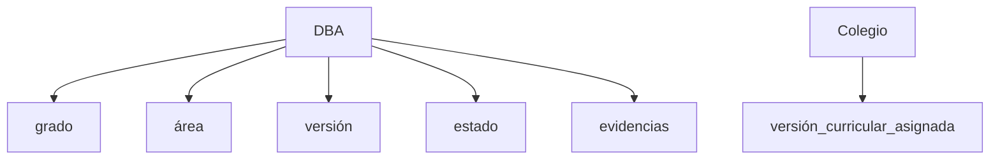

# Historias de Usuario (HU) y Reglas de Negocio (RN) - Módulo DBA

Este documento detalla las historias de usuario y las reglas de negocio para el módulo de Derechos Básicos de Aprendizaje (DBA), dividido en la administración global y la gestión institucional (colegios).

---

## 1. Módulo de Administración Global (Administrador General)

### HU-DBA-001: Registrar un DBA oficial
* **Como:** Administrador General
* **Quiero:** registrar un DBA oficial del MEN
* **Para:** que pueda ser utilizado por los colegios en sus procesos académicos.

#### Criterios de Aceptación
- El sistema permite registrar:
  - Área académica.
  - Grado.
  - Código o identificador.
  - Enunciado del DBA.
  - Año o versión curricular.
- El DBA queda disponible en el catálogo global.

#### Reglas de Negocio
* **RN-DBA-001:** El DBA debe estar asociado a un área y grado.
* **RN-DBA-002:** No puede existir un DBA duplicado para la misma versión curricular.

---

### HU-DBA-002: Registrar evidencias de aprendizaje para un DBA
* **Como:** Administrador General
* **Quiero:** registrar las evidencias asociadas a un DBA
* **Para:** que puedan ser utilizadas posteriormente por los colegios.

#### Criterios de Aceptación
- El sistema permite agregar una o varias evidencias.
- Cada evidencia queda vinculada al DBA correspondiente.
- Las evidencias pueden visualizarse desde la ficha del DBA.

#### Reglas de Negocio
* **RN-DBA-003:** Toda evidencia debe pertenecer a un DBA existente.
* **RN-DBA-004:** Una evidencia no puede existir sin un DBA asociado.

---

### HU-DBA-003: Editar un DBA
* **Como:** Administrador General
* **Quiero:** actualizar información de un DBA
* **Para:** mantener alineado el sistema con cambios oficiales del MEN.

#### Criterios de Aceptación
- El sistema permite modificar:
  - Enunciado.
  - Área.
  - Grado.
  - Estado (Activo / Inactivo).
- Los cambios quedan registrados en auditoría.

#### Reglas de Negocio
* **RN-DBA-005:** Solo Administradores Generales pueden editar DBA oficiales.
* **RN-DBA-006:** Debe registrarse fecha y usuario responsable del cambio.

---

### HU-DBA-004: Editar evidencias de aprendizaje
* **Como:** Administrador General
* **Quiero:** actualizar evidencias asociadas a un DBA
* **Para:** reflejar ajustes curriculares oficiales.

#### Criterios de Aceptación
- El sistema permite editar el contenido de una evidencia.
- El sistema registra la modificación realizada.
- Las relaciones existentes no se pierden.

#### Reglas de Negocio
* **RN-DBA-007:** Solo evidencias activas pueden ser utilizadas por los colegios.

---

### HU-DBA-005: Desactivar un DBA
* **Como:** Administrador General
* **Quiero:** desactivar un DBA obsoleto
* **Para:** evitar su uso en nuevos procesos académicos.

#### Criterios de Aceptación
- El sistema permite cambiar el estado a:
  - Activo.
  - Inactivo.
- Los DBA inactivos no aparecen en nuevas configuraciones.

#### Reglas de Negocio
* **RN-DBA-008:** Los DBA utilizados históricamente no pueden eliminarse físicamente.
* **RN-DBA-009:** El sistema debe conservar la trazabilidad histórica.

---

### HU-DBA-006: Publicar DBA para todos los colegios
* **Como:** Administrador General
* **Quiero:** publicar un DBA oficial en el catálogo global
* **Para:** que todos los colegios puedan consultarlo y utilizarlo.

#### Criterios de Aceptación
- El DBA publicado aparece automáticamente en los colegios habilitados.
- Los directivos pueden consultarlo.
- Los colegios no pueden modificar su contenido.

#### Reglas de Negocio
* **RN-DBA-010:** Los DBA publicados son de solo lectura para instituciones educativas.
* **RN-DBA-011:** La publicación debe respetar la versión curricular asociada.

---

### HU-DBA-007: Importar DBA masivamente
* **Como:** Administrador General
* **Quiero:** importar DBA desde un archivo estructurado
* **Para:** evitar la carga manual de información.

#### Criterios de Aceptación
- El sistema permite importar:
  - DBA.
  - Evidencias.
  - Área.
  - Grado.
- Se muestra un resumen de registros procesados.
- Se notifican errores de validación.

#### Reglas de Negocio
* **RN-DBA-012:** El sistema debe evitar registros duplicados.
* **RN-DBA-013:** Los registros inválidos no deben afectar los válidos.

---

### HU-DBA-008: Consultar catálogo global de DBA
* **Como:** Administrador General
* **Quiero:** visualizar todos los DBA registrados
* **Para:** administrar el currículo disponible en la plataforma.

#### Criterios de Aceptación
- El sistema permite filtrar por:
  - Área.
  - Grado.
  - Versión.
  - Estado.
- Se muestra cantidad de evidencias asociadas por DBA.

#### Reglas de Negocio
* **RN-DBA-014:** Solo usuarios autorizados pueden acceder a la gestión global.

---

### HU-DBA-009: Versionar DBA
* **Como:** Administrador General
* **Quiero:** gestionar diferentes versiones de DBA
* **Para:** conservar la historia curricular sin afectar información antigua.

#### Criterios de Aceptación
- El sistema permite crear nuevas versiones.
- Los colegios pueden identificar la versión utilizada.
- Los registros históricos conservan su referencia original.

#### Reglas de Negocio
* **RN-DBA-015:** Un DBA no debe sobrescribir versiones anteriores.
* **RN-DBA-016:** La versión utilizada en evaluaciones históricas no puede modificarse.

---

### HU-DBA-010: Asignar catálogo DBA a colegios
* **Como:** Administrador General
* **Quiero:** definir qué catálogo curricular utiliza cada colegio
* **Para:** permitir configuraciones institucionales diferentes cuando sea necesario.

#### Criterios de Aceptación
- El sistema permite asociar una versión curricular a uno o varios colegios.
- Los colegios visualizan únicamente el catálogo asignado.
- El cambio queda auditado.

#### Reglas de Negocio
* **RN-DBA-017:** Un colegio debe tener una versión curricular activa por área y grado.
* **RN-DBA-018:** El cambio de catálogo no altera registros históricos.

---

## 2. Recomendación de Arquitectura

El siguiente esquema muestra de manera simplificada la relación lógica propuesta para los elementos curriculares a nivel global y de colegios:



O en formato de árbol:

```text
DBA
├── grado
├── área
├── versión
├── estado
└── evidencias

Colegio
└── versión_curricular_asignada
```

---

## 3. Módulo de Planeación y Ejecución Institucional (Colegios)

### HU-001: Consultar DBA oficiales
* **Como:** Directivo académico
* **Quiero:** consultar los DBA asociados a un grado y área
* **Para:** utilizarlos como base en la planeación académica institucional.

#### Criterios de Aceptación
- Dado un grado y un área, el sistema muestra los DBA disponibles.
- Cada DBA muestra:
  - Título o enunciado.
  - Evidencias de aprendizaje asociadas.
- No es posible modificar la información oficial del DBA.
- Se permite búsqueda por grado, área o palabra clave.

#### Reglas de Negocio
* **RN-001:** Los DBA son información de referencia institucional.
* **RN-002:** Los DBA no pueden ser editados por usuarios del colegio.
* **RN-003:** Cada DBA debe pertenecer a un grado y un área.

---

### HU-002: Crear competencia académica
* **Como:** Directivo académico
* **Quiero:** crear una competencia institucional
* **Para:** organizar evidencias de aprendizaje dentro de una planeación pedagógica.

#### Criterios de Aceptación
- El sistema permite registrar:
  - Nombre de la competencia.
  - Descripción pedagógica.
  - Área.
  - Grado.
- La competencia queda disponible para asignación a periodos.

#### Reglas de Negocio
* **RN-004:** Una competencia no crea evidencias nuevas.
* **RN-005:** Una competencia solo puede referenciar evidencias existentes del DBA.
* **RN-006:** Una competencia puede agrupar evidencias de uno o varios DBA del mismo grado y área.

---

### HU-003: Asociar evidencias DBA a una competencia
* **Como:** Directivo académico
* **Quiero:** seleccionar evidencias de aprendizaje para una competencia
* **Para:** definir qué aprendizajes serán trabajados.

#### Criterios de Aceptación
- El sistema muestra las evidencias disponibles.
- El usuario puede seleccionar una o varias evidencias.
- El sistema almacena las referencias seleccionadas.
- El sistema evita duplicar la misma evidencia dentro de la misma competencia.

#### Reglas de Negocio
* **RN-007:** Toda evidencia asociada a una competencia debe existir previamente en `Evidencias_DBA`.
* **RN-008:** Una misma evidencia puede pertenecer a múltiples competencias.

---

### HU-004: Asignar competencia a un periodo académico
* **Como:** Directivo académico
* **Quiero:** asociar competencias a un periodo académico
* **Para:** organizar la planeación curricular del año.

#### Criterios de Aceptación
- El sistema permite seleccionar:
  - Competencia.
  - Periodo académico.
- La relación queda registrada.
- El sistema muestra las competencias asignadas por periodo.

#### Reglas de Negocio
* **RN-009:** Una competencia puede estar asociada a varios periodos.
* **RN-010:** Un periodo puede contener varias competencias.

---

### HU-005: Consultar evidencias planeadas para un periodo
* **Como:** Docente
* **Quiero:** visualizar las evidencias planeadas para el periodo actual
* **Para:** orientar mis actividades evaluativas.

#### Criterios de Aceptación
- El sistema muestra las competencias activas del periodo.
- El sistema muestra las evidencias asociadas a dichas competencias.
- La información es de solo consulta para el docente.

#### Reglas de Negocio
* **RN-011:** Las evidencias mostradas deben provenir de `Competencia_Evidencia`.

---

### HU-006: Crear actividad evaluativa
* **Como:** Docente
* **Quiero:** registrar una actividad evaluativa
* **Para:** evaluar el aprendizaje de mis estudiantes.

#### Criterios de Aceptación
- El sistema solicita:
  - Nombre.
  - Descripción.
  - Fecha.
  - Peso.
- La actividad queda asociada al curso correspondiente.
- La actividad puede relacionarse con una o varias evidencias.

#### Reglas de Negocio
* **RN-012:** Una actividad puede evaluar múltiples evidencias.
* **RN-013:** Una evidencia puede ser evaluada en múltiples actividades.

---

### HU-007: Asociar evidencias a una actividad
* **Como:** Docente
* **Quiero:** seleccionar las evidencias que serán evaluadas en una actividad
* **Para:** registrar qué aprendizaje estoy evaluando.

#### Criterios de Aceptación
- El sistema permite seleccionar evidencias planeadas.
- El sistema permite seleccionar evidencias no planeadas.
- El sistema registra cada evidencia asociada a la actividad.

#### Reglas de Negocio
* **RN-014:** Todas las evidencias deben existir en `Evidencias_DBA`.
* **RN-015:** Las evidencias asociadas a actividades nunca se crean desde la actividad.

---

### HU-008: Clasificar evidencias evaluadas
* **Como:** Sistema
* **Quiero:** determinar si una evidencia evaluada estaba planeada o no
* **Para:** facilitar la auditoría curricular.

#### Criterios de Aceptación
- Si la evidencia pertenece a una competencia activa del periodo:
  - Se clasifica como **PLANEADA**.
- Si la evidencia no pertenece a una competencia activa del periodo:
  - Se clasifica como **EXTRA**.
- La clasificación se almacena automáticamente.

#### Reglas de Negocio
* **RN-016:** La clasificación es calculada por el sistema.
* **RN-017:** El docente no puede modificar la clasificación.

---

### HU-009: Generar reporte de coherencia curricular
* **Como:** Directivo académico
* **Quiero:** comparar la planeación con la ejecución real
* **Para:** verificar el cumplimiento curricular.

#### Criterios de Aceptación
- El reporte muestra:
  - Evidencias planeadas.
  - Evidencias evaluadas.
  - Evidencias faltantes.
  - Evidencias extra.
  - Docente responsable.
  - Actividad relacionada.

#### Reglas de Negocio
* **RN-018:** La comparación se realiza entre `Competencia_Evidencia` y `Actividad_Evidencia`.
* **RN-019:** El reporte debe poder filtrarse por:
  - Año lectivo.
  - Área.
  - Grado.
  - Curso.
  - Periodo.
  - Docente.

---

### HU-010: Consultar cobertura de DBA
* **Como:** Directivo académico
* **Quiero:** conocer el nivel de cobertura de los DBA del periodo
* **Para:** identificar aprendizajes que aún no han sido evaluados.

#### Criterios de Aceptación
- El sistema calcula:
  - Evidencias planeadas.
  - Evidencias evaluadas.
  - Evidencias pendientes.
- El sistema muestra porcentajes de cobertura.

#### Reglas de Negocio
* **RN-020:** Una evidencia se considera cubierta cuando existe al menos una actividad asociada a ella.
* **RN-021:** La cobertura se calcula por periodo académico.