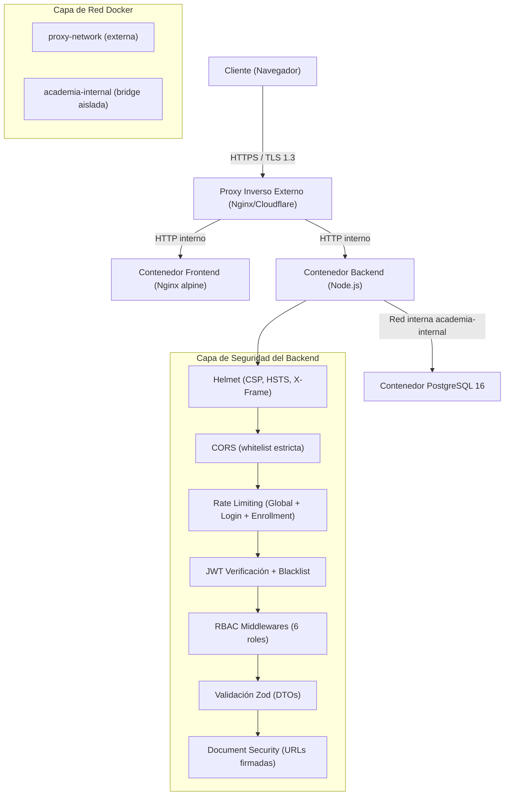
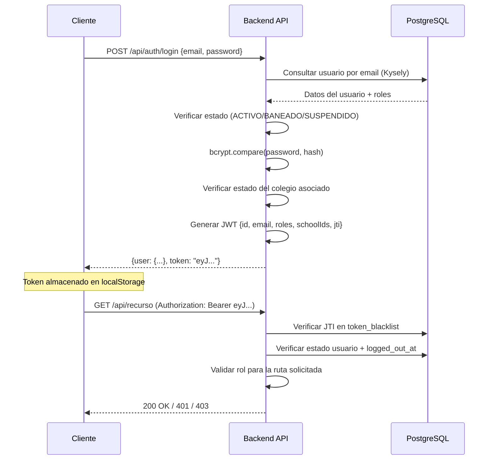

# Documento Técnico de Seguridad — AcademiaNeiva

---

## 1. Información General

| Campo | Valor |
|---|---|
| **Nombre del sistema** | AcademiaNeiva — Portal de Gestión Académica y Curricular |
| **Versión** | 1.0.0 (Producción) |
| **Fecha** | 12 de agosto de 2026 |
| **Responsable** | Equipo de Desarrollo AcademiaNeiva |
| **Objetivo del documento** | Documentar, evaluar y registrar el estado actual de la protección y seguridad del sistema AcademiaNeiva en todas sus capas: frontend, backend, base de datos, autenticación, infraestructura y servicios externos. Identificar controles implementados, vulnerabilidades conocidas y recomendaciones de mejora. |
| **Alcance** | Cubre la totalidad de la plataforma en su estado actual desplegado en producción sobre VPS con Docker. |

### 1.1 Componentes Cubiertos

| Componente | Tecnología | Descripción |
|---|---|---|
| **Frontend** | Vue 3 + Vite + TypeScript + TailwindCSS + Pinia | SPA servida por Nginx dentro de contenedor Docker (`nginx:alpine`) |
| **Backend / API** | Node.js + Express 5 + TypeScript + Kysely | API REST servida en contenedor Docker (`node:22-alpine`), puerto 3000 |
| **Base de datos** | PostgreSQL 16 | Contenedor Docker con volumen persistente, red interna aislada |
| **Autenticación** | JWT (jsonwebtoken) + bcrypt + Token Blacklist | Tokens Bearer con JTI, blacklist en BD, expiración 8h |
| **Infraestructura** | VPS Linux + Docker Compose + Nginx (proxy inverso) + SSH | Containerización con redes segmentadas, proxy inverso externo |
| **Servicios externos** | SMTP (Nodemailer) + Socket.io (WebSockets) | Correo transaccional y notificaciones en tiempo real |

---

## 2. Objetivos de Seguridad

### 2.1 Tríada CIA + Extensiones

| Principio | Objetivo | Estado Actual |
|---|---|---|
| **Confidencialidad** | Solo usuarios autorizados acceden a la información según su rol | ✅ Implementado — RBAC por JWT + middlewares de rol |
| **Integridad** | Los datos no pueden modificarse de forma indebida | ✅ Implementado — Validación Zod, transacciones SQL, restricciones FK |
| **Disponibilidad** | El sistema permanece operativo y accesible | ✅ Implementado — Docker restart:always, healthchecks, rate limiting |
| **Autenticidad** | Cada acción es rastreable a un usuario verificado | ✅ Implementado — JWT con JTI único, verificación de estado en BD |
| **Trazabilidad** | Registro de acciones críticas para auditoría | ✅ Implementado — Módulo de auditoría de supervisión con log de acciones |
| **Control de acceso** | Acceso granular basado en roles y contexto institucional | ✅ Implementado — 6 roles con middlewares específicos por ruta |
| **Protección de información sensible** | Documentos de menores y datos personales protegidos | ✅ Implementado — URLs firmadas temporales, tokens de documento |

---

## 3. Arquitectura de Seguridad

### 3.1 Diagrama de Capas de Seguridad



### 3.2 Segmentación de Red Docker

| Red | Tipo | Contenedores con acceso | Propósito |
|---|---|---|---|
| `proxy-network` | Externa | Frontend, Backend | Comunicación con el proxy inverso externo |
| `academia-internal` | Bridge aislada | Backend, PostgreSQL | Aislamiento de la base de datos del exterior |

> [!IMPORTANT]
> **PostgreSQL NO está expuesto a la red externa**. Solo el contenedor del backend tiene acceso a la base de datos a través de la red interna `academia-internal`. Esto previene ataques directos a la base de datos desde el exterior.

---

## 4. Autenticación y Gestión de Sesiones

### 4.1 Flujo de Autenticación



### 4.2 Configuración JWT

| Parámetro | Valor | Archivo de referencia |
|---|---|---|
| **Algoritmo** | HS256 (por defecto de `jsonwebtoken`) | [authController.ts](file:///c:/Users/alejo/Downloads/segundoProyecto/backend/src/controllers/authController.ts#L99-L111) |
| **Expiración** | 8 horas | [authController.ts L110](file:///c:/Users/alejo/Downloads/segundoProyecto/backend/src/controllers/authController.ts#L110) |
| **Secreto** | Variable de entorno `JWT_SECRET` | [authMiddleware.ts L5](file:///c:/Users/alejo/Downloads/segundoProyecto/backend/src/middleware/authMiddleware.ts#L5) |
| **JTI (JWT ID)** | UUID v4 único por sesión (`crypto.randomUUID()`) | [authController.ts L98](file:///c:/Users/alejo/Downloads/segundoProyecto/backend/src/controllers/authController.ts#L98) |
| **Payload** | `{id, email, role, roles[], schoolId, schoolIds[], jti}` | [authController.ts L100-L108](file:///c:/Users/alejo/Downloads/segundoProyecto/backend/src/controllers/authController.ts#L100-L108) |

### 4.3 Mecanismos de Invalidación de Sesión

| Mecanismo | Implementación | Archivo |
|---|---|---|
| **Token Blacklist (JTI)** | Tabla `token_blacklist` en PostgreSQL con índice en `expires_at` | [authMiddleware.ts L36-L44](file:///c:/Users/alejo/Downloads/segundoProyecto/backend/src/middleware/authMiddleware.ts#L36-L44) |
| **Cierre forzado (`logged_out_at`)** | Columna `logged_out_at` en tabla `usuario`. Tokens emitidos antes de este timestamp son rechazados | [authMiddleware.ts L65-L72](file:///c:/Users/alejo/Downloads/segundoProyecto/backend/src/middleware/authMiddleware.ts#L65-L72) |
| **Verificación de estado en BD** | En cada petición se verifica que `usuario.estado = 'ACTIVO'` | [authMiddleware.ts L60-L63](file:///c:/Users/alejo/Downloads/segundoProyecto/backend/src/middleware/authMiddleware.ts#L60-L63) |
| **Verificación de sesión en frontend** | Guard `beforeEach` valida token contra `GET /api/auth/verify` una vez por pestaña del navegador | [router/index.ts L426-L447](file:///c:/Users/alejo/Downloads/segundoProyecto/frontend/src/router/index.ts#L426-L447) |

### 4.4 Hashing de Contraseñas

| Parámetro | Valor |
|---|---|
| **Algoritmo** | bcrypt |
| **Rondas de sal (salt rounds)** | 10 |
| **Librería** | `bcrypt` v6.0.0 |

> [!NOTE]
> Se utiliza bcrypt con 10 rondas de sal en todos los puntos donde se crean o actualizan contraseñas: registro de directivos, docentes, padres, estudiantes, restablecimiento de contraseña y creación de usuarios por Admin General.

### 4.5 Recuperación de Contraseña

| Control | Detalle | Archivo |
|---|---|---|
| **Prevención de enumeración de usuarios** | Respuesta genérica idéntica tanto si el email existe como si no | [passwordResetController.ts L24](file:///c:/Users/alejo/Downloads/segundoProyecto/backend/src/controllers/passwordResetController.ts#L24) |
| **Token de un solo uso** | UUID v4, marcado como `used = true` tras el consumo | [passwordResetController.ts L31-L43](file:///c:/Users/alejo/Downloads/segundoProyecto/backend/src/controllers/passwordResetController.ts#L31-L43) |
| **Expiración del token** | 1 hora | [passwordResetController.ts L32-L33](file:///c:/Users/alejo/Downloads/segundoProyecto/backend/src/controllers/passwordResetController.ts#L32-L33) |
| **Invalidación de tokens anteriores** | Tokens previos no usados se marcan como `used = true` al generar uno nuevo | [passwordResetController.ts L36-L39](file:///c:/Users/alejo/Downloads/segundoProyecto/backend/src/controllers/passwordResetController.ts#L36-L39) |
| **Longitud mínima de contraseña** | 6 caracteres | [passwordResetController.ts L68-L70](file:///c:/Users/alejo/Downloads/segundoProyecto/backend/src/controllers/passwordResetController.ts#L68-L70) |

---

## 5. Autorización y Control de Acceso (RBAC)

### 5.1 Matriz de Roles del Sistema

| Rol | Código interno | Alcance | Middleware protector |
|---|---|---|---|
| **Administrador General** | `admin_general` | Plataforma completa (multi-colegio) | `requireAdminGeneral` |
| **Directivo / Rector** | `directivo` / `rector` | Colegio asignado | `requireDirectivo` |
| **Docente** | `docente` | Cursos y materias asignados | `requireDocente` |
| **Padre de Familia** | `padre` | Hijos matriculados | `requirePadre` |
| **Estudiante** | `estudiante` | Datos propios | `requireEstudiante` |

### 5.2 Middlewares de Autorización

Todos los middlewares están definidos en [authMiddleware.ts](file:///c:/Users/alejo/Downloads/segundoProyecto/backend/src/middleware/authMiddleware.ts):

| Middleware | Líneas | Roles permitidos | Comportamiento |
|---|---|---|---|
| `verifyToken` | L24-L269 | Todos (autenticado) | Verifica JWT, blacklist, estado del usuario, supervisión activa |
| `verifyTokenOptional` | L368-L416 | Visitantes + autenticados | Extrae el usuario si existe token, pero no bloquea si no hay |
| `requireAdminGeneral` | L275-L287 | `admin_general` | 403 si no es admin general |
| `requireDirectivo` | L293-L309 | `directivo`, `rector`, `admin_general` | 403 si no es directivo/rector/admin |
| `requireDocente` | L315-L327 | `docente`, `admin_general` | 403 si no es docente/admin |
| `requirePadre` | L333-L345 | `padre`, `admin_general` | 403 si no es padre/admin |
| `requireEstudiante` | L351-L363 | `estudiante`, `admin_general` | 403 si no es estudiante/admin |

### 5.3 Protección por Módulo de Rutas

| Módulo de rutas | Archivo | Middleware aplicado | Observaciones |
|---|---|---|---|
| Autenticación (`/api/auth`) | [auth.routes.ts](file:///c:/Users/alejo/Downloads/segundoProyecto/backend/src/routes/auth.routes.ts) | `verifyToken` en rutas protegidas; login/register público | Login, forgot/reset password son públicos |
| Matrículas (`/api/matriculas`) | [matricula.routes.ts](file:///c:/Users/alejo/Downloads/segundoProyecto/backend/src/routes/matricula.routes.ts) | `verifyToken + requireDirectivo` en gestión; `verifyDocumentToken` en documentos | Submit y corrección de matrícula son públicos (por diseño del flujo) |
| Gestión Académica (`/api/academic-admin`) | [academicAdmin.routes.ts](file:///c:/Users/alejo/Downloads/segundoProyecto/backend/src/routes/academicAdmin.routes.ts) | `verifyToken` global + `requireDirectivo` para escritura | Catálogos públicos; settings de lectura para autenticados |
| Estudiantes (`/api/student`) | [student.routes.ts](file:///c:/Users/alejo/Downloads/segundoProyecto/backend/src/routes/student.routes.ts) | `verifyToken + requireDirectivo` para CRUD admin; `verifyToken` para portal | Portal del estudiante requiere autenticación genérica |
| Admin General (`/api/admin`) | [adminGeneral.routes.ts](file:///c:/Users/alejo/Downloads/segundoProyecto/backend/src/routes/adminGeneral.routes.ts) | `verifyToken + requireAdminGeneral` en todas las rutas | Acceso exclusivo al administrador general |
| DBA (`/api/admin/dba`) | [dba.routes.ts](file:///c:/Users/alejo/Downloads/segundoProyecto/backend/src/routes/dba.routes.ts) | `verifyToken + requireAdminGeneral` en todas las rutas | Acceso exclusivo al administrador general |
| Padres (`/api/parents`) | [parent.routes.ts](file:///c:/Users/alejo/Downloads/segundoProyecto/backend/src/routes/parent.routes.ts) | `verifyToken + requireDirectivo` global (`router.use`) | Gestión administrativa de padres |
| Docentes (`/api/teacher`) | [teacher.routes.ts](file:///c:/Users/alejo/Downloads/segundoProyecto/backend/src/routes/teacher.routes.ts) | `verifyToken + requireDocente` / `requireDirectivo` | Separación lectura docente vs gestión directivo |
| Soporte (`/api/support`) | [support.routes.ts](file:///c:/Users/alejo/Downloads/segundoProyecto/backend/src/routes/support.routes.ts) | `verifyToken` + rol según ruta | Tickets de soporte accesibles por todos los roles |
| Boletines (`/api/boletines`) | [boletin.routes.ts](file:///c:/Users/alejo/Downloads/segundoProyecto/backend/src/routes/boletin.routes.ts) | `verifyToken` + `requireDirectivo` | Generación de boletines por directivo |
| Reingreso (`/api/reingreso`) | [reingreso.routes.ts](file:///c:/Users/alejo/Downloads/segundoProyecto/backend/src/routes/reingreso.routes.ts) | `verifyToken + requireDirectivo` | Flujo de reingreso de estudiantes |
| Traslados (`/api/traslados`) | [traslado.routes.ts](file:///c:/Users/alejo/Downloads/segundoProyecto/backend/src/routes/traslado.routes.ts) | `verifyToken + requireDirectivo` | Flujo de traslados entre instituciones |

### 5.4 Contexto Multi-Colegio (`x-school-id`)

El sistema soporta usuarios vinculados a múltiples colegios. El header `x-school-id` permite al frontend seleccionar el colegio activo:

```typescript
// authMiddleware.ts L74-L80
const headerSchoolId = req.headers['x-school-id'] ? Number(req.headers['x-school-id']) : null;
const userSchoolIds = (decoded.schoolIds || []).map(Number);

let activeSchoolId = decoded.schoolId || null;
if (headerSchoolId && (userSchoolIds.length === 0 || userSchoolIds.includes(headerSchoolId) || decoded.roles?.includes('admin_general'))) {
  activeSchoolId = headerSchoolId;
}
```

> [!NOTE]
> Solo se acepta un `x-school-id` si el usuario efectivamente está vinculado a ese colegio en su JWT, o si es `admin_general` (acceso universal).

---

## 6. Protección de Documentos Confidenciales

### 6.1 URLs Firmadas Temporales (Anti-IDOR)

Los documentos de matrícula (registro civil, documentos de identidad, fotos, certificados) están protegidos contra acceso directo por ID mediante **tokens JWT de corta duración** vinculados a cada documento específico.

| Control | Implementación | Archivo |
|---|---|---|
| **Generación de token** | `generateDocumentAccessToken(idDocumento)` — JWT con `type: "doc_access"`, expiración 30 min | [documentSecurity.ts L9-L18](file:///c:/Users/alejo/Downloads/segundoProyecto/backend/src/middleware/documentSecurity.ts#L9-L18) |
| **Verificación híbrida** | 1) Si hay `Authorization` Bearer válido → acceso directo (directivos/admins). 2) Si hay `?token=` → validar firma + match de `id_documento`. 3) Sin token → 403 Forbidden | [documentSecurity.ts L29-L81](file:///c:/Users/alejo/Downloads/segundoProyecto/backend/src/middleware/documentSecurity.ts#L29-L81) |
| **Anti-IDOR** | El token firmado contiene el `id_documento`; si el parámetro `:idDocumento` de la URL no coincide con el del token → 403 | [documentSecurity.ts L68-L73](file:///c:/Users/alejo/Downloads/segundoProyecto/backend/src/middleware/documentSecurity.ts#L68-L73) |
| **Cabeceras anti-caché** | `Cache-Control: private, no-store, no-cache`, `Pragma: no-cache`, `X-Content-Type-Options: nosniff` | [matriculaController.ts L165-L167](file:///c:/Users/alejo/Downloads/segundoProyecto/backend/src/controllers/matriculaController.ts#L165-L167) |

### 6.2 Almacenamiento de Documentos

| Método | Descripción |
|---|---|
| **Primario (actual)** | Binarios almacenados en PostgreSQL como `bytea` en la columna `contenido` de la tabla `documento_matricula` |
| **Fallback (legado)** | Archivos físicos en el volumen Docker `uploads_data` montado en `/app/uploads` |

> [!WARNING]
> La ruta estática `/uploads` está servida por Express (`express.static`) en [app.ts L98](file:///c:/Users/alejo/Downloads/segundoProyecto/backend/src/app.ts#L98) **sin autenticación**. Aunque los documentos nuevos se almacenan en BD, archivos legacy en el directorio `/uploads` siguen siendo accesibles públicamente. **Se recomienda desactivar esta ruta o protegerla con `verifyToken`**.

---

## 7. Validación de Datos de Entrada

### 7.1 Validación con Zod (Backend)

El sistema utiliza **Zod v4** como validador de esquemas en el backend, integrado a través del middleware genérico [validateDto.ts](file:///c:/Users/alejo/Downloads/segundoProyecto/backend/src/middleware/validateDto.ts):

| DTO | Archivo | Rutas protegidas |
|---|---|---|
| `SubmitEnrollmentSchema` | [matricula.dto.ts](file:///c:/Users/alejo/Downloads/segundoProyecto/backend/src/dtos/matricula.dto.ts#L27-L63) | POST `/api/matriculas/submit` |
| `ValidateDocumentSchema` | [matricula.dto.ts](file:///c:/Users/alejo/Downloads/segundoProyecto/backend/src/dtos/matricula.dto.ts#L65-L73) | PATCH `/api/matriculas/document/:id` |
| `FinalizeEnrollmentSchema` | [matricula.dto.ts](file:///c:/Users/alejo/Downloads/segundoProyecto/backend/src/dtos/matricula.dto.ts#L75-L113) | POST `/api/matriculas/finalize/:id` |
| `CancelEnrollmentSchema` | [matricula.dto.ts](file:///c:/Users/alejo/Downloads/segundoProyecto/backend/src/dtos/matricula.dto.ts#L118-L127) | POST `/api/matriculas/cancel/:id` |
| `createAdminUserSchema` | [adminUser.dto.ts](file:///c:/Users/alejo/Downloads/segundoProyecto/backend/src/dtos/adminUser.dto.ts) | POST `/api/admin/usuarios` |
| `updatePhoneSchema` | [profile.dto.ts](file:///c:/Users/alejo/Downloads/segundoProyecto/backend/src/dtos/profile.dto.ts) | PUT `/api/auth/profile/phone` |
| `requestEmailChangeSchema` | [profile.dto.ts](file:///c:/Users/alejo/Downloads/segundoProyecto/backend/src/dtos/profile.dto.ts) | POST `/api/auth/profile/request-email-change` |
| Schemas de reingreso | [reingreso.dto.ts](file:///c:/Users/alejo/Downloads/segundoProyecto/backend/src/dtos/reingreso.dto.ts) | Rutas de reingreso |
| Schemas de traslado | [traslado.dto.ts](file:///c:/Users/alejo/Downloads/segundoProyecto/backend/src/dtos/traslado.dto.ts) | Rutas de traslado |
| Schemas de estudiante | [student.dto.ts](file:///c:/Users/alejo/Downloads/segundoProyecto/backend/src/dtos/student.dto.ts) | Gestión de estudiantes |

### 7.2 Validación de Documentos de Identidad

Validación exhaustiva del formato de documentos colombianos en [documentValidation.ts](file:///c:/Users/alejo/Downloads/segundoProyecto/backend/src/utils/documentValidation.ts):

| Tipo de documento | Formato aceptado |
|---|---|
| CC (Cédula de Ciudadanía) | Solo números, 6-10 dígitos |
| TI (Tarjeta de Identidad) | Solo números, 6-11 dígitos |
| RC (Registro Civil) | Solo números, 6-11 dígitos |
| CE (Cédula de Extranjería) | Solo números, 1-10 dígitos |
| PEP/PPT | Solo números, 1-10 dígitos |
| Pasaporte | Alfanumérico, 1-15 caracteres |

### 7.3 Validación con Kysely (Query Builder Tipado)

El acceso a datos utiliza **Kysely v0.29** como query builder con tipado TypeScript completo, previniendo:
- Inyección SQL (consultas parametrizadas automáticas)
- Errores de columnas inexistentes (validación en tiempo de compilación)
- Tipos incorrectos en inserciones/actualizaciones

> [!NOTE]
> Aún existen consultas SQL crudas (`pool.query()`) en algunos controladores y rutas. La migración progresiva a Kysely está en curso según las reglas del proyecto.

### 7.4 Protección contra XSS

| Control | Estado |
|---|---|
| Vue 3 auto-escaping en templates | ✅ Activo por defecto |
| Ausencia de `v-html` en el frontend | ✅ Verificado — 0 ocurrencias |
| Helmet CSP headers | ✅ Configurado en [app.ts L46-L60](file:///c:/Users/alejo/Downloads/segundoProyecto/backend/src/app.ts#L46-L60) |
| `X-Content-Type-Options: nosniff` | ✅ Aplicado en respuestas de documentos |

---

## 8. Protección contra Ataques Comunes

### 8.1 Rate Limiting (Anti Fuerza Bruta / DDoS)

Implementado con `express-rate-limit` v8 en [app.ts L26-L43](file:///c:/Users/alejo/Downloads/segundoProyecto/backend/src/app.ts#L26-L43):

| Limiter | Ventana | Máximo | Ruta | Particularidad |
|---|---|---|---|---|
| **Global** | 15 min | 2000 req/IP | Todas las rutas | Configurable vía `GLOBAL_RATE_LIMIT_MAX` |
| **Login** | 15 min | 50 intentos fallidos/IP | `/api/auth/login`, `/api/auth/student-login` | `skipSuccessfulRequests: true` — logins exitosos no cuentan |
| **Matrícula** | 15 min | 100 req/IP | `/api/matriculas/submit` | Previene spam de formularios públicos |

> [!TIP]
> El backend confía en el proxy inverso (`app.set("trust proxy", 1)`) para obtener la IP real del cliente a través del header `X-Forwarded-For`.

### 8.2 Helmet (Cabeceras HTTP de Seguridad)

Configurado en [app.ts L46-L60](file:///c:/Users/alejo/Downloads/segundoProyecto/backend/src/app.ts#L46-L60):

| Cabecera | Valor / Comportamiento |
|---|---|
| **Content-Security-Policy** | `default-src 'self'`; scripts y estilos inline permitidos; fuentes de Google Fonts; imágenes de cualquier origen |
| **X-Content-Type-Options** | `nosniff` (por defecto de Helmet) |
| **X-Frame-Options** | Deshabilitado (`frameguard: false`) para permitir embebido de visores |
| **Cross-Origin-Resource-Policy** | Deshabilitado (`false`) para permitir carga de recursos cross-origin |
| **X-Powered-By** | Removido automáticamente por Helmet |

### 8.3 CORS (Cross-Origin Resource Sharing)

Configurado con whitelist estricta en [app.ts L62-L86](file:///c:/Users/alejo/Downloads/segundoProyecto/backend/src/app.ts#L62-L86):

```
Orígenes permitidos:
✓ http://localhost:5173     (desarrollo frontend)
✓ http://localhost:3000     (desarrollo backend)
✓ https://academianeiva.adsoproject.dev   (producción frontend)
✓ https://api-academianeiva.adsoproject.dev (producción API)
✓ process.env.FRONTEND_URL (configurable)
✓ process.env.ALLOWED_ORIGINS (lista adicional, separada por comas)
```

| Parámetro | Valor |
|---|---|
| `credentials` | `true` — Permite envío de cookies y headers de autorización |
| Verificación de origen | Función callback que rechaza orígenes no autorizados |

### 8.4 Límites de Payload

| Parámetro | Valor | Archivo |
|---|---|---|
| `express.json()` limit | 10 MB | [app.ts L88](file:///c:/Users/alejo/Downloads/segundoProyecto/backend/src/app.ts#L88) |
| `express.urlencoded()` limit | 10 MB | [app.ts L89](file:///c:/Users/alejo/Downloads/segundoProyecto/backend/src/app.ts#L89) |
| Multer `fileSize` limit | 100 MB | [multer.ts L7](file:///c:/Users/alejo/Downloads/segundoProyecto/backend/src/config/multer.ts#L7) |
| Nginx `client_max_body_size` | 50 MB | [nginx.conf L6](file:///c:/Users/alejo/Downloads/segundoProyecto/frontend/nginx.conf#L6) |

> [!WARNING]
> Existe una inconsistencia entre el límite de Multer (100 MB) y Nginx (50 MB). Nginx rechazará archivos de más de 50 MB antes de que lleguen al backend. **Se recomienda alinear ambos valores** (e.g., ambos a 50 MB o ambos a 10 MB según las necesidades reales).

### 8.5 Protección contra Inyección SQL

| Capa | Mecanismo | Estado |
|---|---|---|
| Kysely (query builder) | Parametrización automática con tipado | ✅ En uso creciente |
| `pg` (pool.query) | Consultas parametrizadas con `$1, $2, ...` | ✅ Implementado en consultas crudas |
| Zod DTOs | Validación de tipos antes de llegar a la consulta | ✅ En rutas críticas |

---

## 9. Seguridad del Frontend

### 9.1 Almacenamiento de Credenciales

| Dato | Almacenamiento | Riesgo | Mitigación |
|---|---|---|---|
| JWT Token | `localStorage` | Vulnerable a XSS | Ausencia de `v-html`, CSP estricto, no hay librerías de terceros que manipulen DOM raw |
| Datos del usuario | `localStorage` (JSON) | Exposición en DevTools | Datos no sensibles (nombre, email, rol) |
| Rol activo | `localStorage` | Manipulación manual | Guard del router verifica que el rol esté en el JWT del usuario |
| Verificación de sesión | `sessionStorage` | — | Se limpia automáticamente al cerrar la pestaña |

### 9.2 Guards de Navegación

Implementados en [router/index.ts L410-L468](file:///c:/Users/alejo/Downloads/segundoProyecto/frontend/src/router/index.ts#L410-L468):

| Guard | Comportamiento |
|---|---|
| **Redirección login → dashboard** | Si el usuario ya está autenticado y navega a `/login`, redirige a `/dashboard` |
| **Verificación de token** | En la primera navegación de cada pestaña, valida el JWT contra `GET /api/auth/verify` |
| **Protección contra manipulación de rol** | Si `activeRole` en localStorage no está en los roles del JWT, se restaura automáticamente al rol legítimo |
| **Verificación de roles por ruta** | Cada ruta con `meta.roles` se valida contra el `activeRole` del usuario |
| **Stale Assets Auto-Reload** | Si un chunk de módulo falla al cargar (post-despliegue), recarga automáticamente la página una vez |

### 9.3 Interceptores Axios

Definidos en [auth.ts L229-L274](file:///c:/Users/alejo/Downloads/segundoProyecto/frontend/src/stores/auth.ts#L229-L274):

| Interceptor | Función |
|---|---|
| **Request interceptor** | Adjunta `Authorization: Bearer` automáticamente. Bloquea peticiones mutadoras (POST/PUT/PATCH/DELETE) si está en Modo Monitoreo o Supervisión de Solo Lectura |
| **Response interceptor** | Registra en consola errores de red para depuración |

---

## 10. Auditoría y Trazabilidad

### 10.1 Sistema de Auditoría de Supervisión

El módulo de supervisión del Admin General registra automáticamente todas las acciones realizadas durante una sesión de supervisión:

| Componente | Detalle | Archivo |
|---|---|---|
| **Tabla `auditoria_supervision`** | Registra entradas/salidas del admin general en colegios, con duración máxima, tipo (SOLO_LECTURA/COMPLETO) | BD |
| **Tabla `auditoria_acciones_realizadas`** | Log detallado de cada acción: módulo, tipo (LECTURA/CREACION/MODIFICACION/ELIMINACION/EXPORTACION), recurso afectado, valores anteriores/nuevos, motivo de cambio | BD |
| **Auto-logging de GETs** | Las peticiones GET durante supervisión activa se registran automáticamente si coinciden con rutas de módulos conocidos | [authMiddleware.ts L208-L225](file:///c:/Users/alejo/Downloads/segundoProyecto/backend/src/middleware/authMiddleware.ts#L208-L225) |
| **Auto-logging de mutaciones** | Las peticiones POST/PUT/PATCH/DELETE exitosas se registran en el evento `finish` de la respuesta si no fueron auditadas manualmente | [authMiddleware.ts L227-L259](file:///c:/Users/alejo/Downloads/segundoProyecto/backend/src/middleware/authMiddleware.ts#L227-L259) |
| **Expiración automática** | Supervisiones que exceden `duracion_maxima_minutos` se cierran automáticamente tanto en el middleware como en el SchedulerService | [authMiddleware.ts L120-L189](file:///c:/Users/alejo/Downloads/segundoProyecto/backend/src/middleware/authMiddleware.ts#L120-L189), [schedulerService.ts L119-L199](file:///c:/Users/alejo/Downloads/segundoProyecto/backend/src/services/schedulerService.ts#L119-L199) |
| **Notificación a directivos** | Al expirar o salir de una supervisión, se notifica a todos los directivos activos del colegio por correo electrónico y notificación interna | [authMiddleware.ts L160-L180](file:///c:/Users/alejo/Downloads/segundoProyecto/backend/src/middleware/authMiddleware.ts#L160-L180) |

### 10.2 Modo Monitoreo (Solo Lectura)

El sistema implementa dos modos de solo lectura controlados en tiempo real:

| Modo | Actor | Restricción | Control Backend | Control Frontend |
|---|---|---|---|---|
| **Monitoreo Directivo** | Directivo observa panel de un docente/estudiante/padre | Bloqueo de POST/PUT/PATCH/DELETE | Header `X-Monitoring-Mode: true` → [authMiddleware.ts L94-L101](file:///c:/Users/alejo/Downloads/segundoProyecto/backend/src/middleware/authMiddleware.ts#L94-L101) | Interceptor Axios bloquea mutaciones |
| **Supervisión Solo Lectura** | Admin General observa colegio sin poder modificar | Bloqueo de POST/PUT/PATCH/DELETE excepto `/salir` | `supervision.tipo_supervision === 'SOLO_LECTURA'` → [authMiddleware.ts L199-L205](file:///c:/Users/alejo/Downloads/segundoProyecto/backend/src/middleware/authMiddleware.ts#L199-L205) | Interceptor Axios bloquea mutaciones |

---

## 11. Seguridad de Infraestructura

### 11.1 Contenedores Docker

| Contenedor | Imagen Base | Exposición de puertos | Reinicio |
|---|---|---|---|
| `academia-frontend` | `nginx:alpine` | Solo vía `proxy-network` (no expone puertos al host) | `restart: always` |
| `academia-backend` | `node:22-alpine` (multi-stage build) | Solo vía `proxy-network` + `academia-internal` | `restart: always` |
| `academia-postgres` | `postgres:16` | Solo vía `academia-internal` (no accesible externamente) | `restart: always` |

### 11.2 Build Multi-Etapa (Multi-Stage)

Tanto el [backend Dockerfile](file:///c:/Users/alejo/Downloads/segundoProyecto/backend/Dockerfile) como el [frontend Dockerfile](file:///c:/Users/alejo/Downloads/segundoProyecto/frontend/Dockerfile) utilizan builds multi-etapa:

| Beneficio | Detalle |
|---|---|
| **Imagen final más ligera** | Solo contiene el runtime y los artefactos compilados, no el código fuente ni las devDependencies |
| **Superficie de ataque reducida** | No incluye `npm`, compiladores ni herramientas de desarrollo en la imagen de producción |
| **Backend**: `npm ci --omit=dev` | Solo instala dependencias de producción en la imagen final |

### 11.3 Healthcheck de PostgreSQL

```yaml
healthcheck:
  test: ["CMD-SHELL", "pg_isready -U postgres -d AcademiaNeiva"]
  interval: 5s
  timeout: 5s
  retries: 10
```

El backend espera a que PostgreSQL esté saludable antes de iniciar (`condition: service_healthy`).

### 11.4 Volúmenes Persistentes

| Volumen | Montaje | Propósito |
|---|---|---|
| `postgres_data` | `/var/lib/postgresql/data` | Persistencia de datos de la BD |
| `uploads_data` | `/app/uploads` | Persistencia de archivos legacy subidos |

---

## 12. Seguridad de Comunicaciones

### 12.1 WebSockets (Socket.io)

Implementado en [socketManager.ts](file:///c:/Users/alejo/Downloads/segundoProyecto/backend/src/services/socketManager.ts):

| Control | Detalle |
|---|---|
| **Autenticación JWT obligatoria** | Cada conexión WebSocket debe incluir un token JWT válido en `socket.handshake.auth.token` |
| **CORS para WebSockets** | Whitelist de orígenes idéntica a la configuración HTTP |
| **Salas por rol** | Solo usuarios con rol `admin_general` se unen a la sala `admin_general` |
| **Tracking de sesiones** | Map `socketId → userId` para conteo de usuarios únicos conectados |

### 12.2 Correo Electrónico (SMTP)

Configurado en [notificationService.ts](file:///c:/Users/alejo/Downloads/segundoProyecto/backend/src/services/notificationService.ts):

| Parámetro | Valor |
|---|---|
| **Librería** | Nodemailer v8 |
| **Protocolo** | SMTP con TLS (puerto 587) o SMTPS (puerto 465) |
| **Credenciales** | Variables de entorno `SMTP_USER` y `SMTP_PASS` |
| **Verificación al inicio** | `transporter.verify()` confirma la conexión SMTP al arrancar el servidor |

---

## 13. Servicios en Segundo Plano

### 13.1 Scheduler Service

Implementado en [schedulerService.ts](file:///c:/Users/alejo/Downloads/segundoProyecto/backend/src/services/schedulerService.ts):

| Tarea | Frecuencia | Acción |
|---|---|---|
| **Activación automática de periodos** | Cada 1 hora | Activa periodos `PENDIENTE` cuya fecha de inicio ya llegó y cuyo periodo anterior está `CERRADO` |
| **Expiración de supervisiones** | Cada 1 hora | Finaliza supervisiones de admin general que excedieron la `duracion_maxima_minutos` |

---

## 14. Gestión de Secretos y Variables de Entorno

### 14.1 Variables Sensibles

| Variable | Propósito | Almacenamiento |
|---|---|---|
| `JWT_SECRET` | Firma de tokens JWT | `.env` del backend |
| `DB_PASSWORD` | Contraseña de PostgreSQL | `.env` del backend + `docker-compose.yml` |
| `SMTP_USER` / `SMTP_PASS` | Credenciales del servidor de correo | `.env` del backend |
| `DB_USER` / `DB_NAME` / `DB_HOST` / `DB_PORT` | Conexión a la base de datos | `.env` del backend + variables de entorno Docker |

> [!CAUTION]
> **Hallazgo crítico**: En [docker-compose.yml L21](file:///c:/Users/alejo/Downloads/segundoProyecto/docker-compose.yml#L21), las credenciales de PostgreSQL están hardcodeadas como `DB_PASSWORD=postgres`. Aunque se ofrece soporte para `.env` con `env_file`, las variables de entorno definidas directamente en `environment` tienen **prioridad** sobre las del archivo `.env`. **Se recomienda remover las credenciales hardcodeadas del docker-compose.yml y usar exclusivamente archivos `.env` (excluidos de Git)**.

> [!CAUTION]
> **Hallazgo**: En [authMiddleware.ts L5](file:///c:/Users/alejo/Downloads/segundoProyecto/backend/src/middleware/authMiddleware.ts#L5) y múltiples archivos, se usa `process.env.JWT_SECRET || 'fallback-secret'` como secreto JWT. Si la variable de entorno no está configurada, se utiliza un secreto predecible. **Se recomienda eliminar el fallback y forzar la presencia de `JWT_SECRET` en producción**.

---

## 15. Inventario de Vulnerabilidades Conocidas y Hallazgos

### 15.1 Tabla de Hallazgos

| # | Severidad | Categoría | Hallazgo | Ubicación | Estado | Recomendación |
|---|---|---|---|---|---|---|
| H-01 | 🔴 Alta | Secretos | `JWT_SECRET` tiene fallback predecible (`'fallback-secret'`) en 4+ archivos | `authMiddleware.ts`, `documentSecurity.ts`, `socketManager.ts`, `authController.ts` | Abierto | Eliminar fallback; forzar presencia en `.env`; crash al arranque si falta |
| H-02 | 🔴 Alta | Secretos | Credenciales de BD hardcodeadas en `docker-compose.yml` (`DB_PASSWORD=postgres`) | [docker-compose.yml L21](file:///c:/Users/alejo/Downloads/segundoProyecto/docker-compose.yml#L21) | Abierto | Usar exclusivamente `env_file` con `.env` excluido de Git |
| H-03 | 🟡 Media | Acceso | Ruta estática `/uploads` sin autenticación | [app.ts L98](file:///c:/Users/alejo/Downloads/segundoProyecto/backend/src/app.ts#L98) | Abierto | Proteger con `verifyToken` o eliminar si ya no se usa |
| H-04 | 🟡 Media | Config | Inconsistencia de límites: Multer 100MB vs Nginx 50MB | [multer.ts L7](file:///c:/Users/alejo/Downloads/segundoProyecto/backend/src/config/multer.ts#L7) vs [nginx.conf L6](file:///c:/Users/alejo/Downloads/segundoProyecto/frontend/nginx.conf#L6) | Abierto | Alinear límites a 10-20 MB según caso de uso real |
| H-05 | 🟡 Media | Contraseñas | Contraseñas hardcodeadas en seeds (`padre123`, `estudiante123`) podrían quedar en producción | [reset_and_seed.ts](file:///c:/Users/alejo/Downloads/segundoProyecto/backend/src/seeds/reset_and_seed.ts) | Bajo — Solo en seed de desarrollo | Documentar que los seeds son exclusivamente para desarrollo |
| H-06 | 🟢 Baja | Validación | No todas las rutas usan validación Zod DTO (algunos controladores aceptan `req.body` sin validar) | Múltiples controladores | En progreso | Expandir DTOs Zod a todas las rutas que aceptan body |
| H-07 | 🟢 Baja | Migración | Consultas SQL crudas (`pool.query`) coexisten con Kysely | Múltiples archivos | En progreso | Migrar progresivamente a Kysely según reglas del proyecto |
| H-08 | 🟢 Baja | Contraseñas | Longitud mínima de contraseña es 6 caracteres | [passwordResetController.ts L68](file:///c:/Users/alejo/Downloads/segundoProyecto/backend/src/controllers/passwordResetController.ts#L68) | Abierto | Considerar elevar a 8+ caracteres con reglas de complejidad |
| H-09 | 🟢 Info | Headers | `X-Frame-Options` deshabilitado (`frameguard: false`) para visores de documentos | [app.ts L59](file:///c:/Users/alejo/Downloads/segundoProyecto/backend/src/app.ts#L59) | Intencional | Evaluar si se puede re-habilitar con `SAMEORIGIN` |
| H-10 | 🟢 Info | Frontend | Token JWT en `localStorage` (vulnerable a XSS teórico) | [auth.ts L59](file:///c:/Users/alejo/Downloads/segundoProyecto/frontend/src/stores/auth.ts#L59) | Mitigado | CSP + ausencia de `v-html` + Helmet mitigan el riesgo. Evaluar migración a `httpOnly` cookies en futuras iteraciones |

---

## 16. Controles Implementados — Resumen Ejecutivo

### 16.1 Scorecard de Seguridad

| Área | Controles Implementados | Puntaje |
|---|---|---|
| **Autenticación** | JWT con JTI + Blacklist + bcrypt + Verificación de estado en BD + Expiración + Cierre forzado | ⭐⭐⭐⭐⭐ |
| **Autorización (RBAC)** | 6 middlewares de rol + Multi-colegio + Modo monitoreo + Supervisión con auditoría | ⭐⭐⭐⭐⭐ |
| **Validación de entrada** | Zod DTOs en rutas críticas + Kysely tipado + Validación de documentos colombianos | ⭐⭐⭐⭐ |
| **Protección de documentos** | URLs firmadas temporales + Anti-IDOR + Cabeceras anti-caché | ⭐⭐⭐⭐⭐ |
| **Rate Limiting** | 3 limitadores configurables (global, login, matrícula) | ⭐⭐⭐⭐ |
| **Cabeceras HTTP** | Helmet + CSP + CORS whitelist + X-Content-Type-Options | ⭐⭐⭐⭐ |
| **Infraestructura** | Docker multi-stage + Red aislada para BD + Healthchecks | ⭐⭐⭐⭐ |
| **Auditoría** | Log completo de acciones de supervisión + Notificaciones automáticas | ⭐⭐⭐⭐⭐ |
| **Comunicaciones** | WebSockets autenticados + SMTP con TLS | ⭐⭐⭐⭐ |
| **Gestión de secretos** | Variables de entorno en `.env` (con fallbacks a mejorar) | ⭐⭐⭐ |

### 16.2 Calificación General

> **Nivel de Madurez de Seguridad: BUENO (4/5)**
>
> El sistema AcademiaNeiva presenta una postura de seguridad sólida con controles bien implementados en autenticación, autorización, protección de documentos y auditoría. Los hallazgos pendientes (H-01 a H-04) son de corrección relativamente sencilla y no representan brechas explotables de forma trivial en el entorno actual de producción.

---

## 17. Recomendaciones Priorizadas

### Prioridad Alta (Corregir en la próxima iteración)

1. **Eliminar fallback de `JWT_SECRET`**: Reemplazar `|| 'fallback-secret'` por una validación que detenga el arranque si no está definido.
2. **Remover credenciales hardcodeadas de `docker-compose.yml`**: Usar exclusivamente `env_file` con archivos `.env` que estén en `.gitignore`.
3. **Proteger o eliminar la ruta estática `/uploads`**: Agregar `verifyToken` o eliminar si los documentos ya se sirven desde la BD.

### Prioridad Media (Planificar para próximas versiones)

4. **Alinear límites de tamaño de archivo** entre Multer y Nginx.
5. **Extender validación Zod a todas las rutas** que aceptan body de solicitud.
6. **Completar migración a Kysely** para eliminar consultas SQL crudas.
7. **Fortalecer política de contraseñas**: Mínimo 8 caracteres con al menos una mayúscula, un número y un carácter especial.

### Prioridad Baja (Mejora continua)

8. **Evaluar migración de token a httpOnly cookies** para eliminar riesgo teórico de XSS sobre localStorage.
9. **Implementar logging centralizado** (e.g., Winston/Pino) con niveles de severidad para facilitar la detección de incidentes.
10. **Considerar re-habilitar `X-Frame-Options: SAMEORIGIN`** si los visores de documentos pueden funcionar sin iframes cross-origin.

---

*Documento generado el 12 de agosto de 2026 mediante análisis exhaustivo del código fuente del repositorio AcademiaNeiva.*
