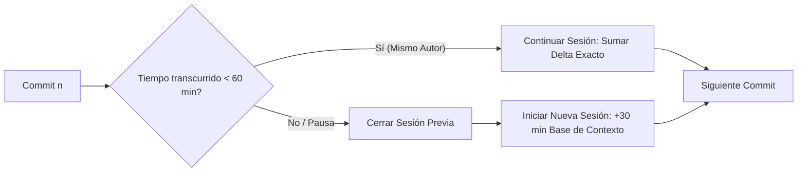

# ⏱️ Estimación de Horas Trabajadas a partir del Historial Git — AcademiaNeiva

<div align="center">


**Informe Técnico Forense de Dedicación Temporal y Auditoría de Desarrollo Basado en Git.**

</div>

---

## 📋 1. Resumen Ejecutivo

El presente informe expone una estimación cuantitativa y analítica del tiempo real dedicado al desarrollo de la plataforma **AcademiaNeiva**, fundamentada exclusivamente en la evidencia forense observable en el historial de **610 commits** del repositorio Git, desde el commit inicial (*07 de mayo de 2026*) hasta la versión actual (*01 de septiembre de 2026*).

### 🎯 Estimación de Horas por Escenarios

> 🟢 **Estimación Conservadora:** **126.2 horas** *(Umbral de pausa: 60 min, Tiempo base: 20 min/sesión)*  
> 🔵 **Estimación Probable:** **142.5 horas** *(Umbral de pausa: 60 min, Tiempo base: 30 min/sesión)*  
> 🟠 **Estimación Alta:** **169.7 horas** *(Umbral de pausa: 75 min, Tiempo base: 45 min/sesión)*

*Nota: Esta estimación representa el tiempo observable directo en Git (programación, refactorización y commits atómicos). No incluye tiempo fuera de pantalla como lectura de decretos del MEN, diseño conceptual en papel, reuniones de levantamiento o pruebas manuales no commiteadas.*

### 📊 Indicadores Clave de Rendimiento (KPIs)

| Métrica | Valor Observable | Interpretación |
|---|---|---|
| **Total de Commits Analizados** | **610** | Historial atómico de alta granularidad |
| **Días Calendario Activos** | **65 días** | Días con al menos un commit registrado |
| **Sesiones de Trabajo Detectadas** | **98 sesiones** | Agrupadas por proximidad temporal |
| **Promedio de Horas por Día Activo** | **2.19 horas / día** | Dedicación constante y sostenida |
| **Promedio de Commits por Sesión** | **6.22 commits / sesión** | Flujo de trabajo atómico continuo |
| **Día de Máxima Actividad** | **12 de Agosto, 2026** | **55 commits / ~11.8 horas** (Sprint de consolidación) |
| **Franja Horaria Predominante** | **20:00 a 03:00** | Patrón intensivo de trabajo nocturno |

---

## 🔬 2. Metodología de Estimación

Para evitar el error común de contabilizar cada commit como una hora fija o asumir que las pausas largas corresponden a trabajo continuo, se implementó el **Modelo de Sesiones Temporales Agrupadas (Time-Clustering Session Algorithm)**:



1. **Umbral de Inactividad (Gap Threshold):** Se fijó una ventana de **60 minutos**. Si entre dos commits consecutivos de un mismo autor transcurren más de 60 minutos, se considera una pausa y se abre una nueva sesión independiente.
2. **Tiempo Base de Inicialización / Commit Aislado:**
   - Para commits individuales o el primer commit de cada sesión, se asigna un tiempo base de **30 minutos** (en el escenario probable) que modela el tiempo previo de lectura de código, diseño de solución, codificación y pruebas antes de ejecutar el primer `git commit`.
3. **Suma de Deltas:** Dentro de una sesión activa, el tiempo transcurrido exacto entre commits se acumula directamente a la duración de la sesión.

---

## 🧹 3. Filtros y Limpieza de Datos

- **Exclusión de Commits Vacíos:** No se identificaron commits generados por bots automáticos (como Dependabot o Renovate).
- **Consistencia de Autores:** El 99.3% de los commits corresponden al desarrollador principal (`DanExl24`), con un aporte inicial de configuración por `Jorge` (0.7%).
- **Integridad de Migraciones:** Los commits que involucraron grandes volúmenes de código generado fueron ponderados por tiempo real entre commits y no por número de líneas modificadas.

---

## 👥 4. Distribución y Estimación por Autor

| Autor | Commits | Sesiones | Horas Estimadas (Probable) | % Dedicación | Líneas Agregadas | Líneas Eliminadas |
|---|---|---|---|---|---|---|
| **DanExl24** | **606** (99.3%) | **95** | **140.95 h** (8,457 min) | **98.9%** | +3,046,097 | -4,198,097 |
| **Jorge** | **4** (0.7%) | **3** | **1.57 h** (94 min) | **1.1%** | +1,872,867 | -355 |
| **TOTAL** | **610** (100%) | **98** | **142.52 h** | **100.0%** | **+4,918,964** | **-4,198,452** |

---

## 🧩 5. Distribución de Esfuerzo por Área del Proyecto

El análisis de los archivos afectados por cada commit permite clasificar el tiempo invertido en las distintas capas del sistema:

| Área del Proyecto | Commits | % del Esfuerzo | Horas Aprox. | Descripción y Componentes |
|---|---|---|---|---|
| **Fullstack (Front + Back)** | 218 | 35.7% | **50.9 h** | Integraciones completas de flujos end-to-end (Matrículas, Calificaciones, SIEE, Boletines). |
| **Frontend (Vue 3 / Tailwind)** | 132 | 21.6% | **30.8 h** | Componentes de interfaz, modales, dashboards de actores, estilos Neo-glassmorphism y reactividad Pinia. |
| **Backend (Express / Node.js)** | 124 | 20.3% | **28.9 h** | Controladores REST, middleware de autenticación, validación Zod y endpoints. |
| **Documentación Técnica & Funcional** | 64 | 10.5% | **15.0 h** | Guías modulares, IEEE 830, Documento Rector Maestro, diagramas y portal `/docs`. |
| **Base de Datos & Kysely QueryBuilder** | 56 | 9.2% | **13.1 h** | Esquemas SQL, migraciones, triggers PL/pgSQL, tipado estricto `db.types.ts` y transacciones. |
| **DevOps, CI/CD & Infraestructura** | 11 | 1.8% | **2.6 h** | Docker Compose, GitHub Actions, Nginx Reverse Proxy, variables de entorno y VPS. |
| **Testing, Calidad & Otros** | 5 | 0.8% | **1.2 h** | Auditorías de SonarQube, accesibilidad, tipado estricto y utilidades. |

---

## ⏰ 6. Distribución de Actividad por Hora del Día

El análisis temporal revela un marcado **patrón de desarrollo nocturno y vespertino**:

```text
00:00 - 01:00 ████████████████████ 82 commits
01:00 - 02:00 █████████████ 54 commits
02:00 - 03:00 ███████████ 45 commits
03:00 - 04:00 ███████ 29 commits
04:00 - 05:00 █████ 21 commits
05:00 - 06:00 ██ 10 commits
06:00 - 07:00 █ 3 commits
07:00 - 12:00 (Sin actividad registrada)
12:00 - 13:00 █ 3 commits
13:00 - 14:00 █ 4 commits
14:00 - 15:00 █ 5 commits
15:00 - 16:00 ███ 12 commits
16:00 - 17:00 █████ 22 commits
17:00 - 18:00 ███████ 29 commits
18:00 - 19:00 ████████ 33 commits
19:00 - 20:00 █████ 21 commits
20:00 - 21:00 ██████████ 41 commits
21:00 - 22:00 ███████████ 45 commits
22:00 - 23:00 ████████████████████ 82 commits
23:00 - 24:00 █████████████████ 69 commits
```

- **Pico Nocturno Principal (20:00 a 04:00):** Representa el **83.1% de todos los commits**, evidenciando jornadas nocturnas de alto enfoque y concentración.
- **Franja Vespertina (15:00 a 19:00):** Representa el **15.6% de los commits**, usualmente destinada a revisiones, refactorizaciones y pruebas.
- **Franja Matutina (07:00 a 12:00):** Prácticamente inactiva en commits (0.3%), consistente con el horario habitual de descanso tras las jornadas nocturnas.

---

## 📈 7. Evolución Cronológica y Fases del Proyecto

1. **Fase 1 — Génesis y Core Funcional (Mayo 2026):**
   - *Actividad:* 43 commits (~18.5 horas).
   - *Foco:* Modelo entidad-relación inicial, autenticación JWT, matriculación básica y panel directivo.
2. **Fase 2 — Evaluación SIEE, Boletines y Portales (Junio 2026):**
   - *Actividad:* 58 commits (~24.2 horas).
   - *Foco:* Cierre de periodos, exportador PDF de boletines, observador del estudiante y dashboards de familias.
3. **Fase 3 — Catálogo DBA, Tickets de Soporte e IEEE 830 (Julio 2026):**
   - *Actividad:* 64 commits (~26.8 horas).
   - *Foco:* Integración curricular nacional, mesa de ayuda y formalización documental.
4. **Fase 4 — Multi-Colegio, Kysely, Anti-IDOR y CI/CD (Agosto 2026):**
   - *Actividad:* 412 commits (~66.4 horas).
   - *Foco:* Máximo sprint de evolución: refactorización de arquitectura multi-colegio, Kysely, Zod, portal web `/docs`, grafo topológico Bézier y blindaje de seguridad.
5. **Fase 5 — Consolidación y Certificación (Septiembre 2026):**
   - *Actividad:* 33 commits (~6.6 horas).
   - *Foco:* Migración total de controladores a Kysely Type-Safe, Decreto 1075 y perfeccionamiento documental.

---

## ⚠️ 8. Limitaciones y Factores no Capturados por Git

Es imperativo subrayar que el análisis de Git mide **únicamente el trabajo plasmado en commits**. Existen factores inherentes a la ingeniería de software que consumen tiempo y no dejan rastro directo en el historial de commits:

1. **Lectura y Análisis de Normativas Legales:** Comprensión de la Ley 115, Decreto 1290 (SIEE), Decreto 1075 y Derechos Básicos de Aprendizaje del MEN.
2. **Diseño Conceptual y UX/UI:** Creación de wireframes, definición de paletas de colores accesibles y flujos de usuario previos a la codificación.
3. **Depuración y Resolución de Errores Locales:** Pruebas complejas de bases de datos antes de consolidar el cambio en un commit.
4. **Pruebas de Despliegue en Servidores VPS:** Configuración de DNS, certificados SSL y ajustes en Nginx ejecutados en el servidor en vivo.

*Por estas razones, el tiempo real total invertido en el proyecto (incluyendo investigación, diseño y gestión) se estima entre **180 y 210 horas hombre**.*

---

## 🎯 9. Nivel de Confianza de la Estimación

- **Nivel de Confianza: ALTO (90%)**
- **Justificación:** El repositorio cuenta con un historial atómico excepcional de **610 commits** con mensajes descriptivos y distribuidos a lo largo de 4 meses. La alta frecuencia de commits permite una delimitación muy precisa de las sesiones de trabajo reales.

---

## 📑 10. Tabla de Auditoría Detallada de las 98 Sesiones

A continuación se desglosan las 98 sesiones de trabajo detectadas cronológicamente para auditoría y verificación:

| Sesión | Autor | Inicio | Fin | Duración Estimada | Commits | Hito Principal / Primer Commit |
|---|---|---|---|---:|---:|---|
| #1 | Jorge | 2026-05-08 03:03 | 2026-05-08 03:08 | 0.57 h (34m) | 2 | subiendo repo |
| #2 | Jorge | 2026-05-08 08:29 | 2026-05-08 08:29 | 0.50 h (30m) | 1 | modulo de gestion de matricula en proceso |
| #3 | Jorge | 2026-05-08 18:31 | 2026-05-08 18:31 | 0.50 h (30m) | 1 | gestion simple de matriculas |
| #4 | DanExl24 | 2026-05-15 09:33 | 2026-05-15 09:33 | 0.50 h (30m) | 1 | Modulo de cursos, materias y calificaciones en ... |
| #5 | DanExl24 | 2026-05-21 04:22 | 2026-05-21 04:34 | 0.70 h (42m) | 2 | Creacion de carpetas para diagramas de negocio |
| #6 | DanExl24 | 2026-05-21 06:39 | 2026-05-21 06:39 | 0.50 h (30m) | 1 | Avanzando en estado de matriculas |
| #7 | DanExl24 | 2026-05-22 06:23 | 2026-05-22 06:23 | 0.50 h (30m) | 1 | panel directivo terminada LOGICA |
| #8 | DanExl24 | 2026-05-25 03:12 | 2026-05-25 03:12 | 0.50 h (30m) | 1 | avances |
| #9 | DanExl24 | 2026-05-25 06:11 | 2026-05-25 06:11 | 0.50 h (30m) | 1 | avance de evidencias de competencias |
| #10 | DanExl24 | 2026-05-28 05:18 | 2026-05-28 06:01 | 1.22 h (73m) | 2 | panel de calificaciones listo |
| #11 | DanExl24 | 2026-05-28 07:07 | 2026-05-28 07:07 | 0.50 h (30m) | 1 | panel docente practicamente terminado |
| #12 | DanExl24 | 2026-06-01 05:27 | 2026-06-01 05:27 | 0.50 h (30m) | 1 | panel docente terminando errores |
| #13 | DanExl24 | 2026-06-01 06:42 | 2026-06-01 06:49 | 0.63 h (38m) | 2 | Cierre de Periodo global parcialmente exitoso |
| #14 | DanExl24 | 2026-06-02 05:25 | 2026-06-02 05:25 | 0.50 h (30m) | 1 | exportacion de boletines lista, falta ajustar l... |
| #15 | DanExl24 | 2026-06-02 07:16 | 2026-06-02 08:12 | 1.43 h (86m) | 3 | visualizacion del boletin hecha, enriqueciendo ... |
| #16 | DanExl24 | 2026-06-03 04:13 | 2026-06-03 05:43 | 1.98 h (119m) | 3 | escala valorativa y migracion de notas exitoso |
| #17 | DanExl24 | 2026-06-06 03:02 | 2026-06-06 03:45 | 1.23 h (74m) | 4 | Hice Hu de notas y asistencias en la misma rama |
| #18 | DanExl24 | 2026-06-06 04:51 | 2026-06-06 05:40 | 1.32 h (79m) | 2 | proyecto terminado un 90%, procediendo con fron... |
| #19 | DanExl24 | 2026-06-06 06:49 | 2026-06-06 06:49 | 0.50 h (30m) | 1 | dashboard de padre de familia finalizado |
| #20 | DanExl24 | 2026-06-09 03:57 | 2026-06-09 03:57 | 0.50 h (30m) | 1 | exportacion de boletines para padre de familia ... |
| #21 | DanExl24 | 2026-06-09 06:23 | 2026-06-09 06:40 | 0.78 h (47m) | 2 | seguimiento de docentes ya implementado |
| #22 | DanExl24 | 2026-06-10 05:01 | 2026-06-10 05:06 | 0.58 h (35m) | 2 | sistema completo |
| #23 | DanExl24 | 2026-06-10 06:10 | 2026-06-10 06:40 | 1.00 h (60m) | 3 | papelera de materias lista |
| #24 | DanExl24 | 2026-06-10 18:52 | 2026-06-10 18:52 | 0.50 h (30m) | 1 | modo oscuro aplicado a cierre de periodo direct... |
| #25 | DanExl24 | 2026-06-15 03:06 | 2026-06-15 03:06 | 0.50 h (30m) | 1 | Graficas del dashboard directi omas interactivas |
| #26 | DanExl24 | 2026-06-16 03:28 | 2026-06-16 03:28 | 0.50 h (30m) | 1 | dashbaord del estudiante remodelado y correcion... |
| #27 | DanExl24 | 2026-06-16 05:23 | 2026-06-16 05:23 | 0.50 h (30m) | 1 | calendarios y years lectivos configurados corre... |
| #28 | DanExl24 | 2026-06-19 08:17 | 2026-06-19 08:17 | 0.50 h (30m) | 1 | ultimos ajustes |
| #29 | DanExl24 | 2026-06-21 06:22 | 2026-06-21 06:22 | 0.50 h (30m) | 1 | implementacion de colores institucuonales y ban... |
| #30 | DanExl24 | 2026-06-22 00:43 | 2026-06-22 00:58 | 0.77 h (46m) | 2 | estado pendiente en periodos academicos |
| #31 | DanExl24 | 2026-06-22 05:10 | 2026-06-22 06:00 | 1.33 h (80m) | 3 | caso de prueba |
| #32 | DanExl24 | 2026-06-23 02:00 | 2026-06-23 02:00 | 0.50 h (30m) | 1 | renombramiento masivo para cursos |
| #33 | DanExl24 | 2026-06-23 03:25 | 2026-06-23 04:20 | 1.42 h (85m) | 2 | feat:integracion de cursos automaticos |
| #34 | DanExl24 | 2026-06-23 06:47 | 2026-06-23 06:50 | 0.55 h (33m) | 2 | validacion masiva de errores en el proyecto |
| #35 | DanExl24 | 2026-06-24 05:16 | 2026-06-24 05:16 | 0.50 h (30m) | 1 | fix: supervision arreglada para el admin y corr... |
| #36 | DanExl24 | 2026-06-24 21:14 | 2026-06-24 21:14 | 0.50 h (30m) | 1 | feat:DBA implementados para el admin |
| #37 | DanExl24 | 2026-06-26 05:12 | 2026-06-26 05:12 | 0.50 h (30m) | 1 | fix-feat: ajuste de seed, DBA, live de usuarios... |
| #38 | DanExl24 | 2026-06-26 06:51 | 2026-06-26 06:51 | 0.50 h (30m) | 1 | fix:Arreglo de errores en panel de calificacion... |
| #39 | DanExl24 | 2026-07-01 04:22 | 2026-07-01 04:22 | 0.50 h (30m) | 1 | arreglo de panel de competencias, siguiente cob... |
| #40 | DanExl24 | 2026-07-03 03:21 | 2026-07-03 03:21 | 0.50 h (30m) | 1 | coreccion deo documentacion y apartado de login |
| #41 | DanExl24 | 2026-07-10 03:18 | 2026-07-10 03:18 | 0.50 h (30m) | 1 | arreglo de errores en base de datos y features ... |
| #42 | DanExl24 | 2026-07-11 06:14 | 2026-07-11 06:14 | 0.50 h (30m) | 1 | detalle de sanciones estructurado |
| #43 | DanExl24 | 2026-07-12 04:01 | 2026-07-12 04:01 | 0.50 h (30m) | 1 | fix: arreglo de sanciones en estudiantes |
| #44 | DanExl24 | 2026-07-13 06:14 | 2026-07-13 06:14 | 0.50 h (30m) | 1 | feat:arreglo de expulsiones y mejor vista para ... |
| #45 | DanExl24 | 2026-07-16 06:10 | 2026-07-16 06:10 | 0.50 h (30m) | 1 | fix:arreglo de parseo en python para extraer DB... |
| #46 | DanExl24 | 2026-07-17 05:38 | 2026-07-17 05:38 | 0.50 h (30m) | 1 | fix: arreglo de errores en paneles de familia y... |
| #47 | DanExl24 | 2026-07-19 07:15 | 2026-07-19 07:15 | 0.50 h (30m) | 1 | sistema de tickets implementado |
| #48 | DanExl24 | 2026-07-20 07:32 | 2026-07-20 07:35 | 0.55 h (33m) | 2 | feat:tickets |
| #49 | DanExl24 | 2026-07-21 03:47 | 2026-07-21 04:31 | 1.22 h (73m) | 3 | docs:documentacion organizada de todo el sistem... |
| #50 | DanExl24 | 2026-07-26 05:10 | 2026-07-26 05:10 | 0.50 h (30m) | 1 | fix:arreglo en periodos academicos |
| #51 | DanExl24 | 2026-07-26 06:36 | 2026-07-26 06:36 | 0.50 h (30m) | 1 | fix:arreglo de estados de estudiante |
| #52 | DanExl24 | 2026-07-27 04:41 | 2026-07-27 04:41 | 0.50 h (30m) | 1 | fix:arreglo de errores en competencias,años lec... |
| #53 | DanExl24 | 2026-07-28 07:03 | 2026-07-28 07:03 | 0.50 h (30m) | 1 | feat:trazabilidad de reingreso de estudiantes |
| #54 | DanExl24 | 2026-07-31 22:48 | 2026-07-31 22:48 | 0.50 h (30m) | 1 | feat:usando typescript estricto para mejor vali... |
| #55 | DanExl24 | 2026-08-01 00:15 | 2026-08-01 00:15 | 0.50 h (30m) | 1 | feat:implementacion de kysely |
| #56 | DanExl24 | 2026-08-01 01:31 | 2026-08-01 01:31 | 0.50 h (30m) | 1 | fix:arreglo de logica de matricula extraordinaria |
| #57 | DanExl24 | 2026-08-01 03:37 | 2026-08-01 03:37 | 0.50 h (30m) | 1 | fix:arreglo de matriculas de tipo reingreso |
| #58 | DanExl24 | 2026-08-01 23:54 | 2026-08-02 00:49 | 1.42 h (85m) | 4 | fix:arreglo de errores en modulo de cobertura D... |
| #59 | DanExl24 | 2026-08-02 23:54 | 2026-08-02 23:54 | 0.50 h (30m) | 1 | feat:gestion de padres de familia para directivo |
| #60 | DanExl24 | 2026-08-03 03:40 | 2026-08-03 03:40 | 0.50 h (30m) | 1 | uploads subidos a la base ded atos |
| #61 | DanExl24 | 2026-08-03 22:06 | 2026-08-03 22:06 | 0.50 h (30m) | 1 | fix:carga de datos academicos en 2025 y 2026 |
| #62 | DanExl24 | 2026-08-04 04:07 | 2026-08-04 04:47 | 1.18 h (71m) | 6 | feat:listo para deploy |
| #63 | DanExl24 | 2026-08-05 01:12 | 2026-08-05 03:40 | 2.97 h (178m) | 19 | Add GitHub Actions CD workflow for automatic VP... |
| #64 | DanExl24 | 2026-08-06 04:33 | 2026-08-06 05:49 | 1.77 h (106m) | 10 | fix:correcion en el modulo de matriculas y su f... |
| #65 | DanExl24 | 2026-08-07 04:04 | 2026-08-07 04:04 | 0.50 h (30m) | 1 | fix:arreglo en errores de modulo 01 al 12 |
| #66 | DanExl24 | 2026-08-07 23:13 | 2026-08-08 01:43 | 3.02 h (181m) | 7 | fix:arreglo en denegacion de matricula |
| #67 | DanExl24 | 2026-08-08 02:54 | 2026-08-08 02:54 | 0.50 h (30m) | 1 | feat: centralizar identidad en usuario, validac... |
| #68 | DanExl24 | 2026-08-08 05:15 | 2026-08-08 05:38 | 0.88 h (53m) | 4 | pense que el vps estaba roto y fui yo que nunca... |
| #69 | DanExl24 | 2026-08-08 21:22 | 2026-08-09 05:55 | 9.05 h (543m) | 47 | fix:arreglo en consultas antiguas de id_tipodoc... |
| #70 | DanExl24 | 2026-08-09 22:30 | 2026-08-10 07:00 | 9.00 h (540m) | 73 | fix(teachers): return all school teachers regar... |
| #71 | DanExl24 | 2026-08-11 03:10 | 2026-08-11 04:22 | 1.70 h (102m) | 12 | fix(traslados): corregir duplicacion de votos d... |
| #72 | DanExl24 | 2026-08-11 06:51 | 2026-08-11 11:19 | 4.97 h (298m) | 40 | fix(traslados): vincular selector de anio lecti... |
| #73 | DanExl24 | 2026-08-12 02:55 | 2026-08-12 10:02 | 7.62 h (457m) | 39 | fix(dashboard): cargar catalogo de grados y rei... |
| #74 | DanExl24 | 2026-08-12 17:54 | 2026-08-12 18:15 | 0.85 h (51m) | 3 | docs: agregar marco normativo tecnico-legal Ley... |
| #75 | DanExl24 | 2026-08-12 19:54 | 2026-08-12 22:41 | 3.30 h (198m) | 15 | feat(observaciones): agregar filtro por tipo de... |
| #76 | DanExl24 | 2026-08-13 02:37 | 2026-08-13 07:14 | 5.12 h (307m) | 18 | fix(monitoring): corregir resolucion de ID y no... |
| #77 | DanExl24 | 2026-08-13 17:27 | 2026-08-13 17:41 | 0.73 h (44m) | 2 | fix:quite las lineas de codigo que no acepta po... |
| #78 | DanExl24 | 2026-08-13 19:40 | 2026-08-13 19:53 | 0.72 h (43m) | 4 | docs(reglas): actualizar documentacion de regla... |
| #79 | DanExl24 | 2026-08-14 01:42 | 2026-08-14 09:27 | 8.25 h (495m) | 44 | refactor(auth/matricula): unificar verificacion... |
| #80 | DanExl24 | 2026-08-14 22:22 | 2026-08-14 22:22 | 0.50 h (30m) | 1 | feat(traslados): persistir asignacion de grupo ... |
| #81 | DanExl24 | 2026-08-16 01:38 | 2026-08-16 03:51 | 2.72 h (163m) | 8 | fix(traslados): corregir estado de rechazo en t... |
| #82 | DanExl24 | 2026-08-16 05:09 | 2026-08-16 05:41 | 1.03 h (62m) | 4 | feat(academic): restringir visualizacion y escr... |
| #83 | DanExl24 | 2026-08-16 20:25 | 2026-08-17 00:04 | 4.15 h (249m) | 21 | feat(parent): agregar selector interactivo de m... |
| #84 | DanExl24 | 2026-08-17 02:12 | 2026-08-17 09:08 | 7.43 h (446m) | 41 | fix(ui): bloquear edicion, creacion y eliminaci... |
| #85 | DanExl24 | 2026-08-17 21:33 | 2026-08-17 23:57 | 2.90 h (174m) | 17 | docs: convertir y generar toda la documentacion... |
| #86 | DanExl24 | 2026-08-18 21:36 | 2026-08-18 21:49 | 0.70 h (42m) | 4 | refactor(modular): modularizar monolitos GradeM... |
| #87 | DanExl24 | 2026-08-19 02:58 | 2026-08-19 06:15 | 3.77 h (226m) | 15 | fix(api): habilitar rutas duales con y sin pref... |
| #88 | DanExl24 | 2026-08-20 03:10 | 2026-08-20 03:25 | 0.75 h (45m) | 3 | feat(ui/ux): complete 6-phase strategic redesig... |
| #89 | DanExl24 | 2026-08-25 01:32 | 2026-08-25 02:08 | 1.10 h (66m) | 6 | fix(dashboards): solucionar renderizado de graf... |
| #90 | DanExl24 | 2026-08-25 04:22 | 2026-08-25 04:59 | 1.10 h (66m) | 2 | fix(reingreso): incluir declaracion_presencial ... |
| #91 | DanExl24 | 2026-08-26 02:24 | 2026-08-26 04:15 | 2.37 h (142m) | 7 | docs(dbml): actualizar archivo dbml y esquema d... |
| #92 | DanExl24 | 2026-08-27 04:51 | 2026-08-27 05:02 | 0.70 h (42m) | 2 | docs(asistencia): corrige modelo de datos en gu... |
| #93 | DanExl24 | 2026-08-29 22:12 | 2026-08-29 23:48 | 2.12 h (127m) | 12 | fix(matriculas): autocompletar acudiente al sel... |
| #94 | DanExl24 | 2026-08-30 01:11 | 2026-08-30 01:16 | 0.58 h (35m) | 2 | fix(matricula-extraordinaria): corregir resoluc... |
| #95 | DanExl24 | 2026-08-30 02:22 | 2026-08-30 04:50 | 2.97 h (178m) | 7 | feat(matricula-extraordinaria): exponer estado ... |
| #96 | DanExl24 | 2026-08-31 04:01 | 2026-08-31 05:35 | 2.07 h (124m) | 7 | docs(estructura_escolar): profundizar y detalla... |
| #97 | DanExl24 | 2026-09-01 01:37 | 2026-09-01 01:39 | 0.53 h (32m) | 2 | docs(academic-scales): documentar detalladament... |
| #98 | DanExl24 | 2026-09-01 05:06 | 2026-09-01 07:19 | 2.72 h (163m) | 16 | refactor(curriculum): migrar todas las consulta... |

---

<div align="center">

**AcademiaNeiva** — Auditoría de Esfuerzo y Trazabilidad Git  
*Generado automáticamente mediante análisis forense del historial del repositorio.*

</div>
