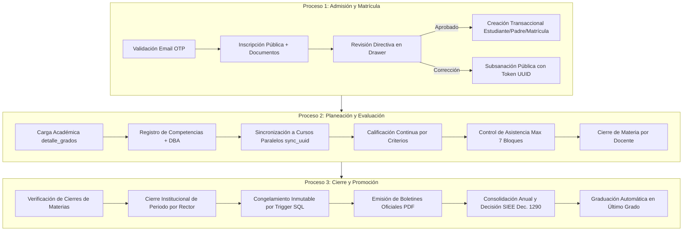

# MAESTRO DE INFORMACIÓN DEL SISTEMA — ACADEMIANEIVA
## Documento Rector de Arquitectura de Negocio, Dominio Educativo y Especificación Transversal

---

# 1. Información General

## 1.1 Nombre del documento
**Maestro de Información del Sistema — AcademiaNeiva**  
*Capa Superior de Inteligencia de Negocio, Dominio Escolar y Gobernanza Transversal.*

## 1.2 Propósito
El propósito de este documento rector es consolidar, articular y gobernar la totalidad del conocimiento funcional, estructural, normativo y operativo de la plataforma **AcademiaNeiva**. Actúa como la fuente única y canónica de verdad global para resolver interrogantes de negocio, guiar la toma de decisiones arquitectónicas, estandarizar la terminología técnica-pedagógica, y asegurar la consistencia entre los 21 módulos funcionales del sistema.

Este documento no reemplaza las especificaciones particulares de cada módulo, sino que establece la capa superior que les confiere coherencia, trazabilidad e interoperabilidad.

## 1.3 Alcance
El alcance comprende la totalidad del ciclo de vida operativo, pedagógico, administrativo y de auditoría de las instituciones educativas gestionadas bajo el modelo Multi-Tenant de AcademiaNeiva, cubriendo:
1. Gestión de identidad, autenticación unificada, perfiles multi-rol y control de accesos RBAC.
2. Gobierno institucional de colegios, sedes, personal directivo y parametrización de calendarios escolares.
3. Estructuración formal de niveles educativos (Preescolar, Primaria, Secundaria, Media), grados, grupos y cargas docentes.
4. Admisión pública, validación documental, control de cupos, verificaciones transaccionales OTP y formalización de matrícula.
5. Planeación curricular basada en Derechos Básicos de Aprendizaje (DBA), sincronización de competencias en cursos paralelos y dimensiones de preescolar.
6. Evaluación continua, planillas de calificaciones con criterios ponderados, control de inasistencias y observador del alumno.
7. Cierre escalonado de periodos (por asignatura e institucional) y emisión de boletines oficiales en formato PDF.
8. Seguimiento académico acumulativo y decisiones de promoción escolar conforme al Decreto 1290 de 2009.
9. Acompañamiento pedagógico directivo en modo solo lectura estricto (Monitoreo Espejo).
10. Mesa de ayuda institucional (soporte por tickets con código Base36 ofuscado) y supervisión extraordinaria del Administrador General con auditoría inmutable en deltas JSONB.
11. Gestión integral de traslados intercolegiados de estudiantes y reasignación institucional de usuarios.

## 1.4 Público objetivo
Este documento está diseñado para ser utilizado por:
- **Directivos de Instituciones Educativas (Rectores, Coordinadores):** Para comprender los alcances de gobierno escolar, autonomía de configuración (SIEE) y flujos de supervisión.
- **Product Owners y Analistas de Negocio:** Como marco de referencia para la priorización de funcionalidades, refinamiento de historias de usuario y evaluación de impactos sistémicos.
- **Arquitectos de Software y Líderes Técnicos:** Para verificar la alineación entre las invariantes del dominio y los patrones de implementación (Kysely, Zod, Triggers PL/pgSQL).
- **Desarrolladores de Software (Frontend & Backend):** Para comprender la lógica de negocio transversal antes de escribir código y evitar violaciones de integridad.
- **Ingenieros de Aseguramiento de Calidad (QA):** Como base para la construcción de matrices de pruebas funcionales, casos de prueba de borde y validaciones de inmutabilidad.
- **Auditores Externos y Entidades Gubernamentales (MEN / Secretarías de Educación):** Para constatar el cumplimiento de las normativas de educación colombiana (Ley 115/1994, Decreto 1290/2009, Decreto 1075/2015).

## 1.5 Relación con la documentación modular
La suite documental de AcademiaNeiva está estructurada en un esquema piramidal de conocimiento:

```
                      ┌─────────────────────────────────┐
                      │     MAESTRO DE INFORMACIÓN      │  <-- Capa Superior / Visión Global
                      │      (Documento Rector)         │      (Reglas Transversales y Dominio)
                      └────────────────┬────────────────┘
                                       │
         ┌─────────────────────────────┼─────────────────────────────┐
         ▼                             ▼                             ▼
┌──────────────────┐          ┌──────────────────┐          ┌──────────────────┐
│  MARCO NORMATIVO │          │  DICCIONARIO DE  │          │   DOCUMENTOS     │
│   Y LEGAL (MEN)  │          │   DATOS (BD)     │          │    MAESTROS      │
│(Ley 115, Dec 1290│          │(Esquema SQL 62T) │          │ (Técnico / Func) │
└──────────────────┘          └──────────────────┘          └──────────────────┘
                                       │
                                       ▼
                      ┌─────────────────────────────────┐
                      │   21 MÓDULOS FUNCIONALES        │  <-- Capa Operativa / Detallada
                      │ (guides/modules/01_ a 21_)      │      (Fichas, HUs, RNs, Casos de Uso)
                      └─────────────────────────────────┘
```

- **El Maestro de Información** define las directrices arquitectónicas, conceptos universales, reglas globales (`RN-GLOBAL-XXX`), dependencias intermodulares y decisiones estratégicas.
- **La Documentación Modular (`guides/modules/XX_nombre_modulo/`)** contiene las especificaciones detalladas a nivel de pantalla, endpoints particulares, historias de usuario granulares (`HU-XXX-YYY`) y reglas de negocio locales (`RN-XXX-YYY`).
- En caso de contradicciones o vacíos entre módulos, las disposiciones establecidas en este documento rector prevalecen sobre la documentación modular particular.

---

# 2. Visión General de AcademiaNeiva

## 2.1 Problema que resuelve
El ecosistema de gestión escolar tradicional en Colombia y Latinoamérica padece de una profunda fragmentación tecnológica y metodológica. Las instituciones educativas operan típicamente mediante planillas de cálculo desconectadas, programas de escritorio aislados o registros físicos en papel, lo que genera:
1. **Pérdida de Trazabilidad e Integridad de Notas:** Imposibilidad de auditar quién, cuándo y por qué modificó una calificación histórica.
2. **Duplicación de Esfuerzos Docentes:** Profesores del mismo grado transcriben manualmente y por duplicado las mismas metas curriculares para salones paralelos.
3. **Desalineación de Estándares Nacionales:** Dificultad para demostrar ante las Secretarías de Educación que la planeación curricular cumple con los Derechos Básicos de Aprendizaje (DBA) y los lineamientos del MEN.
4. **Desconexión con los Acudientes:** Notificación tardía de inasistencias y bajo rendimiento, impidiendo intervenciones pedagógicas oportunas.
5. **Inconsistencias en Procesos de Admisión y Matrícula:** Recepción de documentación incompleta, correos electrónicos erróneos que rompen la comunicación y riesgo de sobrecupo en aulas.
6. **Vulnerabilidad Jurídica en Promoción Escolar:** Falta de sustento auditable ante tutelas o reclamos legales por no respetar el Sistema Institucional de Evaluación de los Estudiantes (SIEE) de cada plantel.

## 2.2 Contexto del negocio
AcademiaNeiva opera en el sector EdTech bajo el modelo **Software as a Service (SaaS) Multi-Tenant Institucional**. Atiende establecimientos educativos de educación formal (preescolar, básica primaria, básica secundaria y educación media), brindando una infraestructura compartida pero con estricta soberanía de datos por institución (`id_colegio`).

El sistema armoniza las directrices legales del Ministerio de Educación Nacional de Colombia (MEN) con la autonomía institucional que la ley otorga a cada plantel a través de su Proyecto Educativo Institucional (PEI).

## 2.3 Propuesta de valor
- **Garantía de Inmutabilidad Legal:** Protección criptográfica y por triggers de base de datos (`fn_bloquear_periodo_cerrado`) que congelan de forma inviolable las calificaciones y registros tras el cierre formal del periodo.
- **Alineación Curricular Inteligente:** Integración nativa del catálogo nacional de DBA con vinculación de evidencias y propagación en caliente a cursos paralelos (`sync_uuid`).
- **Autonomía Paramétrica del SIEE:** Capacidad de que cada colegio defina libremente su escala de notas (0-5, 1-10, etc.), rangos cualitativos (Bajo, Básico, Alto, Superior) y umbrales de materias reprobatorias sin tocar una sola línea de código.
- **Transparencia y Monitoreo Seguro:** Modalidad de "Seguimiento Espejo" que faculta a los directivos para acompañar pedagógicamente a profesores y estudiantes en modo de solo lectura estricto, sin necesidad de conocer contraseñas de terceros.
- **Comunicaciones Seguras y Verificables:** Verificación obligatoria de correos electrónicos mediante contraseñas de un solo uso (OTP) antes de formalizar matrículas o cambiar perfiles.

## 2.4 Objetivos generales del sistema
1. **Centralizar** en una plataforma web responsiva la gestión administrativa, curricular, evaluativa y convivencial de múltiples instituciones educativas.
2. **Automatizar** la consolidación periódica y anual de calificaciones, control de asistencia, expedición de boletines oficiales PDF y actas de promoción conforme al Decreto 1290 de 2009.
3. **Garantizar** el aislamiento lógico multi-institucional y la seguridad perimetral de los datos personales y académicos de los menores de edad.
4. **Facilitar** la interoperabilidad y movilidad escolar mediante flujos controlados de traslados interinstitucionales con consenso tripartito.
5. **Proveer** registros de auditoría inmutables estructurados en deltas JSONB (`valor_antiguo`, `valor_nuevo`) ante cualquier intervención administrativa o técnica.

## 2.5 Tipo de instituciones educativas objetivo
- Colegios públicos y privados de educación formal regular (Calendario A y Calendario B).
- Instituciones de ciclo completo (Preescolar a Grado 11.º).
- Centros educativos de Básica Primaria exclusiva o instituciones de Básica Secundaria y Media Técnica.
- Establecimientos que apliquen jornadas: Mañana, Tarde, Única o Nocturna.

## 2.6 Visión de crecimiento y escalabilidad
- **Escalabilidad Horizontal:** Arquitectura en capas con API REST stateless en Node.js/Express y pool de conexiones optimizado en PostgreSQL.
- **Mantenimiento Centralizado:** Motor de persistencia unificado con el query builder Kysely fuertemente tipado (`db.types.ts`) y validación de esquemas con Zod DTOs, permitiendo actualizaciones de esquemas y nuevas versiones curriculares del MEN sin degradar el servicio.
- **Evolución a Interoperabilidad Gubernamental:** Arquitectura lista para la exportación estandarizada de datos al Sistema de Información de Matrícula (SIMAT) y visor unificado de Registro Escolar Histórico.

---

# 3. Actores del Ecosistema

El sistema identifica formalmente cinco (5) roles de usuario en su jerarquía RBAC:

```
┌─────────────────────────────────────────────────────────────────────────────┐
│                           ADMINISTRADOR GENERAL                             │
│                     (Superusuario Global de Plataforma)                     │
└──────────────────────────────────────┬──────────────────────────────────────┘
                                       │
                                       ▼
┌─────────────────────────────────────────────────────────────────────────────┐
│                             DIRECTIVO DOCENTE                               │
│                   (Rector, Vicerrector, Coordinador)                        │
└───────────────────┬─────────────────────────────────────┬───────────────────┘
                    │                                     │
                    ▼                                     ▼
┌─────────────────────────────────────┐ ┌─────────────────────────────────────┐
│               DOCENTE               │ │          PADRE DE FAMILIA           │
│     (Profesor Titular/Asignatura)   │ │       (Acudiente / Tutor Legal)     │
└───────────────────┬─────────────────┘ └──────────────────┬──────────────────┘
                    │                                      │
                    └──────────────────┬───────────────────┘
                                       ▼
┌─────────────────────────────────────────────────────────────────────────────┐
│                                 ESTUDIANTE                                  │
│                             (Alumno Matriculado)                            │
└─────────────────────────────────────────────────────────────────────────────┘
```

---

### 3.1 Administrador General (`admin_general`)
- **Descripción:** Actor de máxima jerarquía con alcance global sobre la infraestructura del sistema y catálogo de instituciones.
- **Responsabilidades Principales:**
  - Registrar y aprobar nuevas instituciones educativas en la plataforma.
  - Administrar el catálogo nacional de Derechos Básicos de Aprendizaje (DBA) y versiones curriculares.
  - Resolver tickets de soporte técnico de segundo nivel (escalados).
  - Ejecutar supervisiones y auditorías extraordinarias a colegios previa re-autenticación obligatoria de la Rectoría.
  - Gestionar excepciones globales de traslados institucionales mediante facultades de bypass.
- **Procesos en los que participa:** Creación de colegios, mantenimiento de catálogos base, soporte técnico global, auditoría y supervisión externa.
- **Módulos relacionados:** 01 (Autenticación), 02 (Colegios), 03 (Usuarios), 10 (Catálogo DBA), 15 (Supervisión), 16 (Soporte), 18 (Traslados).

---

### 3.2 Directivo Docente (`directivo` / `rector` / `coordinador`)
- **Descripción:** Máxima autoridad institucional dentro del contexto de un colegio específico.
- **Responsabilidades Principales:**
  - Configurar el calendario escolar (años lectivos y periodos académicos).
  - Parametrizar la escala de evaluación institucional (SIEE), notas mínimas/máximas y umbrales de reprobación.
  - Estructurar niveles escolares, tipos de grado, salones (control de cupos) y catálogo de asignaturas.
  - Registrar la planta docente y formalizar la asignación académica (`detalle_grados`).
  - Revisar documentación, validar requisitos y oficializar matrículas ordinarias y extraordinarias.
  - Ejecutar el cierre institucional de periodos académicos y autorizar la emisión de boletines.
  - Conducir el seguimiento pedagógico a profesores y alumnos en Modo Monitoreo Espejo (solo lectura).
  - Registrar decisiones institucionales de promoción escolar anual (`decision_promocion_directivo`).
- **Procesos en los que participa:** Parametrización escolar, asignación de carga docente, admisión y matrícula, cierre de periodos, seguimiento pedagógico, gestión de traslados y promoción anual.
- **Módulos relacionados:** 02, 03, 04, 05, 06, 07, 08, 09, 12, 14, 15, 17, 18, 19, 20.

---

### 3.3 Docente (`docente`)
- **Descripción:** Profesional de la educación responsable del proceso formativo, curricular y evaluativo de las asignaturas a su cargo.
- **Responsabilidades Principales:**
  - Diseñar la planeación curricular del periodo, registrando competencias y vinculando evidencias DBA.
  - Crear actividades evaluativas y criterios porcentuales ponderados en sus materias asignadas.
  - Diligenciar la planilla de calificaciones continuas y registrar notas parciales.
  - Tomar asistencia diaria de clases controlando el límite de 7 bloques diarios.
  - Consignar anotaciones formativas, comportamentales y académicas en el Observador del Estudiante.
  - Realizar el cierre de asignatura (`cierre_materia`) al finalizar cada periodo académico.
- **Procesos en los que participa:** Planeación curricular, evaluación del aprendizaje, control de asistencia, registro en observador y cierre por materia.
- **Módulos relacionados:** 01, 04, 05, 08, 09, 10, 11, 12, 13, 14, 16, 21.

---

### 3.4 Estudiante (`estudiante`)
- **Descripción:** Sujeto central del proceso educativo matriculado activamente en un grupo y año lectivo de una institución.
- **Responsabilidades Principales:**
  - Consultar sus asignaturas matriculadas, docentes asignados y horarios.
  - Monitorear en tiempo real sus calificaciones por actividad, criterios y notas parciales.
  - Revisar su historial de asistencias, inasistencias y justificaciones.
  - Descargar boletines oficiales de calificaciones correspondientes a periodos cerrados.
  - Radicar tickets de soporte técnico o peticiones a la institución.
- **Procesos en los que participa:** Consulta de rendimiento académico, recepción de evaluaciones y descarga de boletines.
- **Módulos relacionados:** 01, 07, 11, 12, 13, 14, 16, 18, 21.

---

### 3.5 Padre de Familia / Acudiente Legal (`padre`)
- **Descripción:** Representante legal y tutor del estudiante ante la institución educativa.
- **Responsabilidades Principales:**
  - Diligenciar el formulario público de inscripción y matrícula validando su email con código OTP.
  - Subsanar documentos de matrícula rechazados o desactualizados mediante el token público de seguimiento.
  - Monitorear el progreso académico, calificaciones, observaciones y fallas de todos sus hijos asociados desde un único perfil unificado.
  - Aprobar o rechazar solicitudes de traslado interinstitucional cuando actúe como acudiente legal del menor.
- **Procesos en los que participa:** Admisión e inscripción de matrícula, subsanación documental, seguimiento integral de acudidos, solicitudes de traslado y soporte.
- **Módulos relacionados:** 01, 06, 07, 11, 12, 13, 14, 16, 17, 18, 21.

---

# 4. Modelo Conceptual del Negocio

A continuación se formaliza el glosario canónico de entidades y conceptos del dominio educativo de AcademiaNeiva:

```
┌─────────────────────────────────────────────────────────────────────────────────────────────┐
│                                       GLOSARIO CANÓNICO                                     │
├────────────────────────────────┬────────────────────────────────────────────────────────────┤
│ Término Oficial                │ Sinónimos Documentales / Coloquiales Detectados            │
├────────────────────────────────┼────────────────────────────────────────────────────────────┤
│ Institución Educativa          │ Colegio, Plantel, Sede, Inquilino, Tenant                  │
│ Usuario                        │ Cuenta de Acceso, Identidad Central                        │
│ Estudiante                     │ Alumno, Educando, Aspirante (en fase de matrícula)         │
│ Docente                        │ Profesor, Maestro, Titular de Materia                      │
│ Padre de Familia               │ Acudiente, Tutor Legal, Responsable de Matrícula           │
│ Directivo Docente              │ Rector, Vicerrector, Coordinador Académico                 │
│ Año Lectivo                    │ Año Académico, Vigencia Escolar, Periodo Calendario        │
│ Periodo Académico              │ Trimestre, Periodo Escolar, Corte Evaluativo               │
│ Nivel Escolar                  │ Nivel Educativo, Categoría Operativa                       │
│ Tipo de Grado                  │ Grado Escolar, Nivel de Grado (Primero, Once)              │
│ Grupo Escolar                  │ Salón, Aula, Curso, Sección (1-A, 1-B)                     │
│ Cursos Paralelos               │ Peer Groups, Secciones del Mismo Grado                     │
│ Asignatura                     │ Materia, Cátedra, Espacio Curricular                       │
│ Carga Académica                │ Detalle Grados, Asignación Docente                         │
│ Derechos Básicos (DBA)         │ Estándares MEN, Catálogo Nacional DBA                      │
│ Dimensiones de Preescolar      │ Ejes de Desarrollo Infantil, Áreas de Transición           │
│ Competencia Curricular         │ Logro, Meta de Aprendizaje, Indicador de Desempeño         │
│ Evidencia de Aprendizaje       │ Entregable, Demostración de Logro                          │
│ Actividad Evaluativa           │ Tarea, Examen, Taller, Planilla Docente                    │
│ Criterio de Evaluación         │ Rúbrica Ponderada, Sub-porcentaje de Actividad             │
│ Escala de Valoración           │ SIEE, Escala Institucional (Bajo, Básico, Alto, Superior)  │
│ Observador del Estudiante      │ Libro de Vida, Registro Convivencial, Ficha Formativa      │
│ Bloque de Clase                │ Hora de Asistencia, Sesión Lectiva Diaria                  │
│ Cierre de Materia              │ Cierre Parcial por Docente, Consolidado de Asignatura      │
│ Cierre de Periodo              │ Congelamiento Institucional, Cierre de Periodo por Rector  │
│ Boletín de Calificaciones      │ Informe Periódico de Notas, Reporte Oficial PDF            │
│ Modo Monitoreo Directivo       │ Seguimiento Espejo, Acompañamiento Pedagógico Solo Lectura │
│ Token OTP                      │ Código de Verificación de Correo (6 Dígitos)               │
│ Token de Seguimiento           │ Token UUID Público de Matrícula                            │
│ Código Base36                  │ Identificador Ofuscado de Ticket (`TKT-XXXX`)              │
└────────────────────────────────┴────────────────────────────────────────────────────────────┘
```

### Definiciones Detalladas de Conceptos Clave:

1. **Institución Educativa (`colegio`)**: Ente jurídico y pedagógico autónomo. Actúa como el límite de aislamiento multi-tenant (`id_colegio`). Aloja sus propios calendarios, escalas SIEE, docentes y estudiantes.
2. **Usuario (`usuario`)**: Identidad informática universal en el sistema. Contiene credenciales (`email`, `password`), nombres, apellidos, tipo y número de documento. Un usuario puede poseer múltiples vínculos en `usuario_colegio` y múltiples roles en `usuario_rol`.
3. **Estudiante (`estudiante`)**: Perfil académico asociado a un `id_usuario` y a un `id_colegio`. Representa la trayectoria escolar del alumno, su estado vital (`ACTIVO`, `SANCIONADO`, `EXPULSADO`, `RETIRADO`, `GRADUADO`) y su historial de matrículas.
4. **Docente (`docente`)**: Perfil profesional vinculado a un `id_usuario` y `id_colegio` con atribuciones para recibir asignaciones académicas y calificar planillas.
5. **Padre de Familia (`padre_familia`)**: Perfil de acudiente vinculado a `id_usuario`. Mantiene una relación 1 a N con estudiantes mediante la tabla pivote `detalle_padrefamilia`.
6. **Matrícula (`matricula`)**: Acto administrativo formal que vincula a un estudiante con un colegio, un año lectivo y un grupo escolar específico. Posee ciclo de vida propio (`PENDIENTE`, `ACTIVA`, `CANCELADA`, `TRASLADADA`, etc.).
7. **Año Lectivo (`anio_lectivo`)**: Eje temporal de 12 meses (ej. 2026) bajo el cual se articulan las matrículas y la promoción. Solo puede haber uno en estado `ABIERTO` por colegio.
8. **Periodo Académico (`periodo_academico`)**: Subdivisión del año lectivo (comúnmente 3 o 4 periodos). Cada periodo posee un porcentaje de ponderación sobre la nota definitiva anual y estados de control (`PENDIENTE`, `ABIERTO`, `CERRADO`).
9. **Nivel Escolar (`nivel_escolar`)**: Categorización operativa del sistema colombiano en cuatro valores inmutables: `PREESCOLAR`, `PRIMARIA`, `SECUNDARIA`, `MEDIA`.
10. **Tipo de Grado (`tipo_grado`)**: Grado pedagógico formal (ej. Transición, 1.º a 11.º).
11. **Grupo Escolar (`grupos`)**: Salón o sección física/virtual identificada por una sección (A, B, C...) y jornada escolar, con un límite estricto de cupos disponibles.
12. **Carga Académica (`detalle_grados`)**: Asignación atómica de una materia a un docente en un grupo, colegio y año lectivo específicos.
13. **Competencia Curricular (`competencias`)**: Meta formativa definida para una materia y periodo. Soporta sincronización bidireccional entre cursos paralelos mediante `sync_uuid`.
14. **Catálogo DBA (`dba` / `evidencias_dba`)**: Derechos Básicos de Aprendizaje oficiales emitidos por el MEN para cada área y grado.
15. **Dimensiones de Preescolar (`dimensiones_preescolar`)**: Los 7 ejes integrales de desarrollo que reemplazan a las materias tradicionales en el grado Transición (Comunicativa, Cognitiva, Corporal, Socioafectiva, Estética, Ética y Valores).
16. **Actividad Evaluativa (`actividad_materia`)**: Evento de evaluación creado por el docente dentro de una materia y periodo, ponderado porcentualmente.
17. **Cierre de Materia (`cierre_materia`)**: Consolidación definitiva de calificaciones ejecutada por el docente que congela la edición de sus planillas.
18. **Cierre de Periodo (`periodo_academico.estado = 'CERRADO'`)**: Acto institucional del Rector que congela de manera absoluta todas las calificaciones, observaciones y asistencias del colegio mediante triggers de base de datos.
19. **Boletín de Calificaciones**: Documento oficial membretado en PDF generado a partir de periodos cerrados.
20. **Seguimiento Pedagógico Espejo**: Emulación controlada de la interfaz de un usuario por parte del directivo bajo estricto modo de solo lectura.

---

# 5. Arquitectura del Negocio

Los 21 módulos del sistema se articulan en seis (6) grandes dominios funcionales:

```
┌─────────────────────────────────────────────────────────────────────────────┐
│                          DOMINIOS DEL NEGOCIO                               │
├───────────────────────┬─────────────────────────────────────────────────────┤
│ 1. Identidad y Acceso │ 01_autenticacion, 03_usuarios_y_directivos,        │
│                       │ 21_flujo_correos_y_verificaciones                   │
├───────────────────────┼─────────────────────────────────────────────────────┤
│ 2. Gobierno Escolar   │ 02_gestion_colegios, 04_estructura_escolar,        │
│                       │ 05_docentes, 08_configuracion_academica             │
├───────────────────────┼─────────────────────────────────────────────────────┤
│ 3. Admisión y Alumnos │ 06_matriculas, 07_estudiantes_y_estados,            │
│                       │ 17_gestion_padres, 18_gestion_traslados             │
├───────────────────────┼─────────────────────────────────────────────────────┤
│ 4. Currículo y Calidad│ 09_competencias_y_sincronizacion, 10_catalogo_dba   │
├───────────────────────┼─────────────────────────────────────────────────────┤
│ 5. Evaluación y Logro │ 11_calificaciones, 12_observaciones, 13_asistencia, │
│                       │ 14_cierre_y_boletines, 19_seguimiento_promocion     │
├───────────────────────┼─────────────────────────────────────────────────────┤
│ 6. Auditoría y Soporte│ 15_supervision_y_auditoria, 16_soporte_y_tickets,   │
│                       │ 20_seguimiento_academico_directivo                  │
└───────────────────────┴─────────────────────────────────────────────────────┘
```

---

### Dominio 1: Identidad, Seguridad y Comunicaciones Transaccionales
- **Propósito:** Centralizar el ciclo de vida de las cuentas, autenticación segura JWT, listas negras de tokens y despacho de correos transaccionales con validación OTP.
- **Módulos:** 01 (Autenticación), 03 (Usuarios y Directivos), 21 (Flujo de Correos y OTP).
- **Procesos Principales:** Login multi-rol, cierre global forzado de sesiones (`logged_out_at`), verificación previa de correo con OTP de 6 dígitos, restablecimiento de contraseñas y registro de personal directivo.
- **Información Administrada:** Credenciales criptográficas, tokens JTI en blacklist, códigos OTP temporales, asignaciones de roles y metadatos de directivos.

---

### Dominio 2: Gobierno Institucional y Estructura Escolar
- **Propósito:** Proveer a los planteles educativos los instrumentos para modelar su oferta académica, sedes, plantas docentes y calendarios institucionales.
- **Módulos:** 02 (Gestión de Colegios), 04 (Estructura Escolar), 05 (Docentes), 08 (Configuración Académica).
- **Procesos Principales:** Apertura y cierre de años lectivos, configuración de periodos y escalas SIEE, definición de jornadas, secciones, cupos por grupo, registro de docentes y asignación académica (`detalle_grados`).
- **Información Administrada:** Datos institucionales del colegio, catálogo de grados, salones, materias, contratos y asignaciones docentes, calendarios y escalas de notas.

---

### Dominio 3: Admisión, Trayectoria y Movilidad Estudiantil
- **Propósito:** Gestionar el ciclo vital del estudiante desde su postulación pública hasta su egreso o traslado, integrando al núcleo familiar.
- **Módulos:** 06 (Matrículas), 07 (Estudiantes y Estados), 17 (Gestión de Padres), 18 (Gestión de Traslados).
- **Procesos Principales:** Formulario público de matrícula con validación previa OTP, revisión documental en drawer administrativo, matriculación extraordinaria con bypass de calendario, seguimiento con token UUID, control de estados del alumno, gestión de acudientes y traslados intercolegiados con consenso tripartito.
- **Información Administrada:** Formularios de inscripción, documentos adjuntos validados/rechazados, estados del alumno (`ACTIVO`, `RETIRADO`, `EXPULSADO`), vínculos de acudientes e historial de traslados.

---

### Dominio 4: Alineación Curricular y Estándares Nacionales
- **Propósito:** Estandarizar la planeación de aula articulándola con las directrices de calidad del Ministerio de Educación Nacional de Colombia.
- **Módulos:** 09 (Competencias y Sincronización), 10 (Catálogo DBA).
- **Procesos Principales:** Consulta del catálogo DBA por área/grado, asignación de evidencias de aprendizaje, planeación de competencias periódicas y sincronización en tiempo real a cursos paralelos mediante identificador `sync_uuid`.
- **Información Administrada:** Catálogo nacional de DBA, dimensiones de preescolar, versiones curriculares institucionales, árbol de competencias y evidencias sincronizadas.

---

### Dominio 5: Evaluación Continua, Asistencia y Promoción Escolar
- **Propósito:** Registrar y consolidar el desempeño integral del estudiante, controlando la asistencia, el observador comportamental, la emisión de boletines oficiales y la promoción anual.
- **Módulos:** 11 (Calificaciones), 12 (Observaciones), 13 (Asistencia), 14 (Cierre y Boletines), 19 (Seguimiento y Promoción Académica).
- **Procesos Principales:** Calificación en planilla docente interactiva por criterios porcentuales, control de inasistencias con límite de 7 bloques diarios, registro de novedades en observador, cierre desacoplado de materia, cierre institucional de periodo, renderizado de boletines PDF y consolidación anual con registro de decisiones SIEE (Decreto 1290/2009).
- **Información Administrada:** Calificaciones por actividad y criterio, asistencias diarias, faltas justificadas/injustificadas, anotaciones de observador, cierres de materias, promedios consolidados, actas de promoción y libro de graduados.

---

### Dominio 6: Auditoría Forense, Soporte Técnico y Acompañamiento
- **Propósito:** Salvaguardar la inmutabilidad de la información, prestar asistencia técnica escalada y facultar a la Rectoría para supervisar la labor pedagógica sin invadir la privacidad.
- **Módulos:** 15 (Supervisión y Auditoría), 16 (Soporte y Tickets), 20 (Seguimiento Académico Directivo).
- **Procesos Principales:** Solicitud de supervisión extraordinaria del Administrador General con aprobación obligatoria por clave del Rector, registro inmutable de deltas JSONB (`valor_antiguo`, `valor_nuevo`), mesa de ayuda pública con código Base36 y regla de turnos ping-pong, y conmutación a Modo Monitoreo Directivo en solo lectura estricto.
- **Información Administrada:** Bitácoras inmutables de auditoría, sesiones de supervisión, tickets de soporte, notas de seguimiento y logs de acompañamiento pedagógico.

---

# 6. Procesos Principales del Negocio



---

### 6.1 Proceso 1: Ciclo de Admisión, Validación OTP y Formalización de Matrícula
- **Inicio:** El acudiente ingresa al portal público de admisiones del colegio.
- **Participantes:** Padre de Familia / Acudiente, Sistema de Correos, Directivo Docente.
- **Etapas Principales:**
  1. *Verificación Previa OTP:* El acudiente digita su correo; el sistema genera un código numérico de 6 dígitos con vigencia de 15 minutos. El acudiente debe validar el código antes de habilitar el formulario.
  2. *Diligenciamiento de Inscripción:* Selección de nivel y grado disponible (sujeto a cupos en `grupos`), captura de datos de contacto telefónico y carga de documentos de soporte (con exención legal de certificados en preescolar).
  3. *Generación de Token UUID:* El sistema emite un token criptográfico único para que el padre consulte el estado de su trámite sin requerir usuario ni contraseña.
  4. *Revisión Administrativa:* El directivo inspecciona cada documento en el visor protegido, calificándolos individualmente como `VALIDADO` o `RECHAZADO`.
  5. *Subsanación:* Si hay documentos observados, la matrícula pasa a estado `CORRECCION` y el padre puede sustituir únicamente los archivos inválidos mediante su token.
  6. *Formalización Transaccional:* Al completar la validación, el directivo asigna grupo y jornada, y el sistema ejecuta una transacción SQL que crea el `usuario`, el perfil `estudiante`, el perfil `padre_familia` (o asocia en `detalle_padrefamilia` si ya existía), y pasa la matrícula a `ACTIVA`.
- **Resultado:** Estudiante y padre matriculados formalmente con credenciales despachadas por email y cupo descontado del grupo.
- **Módulos Involucrados:** 01, 04, 06, 07, 17, 21.
- **Reglas Transversales:** RN-GLOBAL-001 (Multi-Tenant), RN-GLOBAL-004 (Identidad Central), RN-GLOBAL-005 (Email Único), RN-GLOBAL-006 (Documento Único), RN-GLOBAL-014 (Matrícula Única Activa), RN-GLOBAL-027 (Creación Transaccional).

---

### 6.2 Proceso 2: Planeación Curricular, DBA y Sincronización en Paralelos
- **Inicio:** El directivo formaliza la asignación académica en `detalle_grados` y el docente ingresa al nuevo periodo.
- **Participantes:** Directivo, Docente de Asignatura, Sistema de Sincronización.
- **Etapas Principales:**
  1. *Consulta y Selección DBA:* El docente selecciona las metas del catálogo nacional DBA correspondientes al grado y área.
  2. *Creación de Competencias:* Redacción de competencias y evidencias para el periodo académico.
  3. *Generación de `sync_uuid`:* Si el docente enseña la misma materia en grupos paralelos del mismo grado (ej. 1-A y 1-B), el sistema asigna el mismo `sync_uuid`.
  4. *Propagación en Caliente:* Al guardar o modificar una competencia, el backend actualiza atómicamente todos los registros que compartan dicho `sync_uuid`, ahorrando trabajo redundante.
  5. *Tratamiento Especial en Preescolar:* Si el grado es Transición, la interfaz inhabilita asignaturas y despliega exclusivamente las 7 Dimensiones de Preescolar.
- **Resultado:** Planeación curricular estructurada, validada contra el MEN y sincronizada en todos los cursos del grado.
- **Módulos Involucrados:** 04, 05, 08, 09, 10.
- **Reglas Transversales:** RN-GLOBAL-015 (Cadena de Integridad), RN-GLOBAL-027 (Transaccionalidad).

---

### 6.3 Proceso 3: Evaluación Continua, Asistencia y Cierre por Materia
- **Inicio:** Desarrollo de las clases del periodo académico abierto.
- **Participantes:** Docente, Estudiantes, Padres de Familia.
- **Etapas Principales:**
  1. *Creación de Actividades y Criterios:* El docente define tareas o exámenes asignándoles porcentajes cuya sumatoria en el periodo debe ser coherente.
  2. *Calificación en Planilla:* El docente califica a los estudiantes. El sistema normaliza notas según la escala del colegio y mapea al rango cualitativo (Superior, Alto, Básico, Bajo).
  3. *Registro Diario de Asistencia:* El docente toma lista clase a clase. El sistema impone un límite estricto de máximo 7 bloques de clase por día por estudiante.
  4. *Anotaciones en Observador:* Registro de novedades formativas con obligatoriedad de observación académica para el boletín.
  5. *Cierre de Asignatura:* El docente verifica sus notas finales y presiona "Cerrar Materia". Se crea el registro en `cierre_materia` con estado `CERRADO` y se calcula el `resultado_academico` (`APROBADO`, `REPROBADO`).
- **Resultado:** Calificaciones y asistencias de la materia consolidadas y bloqueadas para edición por el docente.
- **Módulos Involucrados:** 11, 12, 13, 14.
- **Reglas Transversales:** RN-GLOBAL-016 (Nota Única por Actividad), RN-GLOBAL-020 (Bloqueo de Materia Cerrada), RN-GLOBAL-031 (Escala SIEE).

---

### 6.4 Proceso 4: Cierre Institucional de Periodo y Emisión de Boletines
- **Inicio:** Vencimiento de la fecha límite del calendario escolar del periodo.
- **Participantes:** Directivo (Rector), Docentes, Estudiantes, Padres.
- **Etapas Principales:**
  1. *Auditoría de Cierres Parciales:* La consola directiva verifica el porcentaje de materias cerradas por la planta docente.
  2. *Reapertura Excepcional (Opcional):* Si un docente cometió un error justificado, el Rector puede reabrir individualmente esa materia (`reopenSubjectClosure`) sin afectar el resto del colegio.
  3. *Cierre Institucional:* El Rector ejecuta el cierre formal del periodo en `periodo_academico` (`estado = 'CERRADO'`).
  4. *Activación de Inmutabilidad SQL:* El trigger de PostgreSQL `fn_bloquear_periodo_cerrado` entra en vigor, rechazando cualquier mutación en notas, asistencias u observaciones con error fatal.
  5. *Generación Masiva de Boletines PDF:* El sistema compila las notas, fallas, escala cualitativa y observaciones en el formato visual oficial del colegio para su descarga desde los portales de estudiantes y padres.
- **Resultado:** Periodo escolar cerrado de forma inmutable y boletines oficiales emitidos.
- **Módulos Involucrados:** 08, 14, 15.
- **Reglas Transversales:** RN-GLOBAL-019 (Bloqueo por Periodo Cerrado), RN-GLOBAL-025 (Inmutabilidad Legal).

---

### 6.5 Proceso 5: Consolidación Anual y Decisiones de Promoción (Decreto 1290)
- **Inicio:** Culminación del periodo final del año lectivo (Periodo 4 o N-1 cerrados).
- **Participantes:** Directivo (Rector / Comisión de Evaluación y Promoción), Estudiante.
- **Etapas Principales:**
  1. *Cálculo del Promedio Ponderado Anual:* El sistema promedia las notas de todos los periodos cerrados para cada materia.
  2. *Clasificación Automática SIEE:*
     - 0 materias reprobadas $\rightarrow$ `APROBADO` (Promovido automáticamente).
     - 1 a $N-1$ materias reprobadas $\rightarrow$ `PENDIENTE_RECUPERACION`.
     - $\ge N$ materias reprobadas (configurado en `configuracion_colegio`, por defecto 3) $\rightarrow$ `NO_PROMOVIDO`.
  3. *Registro de Decisión Directiva:* El directivo consigna en `decision_promocion_directivo` la decisión institucional (`PROMOVER_SIGUIENTE_GRADO`, `MANTENER_GRADO`, `MATRICULA_CONDICIONADA`), respaldada por la restricción UNIQUE `(id_estudiante, id_colegio, id_anio_anterior)`.
  4. *Graduación de Último Grado:* Si el estudiante es promovido en el grado terminal de la institución (ej. 11.º), su estado pasa a `GRADUADO` y se genera su ficha en `registro_graduados`.
  5. *Advertencia Informativa en Nueva Matrícula:* Al matricular al alumno para el año siguiente, el sistema despliega advertencias no bloqueantes si el alumno repitió o tiene compromisos académicos.
- **Resultado:** Situación académica definitiva del estudiante resuelta, registrada y lista para el siguiente ciclo escolar.
- **Módulos Involucrados:** 06, 07, 08, 19.
- **Reglas Transversales:** RN-GLOBAL-034 (Consolidación SIEE y Promoción), RN-GLOBAL-023 (Restricción de Eliminación).

---

### 6.6 Proceso 6: Gestión de Traslados Intercolegiados
- **Inicio:** Solicitud radicada por un acudiente, directivo de origen o Administrador General.
- **Participantes:** Directivo Colegio Origen, Directivo Colegio Destino, Padre/Acudiente, Administrador General.
- **Etapas Principales:**
  1. *Radicación de la Solicitud:* Registro en `solicitud_traslado` indicando colegio origen, colegio destino y motivo.
  2. *Consenso Tripartito:* Requiere los votos favorables (`APROBAR`) en `traslado_aprobacion` del directivo de origen, directivo de destino y acudiente legal (salvo bypass del Admin General).
  3. *Comprobación de Cupos en Destino:* El sistema verifica la disponibilidad física de cupos en el grado receptor antes de autorizar la votación final.
  4. *Ejecución Transaccional Atómica:* Al completarse el consenso, una transacción Kysely con `.forUpdate()`:
     - Marca la matrícula del colegio origen como `TRASLADADA`.
     - Actualiza `estudiante.id_colegio = colegio_destino`.
     - Crea la nueva matrícula en el colegio destino (asignando grupo y jornada si fueron seleccionados).
     - Transfiere el vínculo familiar en `detalle_padrefamilia` y preserva roles laborales del padre si era docente en el colegio origen.
  5. *Notificación Transaccional:* Envío de correos electrónicos formales a todas las partes involucradas.
- **Resultado:** Traslado ejecutado sin pérdida de historial y con aislamiento inmediato del estudiante en la sede anterior.
- **Módulos Involucrados:** 01, 06, 07, 17, 18, 21.
- **Reglas Transversales:** RN-GLOBAL-001 (Multi-Tenant), RN-GLOBAL-006 (Documento Único), RN-GLOBAL-027 (Transaccionalidad).

---

# 7. Reglas de Negocio Transversales

A continuación se compilan las **34 Reglas de Negocio Globales (`RN-GLOBAL-XXX`)** que rigen de forma transversal sobre múltiples módulos del sistema:

---

### Categoría 1: Arquitectura Institucional y Aislamiento Multi-Tenant

#### RN-GLOBAL-001: Arquitectura Multi-Institucional (Multi-Tenant)
- **Nombre:** Aislamiento Lógico por Inquilino (`id_colegio`).
- **Descripción:** Toda entidad institucional en la base de datos debe almacenar y discriminar sus registros mediante la columna `id_colegio`. Las consultas de lectura y mutación del backend deben filtrar obligatoriamente por el `schoolId` extraído del token JWT autenticado.
- **Origen Documental:** [reglas_negocio_generales.md RN-GEN-001](file:///c:/Users/alejo/Downloads/segundoProyecto/guides/reglas_negocio/reglas_negocio_generales.md#rn-gen-001), [AcademiaNeivaBD.sql L878](file:///c:/Users/alejo/Downloads/segundoProyecto/guides/AcademiaNeivaBD.sql#L878).
- **Módulos Afectados:** Todos los módulos (01 a 21).
- **Impacto:** Impide fugas de información entre colegios y garantiza la soberanía de los datos.

#### RN-GLOBAL-002: Aislamiento Estricto en Capa de Middleware
- **Nombre:** Verificación Obligatoria de Inquilino en Peticiones HTTP.
- **Descripción:** El middleware `verifyToken` extrae `req.user.schoolId` del JWT. Ningún controlador puede responder a consultas donde el recurso pertenezca a un `id_colegio` diferente al del usuario autenticado (salvo en sesiones de supervisión activa del Admin General).
- **Origen Documental:** [reglas_negocio_generales.md RN-GEN-002](file:///c:/Users/alejo/Downloads/segundoProyecto/guides/reglas_negocio/reglas_negocio_generales.md#rn-gen-002), [authMiddleware.ts L79](file:///c:/Users/alejo/Downloads/segundoProyecto/backend/src/middleware/authMiddleware.ts#L79).
- **Módulos Afectados:** Todos los módulos protegidos.
- **Impacto:** Blindaje contra ataques de inyección de parámetros IDOR (Insecure Direct Object References).

#### RN-GLOBAL-003: Estado del Colegio como Compuerta Global
- **Nombre:** Control Centralizado de Acceso por Estado Institucional.
- **Descripción:** Solo los usuarios pertenecientes a un colegio con `estado_colegio = 'ACTIVO'` pueden iniciar sesión. Si el colegio está en estado `PENDIENTE`, `SUSPENDIDO`, `RECHAZADO` o `ELIMINADO`, el login es bloqueado inmediatamente con HTTP 403.
- **Origen Documental:** [reglas_negocio_generales.md RN-GEN-003](file:///c:/Users/alejo/Downloads/segundoProyecto/guides/reglas_negocio/reglas_negocio_generales.md#rn-gen-003), [authController.ts L55](file:///c:/Users/alejo/Downloads/segundoProyecto/backend/src/controllers/authController.ts#L55).
- **Módulos Afectados:** 01 (Autenticación), 02 (Gestión de Colegios).
- **Impacto:** Permite suspender el acceso de toda una institución por mora o sanción con un solo cambio de estado.

---

### Categoría 2: Usuarios, Identidad y Control de Acceso

#### RN-GLOBAL-004: Identidad Centralizada en Tabla `usuario`
- **Nombre:** Desacoplamiento de Identidad y Roles Académicos.
- **Descripción:** Todo ser humano registrado en la plataforma posee un único registro en la tabla `usuario`. Las tablas de rol (`directivo`, `docente`, `estudiante`, `padre_familia`) almacenan exclusivamente metadatos específicos y mantienen una FK con restricción `UNIQUE` hacia `id_usuario`.
- **Origen Documental:** [reglas_negocio_generales.md RN-GEN-004](file:///c:/Users/alejo/Downloads/segundoProyecto/guides/reglas_negocio/reglas_negocio_generales.md#rn-gen-004), [AcademiaNeivaBD.sql L2729](file:///c:/Users/alejo/Downloads/segundoProyecto/guides/AcademiaNeivaBD.sql#L2729).
- **Módulos Afectados:** 01, 03, 05, 06, 07, 17, 18.
- **Impacto:** Elimina la duplicación de credenciales y unifica los protocolos de seguridad.

#### RN-GLOBAL-005: Unicidad Global del Correo Electrónico
- **Nombre:** Restricción de Email Único en Plataforma.
- **Descripción:** No pueden coexistir dos usuarios con el mismo `email` en la tabla `usuario` (`UNIQUE (email)`). El email se normaliza canónicamente en minúsculas y sin espacios (`trim().toLowerCase()`). Se permite `NULL` únicamente para estudiantes menores sin correo propio.
- **Origen Documental:** [reglas_negocio_generales.md RN-GEN-005](file:///c:/Users/alejo/Downloads/segundoProyecto/guides/reglas_negocio/reglas_negocio_generales.md#rn-gen-005), [AcademiaNeivaBD.sql L3869](file:///c:/Users/alejo/Downloads/segundoProyecto/guides/AcademiaNeivaBD.sql#L3869).
- **Módulos Afectados:** 01, 03, 05, 06, 17, 21.
- **Impacto:** Evita colisiones en login y garantiza que las notificaciones alcancen al buzón correcto.

#### RN-GLOBAL-006: Unicidad Global y Formato de Documentos de Identidad
- **Nombre:** Estandarización y Unicidad de Documentos de Identificación.
- **Descripción:** El documento de identidad es único en la plataforma. El backend valida formato mediante expresiones regulares estrictas (CC: 6-10 dígitos, TI/RC: 6-11 dígitos, CE/PEP/PPT: 1-10 dígitos, PAS: alfanumérico hasta 15 caracteres) y comprueba unicidad con HTTP 409 Conflict.
- **Origen Documental:** [reglas_negocio_generales.md RN-GEN-006](file:///c:/Users/alejo/Downloads/segundoProyecto/guides/reglas_negocio/reglas_negocio_generales.md#rn-gen-006), [documentValidation.ts](file:///c:/Users/alejo/Downloads/segundoProyecto/backend/src/utils/documentValidation.ts).
- **Módulos Afectados:** 01, 03, 05, 06, 07, 17, 18.
- **Impacto:** Previene identidades duplicadas y protege contra suplantaciones interinstitucionales.

#### RN-GLOBAL-007: Modelo Multi-Institucional mediante `usuario_colegio`
- **Nombre:** Vinculación Relacional de Usuarios a Colegios.
- **Descripción:** Las pertenencias de un usuario a instituciones se gestionan en `usuario_colegio`, permitiendo que un docente labore en dos colegios o que un padre tenga hijos en distintos planteles sin duplicar su cuenta.
- **Origen Documental:** [diccionario_datos.md Sección 3](file:///c:/Users/alejo/Downloads/segundoProyecto/guides/dic/diccionario_datos.md), [18_gestion_traslados RN-TRA-001](file:///c:/Users/alejo/Downloads/segundoProyecto/guides/modules/18_gestion_traslados/reglas_negocio.md#rn-tra-001).
- **Módulos Afectados:** 01, 03, 05, 17, 18.
- **Impacto:** Soporte para docentes compartidos y familias multi-colegio.

#### RN-GLOBAL-008: Asignación Dinámica de Roles mediante Tabla Pivote
- **Nombre:** Modelo Multi-Rol (`usuario_rol`).
- **Descripción:** Los roles se asignan mediante la tabla `usuario_rol (id_usuario, id_rol)`. Un mismo usuario puede ostentar simultáneamente los roles `docente` y `padre` sin inconsistencias de seguridad.
- **Origen Documental:** [reglas_negocio_generales.md RN-GEN-008](file:///c:/Users/alejo/Downloads/segundoProyecto/guides/reglas_negocio/reglas_negocio_generales.md#rn-gen-008), [AcademiaNeivaBD.sql L2778](file:///c:/Users/alejo/Downloads/segundoProyecto/guides/AcademiaNeivaBD.sql#L2778).
- **Módulos Afectados:** 01, 03, 05, 17.
- **Impacto:** Flexibilidad de gobierno escolar sin crear cuentas redundantes.

#### RN-GLOBAL-009: Jerarquía de Autorización RBAC
- **Nombre:** Principio de Mínimo Privilegio por Middleware.
- **Descripción:** Endpoints protegidos mediante middlewares especializados (`requireAdminGeneral`, `requireDirectivo`, `requireDocente`, `requirePadre`, `requireEstudiante`). El rol `admin_general` opera con privilegios transversales.
- **Origen Documental:** [reglas_negocio_generales.md RN-GEN-009](file:///c:/Users/alejo/Downloads/segundoProyecto/guides/reglas_negocio/reglas_negocio_generales.md#rn-gen-009), [authMiddleware.ts L267](file:///c:/Users/alejo/Downloads/segundoProyecto/backend/src/middleware/authMiddleware.ts#L267).
- **Módulos Afectados:** Todos los módulos del sistema.
- **Impacto:** Blindaje de operaciones y separación de atribuciones por rol.

#### RN-GLOBAL-010: Verificación de Estado Activo en Cada Petición
- **Nombre:** Comprobación Dinámica de Cuenta Activa.
- **Descripción:** El middleware `verifyToken` consulta el estado del usuario en la base de datos en cada petición HTTP. Cuentas en estado `SUSPENDIDO`, `BANEADO` o `ELIMINADO` son rechazadas inmediatamente con HTTP 401.
- **Origen Documental:** [reglas_negocio_generales.md RN-GEN-010](file:///c:/Users/alejo/Downloads/segundoProyecto/guides/reglas_negocio/reglas_negocio_generales.md#rn-gen-010), [authMiddleware.ts L60](file:///c:/Users/alejo/Downloads/segundoProyecto/backend/src/middleware/authMiddleware.ts#L60).
- **Módulos Afectados:** Todos los módulos.
- **Impacto:** Revocación inmediata de accesos sin esperar la expiración natural del JWT.

#### RN-GLOBAL-011: Creación Exclusiva de Estudiantes por Matrícula
- **Nombre:** Prohibición de Inserción Directa de Estudiantes.
- **Descripción:** Los perfiles de `estudiante` no pueden ser creados mediante APIs genéricas de administración de usuarios. Solo se generan a través del flujo formal de admisión y oficialización de matrícula (`finalizeEnrollment`).
- **Origen Documental:** [reglas_negocio_generales.md RN-GEN-011](file:///c:/Users/alejo/Downloads/segundoProyecto/guides/reglas_negocio/reglas_negocio_generales.md#rn-gen-011), [adminGeneralController.ts](file:///c:/Users/alejo/Downloads/segundoProyecto/backend/src/controllers/adminGeneralController.ts).
- **Módulos Afectados:** 03 (Usuarios), 06 (Matrículas), 07 (Estudiantes).
- **Impacto:** Garantiza que todo estudiante tenga asignado un grado, grupo, año lectivo y acudiente legal.

---

### Categoría 3: Eje Temporal y Ciclo Escolar

#### RN-GLOBAL-012: Año Lectivo como Eje Temporal Raíz
- **Nombre:** Articulación Temporal de Operaciones Académicas.
- **Descripción:** Toda matrícula, periodo, competencia, asignación de carga y calificación debe estar asociada a un `id_anio`. Prohíbe operaciones académicas huérfanas de año escolar.
- **Origen Documental:** [reglas_negocio_generales.md RN-GEN-012](file:///c:/Users/alejo/Downloads/segundoProyecto/guides/reglas_negocio/reglas_negocio_generales.md#rn-gen-012), [AcademiaNeivaBD.sql L720](file:///c:/Users/alejo/Downloads/segundoProyecto/guides/AcademiaNeivaBD.sql#L720).
- **Módulos Afectados:** 04, 05, 06, 08, 09, 11, 14, 19.
- **Impacto:** Preservación histórica y aislamiento temporal entre ciclos lectivos.

#### RN-GLOBAL-013: Exclusividad de Año Lectivo Abierto por Colegio
- **Nombre:** Monogamia de Vigencia Escolar Activa.
- **Descripción:** Solo puede existir un año lectivo en estado `ABIERTO` por colegio a la vez. Al abrir un nuevo año, el año anterior pasa automáticamente a `CERRADO`.
- **Origen Documental:** [reglas_negocio_generales.md RN-GEN-013](file:///c:/Users/alejo/Downloads/segundoProyecto/guides/reglas_negocio/reglas_negocio_generales.md#rn-gen-013), [academicAdminController.ts](file:///c:/Users/alejo/Downloads/segundoProyecto/backend/src/controllers/academicAdminController.ts).
- **Módulos Afectados:** 06, 08, 11, 14, 19.
- **Impacto:** Concentra la actividad escolar en un único marco temporal de referencia.

---

### Categoría 4: Matrículas y Cupos

#### RN-GLOBAL-014: Unicidad de Matrícula Activa por Estudiante y Año
- **Nombre:** Prohibición de Doble Matrícula Activa.
- **Descripción:** Un estudiante no puede tener más de una matrícula activa para el mismo año y colegio. Garantizado por el índice UNIQUE parcial `idx_matricula_estudiante_anio_colegio_activo WHERE estado NOT IN ('CANCELADA', 'RECHAZADA')`.
- **Origen Documental:** [reglas_negocio_generales.md RN-GEN-014](file:///c:/Users/alejo/Downloads/segundoProyecto/guides/reglas_negocio/reglas_negocio_generales.md#rn-gen-014), [AcademiaNeivaBD.sql L4082](file:///c:/Users/alejo/Downloads/segundoProyecto/guides/AcademiaNeivaBD.sql#L4082).
- **Módulos Afectados:** 06 (Matrículas), 07 (Estudiantes), 18 (Traslados).
- **Impacto:** Previene duplicidad en listas de clase, estadísticas y conteo de cupos.

---

### Categoría 5: Integridad Académica e Inmutabilidad

#### RN-GLOBAL-015: Cadena Jerárquica de Integridad Académica
- **Nombre:** Jerarquía Relacional Académica Inviolable.
- **Descripción:** La estructura sigue una jerarquía estricta: `Colegio` $\rightarrow$ `Año Lectivo` $\rightarrow$ `Periodo` y `Grupos` $\rightarrow$ `Detalle Grados (Materia × Docente × Grupo)` $\rightarrow$ `Actividad Materia` $\rightarrow$ `Notas Actividad / Criterios`.
- **Origen Documental:** [reglas_negocio_generales.md RN-GEN-015](file:///c:/Users/alejo/Downloads/segundoProyecto/guides/reglas_negocio/reglas_negocio_generales.md#rn-gen-015), [AcademiaNeivaBD.sql L1311](file:///c:/Users/alejo/Downloads/segundoProyecto/guides/AcademiaNeivaBD.sql#L1311).
- **Módulos Afectados:** 04, 05, 08, 09, 11, 12, 13, 14.
- **Impacto:** Trazabilidad total de cada nota hasta el docente y salón emisor.

#### RN-GLOBAL-016: Unicidad de Nota por Actividad y Estudiante
- **Nombre:** Restricción de Calificación Singular.
- **Descripción:** Un estudiante solo puede tener una única nota por actividad evaluativa (`UNIQUE (id_actividadmateria, id_estudiante)`) y por criterio (`UNIQUE (id_criterio, id_estudiante)`).
- **Origen Documental:** [reglas_negocio_generales.md RN-GEN-016](file:///c:/Users/alejo/Downloads/segundoProyecto/guides/reglas_negocio/reglas_negocio_generales.md#rn-gen-016), [AcademiaNeivaBD.sql L3821](file:///c:/Users/alejo/Downloads/segundoProyecto/guides/AcademiaNeivaBD.sql#L3821).
- **Módulos Afectados:** 11 (Calificaciones), 14 (Boletines).
- **Impacto:** Evita distorsiones en promedios ponderados y boletines.

#### RN-GLOBAL-017: Catálogo Universal de Estados (ENUMs de PostgreSQL)
- **Nombre:** Tipado Fuerte de Estados en Motor de Base de Datos.
- **Descripción:** Todos los estados del sistema (`estado_colegio`, `estado_usuario_sistema`, `estado_matricula`, `estado_estudiante`, `estado_periodo`, `estado_cierre_materia`, etc.) están definidos como tipos ENUM nativos en PostgreSQL, impidiendo la inserción de estados no válidos.
- **Origen Documental:** [reglas_negocio_generales.md RN-GEN-017](file:///c:/Users/alejo/Downloads/segundoProyecto/guides/reglas_negocio/reglas_negocio_generales.md#rn-gen-017), [AcademiaNeivaBD.sql L52-L348](file:///c:/Users/alejo/Downloads/segundoProyecto/guides/AcademiaNeivaBD.sql#L52-L348).
- **Módulos Afectados:** Todos los módulos.
- **Impacto:** Integridad de datos garantizada a nivel de motor SQL.

#### RN-GLOBAL-018: Sincronización Automática de Estados por Sanción
- **Nombre:** Trigger de Control Disciplinario (`fn_sync_estudiante_sancion`).
- **Descripción:** Al insertar o actualizar una sanción en `sancion`, un trigger actualiza automáticamente `estudiante.estado` a `EXPULSADO` o `SANCIONADO`, y retorna a `ACTIVO` cuando la sanción vence o es revocada.
- **Origen Documental:** [reglas_negocio_generales.md RN-GEN-018](file:///c:/Users/alejo/Downloads/segundoProyecto/guides/reglas_negocio/reglas_negocio_generales.md#rn-gen-018), [AcademiaNeivaBD.sql L449](file:///c:/Users/alejo/Downloads/segundoProyecto/guides/AcademiaNeivaBD.sql#L449).
- **Módulos Afectados:** 07 (Estudiantes y Estados), 12 (Observaciones).
- **Impacto:** Coherencia disciplinaria automática sin intervención manual.

#### RN-GLOBAL-019: Bloqueo Inmutable por Periodo Cerrado (Trigger SQL)
- **Nombre:** Inmutabilidad Absoluta en Periodo Cerrado (`fn_bloquear_periodo_cerrado`).
- **Descripción:** Cuando `periodo_academico.estado = 'CERRADO'`, el trigger de PostgreSQL aborta cualquier INSERT, UPDATE o DELETE sobre `notas_actividad`, `observacion_estudiante` y `registro_asistencia`.
- **Origen Documental:** [reglas_negocio_generales.md RN-GEN-019](file:///c:/Users/alejo/Downloads/segundoProyecto/guides/reglas_negocio/reglas_negocio_generales.md#rn-gen-019), [AcademiaNeivaBD.sql L356](file:///c:/Users/alejo/Downloads/segundoProyecto/guides/AcademiaNeivaBD.sql#L356).
- **Módulos Afectados:** 08, 11, 12, 13, 14.
- **Impacto:** Blindaje legal frente a alteraciones retroactivas de notas consolidadas.

#### RN-GLOBAL-020: Bloqueo de Escritura en Materia Cerrada (Trigger SQL)
- **Nombre:** Congelamiento por Cierre de Asignatura (`trg_check_subject_not_closed`).
- **Descripción:** Si una materia tiene un registro `CERRADO` en `cierre_materia` para ese periodo, se bloquea la inserción y modificación de actividades, notas, criterios, observaciones y asistencias de esa materia.
- **Origen Documental:** [reglas_negocio_generales.md RN-GEN-020](file:///c:/Users/alejo/Downloads/segundoProyecto/guides/reglas_negocio/reglas_negocio_generales.md#rn-gen-020), [AcademiaNeivaBD.sql L562](file:///c:/Users/alejo/Downloads/segundoProyecto/guides/AcademiaNeivaBD.sql#L562).
- **Módulos Afectados:** 11, 12, 13, 14.
- **Impacto:** Autonomía de cierre docente y protección de notas definitivas.

---

### Categoría 6: Seguridad, Auditoría y Defensa en Profundidad

#### RN-GLOBAL-021: Catálogo Consolidado de Invariantes UNIQUE
- **Nombre:** Registro Maestro de Restricciones de Unicidad.
- **Descripción:** Cumplimiento obligatorio de 28 restricciones `UNIQUE` nativas en PostgreSQL que impiden colisiones en tokens, claves de sistema, asignaciones de carga y códigos de tickets.
- **Origen Documental:** [reglas_negocio_generales.md RN-GEN-021](file:///c:/Users/alejo/Downloads/segundoProyecto/guides/reglas_negocio/reglas_negocio_generales.md#rn-gen-021), [AcademiaNeivaBD.sql L3250-L3887](file:///c:/Users/alejo/Downloads/segundoProyecto/guides/AcademiaNeivaBD.sql#L3250-L3887).
- **Módulos Afectados:** Todos los módulos.
- **Impacto:** Resiliencia e integridad relacional en la capa de persistencia.

#### RN-GLOBAL-022: Política de Eliminación en Cascada Institucional
- **Nombre:** Purga Controlada por Eliminación de Colegio (`ON DELETE CASCADE`).
- **Descripción:** Al eliminar lógicamente o físicamente un colegio desde la consola de administración general, las tablas operativas hijas (`anio_lectivo`, `materias`, `docente`, `estudiante`, `configuracion_colegio`) se purgan en cascada.
- **Origen Documental:** [reglas_negocio_generales.md RN-GEN-022](file:///c:/Users/alejo/Downloads/segundoProyecto/guides/reglas_negocio/reglas_negocio_generales.md#rn-gen-022), [AcademiaNeivaBD.sql L4302](file:///c:/Users/alejo/Downloads/segundoProyecto/guides/AcademiaNeivaBD.sql#L4302).
- **Módulos Afectados:** 02 (Gestión de Colegios) y módulos dependientes.
- **Impacto:** Evita la proliferación de registros huérfanos tras la baja de una institución.

#### RN-GLOBAL-023: Restricción de Eliminación para Entidades Críticas
- **Nombre:** Política de Integridad Referencial `ON DELETE RESTRICT`.
- **Descripción:** Se prohíbe eliminar un año lectivo (`anio_lectivo`) que contenga matrículas activas, o un estudiante (`estudiante`) con historial de matrículas registrado (`RESTRICT`).
- **Origen Documental:** [reglas_negocio_generales.md RN-GEN-023](file:///c:/Users/alejo/Downloads/segundoProyecto/guides/reglas_negocio/reglas_negocio_generales.md#rn-gen-023), [AcademiaNeivaBD.sql L4778](file:///c:/Users/alejo/Downloads/segundoProyecto/guides/AcademiaNeivaBD.sql#L4778).
- **Módulos Afectados:** 06 (Matrículas), 07 (Estudiantes), 08 (Configuración Académica).
- **Impacto:** Protección incondicional del historial escolar de los educandos.

#### RN-GLOBAL-024: Limitación de Tasa de Peticiones (Rate Limiting)
- **Nombre:** Protección Perimetral contra Fuerza Bruta y DoS.
- **Descripción:** Se aplican límites de peticiones: Global (1000 req/15 min), Login de Usuarios y Estudiantes (10 intentos/15 min) y Envío de Matrículas Públicas (20 solicitudes/15 min).
- **Origen Documental:** [reglas_negocio_generales.md RN-GEN-024](file:///c:/Users/alejo/Downloads/segundoProyecto/guides/reglas_negocio/reglas_negocio_generales.md#rn-gen-024), [app.ts L25](file:///c:/Users/alejo/Downloads/segundoProyecto/backend/src/app.ts#L25).
- **Módulos Afectados:** 01 (Autenticación), 06 (Matrículas), Todos.
- **Impacto:** Disponibilidad del servicio y mitigación de ataques de denegación o scraping.

#### RN-GLOBAL-025: Inmutabilidad de Bitácoras de Auditoría (Trigger SQL)
- **Nombre:** Blindaje Legal de Logs de Supervisión (`proteger_acciones_auditoria`).
- **Descripción:** Los registros de las tablas `auditoria_supervision` y `auditoria_acciones_realizadas` tienen prohibida la sentencia `DELETE` mediante trigger SQL. Actualizaciones en auditorías finalizadas solo se permiten para el flag de soft-delete.
- **Origen Documental:** [reglas_negocio_generales.md RN-GEN-025](file:///c:/Users/alejo/Downloads/segundoProyecto/guides/reglas_negocio/reglas_negocio_generales.md#rn-gen-025), [AcademiaNeivaBD.sql L493](file:///c:/Users/alejo/Downloads/segundoProyecto/guides/AcademiaNeivaBD.sql#L493).
- **Módulos Afectados:** 15 (Supervisión y Auditoría).
- **Impacto:** Validez jurídica y probatoria de las bitácoras forenses.

#### RN-GLOBAL-026: Invalidación de Sesiones mediante Blacklist y Timestamp Global
- **Nombre:** Revocación Dual de Tokens JWT.
- **Descripción:** Todo token JWT invalidado al cerrar sesión se registra por su `jti` en `token_blacklist`. Adicionalmente, el campo `usuario.logged_out_at` invalida en bloque cualquier token emitido antes de ese timestamp.
- **Origen Documental:** [reglas_negocio_generales.md RN-GEN-026](file:///c:/Users/alejo/Downloads/segundoProyecto/guides/reglas_negocio/reglas_negocio_generales.md#rn-gen-026), [authMiddleware.ts L36](file:///c:/Users/alejo/Downloads/segundoProyecto/backend/src/middleware/authMiddleware.ts#L36).
- **Módulos Afectados:** 01 (Autenticación), 03 (Usuarios).
- **Impacto:** Cierre efectivo e instantáneo de sesiones comprometidas.

#### RN-GLOBAL-027: Creación Transaccional de Entidades Compuestas
- **Nombre:** Atomicidad Obligatoria en Operaciones Complejas.
- **Descripción:** Toda operación que involucre creación o modificación de múltiples tablas dependientes (ej. Matrícula, Registro Docente, Asignación de Carga, Cierres de Materia) debe ejecutarse dentro de un bloque transaccional (`BEGIN` ... `COMMIT` / `ROLLBACK`).
- **Origen Documental:** [reglas_negocio_generales.md RN-GEN-027](file:///c:/Users/alejo/Downloads/segundoProyecto/guides/reglas_negocio/reglas_negocio_generales.md#rn-gen-027), [matriculaService.ts](file:///c:/Users/alejo/Downloads/segundoProyecto/backend/src/services/matriculaService.ts).
- **Módulos Afectados:** 03, 05, 06, 14, 18.
- **Impacto:** Garantiza que no existan estados parciales o registros huérfanos.

#### RN-GLOBAL-028: Validación en Múltiples Capas (Defense in Depth)
- **Nombre:** Arquitectura de Validación Cuádruple.
- **Descripción:** La integridad de los datos se valida en 4 capas secuenciales: (1) Frontend reactivo (Vue 3), (2) DTOs y Esquemas en Middleware (Zod), (3) Lógica de negocio en Controladores/Servicios, y (4) Constraints, Triggers y ENUMs en PostgreSQL.
- **Origen Documental:** [reglas_negocio_generales.md RN-GEN-028](file:///c:/Users/alejo/Downloads/segundoProyecto/guides/reglas_negocio/reglas_negocio_generales.md#rn-gen-028), [validateDto.ts](file:///c:/Users/alejo/Downloads/segundoProyecto/backend/src/middleware/validateDto.ts).
- **Módulos Afectados:** Todos los módulos.
- **Impacto:** Tolerancia a fallos e inviolabilidad de reglas de negocio.

#### RN-GLOBAL-029: Modo Monitoreo Estricto de Solo Lectura
- **Nombre:** Bloqueo Global de Mutaciones en Seguimiento Directivo.
- **Descripción:** Cuando una petición HTTP incluye el encabezado `x-monitoring-mode: true` (o el usuario opera en modo seguimiento), el middleware `verifyToken` bloquea toda operación `POST`, `PUT`, `PATCH` y `DELETE` (excepto la ruta de salida), retornando HTTP 403.
- **Origen Documental:** [reglas_negocio_generales.md RN-GEN-029](file:///c:/Users/alejo/Downloads/segundoProyecto/guides/reglas_negocio/reglas_negocio_generales.md#rn-gen-029), [authMiddleware.ts L86](file:///c:/Users/alejo/Downloads/segundoProyecto/backend/src/middleware/authMiddleware.ts#L86).
- **Módulos Afectados:** Todos los módulos protegidos.
- **Impacto:** Permite al directivo auditar pantallas sin riesgo de modificar calificaciones o asistencias ajenas.

#### RN-GLOBAL-030: Catálogos Tipológicos Estandarizados
- **Nombre:** Enumeración Fuerte de Tipologías.
- **Descripción:** Uso exclusivo de ENUMs tipológicos para clasificar jornadas (`MAÑANA`, `TARDE`, `NOCTURNA`, `UNICA`), tipos de matrícula (`REGULAR`, `RENOVACION`, `REINGRESO`, `EXTRAORDINARIA`, `TRASLADO`), tipos de observación (`ACADEMICA`, `CONVIVENCIA`, etc.) y tipos de incidencia en soporte.
- **Origen Documental:** [reglas_negocio_generales.md RN-GEN-030](file:///c:/Users/alejo/Downloads/segundoProyecto/guides/reglas_negocio/reglas_negocio_generales.md#rn-gen-030), [AcademiaNeivaBD.sql](file:///c:/Users/alejo/Downloads/segundoProyecto/guides/AcademiaNeivaBD.sql).
- **Módulos Afectados:** 04, 06, 12, 16.
- **Impacto:** Estandarización de dominios y facilitación de reportes analíticos.

---

### Categoría 7: Parametrización Institucional y Promoción

#### RN-GLOBAL-031: Parametrización de Escalas de Evaluación por Colegio (SIEE)
- **Nombre:** Autonomía de Escalas en `configuracion_colegio`.
- **Descripción:** Cada colegio parametriza su escala (`nota_minima`, `nota_maxima`, `nota_aprobacion`, `escala_modo`). Las vistas de promedios normalizan automáticamente las calificaciones en función de estos parámetros.
- **Origen Documental:** [reglas_negocio_generales.md RN-GEN-031](file:///c:/Users/alejo/Downloads/segundoProyecto/guides/reglas_negocio/reglas_negocio_generales.md#rn-gen-031), [AcademiaNeivaBD.sql L1043](file:///c:/Users/alejo/Downloads/segundoProyecto/guides/AcademiaNeivaBD.sql#L1043).
- **Módulos Afectados:** 08, 11, 14, 19.
- **Impacto:** Cumplimiento de la autonomía evaluativa conferida por el Decreto 1290 de 2009.

#### RN-GLOBAL-032: Herencia de Parámetros del Sistema
- **Nombre:** Parametrización Institucional con Fallback Base.
- **Descripción:** La tabla `configuracion_sistema (id_colegio, clave)` permite personalizar variables de funcionamiento por colegio, heredando valores por defecto de `configuracion_base`.
- **Origen Documental:** [reglas_negocio_generales.md RN-GEN-032](file:///c:/Users/alejo/Downloads/segundoProyecto/guides/reglas_negocio/reglas_negocio_generales.md#rn-gen-032), [AcademiaNeivaBD.sql L1112](file:///c:/Users/alejo/Downloads/segundoProyecto/guides/AcademiaNeivaBD.sql#L1112).
- **Módulos Afectados:** 08 y módulos de configuración.
- **Impacto:** Flexibilidad de configuración sin alterar código fuente.

#### RN-GLOBAL-033: Restricciones de Integridad por Constraints CHECK
- **Nombre:** Validaciones Lógicas en Base de Datos.
- **Descripción:** Aplicación de reglas CHECK para rangos de calendario (`chk_calendario`), coherencia de fechas en inscripciones (`fecha_cierre > fecha_inicio`), cupos no negativos (`cupos_totales >= 0`) y auditoría con deltas obligatorios en modificaciones (`chk_modificacion_completa`).
- **Origen Documental:** [reglas_negocio_generales.md RN-GEN-033](file:///c:/Users/alejo/Downloads/segundoProyecto/guides/reglas_negocio/reglas_negocio_generales.md#rn-gen-033), [AcademiaNeivaBD.sql](file:///c:/Users/alejo/Downloads/segundoProyecto/guides/AcademiaNeivaBD.sql).
- **Módulos Afectados:** 04, 06, 07, 08, 15.
- **Impacto:** Protección contra datos corruptos en la capa más profunda de persistencia.

#### RN-GLOBAL-034: Consolidación SIEE y Decisiones de Promoción Anual
- **Nombre:** Gobernanza de Promoción conforme al Decreto 1290.
- **Descripción:** (1) Cálculo ponderado anual por materia. (2) Clasificación según materias reprobadas (`APROBADO`, `PENDIENTE_RECUPERACION`, `NO_PROMOVIDO`). (3) Unicidad de decisión institucional en `decision_promocion_directivo` mediante restricción UNIQUE `(id_estudiante, id_colegio, id_anio_anterior)`. (4) Exigencia de periodo final o al menos $N-1$ periodos cerrados para habilitar el registro de decisiones. (5) Graduación automática en el grado máximo del plantel. (6) Advertencias informativas no bloqueantes en el flujo de matrícula.
- **Origen Documental:** [reglas_negocio_generales.md RN-GEN-034](file:///c:/Users/alejo/Downloads/segundoProyecto/guides/reglas_negocio/reglas_negocio_generales.md#rn-gen-034), [047_unique_decision_promocion.sql](file:///c:/Users/alejo/Downloads/segundoProyecto/backend/src/migrations/047_unique_decision_promocion.sql), [Decreto 1290 SIEE](file:///c:/Users/alejo/Downloads/segundoProyecto/guides/normativa_y_legal/Decreto_1290_2009_Evaluacion_y_Promocion_SIEE.md).
- **Módulos Afectados:** 06 (Matrículas), 07 (Estudiantes), 14 (Boletines), 19 (Seguimiento y Promoción).
- **Impacto:** Validez jurídica institucional y soporte de auditoría en la promoción escolar.

---

# 8. Información Maestra

Las entidades maestras son los núcleos estructurales sobre los cuales orbita la operación de AcademiaNeiva:

```
┌─────────────────────────────────────────────────────────────────────────────────────────────┐
│                                   CATÁLOGO DE ENTIDADES MAESTRAS                            │
├─────────────────────┬───────────────────────────────────────────────────────────────────────┤
│ Entidad Maestra     │ Propósito y Relaciones Clave                                          │
├─────────────────────┼───────────────────────────────────────────────────────────────────────┤
│ 1. Colegio          │ Raíz Multi-Tenant. Relaciona usuarios, calendarios, grupos y marcas.  │
│ 2. Usuario          │ Identidad digital global. Relaciona roles, documentos y sesiones.     │
│ 3. Año Lectivo      │ Marco temporal de vigencia escolar. Relaciona periodos y matrículas.  │
│ 4. Estudiante       │ Sujeto de la trayectoria formativa. Relaciona notas, faltas y títulos.│
│ 5. Docente          │ Profesional evaluador. Relaciona asignaciones académicas y cierres.   │
│ 6. Padre de Familia │ Tutor legal del menor. Relaciona múltiples hijos (1:N) y traslados.   │
│ 7. Matrícula        │ Vínculo administrativo oficial de un alumno a un año y salón.         │
│ 8. Carga Académica  │ Cruce atómico (Docente × Asignatura × Salón × Año × Colegio).        │
│ 9. Catálogo DBA     │ Estándar curricular nacional (Área, Grado, Enunciado, Evidencia).    │
│ 10. Periodo Escolar │ Subdivisión ponderada del año lectivo con control de inmutabilidad.   │
└─────────────────────┴───────────────────────────────────────────────────────────────────────┘
```

### Detalle de Ciclo de Vida y Restricciones:
1. **Colegio (`colegio`)**: Ciclo de vida: `PENDIENTE` $\rightarrow$ `ACTIVO` $\leftrightarrow$ `SUSPENDIDO` $\rightarrow$ `RECHAZADO` / `ELIMINADO`. La eliminación física está restringida si posee estudiantes activos.
2. **Usuario (`usuario`)**: Ciclo de vida: `ACTIVO` $\leftrightarrow$ `SUSPENDIDO` / `BANEADO` $\rightarrow$ `ELIMINADO`. Posee unicidad global de documento y correo electrónico.
3. **Año Lectivo (`anio_lectivo`)**: Ciclo de vida: `PENDIENTE` $\rightarrow$ `ABIERTO` $\rightarrow$ `CERRADO`. No puede eliminarse si contiene matrículas (`RESTRICT`).
4. **Matrícula (`matricula`)**: Ciclo de vida: `PENDIENTE` $\rightarrow$ `CORRECCION` $\rightarrow$ `APROBADA` $\rightarrow$ `ACTIVA` $\rightarrow$ `CULMINADA` / `TRASLADADA` / `CANCELADA`. No puede duplicarse para un mismo estudiante en el mismo año.
5. **Periodo Académico (`periodo_academico`)**: Ciclo de vida: `PENDIENTE` $\rightarrow$ `ABIERTO` $\rightarrow$ `CERRADO`. Al cerrarse, activa triggers de bloqueo inmutable.

---

# 9. Relaciones entre Módulos

La siguiente matriz documenta las dependencias funcionales, informativas y de procesos entre los 21 módulos del sistema:

| Módulo Origen | Evento / Información Emitida | Módulo Relacionado | Tipo de Dependencia | Descripción |
|---|---|---|---|---|
| **01. Autenticación** | Emisión de Token JWT con `schoolId` y `roles` | **Todos los módulos** | Funcional / Seguridad | Provee identidad y contexto institucional para aislar peticiones. |
| **01. Autenticación** | Inserción en `token_blacklist` o timestamp `logged_out_at` | **03, 17, 20** | Seguridad | Invalida sesiones activas al desactivar usuarios o cerrar sesión. |
| **02. Colegios** | Cambio de estado de colegio a `SUSPENDIDO` / `ELIMINADO` | **01. Autenticación** | Acceso Global | Bloquea el login de todos los usuarios del plantel. |
| **04. Estructura Escolar** | Creación de niveles, grados, grupos y cupos | **06. Matrículas** | Información | El formulario de admisión consume salones disponibles con cupo $> 0$. |
| **04. Estructura Escolar** | Asignación en `detalle_grados` (Docente + Materia + Grupo) | **05, 09, 11, 13** | Funcional | Habilita al docente para planear competencias, calificar y tomar lista. |
| **05. Docentes** | Registro de nuevo docente con teléfono validado | **21. Flujo Correos** | Procesos | Despacha automáticamente credenciales iniciales de acceso por email. |
| **06. Matrículas** | Solicitud de código OTP antes de inscripción | **21. Flujo Correos** | Seguridad | Emite y valida código numérico de 6 dígitos con expiración de 15 min. |
| **06. Matrículas** | Oficialización de matrícula (`finalizeEnrollment`) | **03, 07, 17** | Transaccional | Crea transaccionalmente los registros en `usuario`, `estudiante` y `padre_familia`. |
| **08. Configuración** | Cierre de año lectivo anterior | **19. Promoción** | Información | Provee las notas históricas para el cálculo y decisiones de promoción. |
| **08. Configuración** | Cambio de estado de `periodo_academico` a `CERRADO` | **11, 12, 13, 14** | Inmutabilidad | Activa el trigger SQL `fn_bloquear_periodo_cerrado` congelando planillas. |
| **09. Competencias** | Actualización de competencia con `sync_uuid` | **09. Competencias** | Funcional | Propaga la modificación a los salones paralelos del mismo grado. |
| **10. Catálogo DBA** | Selección de evidencia DBA en planeación | **09. Competencias** | Curricular | Vincula logros de aula a los estándares nacionales del MEN. |
| **11. Calificaciones** | Registro de notas por actividad y criterios | **14. Boletines** | Información | Alimenta el promedio ponderado de la asignatura. |
| **12. Observaciones** | Registro de anotación de tipo `ACADEMICA` | **14. Boletines** | Informativa | Se concatena obligatoriamente en el informe oficial del boletín. |
| **13. Asistencia** | Conteo acumulado de fallas injustificadas | **14, 19** | Informativa / SIEE | Se imprime en boletín y se evalúa en comisiones de promoción. |
| **14. Cierre y Boletines** | Ejecución de `cierre_materia` por el docente | **14. Cierre y Boletines** | Precondición | Habilita al Rector para ejecutar el cierre institucional del periodo. |
| **15. Supervisión** | Aprobación con re-autenticación de Rectoría | **01, 15** | Auditoría | Genera sesión temporal y registra deltas JSONB inmutables de cambios. |
| **16. Soporte y Tickets** | Escalamiento de ticket técnico no resuelto | **15. Supervisión** | Procesos | Transfiere el caso a la bandeja del Administrador General. |
| **17. Gestión Padres** | Desactivación de cuenta de acudiente | **01. Autenticación** | Seguridad | Actualiza `logged_out_at` forzando cierre de sesión inmediato. |
| **18. Traslados** | Consenso tripartito aprobado (`APROBAR`) | **06, 07, 17** | Transaccional | Transfiere la matrícula, actualiza `estudiante.id_colegio` y notifica por email. |
| **19. Promoción** | Decisión de promover alumno en último grado | **07. Estudiantes** | Proceso Final | Cambia estado a `GRADUADO` y genera ficha en `registro_graduados`. |
| **20. Monitoreo Directivo**| Activación de modo seguimiento a usuario | **11, 12, 13, 18** | Seguridad / UI | Inhabilita botones de mutación (solo lectura) y bloquea ruta de traslados. |

---

# 10. Decisiones Globales de Arquitectura e Ingeniería

A continuación se consolidan los **11 Registros de Decisiones Arquitectónicas (ADRs)** adoptados en el proyecto:

```
┌─────────────────────────────────────────────────────────────────────────────────────────────┐
│                               REGISTRO DE DECISIONES GLOBALES (ADR)                         │
├───────────────┬─────────────────────────────────────────────────────────────┬───────────────┤
│ ID            │ Decisión Arquitectónica                                     │ Estado        │
├───────────────┼─────────────────────────────────────────────────────────────┼───────────────┤
│ DEC-GLOBAL-001│ Adopción de Vue 3 (Composition API) + Pinia en Frontend     │ Implementada  │
│ DEC-GLOBAL-002│ API REST Desacoplada en Node.js + Express + TypeScript      │ Implementada  │
│ DEC-GLOBAL-003│ PostgreSQL con Triggers PL/pgSQL para Inmutabilidad Legal   │ Implementada  │
│ DEC-GLOBAL-004│ Esquema Multi-Tenant Único con Discriminador `id_colegio`   │ Implementada  │
│ DEC-GLOBAL-005│ Almacenamiento JSONB de Deltas (`valor_antiguo/nuevo`)      │ Implementada  │
│ DEC-GLOBAL-006│ Sincronización en Caliente mediante `sync_uuid` en Paralelos│ Implementada  │
│ DEC-GLOBAL-007│ Codificación Base36 (`TKT-XXXX`) para Ofuscación de Tickets │ Implementada  │
│ DEC-GLOBAL-008│ Doble Capa de Inmutabilidad (Express Helper + Trigger SQL)  │ Implementada  │
│ DEC-GLOBAL-009│ Cierre por Asignatura Desacoplado con Reapertura Individual │ Implementada  │
│ DEC-GLOBAL-010│ Query Builder Kysely Fuertemente Tipado (`db.types.ts`)     │ Implementada  │
│ DEC-GLOBAL-011│ Validación y Sanitización Declarativa de DTOs con Zod       │ Implementada  │
└───────────────┴─────────────────────────────────────────────────────────────┴───────────────┘
```

### Fichas Técnicas de Decisiones Principales:

#### DEC-GLOBAL-003: Inmutabilidad por Triggers PL/pgSQL
- **Decisión:** Implementar la inmutabilidad de periodos cerrados y auditorías directamente en el motor PostgreSQL mediante triggers PL/pgSQL (`fn_bloquear_periodo_cerrado`, `proteger_acciones_auditoria`).
- **Contexto:** Las notas y bitácoras tienen valor probatorio legal. Si la aplicación Node.js sufre una vulnerabilidad o un desarrollador comete un error en un endpoint, la base de datos debe abortar cualquier intento de modificación.
- **Justificación:** Independencia de la lógica de aplicación; máxima seguridad jurídica ante auditorías de secretarías de educación.
- **Impacto:** Cualquier UPDATE/DELETE en registros cerrados lanza una excepción SQL `55000`.
- **Módulos Afectados:** 08, 11, 12, 13, 14, 15.
- **Estado:** Implementada.

#### DEC-GLOBAL-004: Multi-Tenancy por Discriminador `id_colegio`
- **Decisión:** Utilizar una única base de datos compartida discriminando instituciones mediante `id_colegio`.
- **Contexto:** Se evaluaron esquemas independientes por colegio vs. base de datos compartida.
- **Justificación:** Reduce drásticamente los costos de infraestructura y mantenimiento de migraciones, facilitando reportes globales y traslados intercolegiados.
- **Impacto:** Obligatoriedad de inyectar y verificar `id_colegio` en el 100% de las consultas backend.
- **Módulos Afectados:** Todos los módulos.
- **Estado:** Implementada.

#### DEC-GLOBAL-010: Adopción de Kysely como Query Builder Tipado
- **Decisión:** Reemplazar sentencias SQL en texto plano por el query builder Kysely respaldado por interfaces TypeScript (`db.types.ts`).
- **Contexto:** Consultas SQL manuales causaban errores en tiempo de ejecución por nombres de columnas desactualizadas o tipos incompatibles.
- **Justificación:** Seguridad de tipos estática en compilación (`tsc`), autocompletado en el IDE, cero costo en runtime y prevención de inyección SQL.
- **Impacto:** Modificaciones en la base de datos requieren actualizar `db.types.ts`.
- **Módulos Afectados:** Toda la capa de acceso a datos del backend.
- **Estado:** Implementada.

#### DEC-GLOBAL-011: Validación de Esquemas con Zod
- **Decisión:** Estandarizar la validación y sanitización de payloads de entrada (`req.body`, `req.query`, `req.params`) mediante esquemas Zod en middleware `validateDto`.
- **Contexto:** Se requerían validaciones estrictas de formatos de documentos, correos, teléfonos y enums antes de tocar los controladores.
- **Justificación:** Inferencia automática de tipos TypeScript (`z.infer`), mensajes semánticos de error y protección contra inyección de campos no autorizados.
- **Impacto:** Controladores desacoplados de validaciones sintácticas básicas.
- **Módulos Afectados:** Todos los controladores de la API REST.
- **Estado:** Implementada.

---

# 11. Cumplimiento Normativo y Legal (Marco Colombiano)

El sistema fundamenta su operación en las leyes y decretos expedidos por la República de Colombia y el Ministerio de Educación Nacional:

```
┌─────────────────────────────────────────────────────────────────────────────────────────────┐
│                              MARCO NORMATIVO Y LEGAL APLICABLE                              │
├────────────────────────┬────────────────────────────────────────────────────────────────────┤
│ Norma / Decreto        │ Artículos / Disposiciones y Aplicación en AcademiaNeiva             │
├────────────────────────┼────────────────────────────────────────────────────────────────────┤
│ Ley 115 de 1994        │ Arts. 10, 11, 12: Estructura de Educación Formal en Preescolar,    │
│ (Ley General de Educ.) │ Básica (Primaria de 5 grados y Secundaria de 4) y Media (2 grados).│
├────────────────────────┼────────────────────────────────────────────────────────────────────┤
│ Decreto 1290 de 2009   │ Autonomía de SIEE por colegio, escala nacional (Superior, Alto,    │
│ (SIEE y Promoción)     │ Básico, Bajo), consolidación periódica y promoción institucional.  │
├────────────────────────┼────────────────────────────────────────────────────────────────────┤
│ Decreto 1075 de 2015   │ Art. 2.3.3.3.3.16: Registro Escolar de Valoración y Trayectoria.   │
│ (DURSE)                │ Art. 2.3.3.3.3.17: Constancias de Desempeño e Informes Parciales.  │
│                        │ Art. 2.3.3.2.2.1.4: Prohibición de pruebas y certificados en Trans.│
├────────────────────────┼────────────────────────────────────────────────────────────────────┤
│ Resolución 7797 de 2015│ Gestión de Cobertura SIMAT (estados de matrícula, caracterización).│
├────────────────────────┼────────────────────────────────────────────────────────────────────┤
│ Ley 1581 de 2012       │ Protección de Datos Personales (Habeas Data) y tratamiento especial│
│ (Habeas Data)          │ para datos sensibles de menores de edad.                           │
└────────────────────────┴────────────────────────────────────────────────────────────────────┘
```

### Análisis de Cumplimiento Específico:

1. **Estructura Escolar (Ley 115/1994, Art. 11):**  
   - *Obligación:* Organizar la educación en 3 niveles legales y 2 ciclos de básica.  
   - *Implementación:* AcademiaNeiva utiliza 4 categorías operativas (`PREESCOLAR`, `PRIMARIA`, `SECUNDARIA`, `MEDIA`) que satisfacen plenamente la norma y optimizan las consultas indexadas.  
   - *Estado:* **Consolidado (100%)**.

2. **Evaluación y Escalas SIEE (Decreto 1290/2009):**  
   - *Obligación:* Respetar la escala institucional y traducirla a la escala conceptual nacional (Superior, Alto, Básico, Bajo).  
   - *Implementación:* Tabla `configuracion_colegio` y `escala_valoracion` totalmente configurables por el directivo.  
   - *Estado:* **Consolidado (100%)**.

3. **Educación Inicial y Transición (Decreto 1075/2015, Art. 2.3.3.2.2.1.4):**  
   - *Obligación:* Prohibir exámenes de admisión o exigencia de certificados académicos previos para el ingreso a Preescolar; evaluar por dimensiones.  
   - *Implementación:* Formulario de matrícula en `matriculaService.ts` excluye automáticamente certificados para Preescolar. El módulo 10 y 11 soportan las 7 Dimensiones de Preescolar.  
   - *Estado:* **Consolidado (100%)**.

4. **Emisión de Informes Parciales en Traslados (Decreto 1075/2015, Art. 2.3.3.3.3.17):**  
   - *Obligación:* Expedir informe parcial de notas a la fecha del retiro si un alumno se traslada a mitad de periodo.  
   - *Situación Documental:* `boletinController.ts` bloquea la generación si el periodo general del colegio no tiene `estado = 'CERRADO'`.  
   - *Estado:* **En discordancia / Requiere ajuste funcional** *(Ver Sección 16)*.

---

# 12. Situaciones Especiales y Casos Ambiguos

A continuación se resuelven las situaciones excepcionales y dudas recurrentes sobre el funcionamiento del sistema:

---

### Caso 1: Docente que labora simultáneamente en dos colegios distintos
- **Pregunta:** ¿Cómo maneja el sistema a un profesor que trabaja por la mañana en el Colegio A y por la tarde en el Colegio B?
- **Respuesta Canónica:** El docente posee un único registro en la tabla `usuario` (con un único email y contraseña), pero tiene dos registros independientes en `docente` (`id_docente_A` con `id_colegio = A` y `id_docente_B` con `id_colegio = B`) y dos vínculos en `usuario_colegio`. Al autenticarse, selecciona el colegio activo; sus cargas académicas, notas y asistencias están 100% aisladas por `id_colegio`.
- **Módulos Relacionados:** 01, 03, 05, 20.
- **Fuente Documental:** [Documento Técnico Sección 4](file:///c:/Users/alejo/Downloads/segundoProyecto/guides/maestros/AcademiaNeiva_Documento_Tecnico.md), [RN-SEG-011](file:///c:/Users/alejo/Downloads/segundoProyecto/guides/modules/20_seguimiento_academico_directivo/reglas_negocio.md#rn-seg-011).

---

### Caso 2: Acudiente con hijos matriculados en diferentes instituciones
- **Pregunta:** ¿Un padre de familia requiere dos cuentas si tiene un hijo en el Colegio San Juan y otro en el Colegio Santa Inés?
- **Respuesta Canónica:** No. El acudiente posee un único `usuario`. La tabla pivote `detalle_padrefamilia` almacena la relación con cada estudiante y su respectivo `id_colegio`. El JWT del padre emite un arreglo de colegios (`schoolIds`), permitiéndole conmutar entre colegios o ver un panel consolidado de sus acudidos.
- **Módulos Relacionados:** 01, 06, 17.
- **Fuente Documental:** [reglas_negocio_generales.md RN-GEN-007](file:///c:/Users/alejo/Downloads/segundoProyecto/guides/reglas_negocio/reglas_negocio_generales.md#rn-gen-007), [authController.ts L84](file:///c:/Users/alejo/Downloads/segundoProyecto/backend/src/controllers/authController.ts#L84).

---

### Caso 3: Modificación urgente de una calificación en un periodo ya cerrado
- **Pregunta:** Si un profesor se equivocó al digitar una nota final y el periodo ya fue cerrado formalmente por el Rector, ¿cómo se soluciona sin violar la inmutabilidad?
- **Respuesta Canónica:** Ni el docente ni el Administrador General pueden alterar la nota directamente (el trigger SQL abortaría la sentencia). El Rector debe ingresar a la consola directiva y ejecutar la reapertura individual de esa materia (`reopenSubjectClosure` en `cierre_materia`). Esto habilita temporalmente la planilla del docente para esa única asignatura. Una vez corregida la nota, el docente vuelve a cerrar la materia y se recalcula el consolidado.
- **Módulos Relacionados:** 08, 11, 14.
- **Fuente Documental:** [AcademiaNeiva_Documento_Tecnico.md ADR-009](file:///c:/Users/alejo/Downloads/segundoProyecto/guides/maestros/AcademiaNeiva_Documento_Tecnico.md#adr-009).

---

### Caso 4: Registro de un usuario cuyo documento de identidad ya existe en otro colegio
- **Pregunta:** Si un directivo intenta registrar a un nuevo docente cuyo número de cédula ya existe en la plataforma porque es acudiente en otro colegio, ¿el sistema rechaza o sobrescribe?
- **Respuesta Canónica:** El sistema aplica el **Principio de Mínima Divulgación de Información** (RN-SEG-012): preserva intactos los datos personales originales en `usuario`, no los sobrescribe, crea únicamente la nueva vinculación en `usuario_colegio` y en la tabla del rol correspondiente, y responde con un mensaje neutro sin revelar qué otros roles o colegios tiene esa persona en la plataforma.
- **Módulos Relacionados:** 03, 05, 06, 17, 20.
- **Fuente Documental:** [RN-SEG-012](file:///c:/Users/alejo/Downloads/segundoProyecto/guides/modules/20_seguimiento_academico_directivo/reglas_negocio.md#rn-seg-012).

---

### Caso 5: Evaluación y Promoción en Grado Transición (Preescolar)
- **Pregunta:** ¿Aplica el cálculo de promedio ponderado y pérdida de año por materias en Transición?
- **Respuesta Canónica:** No. El Decreto 1075 de 2015 y la Ley 115 estipulan que en preescolar no se reprueba ni se evalúa por asignaturas cuantitativas. En Transición se evalúa el desarrollo integral en las 7 Dimensiones de Preescolar mediante juicios descriptivos cualitativos. Todos los estudiantes de Transición son promovidos a Primero.
- **Módulos Relacionados:** 04, 06, 10, 11, 14, 19.
- **Fuente Documental:** [Marco_Normativo_Ley115_AcademiaNeiva.md](file:///c:/Users/alejo/Downloads/segundoProyecto/guides/normativa_y_legal/Marco_Normativo_Ley115_AcademiaNeiva.md), [Reporte_Analisis_Decreto1075_AcademiaNeiva.md](file:///c:/Users/alejo/Downloads/segundoProyecto/guides/normativa_y_legal/Reporte_Analisis_Decreto1075_AcademiaNeiva.md).

---

# 13. Principios de Gestión y Gobernanza de la Información

1. **Soberanía y Aislamiento de Datos:** La información académica y convivencial es propiedad exclusiva de cada institución educativa. Ningún colegio puede visualizar ni inferir datos de otro plantel.
2. **Inmutabilidad Probatoria:** Toda calificación, anotación de observador y registro de asistencia consolidado adquiere el carácter de documento público escolar tras el cierre de periodo, quedando protegido contra modificaciones por triggers SQL.
3. **Mínimo Privilegio y Mínima Divulgación:** Ningún usuario o directivo tiene acceso a datos ajenos a su función o institución. Si un usuario existe en múltiples colegios, su pertenencia cruzada permanece en estricta confidencialidad.
4. **Trazabilidad Forense Completa:** Toda intervención administrativa, cambio de estado, supervisión o reasignación docente genera un registro de auditoría con fecha, hora, IP, usuario emisor y deltas estructurados en JSONB (`valor_antiguo`, `valor_nuevo`).
5. **Preservación Histórica sobre Borrado Físico (Soft Delete):** Queda prohibida la eliminación física (`DELETE`) de expedientes de estudiantes con historial escolar, años lectivos con matrículas, o bitácoras de auditoría. Se implementa borrado lógico mediante flags (`eliminado = true`, `estado = 'RETIRADO'`).
6. **Integridad Transaccional:** Toda operación de negocio que involucre más de una tabla debe ejecutarse bajo transacciones atómicas ACID para evitar estados corruptos.
7. **Normalización Canónica de Datos:** Documentos de identidad y correos electrónicos se sanitizan y formatean en mayúsculas/minúsculas canónicas antes de ingresar a la base de datos.

---

# 14. Supuestos, Restricciones y Decisiones Pendientes

## 14.1 Supuestos
- **Conectividad a Internet:** Se asume que las instituciones educativas cuentan con acceso a internet de banda ancha para la sincronización y consumo de la API REST.
- **Servidor SMTP Transaccional:** Se asume la disponibilidad de un servicio SMTP confiable para el despacho inmediato de códigos OTP (expiración 15 min) y notificaciones de matrículas.
- **Autenticidad de Documentos Físicos:** El sistema valida la legibilidad y coherencia de los documentos cargados en matrícula, pero la responsabilidad legal sobre la veracidad de los documentos físicos reposa en el acudiente y la secretaría del colegio.

## 14.2 Restricciones
- **Límite Diario de Asistencia:** Restricción física máxima de 7 bloques de clase al día por estudiante.
- **Límite de Tamaño de Archivos:** Máximo 5 MB por archivo PDF/imagen adjuntado en trámites de matrícula.
- **Formato OTP:** Códigos estrictamente numéricos de 6 dígitos con vigencia improrrogable de 15 minutos.
- **Inhabilitación en Monitoreo Directivo:** Prohibición total de mutación de datos y bloqueo de acceso a `/dashboard/gestion-traslados` durante el seguimiento pedagógico.

## 14.3 Riesgos
- **Riesgo de Bloqueo en Cierres por Materias Pendientes:** Si un docente no cierra su materia a tiempo, el Rector no puede ejecutar el cierre institucional del periodo, retrasando la emisión masiva de boletines.
- **Riesgo de Correos en Bandeja de Spam:** Posibilidad de que los códigos OTP de matrícula lleguen a la carpeta de correo no deseado del acudiente, retrasando la inscripción.

## 14.4 Vacíos Documentales Identificados
- **Información no encontrada:** No se encuentra documentado el procedimiento formal de contingencia cuando un colegio requiere anular un año lectivo completo cerrado por orden judicial.
- **Vacío en Certificaciones Parciales:** Falta especificar la plantilla oficial de "Constancia de Desempeño Parcial" exigida por el Art. 2.3.3.3.3.17 del Decreto 1075 cuando un estudiante se traslada a mitad de periodo.

## 14.5 Decisiones Pendientes
- **Decisión Pendiente 1:** Implementación de exportador nativo de datos en formato oficial SIMAT (XML/CSV) para rendición de cuentas automática a las Secretarías de Educación.
- **Decisión Pendiente 2:** Definición de un endpoint de bypass controlado en `boletinController.ts` que permita emitir el boletín parcial de un alumno retirado por traslado sin requerir que todo el colegio haya cerrado el periodo.

---

# 15. Matriz de Trazabilidad Global

A continuación se mapean los conceptos y procesos fundamentales con sus reglas, historias de usuario, módulos y archivos fuente:

| Concepto / Proceso | Regla Relacionada | Historia de Usuario | Módulo | Fuente Documental Principal |
|---|---|---|---|---|
| **Aislamiento Multi-Tenant** | RN-GLOBAL-001, RN-GLOBAL-002 | HU-AUT-001, HU-COL-001 | 01, 02 | `authMiddleware.ts`, `AcademiaNeivaBD.sql` |
| **Login y Sesiones JWT** | RN-GLOBAL-003, RN-GLOBAL-026 | HU-AUT-001, HU-AUT-006 | 01 | `authController.ts`, `token_blacklist` |
| **Validación Previa OTP** | RN-MAIL-001 a RN-MAIL-005 | HU-OTP-001, HU-MAT-001 | 21, 06 | `flujo_correos_y_verificaciones.md` |
| **Inscripción y Admisión Pública**| RN-GLOBAL-006, RN-MAT-001 | HU-MAT-001, HU-MAT-002 | 06 | `matriculaService.ts`, `FinalRegistration.vue` |
| **Matrícula Extraordinaria** | RN-MAT-005, RN-GLOBAL-027 | HU-MAT-005, HU-MAT-006 | 06 | `matriculaController.ts`, Drawer Matrícula |
| **Subsanación Documental (UUID)** | RN-MAT-004, RN-GLOBAL-006 | HU-MAT-003, HU-MAT-004 | 06 | `documentValidation.ts`, `documento_matriculas` |
| **Gestión de Acudientes** | RN-PAD-001 a RN-PAD-005 | HU-PAD-001, HU-PAD-002 | 17 | `gestion_padres.md`, `detalle_padrefamilia` |
| **Estructura y Cupos** | RN-GLOBAL-014, RN-EST-001 | HU-EST-001, HU-EST-004 | 04 | `estructura_escolar.md`, `grupos` |
| **Asignación Carga Docente** | RN-DOC-001, RN-GLOBAL-015 | HU-DOC-001, HU-DOC-003 | 05 | `academicAdminController.ts`, `detalle_grados` |
| **Competencias y Sincronización**| RN-COMP-001 a RN-COMP-004 | HU-COM-001, HU-COM-002 | 09 | `competencias.ts`, `sync_uuid` |
| **Catálogo Nacional DBA** | RN-DBA-001 a RN-DBA-005 | HU-DBA-001, HU-DBA-004 | 10 | `catalogo_dba.md`, `evidencias_dba` |
| **Planilla de Calificaciones** | RN-CAL-001 a RN-CAL-006 | HU-CAL-001, HU-CAL-004 | 11 | `gradingController.ts`, `notas_actividad` |
| **Observador del Estudiante** | RN-OBS-001 a RN-OBS-003 | HU-OBS-001, HU-OBS-002 | 12 | `observationController.ts`, `observador` |
| **Control de Asistencia (Max 7)** | RN-ASI-001 a RN-ASI-004 | HU-ASI-001, HU-ASI-002 | 13 | `attendanceController.ts`, `registro_asistencia` |
| **Cierre de Materia Docente** | RN-GLOBAL-020, RN-BOL-001 | HU-BOL-001, HU-BOL-002 | 14 | `boletinController.ts`, `cierre_materia` |
| **Cierre Periodo e Inmutabilidad**| RN-GLOBAL-019, RN-GLOBAL-025 | HU-CON-002, HU-BOL-003 | 08, 14 | `fn_bloquear_periodo_cerrado`, Triggers SQL |
| **Emisión Boletines PDF** | RN-BOL-004, RN-GLOBAL-031 | HU-BOL-004, HU-BOL-005 | 14 | `boletinController.ts`, Modelos PDF Boletín |
| **Supervisión y Auditoría JSONB** | RN-SUP-001 a RN-SUP-008 | HU-SUP-001, HU-SUP-005 | 15 | `supervision_y_auditoria.md`, `auditoria` |
| **Mesa de Soporte (Base36)** | RN-SOP-001 a RN-SOP-005 | HU-SOP-001, HU-SOP-003 | 16 | `soporte_y_tickets.md`, `tickets_soporte` |
| **Traslados Intercolegiados** | RN-TRA-001 a RN-TRA-016 | HU-TRS-001 a HU-TRS-004 | 18 | `gestion_traslados.md`, `solicitud_traslado` |
| **Promoción SIEE (Dec. 1290)** | RN-GLOBAL-034, RN-PRO-001 | HU-PRO-001 a HU-PRO-004 | 19 | `academicTrackingController.ts`, `decision` |
| **Seguimiento Pedagógico Espejo** | RN-SEG-001 a RN-SEG-012 | HU-MON-001, HU-MON-003 | 20 | `DashboardLayout.vue`, `Pinia Auth Store` |

---

# 16. Hallazgos del Análisis y Dictamen Crítico

Como resultado de la inspección exhaustiva de toda la base de conocimiento, código backend, esquema de base de datos y vistas frontend, se clasifica el estado del arte de AcademiaNeiva en cuatro niveles:

---

### 🔴 Hallazgos Críticos (Requieren Corrección Funcional / Legal)

1. **Bloqueo de Boletín Parcial en Traslados a Mitad de Año (Decreto 1075 Art. 2.3.3.3.3.17):**
   - *Estado:* 🟢 **RESUELTO / IMPLEMENTADO** (Marzo 2026).
   - *Documento Origen:* `guides/modules/14_cierre_y_boletines/` y `boletinController.ts`.
   - *Solución Aplicada:* Se implementó el endpoint especializado `GET /api/boletines/transfer-partial-report/:id_estudiante` que consolida las notas de periodos cerrados y el cálculo acumulado en tiempo real de actividades del periodo abierto a la fecha de retiro. En el frontend (`BoletinGenerator.vue` y `BoletinPreview.vue`) se habilitó la modalidad de emisión con membrete legal del Decreto 1075.
   - *Beneficio Obtenido:* Cumplimiento total de la norma ministerial sin romper la validación de cierre institucional para boletines ordinarios trimestrales.

2. **Divergencia entre `usuario.id_colegio` y `usuario_colegio`:**
   - *Estado:* 🟢 **RESUELTO / ELIMINADO DEFINITIVAMENTE** (Marzo 2026).
   - *Documento Origen:* `reglas_negocio_generales.md` (RN-GEN-007) y `diccionario_datos.md`.
   - *Solución Aplicada:* Se eliminó definitivamente la columna obsoleta `id_colegio` de la tabla `usuario` en la base de datos PostgreSQL, en las migraciones (`050_drop_usuario_id_colegio.sql`), en el script base (`auth.migration.sql`) y en los esquemas SQL (`AcademiaNeivaBD.sql`). Se actualizó la regla de negocio `RN-GEN-007` para ratificar que la identidad de los usuarios es global y sus vinculaciones institucionales son multicolegio a través de la tabla asociativa `usuario_colegio` y `usuario_colegio_email`.
   - *Beneficio Obtenido:* Aislamiento multi-tenant flexible y soporte nativo completo para docentes que laboran en múltiples colegios y padres con hijos en distintas instituciones.

---

### 🟠 Hallazgos Importantes (Ambigüedades y Mejoras Operativas)

1. **Parametrización Dinámica del SIEE en Base de Datos:**
   - *Descripción:* Aunque la lógica de promoción calcula materias reprobadas con umbral configurable (por defecto 3), el porcentaje máximo de inasistencias para reprobación automática aún no está completamente expuesto en la interfaz de configuración del colegio (`configuracion_colegio`).
   - *Recomendación:* Incorporar el campo `porcentaje_maximo_inasistencia_promocion` en `configuracion_colegio` y conectarlo a las alertas de `academicTrackingController.ts`.

2. **Caracterización Poblacional SIMAT:**
   - *Descripción:* La tabla `estudiante` captura `es_extranjero` y `tiene_discapacidad`, pero faltan variables requeridas por la Resolución 7797 de 2015 del MEN como `victima_conflicto` y `etnia`.
   - *Recomendación:* Añadir estos campos opcionales en el DTO de matrícula y en la tabla `estudiante`.

---

### 🟡 Mejoras Documentales y Normalización

1. **Unificación de Nomenclatura en Historias de Usuario:**
   - *Descripción:* Se detectó que las historias de usuario de matrículas antiguas utilizaban prefijos `MR01..MR08`, mientras que la nueva especificación estandarizó `HU-MAT-001..008`.
   - *Recomendación:* Mantener la matriz de equivalencias oficial registrada en este Maestro de Información.

2. **Consolidación del Visor de Registro Escolar Histórico (Folio):**
   - *Descripción:* Los reportes actuales se generan periodo a periodo. Se beneficiaría de una vista unificada de "Hoja de Vida Académica" que concatene todos los años cursados por el alumno.

---

### 🟢 Aspectos Consistentes y Fortalezas del Sistema

1. **Inmutabilidad y Seguridad Probatoria:** La doble capa de inmutabilidad (Middleware Express + Trigger SQL PL/pgSQL) es impecable y previene cualquier modificación ilícita en periodos cerrados o bitácoras de auditoría.
2. **Alineación Curricular y DBA:** La integración del catálogo nacional del MEN con sincronización en caliente (`sync_uuid`) para salones paralelos resuelve uno de los mayores problemas operativos de los colegios.
3. **Mesa de Soporte y Acompañamiento Directivo:** El algoritmo Base36 (`TKT-XXXX`) y el Modo Monitoreo Espejo con banner ámbar y bloqueo estricto de mutaciones son innovaciones de diseño de software de primer nivel.
4. **Verificación OTP de Identidad:** La inclusión de códigos temporales de un solo uso en matrículas y cambios de correo erradica los registros fraudulentos y correos no funcionales.
5. **Tipado Estático con Kysely y Zod:** La transición tecnológica hacia Kysely (`db.types.ts`) y Zod DTOs confiere a la plataforma una robustez técnica y mantenibilidad insuperable.

---

*Fin del Documento Rector — Maestro de Información de AcademiaNeiva v2.5.0.*
