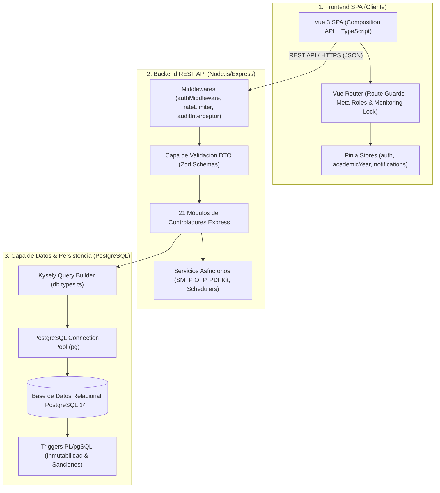
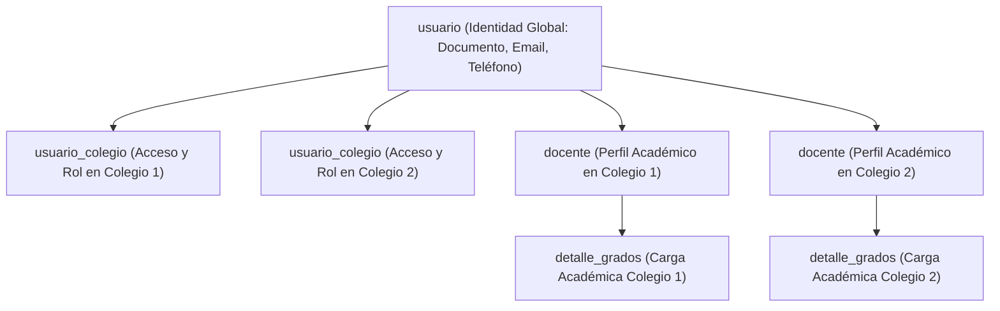

# 📐 Arquitectura, Patrones de Ingeniería y Modelo de Datos — AcademiaNeiva

Este documento detalla la arquitectura de software, la jerarquía de roles de usuario, los flujos de control y las entidades fundamentales de la base de datos relacional de **AcademiaNeiva**.

---

## 💻 Stack Tecnológico

El sistema implementa una **Arquitectura en Capas Desacoplada** (Client-Server REST API) con tipado estático extremo de extremo a extremo:

### Frontend

- **Framework**: Vue 3 (Composition API) con TypeScript en entorno Vite.
- **Enrutamiento**: Vue Router con guardias de navegación (`beforeEach`) para validación de roles y bloqueo de rutas críticas en modo monitoreo.
- **Gestión de Estado**: Pinia (stores especializados: `auth.ts`, `academicYear.ts`, `notifications.ts`).
- **Diseño y Estilos**: CSS Modular / Vanilla CSS de alta fidelidad estética y TailwindCSS para utilidades de maquetación responsiva.

### Backend

- **Entorno de Ejecución**: Node.js v18+ con TypeScript estricto.
- **Framework Web**: Express.js desacoplado.
- **Validación de Entradas**: **Zod** para esquemas DTO declarativos y tipado inferido (`z.infer<typeof Schema>`).
- **Constructor de Consultas SQL**: **Kysely Query Builder** fuertemente tipado mediante la definición estática de esquemas en `backend/src/types/db.types.ts`.
- **Base de Datos**: PostgreSQL 14+ con funciones y triggers en PL/pgSQL para inmutabilidad legal.
- **Mensajería y Seguridad**: Nodemailer para envío SMTP de credenciales y códigos OTP de 6 dígitos numéricos; JWT con firma HMAC-SHA256 e invalidación instantánea mediante `token_blacklist` (`jti`).

---

## 👤 Jerarquía de Roles y Autenticación

El sistema cuenta con 5 roles principales definidos en la tabla `rol`, complementados con mecanismos de supervisión y acompañamiento pedagógico:

1. **Administrador General (`admin_general`)**:
   - Gobierno global del sistema: registro y licencias de colegios, mantenimiento del catálogo nacional DBA.
   - Atención de soporte técnico escalado.
   - Sesiones de supervisión extraordinaria sobre colegios bajo re-autenticación por contraseña del Rector, filtrado por año lectivo y bitácora de auditoría inmutable (`auditoria_acciones_realizadas`).
2. **Directivo (`directivo`)**:
   - Administración institucional: niveles, grados, salones (cupos), materias y asignación docente (`detalle_grados`).
   - Gestión de matrículas ordinarias, extraordinarias, reingresos y traslados.
   - Cierres institucionales de periodos y autorización de boletines PDF.
   - **Acompañamiento Pedagógico (Seguimiento Directivo)**: Capacidad de asumir la vista de un docente, estudiante o padre de su colegio en **modo solo lectura estricto** sin mutar credenciales de sesión.
   - Cargos típicos: `RECTOR`, `COORDINADOR`.
3. **Docente (`docente`)**:
   - Planeación curricular por competencias vinculadas a evidencias DBA con propagación en caliente (`sync_uuid`) a cursos paralelos.
   - Registro de actividades, criterios de evaluación ponderados, toma de asistencia diaria y observaciones formativas.
   - Cierre de periodo por materia (`cierre_materia`).
4. **Estudiante (`estudiante`)**:
   - Portal de consulta de actividades evaluativas, calificaciones por periodo, asistencias, historial de observador y boletines oficiales PDF.
5. **Padre de Familia (`padre`)**:
   - Portal familiar unificado para el seguimiento académico y disciplinario de múltiples hijos asociados (incluso entre diferentes grados del mismo plantel).

---

## 🗄️ Esquema de Base de Datos y Entidades

El diseño relacional se encuentra estandarizado en [AcademiaNeivaBD.sql](file:///c:/Users/alejo/Downloads/segundoProyecto/guides/AcademiaNeivaBD.sql) y tipado en [db.types.ts](file:///c:/Users/alejo/Downloads/segundoProyecto/backend/src/types/db.types.ts). Las entidades críticas del ecosistema comprenden:

### 1. Núcleo Institucional y Estructura Escolar
- `colegio`: Inquilinos del sistema (`nombre`, `nit`, `dominio`, `calendario`, `estado`).
- `año_lectivo`: Ciclos anuales de matrícula y evaluación (`año`, `fecha_inicio`, `fecha_fin`, `estado`).
- `periodo_academico`: Periodos trimestrales/semestrales (`trimestre`, `porcentaje`, `estado: ABIERTO/PENDIENTE/CERRADO`).
- `nivel_escolar` y `tipo_grado`: Jerarquía académica (Preescolar, Primaria, Secundaria, Media).
- `grupos`: Salones físicos con control de cupos máximos.
- `materias`: Asignaturas del catálogo institucional.
- `detalle_grados`: Asignación académica vinculando `materia`, `docente`, `grupo` y `colegio`.

### 2. Matrículas, Admisiones y Estudiantes
- `matricula`: Solicitudes públicas y oficiales con `token_seguimiento` UUID, `correo_padre`, `id_grupo` y estados (`PENDIENTE`, `CORRECCION`, `APROBADA`, `ACTIVA`, `RECHAZADA`, `CANCELADA`, `TRASLADADA`).
- `documento_matricula`: Archivos adjuntos validados individualmente.
- `estudiante`: Ficha escolar con código único y control disciplinario (`estado: ACTIVO/SANCIONADO/EXPULSADO/RETIRADO`).
- `padre_familia` y `detalle_padrefamilia`: Acudientes, datos de contacto (`telefono`) y parentesco con estudiantes.
- `sancion`: Historial disciplinario sincronizado por el trigger `fn_sync_estudiante_sancion`.

### 3. Planeación Curricular y Evaluación
- `competencias`: Metas de aprendizaje agrupadas por `sync_uuid` para cursos paralelos.
- `evidencia_aprendizaje`: Entregables enlazados 1-to-1 al catálogo de `evidencia_dba`.
- `dba_catalogo`: Derechos Básicos de Aprendizaje del Ministerio de Educación Nacional de Colombia.
- `actividad_materia` y `criterio_evaluacion`: Desglose evaluativo ponderado al 100%.
- `notas_actividad` y `nota_criterio`: Calificaciones numéricas cotejadas con la escala.
- `resultado_academico`: Calificaciones definitivas consolidadas por periodo.
- `registro_asistencia`: Control de fallas con límite físico de 7 bloques de clase al día.
- `observacion_estudiante`: Observador del alumno con obligatoriedad de nota académica para boletines.
- `cierre_materia`: Cierre individual por asignatura que permite reaperturas selectivas por el Rector.

### 4. Auditoría, Seguridad, Soporte y Transacciones
- `token_blacklist`: Lista negra de tokens JWT invalidados por `jti`.
- `codigo_verificacion_email`: Almacén transaccional de códigos OTP de 6 dígitos con expiración de 15 minutos.
- `auditoria_supervision` y `auditoria_acciones_realizadas`: Bitácoras inmutables con deltas JSONB (`valor_antiguo`, `valor_nuevo`).
- `tickets_soporte`: Mesa de ayuda con código Base36 (`TKT-XXXX`), regla ping-pong y estados (`ABIERTO`, `EN_PROCESO`, `ESCALADO`, `RESUELTO`).
- `solicitud_traslado` y `traslado_aprobacion`: Flujo de traslados intercolegiados de estudiantes y usuarios.
- `decision_promocion_directivo`: Resoluciones de promoción anual conforme al Decreto 1290 de 2009.

---

## 🏛️ Modelo de Vinculación Multi-Colegio: `usuario_colegio` vs. Entidades de Rol

Para soportar docentes, estudiantes y directivos que pertenecen a más de una institución simultáneamente sin duplicar su identidad ni mezclar su información académica, el sistema implementa una separación limpia de responsabilidades:

### Fuentes de Verdad

1. **`usuario` (Identidad Global de la Persona)**:
   - **Propósito**: Guarda la identidad física única (Nombre, Apellido, Documento, Teléfono, Email, Password Hash).
   - **`id_colegio`**: Es `NULLABLE` para permitir usuarios transversales y administradores globales.

2. **`usuario_colegio` (Fuente de Verdad Administrativa y de Autenticación)**:
   - **Propósito**: Define si una persona tiene autorización activa en una institución específica (`id_usuario`, `id_colegio`, `id_rol`, `estado`).
   - **Uso**: Controla el inicio de sesión, el menú selector de colegio en la barra superior (`x-school-id`), el middleware de seguridad y los traslados institucionales.

3. **`docente` / `estudiante` (Fuente de Verdad Operativa y Académica)**:
   - **Propósito**: Representa la entidad operativa del rol dentro de un colegio concreto.
   - **Restricción Única**: `UNIQUE (id_usuario, id_colegio)` permite que la misma persona tenga un registro independiente en cada colegio donde labora o estudia.
   - **Uso**: Es la clave foránea (`id_docente` / `id_estudiante`) vinculada a cargas lectivas (`detalle_grados`), calificaciones (`resultado_academico`), asistencias (`registro_asistencia`) y cierres de materia (`cierre_materia`).

### Ventajas de esta Arquitectura

- **Aislamiento de Carga Lectiva**: Un docente puede tener el `id_docente: 12` en el Colegio A y el `id_docente: 15` en el Colegio B. Sus asignaciones, horarios y notas no se mezclan.
- **Trazabilidad e Historial**: Si una persona es inactivada en `usuario_colegio` para el Colegio A, pierde acceso al colegio en la plataforma, pero todo su historial de firmas, calificaciones y evidencias registradas en `docente` / `detalle_grados` para el Colegio A permanece **100% inalterado por auditoría**.

---

## 🗺️ Mapa de los 21 Módulos y Referencias de Ingeniería

El ecosistema modular de AcademiaNeiva se organiza en 21 áreas de responsabilidad técnica:

| # | Módulo | Controlador Principal | Esquema DTO / DB | Enlace Técnico |
|---|---|---|---|---|
| 01 | Autenticación | `authController.ts` | `authSchema.ts` / `usuario` | [Módulo 01](file:///c:/Users/alejo/Downloads/segundoProyecto/guides/modules/01_autenticacion/autenticacion.md) |
| 02 | Gestión de Colegios | `colegioController.ts` | `colegioSchema.ts` / `colegio` | [Módulo 02](file:///c:/Users/alejo/Downloads/segundoProyecto/guides/modules/02_gestion_colegios/gestion_colegios.md) |
| 03 | Usuarios y Directivos | `usuarioController.ts` | `usuarioSchema.ts` / `directivo` | [Módulo 03](file:///c:/Users/alejo/Downloads/segundoProyecto/guides/modules/03_usuarios_y_directivos/usuarios_y_directivos.md) |
| 04 | Estructura Escolar | `academicAdminController.ts` | `estructuraSchema.ts` / `grupos` | [Módulo 04](file:///c:/Users/alejo/Downloads/segundoProyecto/guides/modules/04_estructura_escolar/estructura_escolar.md) |
| 05 | Docentes | `academicAdminController.ts` | `teacherSchema.ts` / `docente` | [Módulo 05](file:///c:/Users/alejo/Downloads/segundoProyecto/guides/modules/05_docentes/docentes.md) |
| 06 | Matrículas | `matriculaController.ts` | `matriculaSchema.ts` / `matricula` | [Módulo 06](file:///c:/Users/alejo/Downloads/segundoProyecto/guides/modules/06_matriculas/matriculas.md) |
| 07 | Estudiantes y Estados | `studentController.ts` | `studentSchema.ts` / `estudiante` | [Módulo 07](file:///c:/Users/alejo/Downloads/segundoProyecto/guides/modules/07_estudiantes_y_estados/estudiantes_y_estados.md) |
| 08 | Configuración Académica | `academicAdminController.ts` | `configSchema.ts` / `periodo_academico` | [Módulo 08](file:///c:/Users/alejo/Downloads/segundoProyecto/guides/modules/08_configuracion_academica/configuracion_academica.md) |
| 09 | Competencias | `academicAdminController.ts` | `competenciaSchema.ts` / `competencias` | [Módulo 09](file:///c:/Users/alejo/Downloads/segundoProyecto/guides/modules/09_competencias_y_sincronizacion/competencias_y_sincronizacion.md) |
| 10 | Catálogo DBA | `dbaController.ts` | `dbaSchema.ts` / `dba_catalogo` | [Módulo 10](file:///c:/Users/alejo/Downloads/segundoProyecto/guides/modules/10_catalogo_dba/catalogo_dba.md) |
| 11 | Calificaciones | `gradingController.ts` | `gradeSchema.ts` / `notas_actividad` | [Módulo 11](file:///c:/Users/alejo/Downloads/segundoProyecto/guides/modules/11_calificaciones/calificaciones.md) |
| 12 | Observaciones | `observationController.ts` | `observationSchema.ts` / `observacion_estudiante` | [Módulo 12](file:///c:/Users/alejo/Downloads/segundoProyecto/guides/modules/12_observaciones/observaciones.md) |
| 13 | Asistencia | `attendanceController.ts` | `attendanceSchema.ts` / `registro_asistencia` | [Módulo 13](file:///c:/Users/alejo/Downloads/segundoProyecto/guides/modules/13_asistencia/asistencia.md) |
| 14 | Cierre y Boletines | `boletinController.ts` | `boletinSchema.ts` / `resultado_academico` | [Módulo 14](file:///c:/Users/alejo/Downloads/segundoProyecto/guides/modules/14_cierre_y_boletines/cierre_y_boletines.md) |
| 15 | Supervisión y Auditoría | `adminGeneralController.ts` | `supervisionSchema.ts` / `auditoria_supervision` | [Módulo 15](file:///c:/Users/alejo/Downloads/segundoProyecto/guides/modules/15_supervision_y_auditoria/supervision_y_auditoria.md) |
| 16 | Soporte y Tickets | `supportController.ts` | `supportSchema.ts` / `tickets_soporte` | [Módulo 16](file:///c:/Users/alejo/Downloads/segundoProyecto/guides/modules/16_soporte_y_tickets/soporte_y_tickets.md) |
| 17 | Gestión de Padres | `parentManagementController.ts` | `parentSchema.ts` / `padre_familia` | [Módulo 17](file:///c:/Users/alejo/Downloads/segundoProyecto/guides/modules/17_gestion_padres/gestion_padres.md) |
| 18 | Gestión de Traslados | `trasladoController.ts` | `trasladoSchema.ts` / `solicitud_traslado` | [Módulo 18](file:///c:/Users/alejo/Downloads/segundoProyecto/guides/modules/18_gestion_traslados/gestion_traslados.md) |
| 19 | Seguimiento y Promoción | `academicTrackingController.ts` | `trackingSchema.ts` / `decision_promocion_directivo` | [Módulo 19](file:///c:/Users/alejo/Downloads/segundoProyecto/guides/modules/19_seguimiento_y_promocion_academica/seguimiento_y_promocion_academica.md) |
| 20 | Seguimiento Directivo | (Auth Store & Controllers) | `monitoringSchema.ts` / Modo Espejo | [Módulo 20](file:///c:/Users/alejo/Downloads/segundoProyecto/guides/modules/20_seguimiento_academico_directivo/seguimiento_academico_directivo.md) |
| 21 | Flujo Correos y OTP | `matriculaController.ts` / `notificationService.ts` | `otpSchema.ts` / `codigo_verificacion_email` | [Módulo 21](file:///c:/Users/alejo/Downloads/segundoProyecto/guides/modules/21_flujo_correos_y_verificaciones/flujo_correos_y_verificaciones.md) |

---

### Documentación Conexas
- 📄 **[Documentación Técnica Integral (guides/AcademiaNeiva_Documentacion_Tecnica_Integral.md)](file:///c:/Users/alejo/Downloads/segundoProyecto/guides/AcademiaNeiva_Documentacion_Tecnica_Integral.md)**
- 📘 **[Manual Funcional Maestro (guides/AcademiaNeiva_Documento_Funcional.md)](file:///c:/Users/alejo/Downloads/segundoProyecto/guides/AcademiaNeiva_Documento_Funcional.md)**
- 📙 **[Manual Técnico de Arquitectura (guides/AcademiaNeiva_Documento_Tecnico.md)](file:///c:/Users/alejo/Downloads/segundoProyecto/guides/AcademiaNeiva_Documento_Tecnico.md)**
- 📋 **[Especificación IEEE Std 830-1998 (guides/AcademiaNeiva_Especificacion_IEEE830.md)](file:///c:/Users/alejo/Downloads/segundoProyecto/guides/AcademiaNeiva_Especificacion_IEEE830.md)**
- 🗺️ **[Mapa General de Módulos (guides/modules/mapa_documentacion.md)](file:///c:/Users/alejo/Downloads/segundoProyecto/guides/modules/mapa_documentacion.md)**
