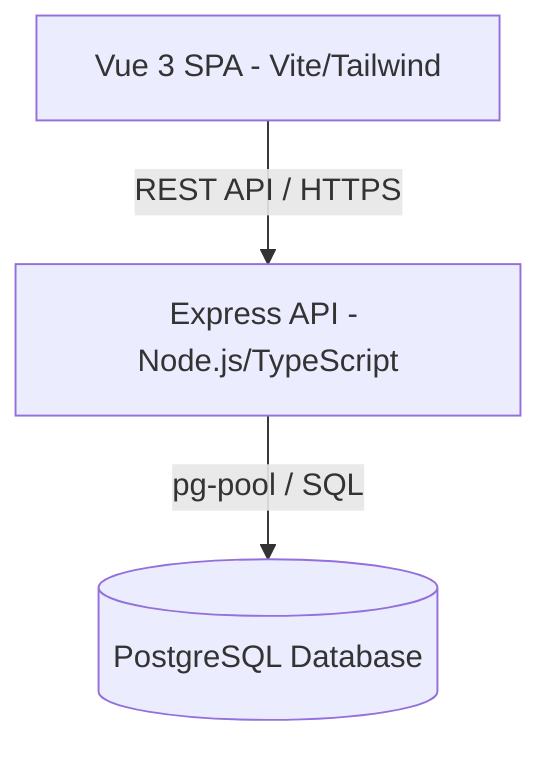

sn

# 📐 Arquitectura y Modelo de Datos - AcademiaNeiva

Este documento detalla la arquitectura de software, la jerarquía de roles de usuario y las tablas fundamentales de la base de datos relacional de **AcademiaNeiva**.

---

## 💻 Stack Tecnológico

El sistema utiliza una arquitectura cliente-servidor desacoplada:

### Frontend

- **Framework**: Vue 3 (Composition API) con TypeScript.
- **Enrutamiento**: Vue Router.
- **Gestión de Estado**: Pinia (con stores especializados en notificaciones, autenticación, etc.).
- **Diseño y Estilos**: TailwindCSS y CSS nativo para vistas personalizadas premium.

### Backend

- **Entorno de Ejecución**: Node.js v18+ con TypeScript.
- **Framework Web**: Express.
- **Base de Datos**: PostgreSQL utilizando el driver nativo de agrupación de conexiones `pg` (pg-pool).

---

## 👤 Jerarquía de Roles y Autenticación

El portal cuenta con 5 roles de usuario principales definidos en la tabla `rol`:

1. **Administrador General (`admin_general`)**:
   - Administra colegios a nivel nacional/local (aprobar, suspender, rechazar).
   - Administra todas las cuentas de usuario registradas en el sistema global.
   - Solicita sesiones de supervisión a los colegios bajo aprobación explícita de sus directivos.
2. **Directivo (`directivo`)**:
   - Administra la planeación del colegio (períodos lectivos, escalas de evaluación, asignaciones docentes).
   - Administra los estudiantes, matrículas, profesores, y aprueba/rechaza las solicitudes de supervisión del Administrador General.
   - Cargos típicos: `RECTOR`, `COORDINADOR`.
3. **Docente (`docente`)**:
   - Registra actividades, calificaciones y asistencias de los cursos bajo su asignación académica (`detalle_grados`).
   - Define descripciones de evidencias y criterios evaluativos en periodos abiertos.
4. **Estudiante (`estudiante`)**:
   - Consulta sus calificaciones detalladas, fallas de asistencia, boletines y observaciones acumuladas en su dashboard personal.
   - Autenticación mediante código estudiantil (`codigo`).
5. **Padre de Familia (`padre`)**:
   - Supervisa a múltiples hijos (incluso en diferentes colegios).
   - Accede a boletines, notas y registros de inasistencias en tiempo real.

---

## 🗄️ Esquema de Base de Datos y Entidades

El diseño de datos está definido en [AcademiaNeivaBD.sql](file:///c:/Users/alejo/Downloads/segundoProyecto/guides/AcademiaNeivaBD.sql). A continuación se resumen las entidades críticas del sistema:

### Estructura Escolar e Instituciones

- `colegio`: Define las instituciones (nombre, dane, dominio, calendario 'A' o 'B', estado 'Activo'/'Suspendido').
- `año_lectivo`: Controla los calendarios académicos específicos de cada escuela (`calendario`, `id_colegio`).
- `periodo_academico`: Trimestres académicos (`trimestre`, `estado: ABIERTO/PENDIENTE/CERRADO`, `porcentaje`).
- `configuracion_colegio`: Configuración de límites evaluativos (`nota_minima`, `nota_maxima`, `nota_aprobacion`, `escala_modo`).

### Matrículas y Cursos

- `nivel_escolar` y `tipo_grado`: Jerarquía escolar (ej. PRIMARIA -> PRIMERO).
- `grupos` y `grados`: Cursos del año (ej. Primero A, Primero B).
- `materias`: Asignaturas del catálogo (ej. Matemáticas, Español).
- `detalle_grados`: Relación n-to-n que asigna materias, docentes y grupos.
- `matricula`: Vincula al estudiante con un grupo, año lectivo y estado de matrícula (`ACTIVA`/`CANCELADA`).

### Académico y Planeación Curricular

- `competencias`: Plan curricular. Posee la columna `sync_uuid` para coordinar la sincronización entre cursos paralelos.
- `evidencia_aprendizaje`: Evidencias pedagógicas asociadas a una competencia (pueden ser libres o enlazadas a un `id_evidencia_dba` oficial).
- `actividad_materia`: Evaluaciones del periodo creadas por los docentes. Posee el campo `fecha_creacion` (TIMESTAMPTZ).
- `criterio_evaluacion`: Distribución porcentual de notas dentro de una actividad académica.
- `notas_actividad` / `nota_criterio`: Notas individuales de los estudiantes.
- `resultado_academico`: Promedios oficiales del periodo calculados al cerrar la materia.
- `registro_asistencia`: Registros de fallas (`AUSENTE`, `PRESENTE`, `TARDE`, `JUSTIFICADA`).
