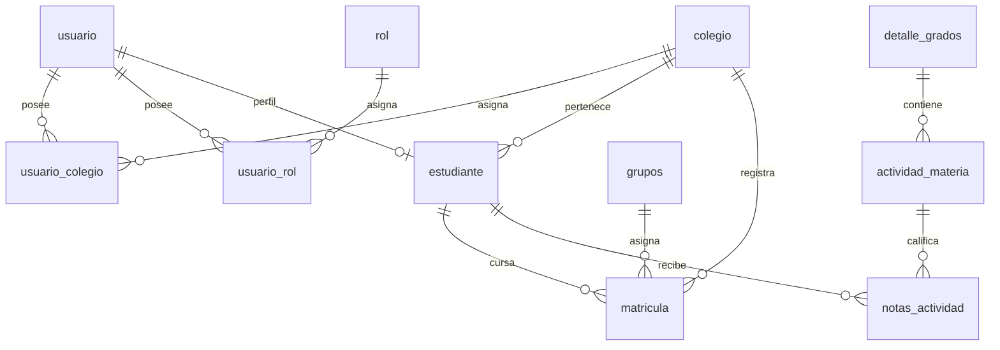

# Diccionario de Datos Oficial - Plataforma AcademiaNeiva

**Documentación Técnica y Especificación del Esquema de Base de Datos SQL (`AcademiaNeivaBD`)**

> **Fecha de generación:** 2026-08-11
> **Fidelidad:** 100% extractada directamente del esquema DDL nativo `AcademiaNeivaBD.sql`.

## 1. Introducción

El presente documento constituye el **Diccionario de Datos Oficial** del sistema de información educativa **AcademiaNeiva**.
La arquitectura de base de datos sigue un diseño **multicolegio y multirrol totalmente desacoplado**, estructurado para garantizar la integridad referencial, el aislamiento tenant por colegio mediante la tabla relacional `usuario_colegio`, la inmutabilidad del historial académico y el soporte nativo para requerimientos del Ministerio de Educación Nacional (MEN) en Colombia, como los Derechos Básicos de Aprendizaje (DBA), escalas de valoración cuantitativas/cualitativas, boletines por periodos y procesos de promoción escolar.

## 2. Motor y Versión de la BD

- **Sistema Gestor de Base de Datos (RDBMS):** PostgreSQL 15+ (PostgreSQL Database Server).
- **Codificación de Caracteres (Encoding):** `UTF-8`.
- **Esquema:** `public`.
- **Tipos de Datos Avanzados Utilizados:**
  - **Tipos de Enumeración Nativos (`ENUM`):** 26 tipos personalizados para estados y clasificaciones.
  - **Almacenamiento Estructurado / Documental (`JSONB`):** Para metadatos de tickets, observaciones complejas y auditoría.
  - **Arreglos Nativos (`VARCHAR[]`):** Para arreglos de roles o colecciones de identificadores.
  - **Marcas de Tiempo con Zona Horaria (`TIMESTAMPTZ`):** Para trazabilidad precisa en auditoría.

## 3. Modelo Entidad-Relación

El modelo conceptual se organiza en 6 dominios funcionales clave:

1. **Seguridad y Usuarios Centralizados:** `usuario`, `rol`, `usuario_rol`, `usuario_colegio`, `token_blacklist`.
2. **Estructura Institucional:** `colegio`, `directivo`, `docente`, `estudiante`, `padre_familia`, `detalle_padrefamilia`.
3. **Gestión Académica y Carga:** `anio_lectivo`, `periodo_academico`, `nivel_escolar`, `tipo_grado`, `jornada`, `secciones`, `grados`, `grupos`, `materias`, `detalle_grados`.
4. **Evaluación y Desempeño:** `actividad_materia`, `notas_actividad`, `resultado_academico`, `cierre_materia`, `criterio_evaluacion`, `nota_criterio`, `escala_valoracion`, `configuracion_colegio`, `observacion_estudiante`, `registro_asistencia`, `sancion`, `tipo_sancion`, `decision_promocion_directivo`, `registro_graduados`.
5. **Catálogo de Estándares MEN (DBA):** `dba`, `evidencias_dba`, `colegio_version_curricular`, `competencias`, `evidencia_aprendizaje`, `actividad_evidencia_dba`, `dimensiones_preescolar`, `dba_dimensiones_preescolar`.
6. **Auditoría, Traslados y Soporte:** `solicitud_traslado`, `traslado_aprobacion`, `auditoria_supervision`, `auditoria_acciones_realizadas`, `notificacion_colegio`, `notificacion_supervision`, `tickets_soporte`.

## 4. Modelo Relacional

La base de datos se encuentra normalizada en **Tercera Forma Normal (3NF)** y Formas Normales Superiores para eliminar la redundancia de datos. La relación entre usuarios e instituciones educativas se maneja de forma totalmente relacional mediante `usuario_colegio`, eliminando la dependencia física de pertenencia a un solo colegio en la tabla `usuario`.

## 5. Diccionario de Datos

A continuación se detallan las **62 tablas** pertenecientes al esquema `AcademiaNeivaBD`:

### 5.1 Tabla: `actividad_evidencia_dba`
**Descripción:** Relación entre actividades evaluativas y evidencias DBA alcanzadas.

| Campo | Tipo de Dato | Nulo | Valor por Defecto | Clave | Descripción / Dominio |
| :--- | :--- | :---: | :--- | :---: | :--- |
| `id_actividadmateria` | `integer` | NO | - | **PK / FK** | Clave foránea que referencia a `actividad_materia(id_actividadmateria)`. |
| `id_evidencia_dba` | `integer` | NO | - | **PK / FK** | Clave foránea que referencia a `evidencias_dba(id_evidencia_dba)`. |

### 5.2 Tabla: `actividad_materia`
**Descripción:** Actividades evaluativas programadas por los docentes para cada materia y periodo.

| Campo | Tipo de Dato | Nulo | Valor por Defecto | Clave | Descripción / Dominio |
| :--- | :--- | :---: | :--- | :---: | :--- |
| `id_actividadmateria` | `integer` | NO | - | **PK** | Atributo id_actividadmateria. |
| `id_detallegrado` | `integer` | SÍ | - | **FK** | Clave foránea que referencia a `detalle_grados(id_detallegrado)`. |
| `id_periodo` | `integer` | SÍ | - | **FK** | Clave foránea que referencia a `periodo_academico(id_periodo)`. |
| `nombre` | `character varying(255)` | NO | - | **** | Atributo nombre. |
| `porcentaje` | `numeric(5,2)` | NO | - | **** | Atributo porcentaje. |
| `id_colegio` | `integer` | NO | - | **FK** | Clave foránea que referencia a `colegio(id_colegio)`. |
| `id_competencia` | `integer` | SÍ | - | **FK** | Clave foránea que referencia a `competencias(id_competencia)`. |
| `id_evidencia` | `integer` | SÍ | - | **FK** | Clave foránea que referencia a `evidencia_aprendizaje(id_evidencia)`. |
| `fecha_creacion` | `timestamp with time zone` | SÍ | `now()` | **** | Marca de tiempo de registro o modificación. |
| `motivo_extra` | `character varying(100)` | SÍ | `NULL::character varying` | **** | Atributo motivo_extra. |
| `justificacion_extra` | `text` | SÍ | - | **** | Atributo justificacion_extra. |
| `id_docente_creador` | `integer` | SÍ | - | **FK** | Clave foránea que referencia a `docente(id_docente)`. |

### 5.3 Tabla: `anio_lectivo`
**Descripción:** Años lectivos institucionales (calendario A/B, fechas de inicio/fin, estado abierto/cerrado).

| Campo | Tipo de Dato | Nulo | Valor por Defecto | Clave | Descripción / Dominio |
| :--- | :--- | :---: | :--- | :---: | :--- |
| `id_anio` | `integer CONSTRAINT "año_lectivo_id_año_not_null"` | NO | - | **** | Atributo id_anio. |
| `calendario` | `character varying(10)` | SÍ | - | **** | Atributo calendario. |
| `id_colegio` | `integer CONSTRAINT "año_lectivo_id_colegio_not_null"` | NO | - | **** | Atributo id_colegio. |
| `tipo_calendario` | `character(1)` | SÍ | `'A'::bpchar` | **** | Atributo tipo_calendario. |
| `estado` | `public.estado_periodo` | SÍ | `'ABIERTO'::public.estado_periodo` | **** | Atributo estado. |
| `fecha_inicio` | `date` | SÍ | - | **** | Marca de tiempo de registro o modificación. |
| `fecha_fin` | `date` | SÍ | - | **** | Marca de tiempo de registro o modificación. |

### 5.4 Tabla: `auditoria_acciones_realizadas`
**Descripción:** Log de acciones y lecturas durante las sesiones de supervisión.

| Campo | Tipo de Dato | Nulo | Valor por Defecto | Clave | Descripción / Dominio |
| :--- | :--- | :---: | :--- | :---: | :--- |
| `id_accion` | `integer` | NO | - | **PK** | Atributo id_accion. |
| `id_auditoria` | `integer` | NO | - | **FK** | Clave foránea que referencia a `auditoria_supervision(id_auditoria)`. |
| `fecha_accion` | `timestamp with time zone` | NO | `now() NOT NULL` | **** | Marca de tiempo de registro o modificación. |
| `modulo` | `character varying(255)` | NO | - | **** | Atributo modulo. |
| `tipo_accion` | `public.tipo_accion_auditoria` | NO | - | **** | Atributo tipo_accion. |
| `accion` | `character varying(255)` | NO | - | **** | Atributo accion. |
| `recurso_afectado` | `text` | NO | - | **** | Atributo recurso_afectado. |
| `id_usuario_afectado` | `integer` | SÍ | - | **** | Atributo id_usuario_afectado. |
| `valor_antiguo` | `jsonb` | SÍ | - | **** | Atributo valor_antiguo. |
| `valor_nuevo` | `jsonb` | SÍ | - | **** | Atributo valor_nuevo. |
| `motivo_cambio` | `text` | SÍ | - | **** | Atributo motivo_cambio. |

### 5.5 Tabla: `auditoria_supervision`
**Descripción:** Registros de supervisión y auditoría del Administrador General a colegios.

| Campo | Tipo de Dato | Nulo | Valor por Defecto | Clave | Descripción / Dominio |
| :--- | :--- | :---: | :--- | :---: | :--- |
| `id_auditoria` | `integer` | NO | - | **PK** | Atributo id_auditoria. |
| `id_admin_general` | `integer` | NO | - | **** | Atributo id_admin_general. |
| `id_colegio` | `integer` | NO | - | **FK** | Clave foránea que referencia a `colegio(id_colegio)`. |
| `id_directivo_aprobador` | `integer` | SÍ | - | **FK** | Clave foránea que referencia a `directivo(id)`. |
| `motivo_solicitud` | `text` | NO | - | **** | Atributo motivo_solicitud. |
| `fecha_solicitud` | `timestamp with time zone` | NO | `now() NOT NULL` | **** | Marca de tiempo de registro o modificación. |
| `tipo_supervision` | `public.tipo_supervision` | NO | - | **** | Enumeración nativa `tipo_supervision`. |
| `estado_supervision` | `public.estado_supervision` | NO | `'SOLICITADA'::public.estado_supervision NOT NULL` | **** | Enumeración nativa `estado_supervision`. |
| `fecha_aprobacion` | `timestamp with time zone` | SÍ | - | **** | Marca de tiempo de registro o modificación. |
| `motivo_entrada` | `text` | SÍ | - | **** | Atributo motivo_entrada. |
| `fecha_entrada` | `timestamp with time zone` | SÍ | - | **** | Marca de tiempo de registro o modificación. |
| `fecha_salida` | `timestamp with time zone` | SÍ | - | **** | Marca de tiempo de registro o modificación. |
| `duracion_maxima_minutos` | `integer` | NO | `60 NOT NULL` | **** | Atributo duracion_maxima_minutos. |
| `revocado_por` | `integer` | SÍ | - | **FK** | Clave foránea que referencia a `directivo(id)`. |
| `fecha_revocacion` | `timestamp with time zone` | SÍ | - | **** | Marca de tiempo de registro o modificación. |
| `ip_admin` | `character varying(45)` | SÍ | - | **** | Atributo ip_admin. |
| `eliminado` | `boolean` | NO | `false NOT NULL` | **** | Atributo eliminado. |
| `fecha_retencion_hasta` | `timestamp with time zone` | NO | `(now() + '5 years'::interval) NOT NULL` | **** | Marca de tiempo de registro o modificación. |
| `motivo_revocacion` | `text` | SÍ | - | **** | Atributo motivo_revocacion. |

### 5.6 Tabla: `cierre_materia`
**Descripción:** Registro de cierre definitivo de notas por materia y periodo académico.

| Campo | Tipo de Dato | Nulo | Valor por Defecto | Clave | Descripción / Dominio |
| :--- | :--- | :---: | :--- | :---: | :--- |
| `id_cierremateria` | `integer` | NO | - | **PK** | Atributo id_cierremateria. |
| `id_detallegrado` | `integer` | NO | - | **FK** | Clave foránea que referencia a `detalle_grados(id_detallegrado)`. |
| `id_periodo` | `integer` | NO | - | **FK** | Clave foránea que referencia a `periodo_academico(id_periodo)`. |
| `estado` | `public.estado_cierre_materia` | NO | - | **** | Atributo estado. |
| `fecha_cierre` | `timestamp with time zone` | NO | - | **** | Marca de tiempo de registro o modificación. |
| `justificacion_evidencias_pendientes` | `text` | SÍ | - | **** | Atributo justificacion_evidencias_pendientes. |
| `id_docente_cierre` | `integer` | SÍ | - | **FK** | Clave foránea que referencia a `docente(id_docente)`. |

### 5.7 Tabla: `colegio`
**Descripción:** Tabla principal de instituciones educativas registradas en la plataforma.

| Campo | Tipo de Dato | Nulo | Valor por Defecto | Clave | Descripción / Dominio |
| :--- | :--- | :---: | :--- | :---: | :--- |
| `id_colegio` | `integer` | NO | - | **PK** | Identificador único primario de la tabla. |
| `nombre` | `text` | NO | - | **** | Atributo nombre. |
| `tipo_colegio` | `character varying(20)` | NO | - | **** | Atributo tipo_colegio. |
| `sede` | `character varying(255)` | NO | - | **** | Atributo sede. |
| `contacto` | `numeric` | NO | - | **** | Atributo contacto. |
| `correo` | `character varying(100)` | NO | - | **** | Atributo correo. |
| `dane` | `character varying(100)` | NO | - | **** | Atributo dane. |
| `tipo_calendario` | `character(1)` | SÍ | `'A'::bpchar` | **** | Atributo tipo_calendario. |
| `estado` | `public.estado_colegio` | NO | `'ACTIVO'::public.estado_colegio NOT NULL` | **** | Atributo estado. |
| `fecha_registro` | `timestamp with time zone` | NO | `now() NOT NULL` | **** | Marca de tiempo de registro o modificación. |
| `motivo_rechazo` | `text` | SÍ | - | **** | Atributo motivo_rechazo. |
| `fecha_cambio_estado` | `timestamp with time zone` | SÍ | - | **** | Marca de tiempo de registro o modificación. |
| `escudo_url` | `text` | SÍ | - | **** | Atributo escudo_url. |
| `colores` | `character varying(255)` | SÍ | - | **** | Atributo colores. |
| `color_primario` | `character varying(50)` | SÍ | `NULL::character varying` | **** | Atributo color_primario. |
| `color_secundario` | `character varying(50)` | SÍ | `NULL::character varying` | **** | Atributo color_secundario. |

### 5.8 Tabla: `colegio_version_curricular`
**Descripción:** Versión del catálogo de DBA adoptada por colegio, área y grado.

| Campo | Tipo de Dato | Nulo | Valor por Defecto | Clave | Descripción / Dominio |
| :--- | :--- | :---: | :--- | :---: | :--- |
| `id` | `integer` | NO | - | **PK** | Identificador único primario de la tabla. |
| `id_colegio` | `integer` | NO | - | **FK** | Clave foránea que referencia a `colegio(id_colegio)`. |
| `area` | `character varying(100)` | NO | - | **** | Atributo area. |
| `grado` | `character varying(50)` | NO | - | **** | Atributo grado. |
| `version_curricular` | `character varying(20)` | NO | - | **** | Atributo version_curricular. |
| `fecha_asignacion` | `timestamp with time zone` | NO | `now() NOT NULL` | **** | Marca de tiempo de registro o modificación. |

### 5.9 Tabla: `competencias`
**Descripción:** Competencias académicas configuradas para un grupo, materia y periodo.

| Campo | Tipo de Dato | Nulo | Valor por Defecto | Clave | Descripción / Dominio |
| :--- | :--- | :---: | :--- | :---: | :--- |
| `id_competencia` | `integer` | NO | - | **PK** | Atributo id_competencia. |
| `id_anio` | `integer CONSTRAINT "competencias_id_año_not_null"` | NO | - | **** | Atributo id_anio. |
| `id_grupo` | `integer` | NO | - | **FK** | Clave foránea que referencia a `grupos(id_grupo)`. |
| `id_materia` | `integer` | NO | - | **FK** | Clave foránea que referencia a `materias(id_materia)`. |
| `id_periodo` | `integer` | NO | - | **FK** | Clave foránea que referencia a `periodo_academico(id_periodo)`. |
| `descripcion` | `text` | NO | `'Competencia pendiente por definir.'::text NOT NULL` | **** | Atributo descripcion. |
| `id_colegio` | `integer` | NO | - | **FK** | Clave foránea que referencia a `colegio(id_colegio)`. |
| `nombre` | `character varying(200)` | SÍ | - | **** | Atributo nombre. |
| `sync_uuid` | `uuid` | SÍ | - | **** | Atributo sync_uuid. |
| `id_dimension` | `integer` | SÍ | - | **FK** | Clave foránea que referencia a `dimensiones_preescolar(id_dimension)`. |

### 5.10 Tabla: `configuracion_base`
**Descripción:** Configuración base de la infraestructura.

| Campo | Tipo de Dato | Nulo | Valor por Defecto | Clave | Descripción / Dominio |
| :--- | :--- | :---: | :--- | :---: | :--- |
| `id_config_base` | `integer` | NO | - | **PK** | Atributo id_config_base. |
| `clave` | `character varying(100)` | NO | - | **** | Atributo clave. |
| `descripcion` | `text` | SÍ | - | **** | Atributo descripcion. |
| `valor_default` | `character varying(255)` | NO | - | **** | Atributo valor_default. |
| `tipo` | `character varying(20)` | NO | - | **** | Atributo tipo. |

### 5.11 Tabla: `configuracion_colegio`
**Descripción:** Parámetros académicos por colegio (notas mínimas, máximas, de aprobación y escala).

| Campo | Tipo de Dato | Nulo | Valor por Defecto | Clave | Descripción / Dominio |
| :--- | :--- | :---: | :--- | :---: | :--- |
| `id_colegio` | `integer` | NO | - | **PK / FK** | Clave foránea que referencia a `colegio(id_colegio)`. |
| `nota_minima` | `numeric(5,2)` | NO | `0 NOT NULL` | **** | Atributo nota_minima. |
| `nota_maxima` | `numeric(5,2)` | NO | `5 NOT NULL` | **** | Atributo nota_maxima. |
| `nota_aprobacion` | `numeric(5,2)` | NO | `3 NOT NULL` | **** | Atributo nota_aprobacion. |
| `escala_modo` | `character varying(20)` | NO | `'AUTOMATICO'::character varying NOT NULL` | **** | Atributo escala_modo. |

### 5.12 Tabla: `configuracion_inscripcion`
**Descripción:** Parámetros de convocatorias e inscripciones estudiantiles.

| Campo | Tipo de Dato | Nulo | Valor por Defecto | Clave | Descripción / Dominio |
| :--- | :--- | :---: | :--- | :---: | :--- |
| `id_configuracion` | `integer` | NO | - | **PK** | Atributo id_configuracion. |
| `id_colegio` | `integer` | NO | - | **FK** | Clave foránea que referencia a `colegio(id_colegio)`. |
| `id_anio` | `integer CONSTRAINT "configuracion_inscripcion_id_año_not_null"` | NO | - | **** | Atributo id_anio. |
| `fecha_inicio` | `timestamp with time zone` | NO | - | **** | Marca de tiempo de registro o modificación. |
| `fecha_cierre` | `timestamp with time zone` | NO | - | **** | Marca de tiempo de registro o modificación. |
| `habilitada` | `boolean` | NO | `true NOT NULL` | **** | Atributo habilitada. |

### 5.13 Tabla: `configuracion_plataforma`
**Descripción:** Configuración global de la plataforma (ej. duraciones de supervisión).

| Campo | Tipo de Dato | Nulo | Valor por Defecto | Clave | Descripción / Dominio |
| :--- | :--- | :---: | :--- | :---: | :--- |
| `clave` | `character varying(100)` | NO | - | **PK** | Atributo clave. |
| `valor` | `character varying(255)` | NO | - | **** | Atributo valor. |
| `descripcion` | `text` | SÍ | - | **** | Atributo descripcion. |
| `actualizado_por` | `integer` | SÍ | - | **** | Atributo actualizado_por. |
| `fecha_actualizacion` | `timestamp with time zone` | NO | `now() NOT NULL` | **** | Marca de tiempo de registro o modificación. |

### 5.14 Tabla: `configuracion_sistema`
**Descripción:** Variables generales del sistema.

| Campo | Tipo de Dato | Nulo | Valor por Defecto | Clave | Descripción / Dominio |
| :--- | :--- | :---: | :--- | :---: | :--- |
| `id_configuracion` | `integer` | NO | - | **PK** | Atributo id_configuracion. |
| `id_colegio` | `integer` | NO | - | **FK** | Clave foránea que referencia a `colegio(id_colegio)`. |
| `clave` | `character varying(100)` | NO | - | **** | Atributo clave. |
| `valor` | `character varying(255)` | NO | - | **** | Atributo valor. |
| `id_config_base` | `integer` | SÍ | - | **FK** | Clave foránea que referencia a `configuracion_base(id_config_base)`. |

### 5.15 Tabla: `contrato_docente`
**Descripción:** Vínculo contractual de docentes con instituciones.

| Campo | Tipo de Dato | Nulo | Valor por Defecto | Clave | Descripción / Dominio |
| :--- | :--- | :---: | :--- | :---: | :--- |
| `id_contratodocente` | `integer` | NO | - | **PK** | Atributo id_contratodocente. |
| `estado` | `character varying(50)` | NO | - | **** | Atributo estado. |
| `id_colegio` | `integer` | NO | - | **FK** | Clave foránea que referencia a `colegio(id_colegio)`. |

### 5.16 Tabla: `criterio_evaluacion`
**Descripción:** Criterios y rubricas de evaluación definidos para las actividades.

| Campo | Tipo de Dato | Nulo | Valor por Defecto | Clave | Descripción / Dominio |
| :--- | :--- | :---: | :--- | :---: | :--- |
| `id_criterio` | `integer` | NO | - | **PK** | Atributo id_criterio. |
| `id_actividadmateria` | `integer` | NO | - | **FK** | Clave foránea que referencia a `actividad_materia(id_actividadmateria)`. |
| `id_evidencia` | `integer` | SÍ | - | **FK** | Clave foránea que referencia a `evidencia_aprendizaje(id_evidencia)`. |
| `descripcion` | `text` | NO | - | **** | Atributo descripcion. |
| `porcentaje` | `numeric(5,2)` | NO | - | **** | Atributo porcentaje. |
| `id_colegio` | `integer` | NO | - | **FK** | Clave foránea que referencia a `colegio(id_colegio)`. |

### 5.17 Tabla: `dba`
**Descripción:** Derechos Básicos de Aprendizaje (DBA) oficiales del Ministerio de Educación Nacional.

| Campo | Tipo de Dato | Nulo | Valor por Defecto | Clave | Descripción / Dominio |
| :--- | :--- | :---: | :--- | :---: | :--- |
| `id_dba` | `integer` | NO | - | **PK** | Identificador único primario de la tabla. |
| `area` | `character varying(100)` | NO | - | **** | Atributo area. |
| `grado` | `character varying(50)` | NO | - | **** | Atributo grado. |
| `numero_dba` | `integer` | NO | - | **** | Atributo numero_dba. |
| `enunciado` | `text` | NO | - | **** | Atributo enunciado. |
| `version_curricular` | `character varying(20)` | NO | - | **** | Atributo version_curricular. |
| `estado` | `public.estado_dba` | NO | `'ACTIVO'::public.estado_dba NOT NULL` | **** | Atributo estado. |
| `created_at` | `timestamp with time zone` | NO | `now() NOT NULL` | **** | Marca de tiempo de registro o modificación. |
| `updated_at` | `timestamp with time zone` | NO | `now() NOT NULL` | **** | Marca de tiempo de registro o modificación. |

### 5.18 Tabla: `dba_dimensiones_preescolar`
**Descripción:** Mapeo entre DBA de transición y dimensiones del desarrollo preescolar.

| Campo | Tipo de Dato | Nulo | Valor por Defecto | Clave | Descripción / Dominio |
| :--- | :--- | :---: | :--- | :---: | :--- |
| `id_dba` | `integer` | NO | - | **PK / FK** | Clave foránea que referencia a `dba(id_dba)`. |
| `id_dimension` | `integer` | NO | - | **PK / FK** | Clave foránea que referencia a `dimensiones_preescolar(id_dimension)`. |

### 5.19 Tabla: `decision_promocion_directivo`
**Descripción:** Registro formal de decisiones del consejo académico sobre la promoción estudiantil.

| Campo | Tipo de Dato | Nulo | Valor por Defecto | Clave | Descripción / Dominio |
| :--- | :--- | :---: | :--- | :---: | :--- |
| `id_decision` | `integer` | NO | - | **PK** | Atributo id_decision. |
| `id_estudiante` | `integer` | NO | - | **FK** | Clave foránea que referencia a `estudiante(id_estudiante)`. |
| `id_colegio` | `integer` | NO | - | **FK** | Clave foránea que referencia a `colegio(id_colegio)`. |
| `id_anio_anterior` | `integer` | NO | - | **FK** | Clave foránea que referencia a `anio_lectivo(id_anio)`. |
| `resultado_calculado` | `public.resultado_consolidado_anual` | NO | - | **** | Atributo resultado_calculado. |
| `decision_tomada` | `public.decision_promocion_tipo` | NO | - | **** | Atributo decision_tomada. |
| `id_grado_anterior` | `integer` | SÍ | - | **FK** | Clave foránea que referencia a `grados(id_grado)`. |
| `id_grado_asignado` | `integer` | SÍ | - | **FK** | Clave foránea que referencia a `grados(id_grado)`. |
| `id_usuario_decision` | `integer` | NO | - | **** | Atributo id_usuario_decision. |
| `fecha_decision` | `timestamp with time zone` | SÍ | `CURRENT_TIMESTAMP` | **** | Marca de tiempo de registro o modificación. |
| `observacion` | `text` | SÍ | - | **** | Atributo observacion. |

### 5.20 Tabla: `desempeno`
**Descripción:** Niveles cualitativos de desempeño por rango de notas.

| Campo | Tipo de Dato | Nulo | Valor por Defecto | Clave | Descripción / Dominio |
| :--- | :--- | :---: | :--- | :---: | :--- |
| `id_desempeno` | `integer` | NO | - | **PK** | Identificador único primario de la tabla. |
| `descripcion` | `text` | NO | - | **** | Atributo descripcion. |
| `id_actividadmateria` | `integer` | NO | - | **FK** | Clave foránea que referencia a `actividad_materia(id_actividadmateria)`. |
| `id_colegio` | `integer` | NO | - | **FK** | Clave foránea que referencia a `colegio(id_colegio)`. |

### 5.21 Tabla: `detalle_grados`
**Descripción:** Asignación de carga académica (Materia + Grupo + Docente + Año).

| Campo | Tipo de Dato | Nulo | Valor por Defecto | Clave | Descripción / Dominio |
| :--- | :--- | :---: | :--- | :---: | :--- |
| `id_detallegrado` | `integer` | NO | - | **PK** | Atributo id_detallegrado. |
| `id_materia` | `integer` | NO | - | **FK** | Clave foránea que referencia a `materias(id_materia)`. |
| `id_docente` | `integer` | NO | - | **FK** | Clave foránea que referencia a `docente(id_docente)`. |
| `id_colegio` | `integer` | NO | - | **FK** | Clave foránea que referencia a `colegio(id_colegio)`. |
| `id_grupo` | `integer` | SÍ | - | **FK** | Clave foránea que referencia a `grupos(id_grupo)`. |
| `id_anio` | `integer` | NO | - | **FK** | Clave foránea que referencia a `anio_lectivo(id_anio)`. |

### 5.22 Tabla: `detalle_padrefamilia`
**Descripción:** Relación entre padres de familia y sus estudiantes a cargo.

| Campo | Tipo de Dato | Nulo | Valor por Defecto | Clave | Descripción / Dominio |
| :--- | :--- | :---: | :--- | :---: | :--- |
| `id_detallepadrefamilia` | `integer` | NO | - | **PK** | Atributo id_detallepadrefamilia. |
| `id_padrefamilia` | `integer` | NO | - | **FK** | Clave foránea que referencia a `padre_familia(id_padrefamilia)`. |
| `id_estudiante` | `integer` | NO | - | **FK** | Clave foránea que referencia a `estudiante(id_estudiante)`. |
| `id_colegio` | `integer` | NO | - | **FK** | Clave foránea que referencia a `colegio(id_colegio)`. |

### 5.23 Tabla: `dimensiones_preescolar`
**Descripción:** Dimensiones del desarrollo infantil para nivel Preescolar (Comunicativa, Cognitiva, etc.).

| Campo | Tipo de Dato | Nulo | Valor por Defecto | Clave | Descripción / Dominio |
| :--- | :--- | :---: | :--- | :---: | :--- |
| `id_dimension` | `integer` | NO | - | **PK** | Atributo id_dimension. |
| `nombre` | `character varying(100)` | NO | - | **** | Atributo nombre. |

### 5.24 Tabla: `directivo`
**Descripción:** Perfil de directivos docentes (Rectores, Coordinadores, Administradores de Colegio).

| Campo | Tipo de Dato | Nulo | Valor por Defecto | Clave | Descripción / Dominio |
| :--- | :--- | :---: | :--- | :---: | :--- |
| `id` | `integer` | NO | - | **PK** | Identificador único primario de la tabla. |
| `id_colegio` | `integer` | NO | - | **FK** | Clave foránea que referencia a `colegio(id_colegio)`. |
| `id_usuario` | `integer` | SÍ | - | **** | Atributo id_usuario. |
| `cargo` | `character varying(100)` | SÍ | - | **** | Atributo cargo. |
| `estado` | `public.estado_usuario_sistema` | NO | `'ACTIVO'::public.estado_usuario_sistema NOT NULL` | **** | Atributo estado. |
| `fecha_vinculacion` | `timestamp with time zone` | NO | `now() NOT NULL` | **** | Marca de tiempo de registro o modificación. |
| `fecha_desvinculacion` | `timestamp with time zone` | SÍ | - | **** | Marca de tiempo de registro o modificación. |

### 5.25 Tabla: `docente`
**Descripción:** Perfil institucional de profesores vinculados a colegios.

| Campo | Tipo de Dato | Nulo | Valor por Defecto | Clave | Descripción / Dominio |
| :--- | :--- | :---: | :--- | :---: | :--- |
| `id_docente` | `integer` | NO | - | **PK** | Identificador único primario de la tabla. |
| `nombre` | `character varying(255)` | NO | - | **** | Atributo nombre. |
| `apellido` | `character varying(255)` | NO | - | **** | Atributo apellido. |
| `id_contratodocente` | `integer` | SÍ | - | **FK** | Clave foránea que referencia a `contrato_docente(id_contratodocente)`. |
| `id_colegio` | `integer` | NO | - | **FK** | Clave foránea que referencia a `colegio(id_colegio)`. |
| `id_usuario` | `integer` | SÍ | - | **** | Atributo id_usuario. |
| `email_institucional` | `character varying(255)` | SÍ | - | **** | Correo electrónico institucional específico asignado al docente para este colegio. |
| `estado` | `character varying(20)` | NO | `'ACTIVO'::character varying NOT NULL` | **** | Atributo estado. |

### 5.26 Tabla: `documento_matriculas`
**Descripción:** Archivos y documentos adjuntos al expediente digital de matrícula.

| Campo | Tipo de Dato | Nulo | Valor por Defecto | Clave | Descripción / Dominio |
| :--- | :--- | :---: | :--- | :---: | :--- |
| `id_documento` | `integer` | NO | - | **PK** | Atributo id_documento. |
| `id_matricula` | `integer` | NO | - | **FK** | Clave foránea que referencia a `matricula(id_matricula)`. |
| `tipo_documento` | `character varying(100)` | NO | - | **** | Atributo tipo_documento. |
| `url` | `text` | NO | - | **** | Atributo url. |
| `estado` | `public.estado_documento` | NO | `'PENDIENTE'::public.estado_documento NOT NULL` | **** | Atributo estado. |
| `fecha` | `timestamp with time zone` | NO | - | **** | Marca de tiempo de registro o modificación. |
| `id_colegio` | `integer` | NO | - | **FK** | Clave foránea que referencia a `colegio(id_colegio)`. |
| `version` | `integer` | NO | `1 NOT NULL` | **** | Atributo version. |
| `fecha_expedicion` | `date` | SÍ | - | **** | Marca de tiempo de registro o modificación. |
| `estado_renovacion` | `public.estado_renovacion_documento` | SÍ | `'VIGENTE'::public.estado_renovacion_documento` | **** | Atributo estado_renovacion. |
| `contenido` | `bytea` | SÍ | - | **** | Atributo contenido. |
| `mime_type` | `character varying(100)` | SÍ | - | **** | Atributo mime_type. |
| `nombre_original` | `character varying(255)` | SÍ | - | **** | Atributo nombre_original. |
| `tamano_bytes` | `integer` | SÍ | - | **** | Atributo tamano_bytes. |

### 5.27 Tabla: `email_change_tokens`
**Descripción:** Tokens de verificación para cambio de correo electrónico.

| Campo | Tipo de Dato | Nulo | Valor por Defecto | Clave | Descripción / Dominio |
| :--- | :--- | :---: | :--- | :---: | :--- |
| `id` | `integer` | NO | - | **PK** | Identificador único primario de la tabla. |
| `id_usuario` | `integer` | SÍ | - | **** | Atributo id_usuario. |
| `nuevo_email` | `character varying(255)` | NO | - | **** | Atributo nuevo_email. |
| `codigo` | `character varying(6)` | NO | - | **** | Atributo codigo. |
| `expires_at` | `timestamp with time zone` | NO | - | **** | Atributo expires_at. |
| `used` | `boolean` | SÍ | `false` | **** | Atributo used. |
| `created_at` | `timestamp with time zone` | SÍ | `now()` | **** | Marca de tiempo de registro o modificación. |

### 5.28 Tabla: `escala_valoracion`
**Descripción:** Escala de valoración cuantitativa y cualitativa (SUPERIOR, ALTO, BASICO, BAJO).

| Campo | Tipo de Dato | Nulo | Valor por Defecto | Clave | Descripción / Dominio |
| :--- | :--- | :---: | :--- | :---: | :--- |
| `id_escalavaloracion` | `integer` | NO | - | **PK** | Atributo id_escalavaloracion. |
| `nivel` | `character varying(20)` | NO | - | **** | Atributo nivel. |
| `valor_minimo` | `numeric(5,2)` | NO | - | **** | Atributo valor_minimo. |
| `valor_maximo` | `numeric(5,2)` | NO | - | **** | Atributo valor_maximo. |
| `id_colegio` | `integer` | NO | - | **** | Atributo id_colegio. |

### 5.29 Tabla: `estudiante`
**Descripción:** Perfil de estudiantes matriculados en instituciones educativas.

| Campo | Tipo de Dato | Nulo | Valor por Defecto | Clave | Descripción / Dominio |
| :--- | :--- | :---: | :--- | :---: | :--- |
| `id_estudiante` | `integer` | NO | - | **PK** | Identificador único primario de la tabla. |
| `nombre` | `character varying(100)` | NO | - | **** | Atributo nombre. |
| `apellido` | `character varying(100)` | NO | - | **** | Atributo apellido. |
| `codigo` | `character varying(20)` | NO | - | **** | Atributo codigo. |
| `id_nivel` | `integer` | SÍ | - | **** | Atributo id_nivel. |
| `id_colegio` | `integer` | NO | - | **FK** | Clave foránea que referencia a `colegio(id_colegio)`. |
| `id_usuario` | `integer` | SÍ | - | **** | Atributo id_usuario. |
| `estado` | `public.estado_estudiante` | SÍ | `'ACTIVO'::public.estado_estudiante` | **** | Atributo estado. |
| `motivo_estado` | `text` | SÍ | - | **** | Atributo motivo_estado. |

### 5.30 Tabla: `evidencia_aprendizaje`
**Descripción:** Evidencias de aprendizaje ligadas a competencias académicas.

| Campo | Tipo de Dato | Nulo | Valor por Defecto | Clave | Descripción / Dominio |
| :--- | :--- | :---: | :--- | :---: | :--- |
| `id_evidencia` | `integer` | NO | - | **PK** | Atributo id_evidencia. |
| `id_competencia` | `integer` | NO | - | **FK** | Clave foránea que referencia a `competencias(id_competencia)`. |
| `descripcion` | `text` | NO | - | **** | Atributo descripcion. |
| `orden` | `integer` | NO | `0 NOT NULL` | **** | Atributo orden. |
| `id_colegio` | `integer` | NO | - | **FK** | Clave foránea que referencia a `colegio(id_colegio)`. |
| `id_evidencia_dba` | `integer` | SÍ | - | **FK** | Clave foránea que referencia a `evidencias_dba(id_evidencia_dba)`. |

### 5.31 Tabla: `evidencias_dba`
**Descripción:** Evidencias de aprendizaje asociadas a cada DBA.

| Campo | Tipo de Dato | Nulo | Valor por Defecto | Clave | Descripción / Dominio |
| :--- | :--- | :---: | :--- | :---: | :--- |
| `id_evidencia_dba` | `integer` | NO | - | **PK** | Atributo id_evidencia_dba. |
| `id_dba` | `integer` | NO | - | **FK** | Clave foránea que referencia a `dba(id_dba)`. |
| `descripcion` | `text` | NO | - | **** | Atributo descripcion. |
| `orden` | `integer` | NO | `1 NOT NULL` | **** | Atributo orden. |
| `estado` | `public.estado_dba` | NO | `'ACTIVO'::public.estado_dba NOT NULL` | **** | Atributo estado. |
| `created_at` | `timestamp with time zone` | NO | `now() NOT NULL` | **** | Marca de tiempo de registro o modificación. |

### 5.32 Tabla: `grados`
**Descripción:** Estructura de grados configurada por colegio, jornada y sección.

| Campo | Tipo de Dato | Nulo | Valor por Defecto | Clave | Descripción / Dominio |
| :--- | :--- | :---: | :--- | :---: | :--- |
| `id_grado` | `integer` | NO | - | **PK** | Atributo id_grado. |
| `nivel` | `character varying(50)` | NO | - | **** | Atributo nivel. |
| `tipo_grado` | `character varying(50)` | NO | - | **** | Atributo tipo_grado. |
| `id_jornada` | `integer` | NO | - | **** | Atributo id_jornada. |
| `id_colegio` | `integer` | NO | - | **** | Atributo id_colegio. |
| `cupos_totales` | `integer` | NO | `30 NOT NULL` | **** | Atributo cupos_totales. |
| `seccion` | `character varying(10)` | SÍ | `'A'::character varying` | **** | Atributo seccion. |

### 5.33 Tabla: `grupos`
**Descripción:** Grupos de clase o cursos organizados por grado, jornada, sección y docente titular.

| Campo | Tipo de Dato | Nulo | Valor por Defecto | Clave | Descripción / Dominio |
| :--- | :--- | :---: | :--- | :---: | :--- |
| `id_grupo` | `integer` | NO | - | **PK** | Atributo id_grupo. |
| `id_nivel` | `integer` | NO | - | **FK** | Clave foránea que referencia a `nivel_escolar(id_nivel)`. |
| `id_jornada` | `integer` | NO | - | **FK** | Clave foránea que referencia a `jornada(id_jornada)`. |
| `id_colegio` | `integer` | NO | - | **FK** | Clave foránea que referencia a `colegio(id_colegio)`. |
| `id_seccion` | `integer` | NO | - | **FK** | Clave foránea que referencia a `secciones(id_seccion)`. |
| `cupos_totales` | `integer` | NO | `0 NOT NULL` | **** | Atributo cupos_totales. |
| `id_tipo_grado` | `integer` | NO | - | **FK** | Clave foránea que referencia a `tipo_grado(id_tipo_grado)`. |
| `id_docente` | `integer` | SÍ | - | **FK** | Clave foránea que referencia a `docente(id_docente)`. |

### 5.34 Tabla: `jornada`
**Descripción:** Jornadas escolares (MAÑANA, TARDE, UNICA, NOCTURNA).

| Campo | Tipo de Dato | Nulo | Valor por Defecto | Clave | Descripción / Dominio |
| :--- | :--- | :---: | :--- | :---: | :--- |
| `id_jornada` | `integer` | NO | - | **PK** | Identificador único primario de la tabla. |
| `nombre` | `public.tipo_jornada` | NO | - | **** | Atributo nombre. |
| `id_colegio` | `integer` | NO | - | **FK** | Clave foránea que referencia a `colegio(id_colegio)`. |

### 5.35 Tabla: `materias`
**Descripción:** Catálogo de asignaturas y materias por colegio.

| Campo | Tipo de Dato | Nulo | Valor por Defecto | Clave | Descripción / Dominio |
| :--- | :--- | :---: | :--- | :---: | :--- |
| `id_materia` | `integer` | NO | - | **PK** | Atributo id_materia. |
| `nombre` | `character varying(100)` | NO | - | **** | Atributo nombre. |
| `id_colegio` | `integer` | NO | - | **FK** | Clave foránea que referencia a `colegio(id_colegio)`. |

### 5.36 Tabla: `matricula`
**Descripción:** Registro histórico y actual de matrículas académicas por estudiante, año lectivo y colegio.

| Campo | Tipo de Dato | Nulo | Valor por Defecto | Clave | Descripción / Dominio |
| :--- | :--- | :---: | :--- | :---: | :--- |
| `id_matricula` | `integer` | NO | - | **PK** | Identificador único primario de la tabla. |
| `id_estudiante` | `integer` | SÍ | - | **FK** | Clave foránea que referencia a `estudiante(id_estudiante)`. |
| `id_nivel` | `integer` | SÍ | - | **FK** | Clave foránea que referencia a `nivel_escolar(id_nivel)`. |
| `id_colegio` | `integer` | NO | - | **FK** | Clave foránea que referencia a `colegio(id_colegio)`. |
| `id_anio` | `integer CONSTRAINT "matricula_id_año_not_null"` | NO | - | **FK** | Clave foránea que referencia a `anio_lectivo(id_anio)`. |
| `estado` | `public.estado_matricula` | NO | - | **** | Atributo estado. |
| `correo_padre` | `character varying(100)` | SÍ | - | **** | Atributo correo_padre. |
| `tiene_discapacidad` | `boolean` | SÍ | `false` | **** | Atributo tiene_discapacidad. |
| `es_extranjero` | `boolean` | SÍ | `false` | **** | Atributo es_extranjero. |
| `token_seguimiento` | `uuid` | NO | `public.uuid_generate_v4() NOT NULL` | **** | Atributo token_seguimiento. |
| `id_grupo` | `integer` | SÍ | - | **FK** | Clave foránea que referencia a `grupos(id_grupo)`. |
| `motivo_cancelacion` | `character varying(100)` | SÍ | - | **** | Atributo motivo_cancelacion. |
| `detalles_cancelacion` | `text` | SÍ | - | **** | Atributo detalles_cancelacion. |
| `es_traslado` | `boolean` | SÍ | `false` | **** | Atributo es_traslado. |
| `fecha_aprobacion` | `timestamp without time zone` | SÍ | - | **** | Marca de tiempo de registro o modificación. |
| `tipo` | `public.tipo_matricula` | NO | `'REGULAR'::public.tipo_matricula NOT NULL` | **** | Atributo tipo. |
| `motivo` | `text` | SÍ | - | **** | Atributo motivo. |
| `observaciones` | `text` | SÍ | - | **** | Atributo observaciones. |
| `id_usuario_responsable` | `integer` | SÍ | - | **** | Atributo id_usuario_responsable. |
| `fecha_creacion` | `timestamp without time zone` | SÍ | `now()` | **** | Marca de tiempo de registro o modificación. |
| `id_ticket` | `integer` | SÍ | - | **FK** | Clave foránea que referencia a `tickets_soporte(id_ticket)`. |

### 5.37 Tabla: `nivel_escolar`
**Descripción:** Niveles educativos (PREESCOLAR, PRIMARIA, SECUNDARIA, MEDIA).

| Campo | Tipo de Dato | Nulo | Valor por Defecto | Clave | Descripción / Dominio |
| :--- | :--- | :---: | :--- | :---: | :--- |
| `id_nivel` | `integer` | NO | - | **PK** | Atributo id_nivel. |
| `nombre` | `character varying(100)` | NO | - | **** | Atributo nombre. |
| `id_colegio` | `integer` | NO | - | **FK** | Clave foránea que referencia a `colegio(id_colegio)`. |

### 5.38 Tabla: `nota_criterio`
**Descripción:** Calificación específica asignada a un criterio de evaluación.

| Campo | Tipo de Dato | Nulo | Valor por Defecto | Clave | Descripción / Dominio |
| :--- | :--- | :---: | :--- | :---: | :--- |
| `id_nota_criterio` | `integer` | NO | - | **PK** | Identificador único primario de la tabla. |
| `id_criterio` | `integer` | NO | - | **FK** | Clave foránea que referencia a `criterio_evaluacion(id_criterio)`. |
| `id_estudiante` | `integer` | NO | - | **FK** | Clave foránea que referencia a `estudiante(id_estudiante)`. |
| `nota` | `numeric(5,2)` | NO | - | **** | Atributo nota. |
| `id_colegio` | `integer` | NO | - | **FK** | Clave foránea que referencia a `colegio(id_colegio)`. |

### 5.39 Tabla: `notas_actividad`
**Descripción:** Calificaciones individuales registradas a los estudiantes por cada actividad.

| Campo | Tipo de Dato | Nulo | Valor por Defecto | Clave | Descripción / Dominio |
| :--- | :--- | :---: | :--- | :---: | :--- |
| `id_notaactividad` | `integer` | NO | - | **PK** | Atributo id_notaactividad. |
| `id_actividadmateria` | `integer` | NO | - | **FK** | Clave foránea que referencia a `actividad_materia(id_actividadmateria)`. |
| `id_estudiante` | `integer` | NO | - | **FK** | Clave foránea que referencia a `estudiante(id_estudiante)`. |
| `id_escalavaloracion` | `integer` | NO | - | **FK** | Clave foránea que referencia a `escala_valoracion(id_escalavaloracion)`. |
| `nota` | `numeric(5,2)` | NO | - | **** | Atributo nota. |
| `id_colegio` | `integer` | NO | - | **** | Atributo id_colegio. |

### 5.40 Tabla: `notificacion_colegio`
**Descripción:** Notificaciones del sistema dirigidas a colegios y directivos.

| Campo | Tipo de Dato | Nulo | Valor por Defecto | Clave | Descripción / Dominio |
| :--- | :--- | :---: | :--- | :---: | :--- |
| `id_notificacion` | `integer` | NO | - | **PK** | Atributo id_notificacion. |
| `id_colegio` | `integer` | NO | - | **FK** | Clave foránea que referencia a `colegio(id_colegio)`. |
| `id_directivo` | `integer` | NO | - | **FK** | Clave foránea que referencia a `directivo(id)`. |
| `tipo` | `character varying(50)` | NO | - | **** | Atributo tipo. |
| `mensaje` | `text` | NO | - | **** | Atributo mensaje. |
| `estado_anterior` | `character varying(20)` | SÍ | - | **** | Atributo estado_anterior. |
| `estado_nuevo` | `character varying(20)` | SÍ | - | **** | Atributo estado_nuevo. |
| `leida` | `boolean` | NO | `false NOT NULL` | **** | Atributo leida. |
| `fecha_notificacion` | `timestamp with time zone` | NO | `now() NOT NULL` | **** | Marca de tiempo de registro o modificación. |

### 5.41 Tabla: `notificacion_supervision`
**Descripción:** Notificaciones específicas de solicitudes y aprobaciones de supervisión.

| Campo | Tipo de Dato | Nulo | Valor por Defecto | Clave | Descripción / Dominio |
| :--- | :--- | :---: | :--- | :---: | :--- |
| `id_notificacion` | `integer` | NO | - | **PK** | Atributo id_notificacion. |
| `id_auditoria` | `integer` | NO | - | **FK** | Clave foránea que referencia a `auditoria_supervision(id_auditoria)`. |
| `id_directivo` | `integer` | NO | - | **FK** | Clave foránea que referencia a `directivo(id)`. |
| `tipo_notificacion` | `character varying(50)` | NO | - | **** | Atributo tipo_notificacion. |
| `mensaje` | `text` | NO | - | **** | Atributo mensaje. |
| `leida` | `boolean` | NO | `false NOT NULL` | **** | Atributo leida. |
| `fecha_notificacion` | `timestamp with time zone` | NO | `now() NOT NULL` | **** | Marca de tiempo de registro o modificación. |

### 5.42 Tabla: `observacion_estudiante`
**Descripción:** Observador del estudiante (anotaciones académicas, de convivencia y disciplinarias).

| Campo | Tipo de Dato | Nulo | Valor por Defecto | Clave | Descripción / Dominio |
| :--- | :--- | :---: | :--- | :---: | :--- |
| `id_observacion` | `integer` | NO | - | **PK** | Atributo id_observacion. |
| `id_estudiante` | `integer` | NO | - | **FK** | Clave foránea que referencia a `estudiante(id_estudiante)`. |
| `id_detallegrado` | `integer` | NO | - | **FK** | Clave foránea que referencia a `detalle_grados(id_detallegrado)`. |
| `id_periodo` | `integer` | NO | - | **FK** | Clave foránea que referencia a `periodo_academico(id_periodo)`. |
| `fortalezas` | `text` | SÍ | - | **** | Atributo fortalezas. |
| `debilidades` | `text` | SÍ | - | **** | Atributo debilidades. |
| `recomendaciones` | `text` | SÍ | - | **** | Atributo recomendaciones. |
| `fecha` | `timestamp with time zone` | NO | - | **** | Marca de tiempo de registro o modificación. |
| `id_colegio` | `integer` | NO | - | **FK** | Clave foránea que referencia a `colegio(id_colegio)`. |
| `tipo` | `public.tipo_observacion` | SÍ | `'ACADEMICA'::public.tipo_observacion` | **** | Atributo tipo. |

### 5.43 Tabla: `padre_familia`
**Descripción:** Perfil de acudientes y padres de familia.

| Campo | Tipo de Dato | Nulo | Valor por Defecto | Clave | Descripción / Dominio |
| :--- | :--- | :---: | :--- | :---: | :--- |
| `id_padrefamilia` | `integer` | NO | - | **PK** | Atributo id_padrefamilia. |
| `nombre` | `character varying(50)` | NO | - | **** | Atributo nombre. |
| `apellido` | `character varying(50)` | NO | - | **** | Atributo apellido. |
| `id_colegio` | `integer` | SÍ | - | **FK** | Clave foránea que referencia a `colegio(id_colegio)`. |
| `id_usuario` | `integer` | SÍ | - | **** | Atributo id_usuario. |

### 5.44 Tabla: `papelera_materias`
**Descripción:** Papelera de reciclaje para materias eliminadas con fecha de expiración.

| Campo | Tipo de Dato | Nulo | Valor por Defecto | Clave | Descripción / Dominio |
| :--- | :--- | :---: | :--- | :---: | :--- |
| `id_papelera` | `integer` | NO | - | **PK** | Atributo id_papelera. |
| `id_colegio` | `integer` | SÍ | - | **** | Atributo id_colegio. |
| `nombre_materia` | `character varying(255)` | SÍ | - | **** | Atributo nombre_materia. |
| `data_respaldo` | `jsonb` | SÍ | - | **** | Atributo data_respaldo. |
| `fecha_borrado` | `timestamp without time zone` | SÍ | `CURRENT_TIMESTAMP` | **** | Marca de tiempo de registro o modificación. |
| `fecha_expiracion` | `timestamp without time zone` | SÍ | `(CURRENT_TIMESTAMP + '30 days'::interval)` | **** | Marca de tiempo de registro o modificación. |

### 5.45 Tabla: `password_reset_tokens`
**Descripción:** Tokens para restablecimiento de contraseñas de usuarios.

| Campo | Tipo de Dato | Nulo | Valor por Defecto | Clave | Descripción / Dominio |
| :--- | :--- | :---: | :--- | :---: | :--- |
| `id` | `integer` | NO | - | **PK** | Identificador único primario de la tabla. |
| `id_usuario` | `integer` | NO | - | **** | Atributo id_usuario. |
| `token` | `character varying(255)` | NO | - | **** | Atributo token. |
| `expires_at` | `timestamp with time zone` | NO | - | **** | Atributo expires_at. |
| `used` | `boolean` | NO | `false NOT NULL` | **** | Atributo used. |
| `created_at` | `timestamp with time zone` | NO | `now() NOT NULL` | **** | Marca de tiempo de registro o modificación. |

### 5.46 Tabla: `periodo_academico`
**Descripción:** Periodos y trimestres académicos asociados a cada año lectivo.

| Campo | Tipo de Dato | Nulo | Valor por Defecto | Clave | Descripción / Dominio |
| :--- | :--- | :---: | :--- | :---: | :--- |
| `id_periodo` | `integer` | NO | - | **PK** | Atributo id_periodo. |
| `nombre` | `character varying(100)` | NO | - | **** | Atributo nombre. |
| `estado` | `public.estado_periodo` | NO | - | **** | Atributo estado. |
| `porcentaje` | `numeric(5,2)` | NO | - | **** | Atributo porcentaje. |
| `id_anio` | `integer` | SÍ | - | **** | Atributo id_anio. |
| `id_colegio` | `integer` | NO | - | **FK** | Clave foránea que referencia a `colegio(id_colegio)`. |
| `trimestre` | `integer` | SÍ | - | **** | Atributo trimestre. |
| `dia_inicio` | `integer` | SÍ | - | **** | Atributo dia_inicio. |
| `dia_fin` | `integer` | SÍ | - | **** | Atributo dia_fin. |
| `mes_inicio` | `integer` | SÍ | - | **** | Atributo mes_inicio. |
| `mes_fin` | `integer` | SÍ | - | **** | Atributo mes_fin. |

### 5.47 Tabla: `registro_asistencia`
**Descripción:** Control diario de asistencia de los estudiantes (PRESENTE, AUSENTE, TARDE, JUSTIFICADA).

| Campo | Tipo de Dato | Nulo | Valor por Defecto | Clave | Descripción / Dominio |
| :--- | :--- | :---: | :--- | :---: | :--- |
| `id_registroasistencia` | `integer` | NO | - | **PK** | Atributo id_registroasistencia. |
| `id_estudiante` | `integer` | NO | - | **FK** | Clave foránea que referencia a `estudiante(id_estudiante)`. |
| `id_detallegrado` | `integer` | NO | - | **FK** | Clave foránea que referencia a `detalle_grados(id_detallegrado)`. |
| `fecha` | `timestamp with time zone` | NO | - | **** | Marca de tiempo de registro o modificación. |
| `estado` | `public.estado_asistencia` | NO | `'PRESENTE'::public.estado_asistencia NOT NULL` | **** | Atributo estado. |
| `id_colegio` | `integer` | NO | - | **FK** | Clave foránea que referencia a `colegio(id_colegio)`. |
| `justificacion` | `text` | SÍ | - | **** | Atributo justificacion. |
| `hora_llegada` | `time without time zone` | SÍ | - | **** | Atributo hora_llegada. |

### 5.48 Tabla: `registro_graduados`
**Descripción:** Historial de estudiantes graduados por colegio y año lectivo.

| Campo | Tipo de Dato | Nulo | Valor por Defecto | Clave | Descripción / Dominio |
| :--- | :--- | :---: | :--- | :---: | :--- |
| `id_graduado` | `integer` | NO | - | **PK** | Atributo id_graduado. |
| `id_estudiante` | `integer` | NO | - | **FK** | Clave foránea que referencia a `estudiante(id_estudiante)`. |
| `fecha_graduacion` | `timestamp with time zone` | NO | `CURRENT_TIMESTAMP NOT NULL` | **** | Marca de tiempo de registro o modificación. |
| `observaciones` | `text` | SÍ | - | **** | Atributo observaciones. |
| `id_usuario_registro` | `integer` | SÍ | - | **** | Atributo id_usuario_registro. |
| `creado_en` | `timestamp with time zone` | NO | `CURRENT_TIMESTAMP NOT NULL` | **** | Atributo creado_en. |
| `id_anio` | `integer` | SÍ | - | **** | Atributo id_anio. |

### 5.49 Tabla: `resultado_academico`
**Descripción:** Consolidado de calificaciones y nota final por estudiante, periodo y materia.

| Campo | Tipo de Dato | Nulo | Valor por Defecto | Clave | Descripción / Dominio |
| :--- | :--- | :---: | :--- | :---: | :--- |
| `id_resultado` | `integer` | NO | - | **PK** | Atributo id_resultado. |
| `id_estudiante` | `integer` | NO | - | **FK** | Clave foránea que referencia a `estudiante(id_estudiante)`. |
| `id_detallegrado` | `integer` | NO | - | **FK** | Clave foránea que referencia a `detalle_grados(id_detallegrado)`. |
| `id_periodo` | `integer` | NO | - | **FK** | Clave foránea que referencia a `periodo_academico(id_periodo)`. |
| `promedio` | `numeric(5,2)` | NO | - | **** | Atributo promedio. |
| `estado` | `public.estado_resultado` | NO | - | **** | Atributo estado. |
| `fecha_cierre` | `timestamp with time zone` | NO | - | **** | Marca de tiempo de registro o modificación. |
| `id_docente` | `integer` | NO | - | **FK** | Clave foránea que referencia a `docente(id_docente)`. |
| `observacion` | `text` | SÍ | - | **** | Atributo observacion. |

### 5.50 Tabla: `rol`
**Descripción:** Catálogo de roles del sistema (ADMIN_GENERAL, DIRECTIVO, DOCENTE, ESTUDIANTE, PADRE, etc.).

| Campo | Tipo de Dato | Nulo | Valor por Defecto | Clave | Descripción / Dominio |
| :--- | :--- | :---: | :--- | :---: | :--- |
| `id_rol` | `integer` | NO | - | **PK** | Identificador único primario de la tabla. |
| `nombre` | `character varying(50)` | NO | - | **** | Atributo nombre. |

### 5.51 Tabla: `sancion`
**Descripción:** Registro de sanciones disciplinarias aplicadas a estudiantes.

| Campo | Tipo de Dato | Nulo | Valor por Defecto | Clave | Descripción / Dominio |
| :--- | :--- | :---: | :--- | :---: | :--- |
| `id_sancion` | `integer` | NO | - | **PK** | Identificador único primario de la tabla. |
| `id_estudiante` | `integer` | NO | - | **FK** | Clave foránea que referencia a `estudiante(id_estudiante)`. |
| `id_tipo_sancion` | `integer` | NO | - | **FK** | Clave foránea que referencia a `tipo_sancion(id_tipo_sancion)`. |
| `motivo` | `text` | NO | - | **** | Atributo motivo. |
| `fecha_inicio` | `date` | NO | `CURRENT_DATE NOT NULL` | **** | Marca de tiempo de registro o modificación. |
| `fecha_fin` | `date` | NO | - | **** | Marca de tiempo de registro o modificación. |
| `estado` | `public.estado_sancion` | SÍ | `'ACTIVA'::public.estado_sancion` | **** | Atributo estado. |
| `observaciones` | `text` | SÍ | - | **** | Atributo observaciones. |
| `id_directivo` | `integer` | NO | - | **FK** | Clave foránea que referencia a `directivo(id)`. |
| `creado_en` | `timestamp with time zone` | SÍ | `CURRENT_TIMESTAMP` | **** | Atributo creado_en. |

### 5.52 Tabla: `secciones`
**Descripción:** Secciones de curso (A, B, C, etc.).

| Campo | Tipo de Dato | Nulo | Valor por Defecto | Clave | Descripción / Dominio |
| :--- | :--- | :---: | :--- | :---: | :--- |
| `id_seccion` | `integer` | NO | - | **PK** | Atributo id_seccion. |
| `nombre` | `character varying(10)` | NO | - | **** | Atributo nombre. |

### 5.53 Tabla: `solicitud_traslado`
**Descripción:** Solicitudes de traslado de estudiantes entre colegios o sedes.

| Campo | Tipo de Dato | Nulo | Valor por Defecto | Clave | Descripción / Dominio |
| :--- | :--- | :---: | :--- | :---: | :--- |
| `id_solicitud` | `integer` | NO | - | **PK** | Atributo id_solicitud. |
| `tipo` | `public.tipo_traslado` | NO | `'TRASLADO_USUARIO'::public.tipo_traslado NOT NULL` | **** | Atributo tipo. |
| `id_usuario` | `integer` | NO | - | **** | Atributo id_usuario. |
| `id_colegio_origen` | `integer` | NO | - | **FK** | Clave foránea que referencia a `colegio(id_colegio)`. |
| `id_colegio_destino` | `integer` | NO | - | **FK** | Clave foránea que referencia a `colegio(id_colegio)`. |
| `id_matricula` | `integer` | SÍ | - | **FK** | Clave foránea que referencia a `matricula(id_matricula)`. |
| `estado` | `public.estado_solicitud_traslado` | NO | `'SOLICITADA'::public.estado_solicitud_traslado NOT NULL` | **** | Atributo estado. |
| `motivo` | `text` | NO | - | **** | Atributo motivo. |
| `creado_por` | `integer` | NO | - | **** | Atributo creado_por. |
| `fecha_creacion` | `timestamp with time zone` | SÍ | `CURRENT_TIMESTAMP` | **** | Marca de tiempo de registro o modificación. |
| `fecha_finalizacion` | `timestamp with time zone` | SÍ | - | **** | Marca de tiempo de registro o modificación. |

### 5.54 Tabla: `tickets_soporte`
**Descripción:** Sistema de tickets de soporte técnico e incidencias académicas.

| Campo | Tipo de Dato | Nulo | Valor por Defecto | Clave | Descripción / Dominio |
| :--- | :--- | :---: | :--- | :---: | :--- |
| `id_ticket` | `integer` | NO | - | **PK** | Atributo id_ticket. |
| `id_usuario` | `integer` | SÍ | - | **** | Atributo id_usuario. |
| `nombre_remitente` | `character varying(155)` | NO | - | **** | Atributo nombre_remitente. |
| `correo_remitente` | `character varying(155)` | NO | - | **** | Atributo correo_remitente. |
| `telefono` | `character varying(50)` | SÍ | - | **** | Atributo telefono. |
| `tipo_incidencia` | `public.tipo_incidencia_soporte` | NO | - | **** | Atributo tipo_incidencia. |
| `asunto` | `character varying(255)` | NO | - | **** | Atributo asunto. |
| `descripcion` | `text` | NO | - | **** | Atributo descripcion. |
| `estado` | `public.estado_ticket_soporte` | SÍ | `'ABIERTO'::public.estado_ticket_soporte` | **** | Atributo estado. |
| `fecha_creacion` | `timestamp with time zone` | SÍ | `CURRENT_TIMESTAMP` | **** | Marca de tiempo de registro o modificación. |
| `id_colegio` | `integer` | SÍ | - | **FK** | Clave foránea que referencia a `colegio(id_colegio)`. |
| `observaciones` | `jsonb` | SÍ | `'[]'::jsonb` | **** | Atributo observaciones. |
| `codigo_ticket` | `character varying(50)` | SÍ | - | **** | Atributo codigo_ticket. |
| `fecha_escalado` | `timestamp with time zone` | SÍ | - | **** | Marca de tiempo de registro o modificación. |
| `id_estudiante` | `integer` | SÍ | - | **FK** | Clave foránea que referencia a `estudiante(id_estudiante)`. |

### 5.55 Tabla: `tipo_documento`
**Descripción:** Tabla del sistema AcademiaNeiva.

| Campo | Tipo de Dato | Nulo | Valor por Defecto | Clave | Descripción / Dominio |
| :--- | :--- | :---: | :--- | :---: | :--- |
| `id_tipodocumento` | `integer` | NO | - | **PK** | Atributo id_tipodocumento. |
| `tipo` | `character varying(255)` | NO | - | **** | Atributo tipo. |

### 5.56 Tabla: `tipo_grado`
**Descripción:** Grados específicos por nivel (PREJARDIN, PRIMERO, SEXTO, DECIMO, etc.).

| Campo | Tipo de Dato | Nulo | Valor por Defecto | Clave | Descripción / Dominio |
| :--- | :--- | :---: | :--- | :---: | :--- |
| `id_tipo_grado` | `integer CONSTRAINT tipo_grado_tabla_id_tipo_grado_not_null` | NO | - | **PK** | Identificador único primario de la tabla. |
| `nombre` | `character varying(50) CONSTRAINT tipo_grado_tabla_nombre_not_null` | NO | - | **** | Atributo nombre. |
| `id_nivel` | `integer CONSTRAINT tipo_grado_tabla_id_nivel_not_null` | NO | - | **FK** | Clave foránea que referencia a `nivel_escolar(id_nivel)`. |

### 5.57 Tabla: `tipo_sancion`
**Descripción:** Catálogo de tipos de sanción (SUSPENSION_TEMPORAL, MATRICULA_CONDICIONAL, EXPULSION, etc.).

| Campo | Tipo de Dato | Nulo | Valor por Defecto | Clave | Descripción / Dominio |
| :--- | :--- | :---: | :--- | :---: | :--- |
| `id_tipo_sancion` | `integer` | NO | - | **PK** | Identificador único primario de la tabla. |
| `nombre` | `character varying(100)` | NO | - | **** | Atributo nombre. |
| `descripcion` | `text` | SÍ | - | **** | Atributo descripcion. |

### 5.58 Tabla: `token_blacklist`
**Descripción:** Lista de revocación de tokens JWT para seguridad de autenticación.

| Campo | Tipo de Dato | Nulo | Valor por Defecto | Clave | Descripción / Dominio |
| :--- | :--- | :---: | :--- | :---: | :--- |
| `id` | `integer` | NO | - | **PK** | Identificador único primario de la tabla. |
| `jti` | `character varying(255)` | NO | - | **** | Atributo jti. |
| `expires_at` | `timestamp with time zone` | NO | - | **** | Atributo expires_at. |
| `created_at` | `timestamp with time zone` | SÍ | `now()` | **** | Marca de tiempo de registro o modificación. |

### 5.59 Tabla: `traslado_aprobacion`
**Descripción:** Historial de aprobaciones/rechazos en el flujo de traslados.

| Campo | Tipo de Dato | Nulo | Valor por Defecto | Clave | Descripción / Dominio |
| :--- | :--- | :---: | :--- | :---: | :--- |
| `id_aprobacion` | `integer` | NO | - | **PK** | Atributo id_aprobacion. |
| `id_solicitud` | `integer` | NO | - | **FK** | Clave foránea que referencia a `solicitud_traslado(id_solicitud)`. |
| `id_usuario` | `integer` | NO | - | **** | Atributo id_usuario. |
| `rol` | `character varying(50)` | NO | - | **** | Atributo rol. |
| `accion` | `public.accion_aprobacion_traslado` | NO | - | **** | Atributo accion. |
| `comentario` | `text` | SÍ | - | **** | Atributo comentario. |
| `fecha` | `timestamp with time zone` | SÍ | `CURRENT_TIMESTAMP` | **** | Marca de tiempo de registro o modificación. |

### 5.60 Tabla: `usuario`
**Descripción:** Tabla de usuarios centralizados del sistema (sin acoplamiento a colegio específico).

| Campo | Tipo de Dato | Nulo | Valor por Defecto | Clave | Descripción / Dominio |
| :--- | :--- | :---: | :--- | :---: | :--- |
| `id_usuario` | `integer` | NO | - | **PK** | Identificador único primario de la tabla. |
| `email` | `character varying(255)` | SÍ | - | **** | Atributo email. |
| `password` | `character varying(255)` | NO | - | **** | Atributo password. |
| `nombre` | `character varying(255)` | NO | - | **** | Atributo nombre. |
| `apellido` | `character varying(255)` | SÍ | - | **** | Atributo apellido. |
| `id_colegio` | `integer` | SÍ | - | **FK** | Clave foránea que referencia a `colegio(id_colegio)`. |
| `activo` | `boolean` | SÍ | `true` | **** | Atributo activo. |
| `fecha_creacion` | `timestamp with time zone` | SÍ | `now()` | **** | Marca de tiempo de registro o modificación. |
| `estado` | `public.estado_usuario_sistema` | NO | `'ACTIVO'::public.estado_usuario_sistema NOT NULL` | **** | Atributo estado. |
| `motivo_baneo` | `text` | SÍ | - | **** | Atributo motivo_baneo. |
| `fecha_baneo` | `timestamp with time zone` | SÍ | - | **** | Marca de tiempo de registro o modificación. |
| `baneado_por` | `integer` | SÍ | - | **FK** | Clave foránea que referencia a `usuario(id_usuario)`. |
| `logged_out_at` | `timestamp with time zone` | SÍ | - | **** | Atributo logged_out_at. |
| `id_tipodocumento` | `integer` | SÍ | - | **FK** | Clave foránea que referencia a `tipo_documento(id_tipodocumento)`. |
| `documento` | `character varying(50)` | SÍ | - | **** | Atributo documento. |
| `telefono` | `character varying(50)` | SÍ | - | **** | Atributo telefono. |

### 5.61 Tabla: `usuario_colegio`
**Descripción:** Tabla pivot que desacopla la relación usuario-colegio, soportando multirrol y multicolegio.

| Campo | Tipo de Dato | Nulo | Valor por Defecto | Clave | Descripción / Dominio |
| :--- | :--- | :---: | :--- | :---: | :--- |
| `id_usuario_colegio` | `integer` | NO | - | **PK** | Identificador único primario de la tabla. |
| `id_usuario` | `integer` | NO | - | **** | Atributo id_usuario. |
| `id_colegio` | `integer` | NO | - | **FK** | Clave foránea que referencia a `colegio(id_colegio)`. |
| `id_rol` | `integer` | NO | - | **** | Atributo id_rol. |
| `estado` | `character varying(20)` | NO | `'ACTIVO'::character varying NOT NULL` | **** | Atributo estado. |
| `fecha_inicio` | `timestamp with time zone` | SÍ | `CURRENT_TIMESTAMP` | **** | Marca de tiempo de registro o modificación. |
| `fecha_fin` | `timestamp with time zone` | SÍ | - | **** | Marca de tiempo de registro o modificación. |

### 5.62 Tabla: `usuario_rol`
**Descripción:** Relación muchos a muchos entre usuarios y roles asignados.

| Campo | Tipo de Dato | Nulo | Valor por Defecto | Clave | Descripción / Dominio |
| :--- | :--- | :---: | :--- | :---: | :--- |
| `id_usuario` | `integer` | NO | - | **PK / FK** | Clave foránea que referencia a `usuario(id_usuario)`. |
| `id_rol` | `integer` | NO | - | **PK / FK** | Clave foránea que referencia a `rol(id_rol)`. |

## 6. Relaciones entre Tablas (Foreign Keys)

El esquema define un total de **112 relaciones mediante claves foráneas** que garantizan la integridad referencial:

| Tabla Origen | Columna Origen | Tabla Destino | Columna Destino | Regla de Borrado (`ON DELETE`) |
| :--- | :--- | :--- | :--- | :--- |
| `actividad_evidencia_dba` | `id_actividadmateria` | `actividad_materia` | `id_actividadmateria` | `CASCADE` |
| `actividad_evidencia_dba` | `id_evidencia_dba` | `evidencias_dba` | `id_evidencia_dba` | `CASCADE` |
| `actividad_materia` | `id_colegio` | `colegio` | `id_colegio` | `NO ACTION` |
| `actividad_materia` | `id_competencia` | `competencias` | `id_competencia` | `CASCADE` |
| `actividad_materia` | `id_detallegrado` | `detalle_grados` | `id_detallegrado` | `CASCADE` |
| `actividad_materia` | `id_docente_creador` | `docente` | `id_docente` | `NO ACTION` |
| `actividad_materia` | `id_evidencia` | `evidencia_aprendizaje` | `id_evidencia` | `SET NULL` |
| `actividad_materia` | `id_periodo` | `periodo_academico` | `id_periodo` | `NO ACTION` |
| `auditoria_acciones_realizadas` | `id_auditoria` | `auditoria_supervision` | `id_auditoria` | `NO ACTION` |
| `auditoria_supervision` | `id_colegio` | `colegio` | `id_colegio` | `NO ACTION` |
| `auditoria_supervision` | `id_directivo_aprobador` | `directivo` | `id` | `NO ACTION` |
| `auditoria_supervision` | `revocado_por` | `directivo` | `id` | `NO ACTION` |
| `cierre_materia` | `id_detallegrado` | `detalle_grados` | `id_detallegrado` | `NO ACTION` |
| `cierre_materia` | `id_docente_cierre` | `docente` | `id_docente` | `SET NULL` |
| `cierre_materia` | `id_periodo` | `periodo_academico` | `id_periodo` | `NO ACTION` |
| `colegio_version_curricular` | `id_colegio` | `colegio` | `id_colegio` | `CASCADE` |
| `competencias` | `id_colegio` | `colegio` | `id_colegio` | `CASCADE` |
| `competencias` | `id_dimension` | `dimensiones_preescolar` | `id_dimension` | `SET NULL` |
| `competencias` | `id_grupo` | `grupos` | `id_grupo` | `CASCADE` |
| `competencias` | `id_materia` | `materias` | `id_materia` | `CASCADE` |
| `competencias` | `id_periodo` | `periodo_academico` | `id_periodo` | `CASCADE` |
| `configuracion_colegio` | `id_colegio` | `colegio` | `id_colegio` | `CASCADE` |
| `configuracion_inscripcion` | `id_colegio` | `colegio` | `id_colegio` | `CASCADE` |
| `configuracion_sistema` | `id_colegio` | `colegio` | `id_colegio` | `CASCADE` |
| `configuracion_sistema` | `id_config_base` | `configuracion_base` | `id_config_base` | `NO ACTION` |
| `contrato_docente` | `id_colegio` | `colegio` | `id_colegio` | `CASCADE` |
| `criterio_evaluacion` | `id_actividadmateria` | `actividad_materia` | `id_actividadmateria` | `CASCADE` |
| `criterio_evaluacion` | `id_colegio` | `colegio` | `id_colegio` | `CASCADE` |
| `criterio_evaluacion` | `id_evidencia` | `evidencia_aprendizaje` | `id_evidencia` | `SET NULL` |
| `dba_dimensiones_preescolar` | `id_dba` | `dba` | `id_dba` | `CASCADE` |
| `dba_dimensiones_preescolar` | `id_dimension` | `dimensiones_preescolar` | `id_dimension` | `CASCADE` |
| `decision_promocion_directivo` | `id_anio_anterior` | `anio_lectivo` | `id_anio` | `CASCADE` |
| `decision_promocion_directivo` | `id_colegio` | `colegio` | `id_colegio` | `CASCADE` |
| `decision_promocion_directivo` | `id_estudiante` | `estudiante` | `id_estudiante` | `CASCADE` |
| `decision_promocion_directivo` | `id_grado_anterior` | `grados` | `id_grado` | `SET NULL` |
| `decision_promocion_directivo` | `id_grado_asignado` | `grados` | `id_grado` | `SET NULL` |
| `desempeno` | `id_actividadmateria` | `actividad_materia` | `id_actividadmateria` | `NO ACTION` |
| `desempeno` | `id_colegio` | `colegio` | `id_colegio` | `NO ACTION` |
| `detalle_grados` | `id_anio` | `anio_lectivo` | `id_anio` | `CASCADE` |
| `detalle_grados` | `id_colegio` | `colegio` | `id_colegio` | `NO ACTION` |
| `detalle_grados` | `id_docente` | `docente` | `id_docente` | `NO ACTION` |
| `detalle_grados` | `id_grupo` | `grupos` | `id_grupo` | `NO ACTION` |
| `detalle_grados` | `id_materia` | `materias` | `id_materia` | `NO ACTION` |
| `detalle_padrefamilia` | `id_colegio` | `colegio` | `id_colegio` | `NO ACTION` |
| `detalle_padrefamilia` | `id_estudiante` | `estudiante` | `id_estudiante` | `NO ACTION` |
| `detalle_padrefamilia` | `id_padrefamilia` | `padre_familia` | `id_padrefamilia` | `NO ACTION` |
| `directivo` | `id_colegio` | `colegio` | `id_colegio` | `NO ACTION` |
| `docente` | `id_colegio` | `colegio` | `id_colegio` | `CASCADE` |
| `docente` | `id_contratodocente` | `contrato_docente` | `id_contratodocente` | `NO ACTION` |
| `documento_matriculas` | `id_colegio` | `colegio` | `id_colegio` | `NO ACTION` |
| `documento_matriculas` | `id_matricula` | `matricula` | `id_matricula` | `NO ACTION` |
| `estudiante` | `id_colegio` | `colegio` | `id_colegio` | `CASCADE` |
| `evidencia_aprendizaje` | `id_colegio` | `colegio` | `id_colegio` | `CASCADE` |
| `evidencia_aprendizaje` | `id_competencia` | `competencias` | `id_competencia` | `CASCADE` |
| `evidencia_aprendizaje` | `id_evidencia_dba` | `evidencias_dba` | `id_evidencia_dba` | `SET NULL` |
| `evidencias_dba` | `id_dba` | `dba` | `id_dba` | `CASCADE` |
| `grupos` | `id_colegio` | `colegio` | `id_colegio` | `NO ACTION` |
| `grupos` | `id_docente` | `docente` | `id_docente` | `NO ACTION` |
| `grupos` | `id_jornada` | `jornada` | `id_jornada` | `NO ACTION` |
| `grupos` | `id_nivel` | `nivel_escolar` | `id_nivel` | `NO ACTION` |
| `grupos` | `id_seccion` | `secciones` | `id_seccion` | `NO ACTION` |
| `grupos` | `id_tipo_grado` | `tipo_grado` | `id_tipo_grado` | `NO ACTION` |
| `jornada` | `id_colegio` | `colegio` | `id_colegio` | `CASCADE` |
| `materias` | `id_colegio` | `colegio` | `id_colegio` | `CASCADE` |
| `matricula` | `id_anio` | `anio_lectivo` | `id_anio` | `RESTRICT` |
| `matricula` | `id_colegio` | `colegio` | `id_colegio` | `NO ACTION` |
| `matricula` | `id_estudiante` | `estudiante` | `id_estudiante` | `RESTRICT` |
| `matricula` | `id_estudiante` | `estudiante` | `id_estudiante` | `CASCADE` |
| `matricula` | `id_grupo` | `grupos` | `id_grupo` | `NO ACTION` |
| `matricula` | `id_nivel` | `nivel_escolar` | `id_nivel` | `NO ACTION` |
| `matricula` | `id_ticket` | `tickets_soporte` | `id_ticket` | `SET NULL` |
| `nivel_escolar` | `id_colegio` | `colegio` | `id_colegio` | `CASCADE` |
| `nota_criterio` | `id_colegio` | `colegio` | `id_colegio` | `CASCADE` |
| `nota_criterio` | `id_criterio` | `criterio_evaluacion` | `id_criterio` | `CASCADE` |
| `nota_criterio` | `id_estudiante` | `estudiante` | `id_estudiante` | `CASCADE` |
| `notas_actividad` | `id_actividadmateria` | `actividad_materia` | `id_actividadmateria` | `CASCADE` |
| `notas_actividad` | `id_escalavaloracion` | `escala_valoracion` | `id_escalavaloracion` | `NO ACTION` |
| `notas_actividad` | `id_estudiante` | `estudiante` | `id_estudiante` | `CASCADE` |
| `notificacion_colegio` | `id_colegio` | `colegio` | `id_colegio` | `NO ACTION` |
| `notificacion_colegio` | `id_directivo` | `directivo` | `id` | `NO ACTION` |
| `notificacion_supervision` | `id_auditoria` | `auditoria_supervision` | `id_auditoria` | `NO ACTION` |
| `notificacion_supervision` | `id_directivo` | `directivo` | `id` | `NO ACTION` |
| `observacion_estudiante` | `id_colegio` | `colegio` | `id_colegio` | `NO ACTION` |
| `observacion_estudiante` | `id_detallegrado` | `detalle_grados` | `id_detallegrado` | `NO ACTION` |
| `observacion_estudiante` | `id_estudiante` | `estudiante` | `id_estudiante` | `NO ACTION` |
| `observacion_estudiante` | `id_periodo` | `periodo_academico` | `id_periodo` | `NO ACTION` |
| `padre_familia` | `id_colegio` | `colegio` | `id_colegio` | `CASCADE` |
| `periodo_academico` | `id_colegio` | `colegio` | `id_colegio` | `NO ACTION` |
| `registro_asistencia` | `id_colegio` | `colegio` | `id_colegio` | `NO ACTION` |
| `registro_asistencia` | `id_detallegrado` | `detalle_grados` | `id_detallegrado` | `NO ACTION` |
| `registro_asistencia` | `id_estudiante` | `estudiante` | `id_estudiante` | `NO ACTION` |
| `registro_graduados` | `id_estudiante` | `estudiante` | `id_estudiante` | `CASCADE` |
| `resultado_academico` | `id_detallegrado` | `detalle_grados` | `id_detallegrado` | `NO ACTION` |
| `resultado_academico` | `id_docente` | `docente` | `id_docente` | `NO ACTION` |
| `resultado_academico` | `id_estudiante` | `estudiante` | `id_estudiante` | `NO ACTION` |
| `resultado_academico` | `id_periodo` | `periodo_academico` | `id_periodo` | `NO ACTION` |
| `sancion` | `id_directivo` | `directivo` | `id` | `CASCADE` |
| `sancion` | `id_estudiante` | `estudiante` | `id_estudiante` | `CASCADE` |
| `sancion` | `id_tipo_sancion` | `tipo_sancion` | `id_tipo_sancion` | `NO ACTION` |
| `solicitud_traslado` | `id_colegio_destino` | `colegio` | `id_colegio` | `NO ACTION` |
| `solicitud_traslado` | `id_colegio_origen` | `colegio` | `id_colegio` | `NO ACTION` |
| `solicitud_traslado` | `id_matricula` | `matricula` | `id_matricula` | `SET NULL` |
| `tickets_soporte` | `id_colegio` | `colegio` | `id_colegio` | `CASCADE` |
| `tickets_soporte` | `id_estudiante` | `estudiante` | `id_estudiante` | `SET NULL` |
| `tipo_grado` | `id_nivel` | `nivel_escolar` | `id_nivel` | `NO ACTION` |
| `traslado_aprobacion` | `id_solicitud` | `solicitud_traslado` | `id_solicitud` | `CASCADE` |
| `usuario` | `baneado_por` | `usuario` | `id_usuario` | `NO ACTION` |
| `usuario` | `id_colegio` | `colegio` | `id_colegio` | `NO ACTION` |
| `usuario` | `id_tipodocumento` | `tipo_documento` | `id_tipodocumento` | `NO ACTION` |
| `usuario_colegio` | `id_colegio` | `colegio` | `id_colegio` | `CASCADE` |
| `usuario_rol` | `id_rol` | `rol` | `id_rol` | `CASCADE` |
| `usuario_rol` | `id_usuario` | `usuario` | `id_usuario` | `CASCADE` |

## 7. Claves Primarias y Foráneas

### 7.1 Claves Primarias (Primary Keys)

| Tabla | Clave Primaria (PK) |
| :--- | :--- |
| `actividad_evidencia_dba` | `id_actividadmateria, id_evidencia_dba` |
| `actividad_materia` | `id_actividadmateria` |
| `auditoria_acciones_realizadas` | `id_accion` |
| `auditoria_supervision` | `id_auditoria` |
| `cierre_materia` | `id_cierremateria` |
| `colegio` | `id_colegio` |
| `colegio_version_curricular` | `id` |
| `competencias` | `id_competencia` |
| `configuracion_base` | `id_config_base` |
| `configuracion_colegio` | `id_colegio` |
| `configuracion_inscripcion` | `id_configuracion` |
| `configuracion_plataforma` | `clave` |
| `configuracion_sistema` | `id_configuracion` |
| `contrato_docente` | `id_contratodocente` |
| `criterio_evaluacion` | `id_criterio` |
| `dba` | `id_dba` |
| `dba_dimensiones_preescolar` | `id_dba, id_dimension` |
| `decision_promocion_directivo` | `id_decision` |
| `desempeno` | `id_desempeno` |
| `detalle_grados` | `id_detallegrado` |
| `detalle_padrefamilia` | `id_detallepadrefamilia` |
| `dimensiones_preescolar` | `id_dimension` |
| `directivo` | `id` |
| `docente` | `id_docente` |
| `documento_matriculas` | `id_documento` |
| `email_change_tokens` | `id` |
| `escala_valoracion` | `id_escalavaloracion` |
| `estudiante` | `id_estudiante` |
| `evidencia_aprendizaje` | `id_evidencia` |
| `evidencias_dba` | `id_evidencia_dba` |
| `grados` | `id_grado` |
| `grupos` | `id_grupo` |
| `jornada` | `id_jornada` |
| `materias` | `id_materia` |
| `matricula` | `id_matricula` |
| `nivel_escolar` | `id_nivel` |
| `nota_criterio` | `id_nota_criterio` |
| `notas_actividad` | `id_notaactividad` |
| `notificacion_colegio` | `id_notificacion` |
| `notificacion_supervision` | `id_notificacion` |
| `observacion_estudiante` | `id_observacion` |
| `padre_familia` | `id_padrefamilia` |
| `papelera_materias` | `id_papelera` |
| `password_reset_tokens` | `id` |
| `periodo_academico` | `id_periodo` |
| `registro_asistencia` | `id_registroasistencia` |
| `registro_graduados` | `id_graduado` |
| `resultado_academico` | `id_resultado` |
| `rol` | `id_rol` |
| `sancion` | `id_sancion` |
| `secciones` | `id_seccion` |
| `solicitud_traslado` | `id_solicitud` |
| `tickets_soporte` | `id_ticket` |
| `tipo_documento` | `id_tipodocumento` |
| `tipo_grado` | `id_tipo_grado` |
| `tipo_sancion` | `id_tipo_sancion` |
| `token_blacklist` | `id` |
| `traslado_aprobacion` | `id_aprobacion` |
| `usuario` | `id_usuario` |
| `usuario_colegio` | `id_usuario_colegio` |
| `usuario_rol` | `id_usuario, id_rol` |

## 8. Restricciones y Reglas de Integridad

### 8.1 Restricciones de Unicidad (`UNIQUE`)

El esquema implementa restricciones de unicidad compuestas y simples para evitar duplicados en la capa de datos:

| Tabla | Nombre del Constraint | Columnas de Unicidad |
| :--- | :--- | :--- |
| `colegio_version_curricular` | `uq_colegio_area_grado` | `id_colegio, area, grado` |
| `configuracion_base` | `configuracion_base_clave_key` | `clave` |
| `configuracion_inscripcion` | `uq_colegio_anio` | `id_colegio, id_anio` |
| `configuracion_sistema` | `unique_configuracion` | `id_colegio, clave` |
| `dba` | `uq_dba_area_grado_num_version` | `area, grado, numero_dba, version_curricular` |
| `dimensiones_preescolar` | `dimensiones_preescolar_nombre_key` | `nombre` |
| `directivo` | `directivo_id_usuario_key` | `id_usuario` |
| `docente` | `docente_id_usuario_id_colegio_key` | `id_usuario, id_colegio` |
| `estudiante` | `estudiante_id_usuario_key` | `id_usuario` |
| `matricula` | `matricula_token_key` | `token_seguimiento` |
| `nota_criterio` | `nota_criterio_id_criterio_id_estudiante_key` | `id_criterio, id_estudiante` |
| `notas_actividad` | `unique_actividad_estudiante` | `id_actividadmateria, id_estudiante` |
| `padre_familia` | `padre_familia_id_usuario_key` | `id_usuario` |
| `password_reset_tokens` | `password_reset_tokens_token_key` | `token` |
| `registro_graduados` | `registro_graduados_id_estudiante_key` | `id_estudiante` |
| `rol` | `rol_nombre_key` | `nombre` |
| `secciones` | `secciones_nombre_key` | `nombre` |
| `tickets_soporte` | `tickets_soporte_codigo_ticket_key` | `codigo_ticket` |
| `tipo_grado` | `uq_tipo_grado` | `nombre, id_nivel` |
| `tipo_sancion` | `tipo_sancion_nombre_key` | `nombre` |
| `token_blacklist` | `token_blacklist_jti_key` | `jti` |
| `usuario` | `usuario_email_key` | `email` |
| `usuario_colegio` | `uq_usuario_colegio_rol` | `id_usuario, id_colegio, id_rol` |

## 9. Índices de Optimización de Rendimiento

La base de datos cuenta con **56 índices** para acelerar consultas frecuentes de búsqueda, filtrado y joins:

| Tabla | Nombre del Índice | Tipo | Columnas Indexadas | Condición / Filtro (`WHERE`) |
| :--- | :--- | :---: | :--- | :--- |
| `actividad_evidencia_dba` | `idx_actividad_evidencia_dba_act` | BTREE | `id_actividadmateria` | N/A |
| `actividad_evidencia_dba` | `idx_actividad_evidencia_dba_ev` | BTREE | `id_evidencia_dba` | N/A |
| `auditoria_acciones_realizadas` | `idx_audit_acc_auditoria` | BTREE | `id_auditoria` | N/A |
| `auditoria_acciones_realizadas` | `idx_audit_acc_fecha` | BTREE | `fecha_accion` | N/A |
| `auditoria_acciones_realizadas` | `idx_audit_acc_tipo` | BTREE | `tipo_accion` | N/A |
| `auditoria_acciones_realizadas` | `idx_audit_acc_usuario` | BTREE | `id_usuario_afectado` | `(id_usuario_afectado IS NOT NULL)` |
| `auditoria_supervision` | `idx_audit_sup_admin` | BTREE | `id_admin_general` | N/A |
| `auditoria_supervision` | `idx_audit_sup_colegio` | BTREE | `id_colegio` | N/A |
| `auditoria_supervision` | `idx_audit_sup_eliminado` | BTREE | `eliminado` | `(eliminado = false)` |
| `auditoria_supervision` | `idx_audit_sup_estado` | BTREE | `estado_supervision` | N/A |
| `auditoria_supervision` | `idx_audit_sup_fecha` | BTREE | `fecha_solicitud` | N/A |
| `colegio` | `idx_colegio_estado` | BTREE | `estado` | N/A |
| `colegio_version_curricular` | `idx_colegio_version_colegio` | BTREE | `id_colegio` | N/A |
| `competencias` | `idx_competencias_sync_uuid` | BTREE | `sync_uuid` | N/A |
| `configuracion_inscripcion` | `idx_config_inscripcion_colegio` | BTREE | `id_colegio` | N/A |
| `dba` | `idx_dba_area_grado` | BTREE | `area, grado` | N/A |
| `dba` | `idx_dba_estado` | BTREE | `estado` | `(estado = 'ACTIVO'::public.estado_dba)` |
| `dba` | `idx_dba_version` | BTREE | `version_curricular` | N/A |
| `decision_promocion_directivo` | `idx_decision_promocion_anio` | BTREE | `id_anio_anterior` | N/A |
| `decision_promocion_directivo` | `idx_decision_promocion_estudiante` | BTREE | `id_estudiante, id_colegio` | N/A |
| `detalle_padrefamilia` | `idx_detalle_padrefamilia_padrefamilia` | BTREE | `id_padrefamilia` | N/A |
| `email_change_tokens` | `idx_email_change_codigo` | BTREE | `codigo` | N/A |
| `email_change_tokens` | `idx_email_change_usuario` | BTREE | `id_usuario` | N/A |
| `evidencia_aprendizaje` | `idx_evidencia_aprendizaje_dba` | BTREE | `id_evidencia_dba` | `(id_evidencia_dba IS NOT NULL)` |
| `evidencia_aprendizaje` | `idx_evidencia_competencia` | BTREE | `id_competencia` | N/A |
| `evidencias_dba` | `idx_evidencias_dba_dba` | BTREE | `id_dba` | N/A |
| `grupos` | `idx_grupos_tipo_grado` | BTREE | `id_tipo_grado` | N/A |
| `matricula` | `idx_matricula_estudiante` | BTREE | `id_estudiante` | N/A |
| `matricula` | `idx_matricula_estudiante_anio_colegio_activo` | UNIQUE | `id_estudiante, id_anio, id_colegio` | `(estado <> ALL (ARRAY['CANCELADA'::public.estado_matricula, 'RECHAZADA'::public.estado_matricula]))` |
| `notas_actividad` | `idx_notas_actividad` | BTREE | `id_actividadmateria` | N/A |
| `notas_actividad` | `idx_notas_estudiante` | BTREE | `id_estudiante` | N/A |
| `notificacion_colegio` | `idx_notif_col_colegio` | BTREE | `id_colegio` | N/A |
| `notificacion_colegio` | `idx_notif_col_directivo` | BTREE | `id_directivo` | N/A |
| `notificacion_colegio` | `idx_notif_col_leida` | BTREE | `leida` | `(leida = false)` |
| `notificacion_supervision` | `idx_notif_sup_auditoria` | BTREE | `id_auditoria` | N/A |
| `notificacion_supervision` | `idx_notif_sup_directivo` | BTREE | `id_directivo` | N/A |
| `notificacion_supervision` | `idx_notif_sup_leida` | BTREE | `leida` | `(leida = false)` |
| `observacion_estudiante` | `idx_observacion_estudiante` | BTREE | `id_estudiante` | N/A |
| `password_reset_tokens` | `idx_password_reset_token` | BTREE | `token` | N/A |
| `registro_asistencia` | `idx_asistencia_estudiante` | BTREE | `id_estudiante` | N/A |
| `solicitud_traslado` | `idx_solicitud_traslado_destino` | BTREE | `id_colegio_destino` | N/A |
| `solicitud_traslado` | `idx_solicitud_traslado_origen` | BTREE | `id_colegio_origen` | N/A |
| `solicitud_traslado` | `idx_solicitud_traslado_usr` | BTREE | `id_usuario` | N/A |
| `tickets_soporte` | `idx_tickets_codigo` | BTREE | `codigo_ticket` | N/A |
| `tickets_soporte` | `idx_tickets_colegio` | BTREE | `id_colegio` | N/A |
| `tickets_soporte` | `idx_tickets_estado` | BTREE | `estado` | N/A |
| `tickets_soporte` | `idx_tickets_usuario` | BTREE | `id_usuario` | N/A |
| `token_blacklist` | `idx_token_blacklist_expires_at` | BTREE | `expires_at` | N/A |
| `traslado_aprobacion` | `idx_traslado_aprobacion_sol` | BTREE | `id_solicitud` | N/A |
| `usuario` | `idx_usuario_colegio` | BTREE | `id_colegio` | N/A |
| `usuario` | `idx_usuario_documento` | BTREE | `documento` | N/A |
| `usuario` | `idx_usuario_email` | BTREE | `email` | N/A |
| `usuario` | `idx_usuario_estado` | BTREE | `estado` | N/A |
| `usuario_colegio` | `idx_usuario_colegio_activo` | BTREE | `id_usuario, id_colegio` | `((estado)::text = 'ACTIVO'::text)` |
| `usuario_colegio` | `idx_usuario_colegio_col` | BTREE | `id_colegio` | N/A |
| `usuario_colegio` | `idx_usuario_colegio_usr` | BTREE | `id_usuario` | N/A |

## 10. Triggers, Funciones y Procedimientos Almacenados

El esquema incluye funciones PL/pgSQL y disparadores automáticos para la aplicación estricta de reglas de negocio a nivel de motor de base de datos:

### 10.1 `fn_bloquear_periodo_cerrado`
- **Tipo:** `TRIGGER FUNCTION`
- **Descripción:** Valida si el periodo académico correspondiente a una nota, asistencia u observación está en estado CERRADO. Lanza una excepción denegando escrituras a menos que la variable de sesión `my.app.bypass_triggers` esté activa.

### 10.2 `trg_bloquear_notas_periodo`
- **Tipo:** `TRIGGER (BEFORE INSERT/UPDATE/DELETE ON notas_actividad)`
- **Descripción:** Invoca `fn_bloquear_periodo_cerrado()` para impedir alteraciones en notas de periodos cerrados.

### 10.3 `trg_bloquear_asistencia_periodo`
- **Tipo:** `TRIGGER (BEFORE INSERT/UPDATE/DELETE ON registro_asistencia)`
- **Descripción:** Invoca `fn_bloquear_periodo_cerrado()` para impedir modificaciones en asistencia de periodos cerrados.

### 10.4 `trg_bloquear_observacion_periodo`
- **Tipo:** `TRIGGER (BEFORE INSERT/UPDATE/DELETE ON observacion_estudiante)`
- **Descripción:** Invoca `fn_bloquear_periodo_cerrado()` para impedir alteraciones en el observador del estudiante en periodos cerrados.

## 11. Enumeraciones y Valores Permitidos (`ENUM`)

Se definen **26 tipos de enumeración nativos** en el motor PostgreSQL:

#### `accion_aprobacion_traslado`
- **Valores Permitidos:** `'APROBAR'`, `'RECHAZAR'`, `'CANCELAR'`

#### `decision_promocion_tipo`
- **Valores Permitidos:** `'PROMOVER_SIGUIENTE_GRADO'`, `'MANTENER_GRADO'`, `'MATRICULA_CONDICIONADA'`, `'OTRA_DECISION'`

#### `estado_asistencia`
- **Valores Permitidos:** `'PRESENTE'`, `'AUSENTE'`, `'TARDE'`, `'JUSTIFICADA'`

#### `estado_cierre_materia`
- **Valores Permitidos:** `'ABIERTO'`, `'CERRADO'`

#### `estado_colegio`
- **Valores Permitidos:** `'PENDIENTE'`, `'ACTIVO'`, `'SUSPENDIDO'`, `'RECHAZADO'`, `'ELIMINADO'`

#### `estado_dba`
- **Valores Permitidos:** `'ACTIVO'`, `'INACTIVO'`

#### `estado_documento`
- **Valores Permitidos:** `'PENDIENTE'`, `'VALIDADO'`, `'RECHAZADO'`

#### `estado_estudiante`
- **Valores Permitidos:** `'ACTIVO'`, `'SANCIONADO'`, `'EXPULSADO'`, `'RETIRADO'`, `'GRADUADO'`

#### `estado_matricula`
- **Valores Permitidos:** `'PENDIENTE'`, `'ACTIVA'`, `'CANCELADA'`, `'TRASLADADA'`, `'RECHAZADA'`, `'CORRECCION'`, `'APROBADA'`, `'CULMINADA'`, `'PENDIENTE_RENOVACION'`, `'CORREGIDA'`

#### `estado_periodo`
- **Valores Permitidos:** `'ABIERTO'`, `'CERRADO'`, `'PENDIENTE'`

#### `estado_renovacion_documento`
- **Valores Permitidos:** `'VIGENTE'`, `'RECOMENDADO_ACTUALIZAR'`, `'OBLIGATORIO_ACTUALIZAR'`, `'DESACTUALIZADO_POR_FECHA'`

#### `estado_resultado`
- **Valores Permitidos:** `'APROBADO'`, `'REPROBADO'`, `'EN_PROCESO'`

#### `estado_sancion`
- **Valores Permitidos:** `'ACTIVA'`, `'REVOCADA'`, `'VENCIDA'`

#### `estado_solicitud_traslado`
- **Valores Permitidos:** `'SOLICITADA'`, `'EN_APROBACION'`, `'APROBADA'`, `'RECHAZADA'`, `'CANCELADA'`, `'EJECUTADA'`

#### `estado_supervision`
- **Valores Permitidos:** `'SOLICITADA'`, `'APROBADA'`, `'ACTIVA'`, `'FINALIZADA'`, `'REVOCADA'`, `'EXPIRADA'`

#### `estado_ticket_soporte`
- **Valores Permitidos:** `'ABIERTO'`, `'EN_PROCESO'`, `'RESUELTO'`, `'ESCALADO'`

#### `estado_usuario_sistema`
- **Valores Permitidos:** `'ACTIVO'`, `'SUSPENDIDO'`, `'BANEADO'`, `'ELIMINADO'`

#### `resultado_consolidado_anual`
- **Valores Permitidos:** `'APROBADO'`, `'NO_PROMOVIDO'`, `'PENDIENTE_RECUPERACION'`, `'PENDIENTE_DECISION'`

#### `tipo_accion_auditoria`
- **Valores Permitidos:** `'LECTURA'`, `'CREACION'`, `'MODIFICACION'`, `'ELIMINACION'`, `'EXPORTACION'`

#### `tipo_documento_identidad`
- **Valores Permitidos:** `'TI'`, `'CC'`, `'CE'`, `'RC'`, `'PAS'`

#### `tipo_incidencia_soporte`
- **Valores Permitidos:** `'TECNICO'`, `'CALIFICACIONES'`, `'ASISTENCIA'`, `'AUTENTICACION'`, `'SOPORTE'`, `'REINGRESO'`, `'MATRICULA_EXTRAORDINARIA'`

#### `tipo_jornada`
- **Valores Permitidos:** `'MAÑANA'`, `'TARDE'`, `'NOCTURNA'`, `'UNICA'`

#### `tipo_matricula`
- **Valores Permitidos:** `'REGULAR'`, `'RENOVACION'`, `'REINGRESO'`, `'EXTRAORDINARIA'`, `'TRASLADO'`

#### `tipo_observacion`
- **Valores Permitidos:** `'ACADEMICA'`, `'CONVIVENCIA'`, `'OTRO'`, `'DISCIPLINARIA'`

#### `tipo_supervision`
- **Valores Permitidos:** `'SOLO_LECTURA'`, `'EDITOR'`

#### `tipo_traslado`
- **Valores Permitidos:** `'TRASLADO_USUARIO'`, `'TRASLADO_MATRICULA'`

## 12. Reglas de Negocio Implementadas en BD

El esquema de `AcademiaNeivaBD` impone directamente en la base de datos las siguientes reglas de negocio críticas:

1. **Unicidad de Matrícula Activa por Año Lectivo:** La restricción parcial `idx_matricula_estudiante_anio_colegio_activo` impide que un estudiante tenga más de una matrícula simultánea activa (`PENDIENTE`, `ACTIVA`, `TRASLADADA`, `CORRECCION`, `APROBADA`, `CULMINADA`, `PENDIENTE_RENOVACION`, `CORREGIDA`) en un mismo colegio y año lectivo.
2. **Protección de Periodos Académicos Cerrados:** El trigger `fn_bloquear_periodo_cerrado()` bloquea inserciones, modificaciones o eliminaciones en las tablas `notas_actividad`, `registro_asistencia` u `observacion_estudiante` pertenecientes a un periodo en estado `CERRADO`.
3. **Desacoplamiento Multicolegio:** La tabla `usuario_colegio` desvincula la pertenencia rígida de los usuarios a una sola institución, permitiendo que un mismo usuario tenga perfiles/roles distintos o activos en múltiples colegios de la red.
4. **Protección contra Eliminación Accidental de Calificaciones e Historial:** Las llaves foráneas en tablas críticas como `notas_actividad`, `resultado_academico`, `boletin_estudiante` e `historial_periodo_estudiante` utilizan la regla `ON DELETE RESTRICT` para evitar el borrado en cascada de información académica oficial.
5. **Consolidación Unívoca de Carga Académica:** La restricción de unicidad `uq_detalle_grados_colegio_grupo_materia_anio` garantiza que no existan registros duplicados en `detalle_grados` para la misma combinación de colegio, grupo, materia y año lectivo.
