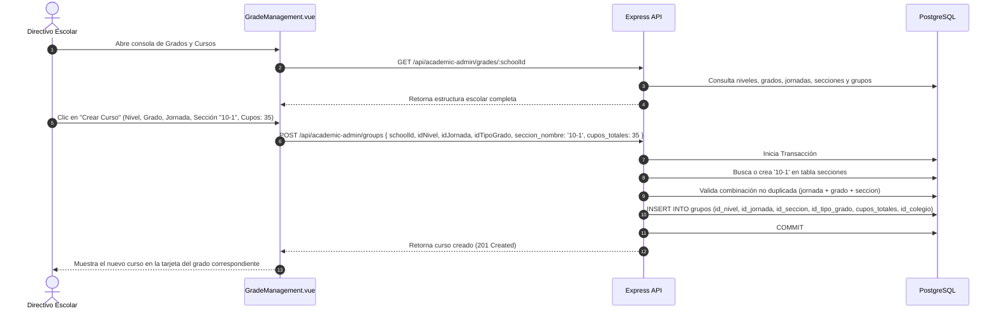
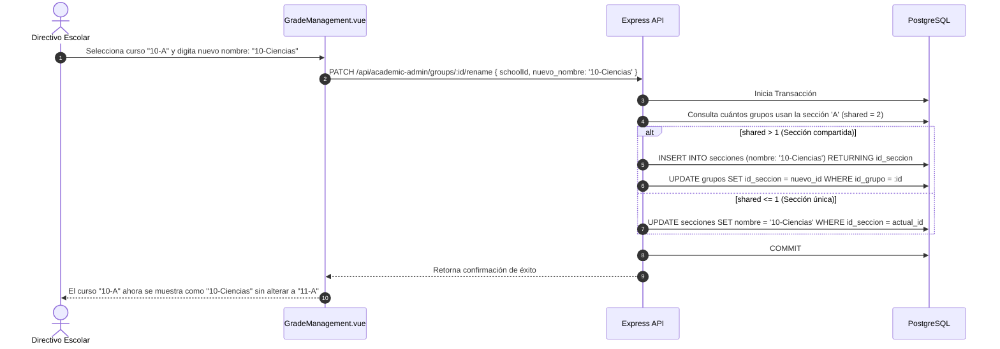
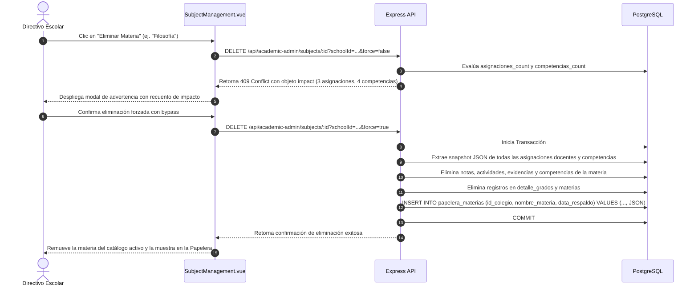
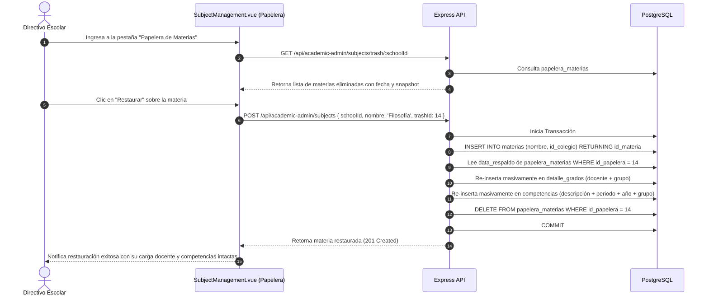
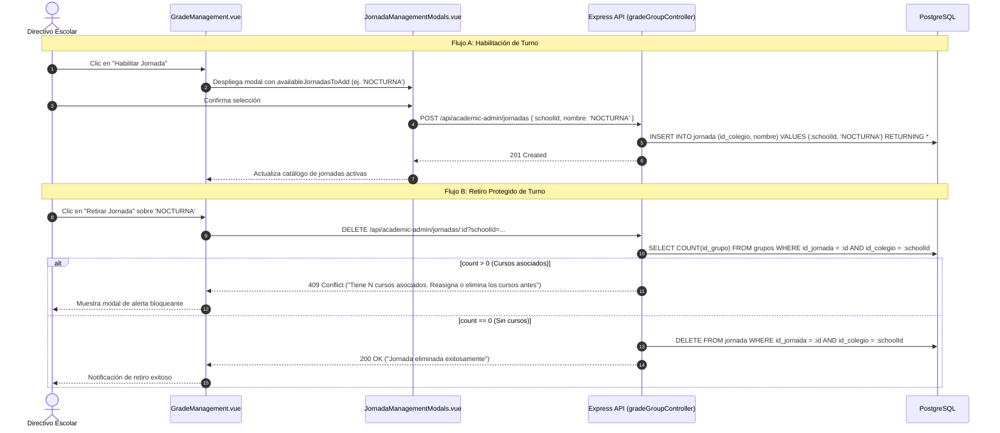
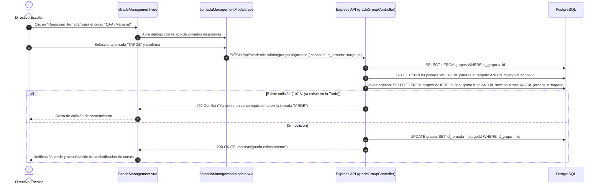

# Casos de Uso — Estructura Escolar (Grados, Cursos, Jornadas y Materias)

Este documento describe los flujos de interacción y diagramas de secuencia paso a paso del módulo de **Estructura Escolar** de AcademiaNeiva.

---

## Caso de Uso 1: Creación de Cursos Físicos y Control de Aforos

### Actores
- **Directivo Escolar** (Coordinador Académico / Rector)

### Precondiciones
- La institución cuenta con al menos un Nivel Escolar, un Tipo de Grado y una Jornada habilitada.

### Diagrama de Secuencia

---

## Caso de Uso 2: Renombramiento de Cursos con Desvinculación de Secciones Compartidas

### Actores
- **Directivo Escolar**

### Precondiciones
- Existen cursos paralelos en la institución (ej. "10-A" y "11-A" que comparten la sección "A").

### Diagrama de Secuencia

---

## Caso de Uso 3: Eliminación Forzada de Materia y Respaldo Snapshot en Papelera

### Actores
- **Directivo Escolar**

### Precondiciones
- La materia a eliminar posee asignaciones docentes (`detalle_grados`) o competencias pedagógicas asociadas.

### Diagrama de Secuencia

---

## Caso de Uso 4: Restauración de Materia con Recreación de Asignaciones y Competencias

### Actores
- **Directivo Escolar**

### Precondiciones
- La materia fue eliminada forzadamente y existe su respaldo en la tabla `papelera_materias`.

### Diagrama de Secuencia

---

## Caso de Uso 5: Habilitación y Retiro de Jornadas Institucionales

### Actores
- **Directivo Escolar** (Coordinador / Rector)

### Precondiciones
- Para la habilitación: La jornada deseada no debe estar habilitada previamente en la institución.
- Para el retiro: La jornada a eliminar no debe tener ningún curso físico (`grupos`) asociado.

### Diagrama de Secuencia

---

## Caso de Uso 6: Reasignación de Cursos entre Jornadas bajo Guarda Institucional

### Actores
- **Directivo Escolar / Administrador General**

### Precondiciones
- La política de reasignación institucional está autorizada (`IS_JORNADA_REASSIGNMENT_ENABLED = true`).
- El curso de origen existe y la jornada de destino pertenece a la misma institución.

### Diagrama de Secuencia

