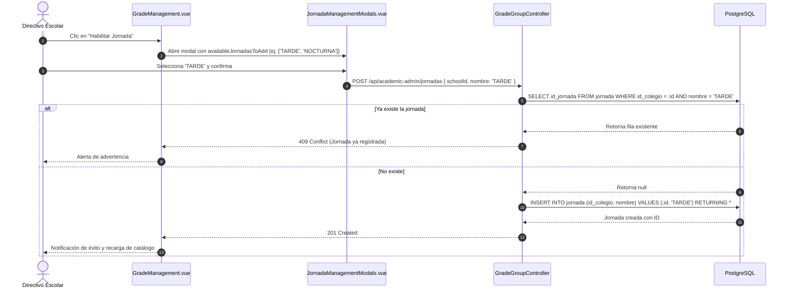
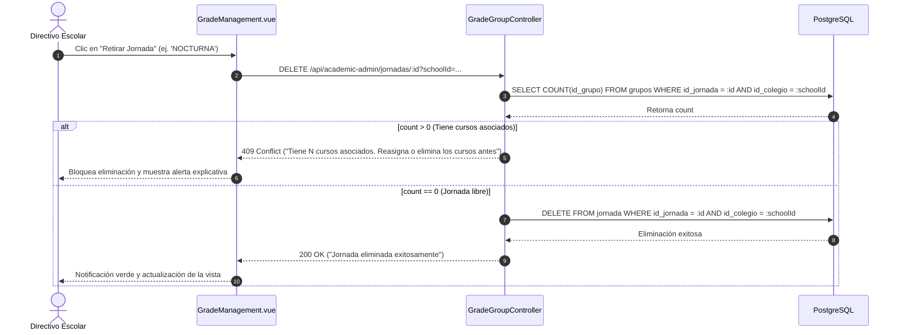
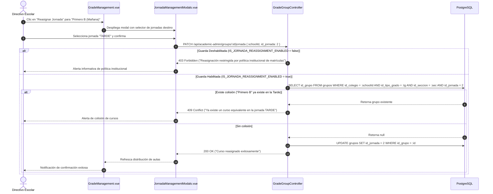

# 🌅 Sub-Módulo 04.1 — Gestión de Jornadas Institucionales

**Módulo Principal:** [04 — Estructura Escolar](../estructura_escolar.md)  
**Sistema:** Academia Neiva  
**Última actualización:** 2026-08-30  

---

## 1. Descripción Funcional y Arquitectura

El sub-módulo de **Gestión de Jornadas Institucionales** administra la dimensión temporal y operativa de los colegios en AcademiaNeiva. En el sistema educativo colombiano (normativa MEN / SIMAT), los turnos escolares estructuran la jornada de permanencia de los estudiantes y la disponibilidad física de las sedes educativas.

En la arquitectura del sistema, la **Jornada** es una entidad de primer orden que se articula directamente con los **Cursos Físicos (`grupos`)**, permitiendo que una misma institución cuente con cursos homónimos en diferentes franjas horarias (por ejemplo, *Grado Décimo - Sección A en Jornada Mañana* y *Grado Décimo - Sección A en Jornada Tarde*) sin que colisionen sus cupos, listas de asistencia ni asignaciones docentes.

```
┌────────────────────────────────────────────────────────────────────────┐
│               ARTICULACIÓN DE JORNADAS EN LA ESTRUCTURA                │
├────────────────────────────────────────────────────────────────────────┤
│                                                                        │
│                      ┌──────────────────────┐                          │
│                      │  COLEGIO / SEDE      │                          │
│                      └──────────┬───────────┘                          │
│                                 │ (Habilita)                           │
│        ┌────────────────────────┼────────────────────────┐             │
│        ▼                        ▼                        ▼             │
│ ┌──────────────┐         ┌──────────────┐         ┌──────────────┐     │
│ │   MAÑANA     │         │    TARDE     │         │    UNICA     │ ... │
│ └──────┬───────┘         └──────┬───────┘         └──────┬───────┘     │
│        │                        │                        │             │
│        │ (Contiene)             │ (Contiene)             │ (Contiene)  │
│        ▼                        ▼                        ▼             │
│ ┌──────────────┐         ┌──────────────┐         ┌──────────────┐     │
│ │ 10-A (35 cp) │         │ 10-A (30 cp) │         │ 11-1 (28 cp) │     │
│ └──────────────┘         └──────────────┘         └──────────────┘     │
│                                                                        │
└────────────────────────────────────────────────────────────────────────┘
```

---

## 2. Modelo de Datos y Relaciones SQL

### Tabla: `jornada`

| Columna | Tipo | Restricción | Descripción |
|---|---|---|---|
| `id_jornada` | `SERIAL` | `PRIMARY KEY` | Identificador único secuencial de la jornada. |
| `id_colegio` | `INTEGER` | `FOREIGN KEY -> colegio(id_colegio) ON DELETE CASCADE` | Institución educativa propietaria del turno. |
| `nombre` | `VARCHAR(20)` | `CHECK (nombre IN ('MAÑANA', 'TARDE', 'UNICA', 'NOCTURNA'))` | Nombre normalizado de la jornada. |

> [!NOTE]
> **Restricción de Unicidad:** Existe un índice único en PostgreSQL `UNIQUE (id_colegio, nombre)` que previene registrar dos jornadas con el mismo nombre para una misma institución.

### Relación con `grupos` (Cursos Físicos):
* La tabla `grupos` almacena la llave foránea `id_jornada REFERENCES jornada(id_jornada)`.
* La unicidad de un curso físico está delimitada por la quinteta: `(id_colegio, id_nivel, id_jornada, id_tipo_grado, id_seccion)`.

---

## 3. Reglas de Negocio del Sub-Módulo

### RN-JOR-001: Catálogo Oficial Cerrado de Turnos Escolares
- **Descripción:** Solo se permite habilitar las cuatro jornadas oficiales del estándar educativo:
  - `MAÑANA`: Jornada diurna matutina (habitual 6:30 AM a 12:30 PM).
  - `TARDE`: Jornada diurna vespertina (habitual 12:30 PM a 6:30 PM).
  - `UNICA`: Jornada única continua con permanencia extendida y PAE (habitual 7:00 AM a 3:00 PM).
  - `NOCTURNA`: Jornada nocturna orientada a educación de adultos y modelos flexibles (habitual 6:00 PM a 10:00 PM).
- **Control:** El backend valida el valor recibido contra el arreglo `["MAÑANA", "TARDE", "UNICA", "NOCTURNA"]`. Si no coincide, retorna `400 Bad Request`.
- **Implementación:** [gradeGroupController.ts](file:///c:/Users/alejo/Downloads/segundoProyecto/backend/src/controllers/academicAdmin/gradeGroupController.ts) (`createJornada`).

---

### RN-JOR-002: Unicidad e Inmutabilidad Nominal Institucional
- **Descripción:** Una institución educativa no puede registrar jornadas duplicadas. Si se intenta habilitar una jornada que ya existe en el colegio, el backend intercepta la verificación previa y retorna `409 Conflict` con el mensaje: *"La jornada '{nombre}' ya se encuentra registrada en esta institución."*
- **Implementación:** [gradeGroupController.ts](file:///c:/Users/alejo/Downloads/segundoProyecto/backend/src/controllers/academicAdmin/gradeGroupController.ts) (`createJornada`).

---

### RN-JOR-003: Eliminación Protegida por Aforo de Cursos Físicos
- **Descripción:** Una jornada no puede eliminarse (`deleteJornada`) si cuenta con al menos un curso físico vinculado en la tabla `grupos`.
- **Validación:** El backend ejecuta una consulta de agregación sobre `grupos`:
  ```sql
  SELECT COUNT(id_grupo) as count 
  FROM grupos 
  WHERE id_jornada = :idJornada AND id_colegio = :schoolId
  ```
  Si `count > 0`, responde con `409 Conflict`: *"No es posible eliminar la jornada '{nombre}' porque tiene N curso(s) asociado(s). Reasigna o elimina los cursos antes de retirar la jornada."*
- **Implementación:** [gradeGroupController.ts](file:///c:/Users/alejo/Downloads/segundoProyecto/backend/src/controllers/academicAdmin/gradeGroupController.ts) (`deleteJornada`).

---

### RN-JOR-004: Guarda de Política Institucional de Reasignación de Jornada
- **Descripción:** La reasignación masiva o individual de cursos entre jornadas (`reassignGroupJornada`) se encuentra controlada por una guarda de política estricta (`IS_JORNADA_REASSIGNMENT_ENABLED = false`).
- **Justificación:** La jornada es un factor contractual y legal pactado con las familias en el momento de formalizar la matrícula. Mover arbitrariamente un salón de la mañana a la tarde alteraría la jornada escolar de decenas de estudiantes matriculados.
- **Flujo cuando la guarda se encuentra activa (por autorización rectoral):**
  1. Verifica que el curso pertenezca a la institución.
  2. Valida que la nueva jornada destino exista en el colegio.
  3. Verifica que no exista colisión con un curso homólogo en la jornada destino (`id_tipo_grado`, `id_seccion`, `id_jornada_destino`), bloqueando con `409 Conflict` si ya existe un curso idéntico en esa jornada.
- **Implementación:** [gradeGroupController.ts](file:///c:/Users/alejo/Downloads/segundoProyecto/backend/src/controllers/academicAdmin/gradeGroupController.ts) (`reassignGroupJornada`).

---

## 4. Endpoints y Operaciones de la API

| Método | Endpoint | Permiso | Parámetros / Body | Respuestas | Descripción |
|---|---|---|---|---|---|
| `POST` | `/api/academic-admin/jornadas` | JWT Directivo | `{ schoolId: number, nombre: 'MAÑANA' \| 'TARDE' \| 'UNICA' \| 'NOCTURNA' }` | `201 Created`<br>`400 Bad Request`<br>`409 Conflict` | Habilita un nuevo turno operativo en la institución. |
| `DELETE` | `/api/academic-admin/jornadas/:id` | JWT Directivo | `id` (URL), Query: `schoolId` | `200 OK`<br>`404 Not Found`<br>`409 Conflict` | Retira una jornada sin cursos vinculados. |
| `PATCH` | `/api/academic-admin/groups/:id/jornada` | JWT Directivo | `id` (URL), `{ schoolId: number, id_jornada: number }` | `200 OK`<br>`403 Forbidden`<br>`409 Conflict` | Reasigna un curso a otra jornada bajo guarda rectoral. |
| `GET` | `/api/academic-admin/grades/:schoolId` | JWT Directivo | `schoolId` (URL), Query: `yearId?` | `200 OK` (incluye array `jornadas`) | Consulta las jornadas activas junto con la estructura de grados. |
| `GET` | `/api/grados/available/:idColegio` | Pública | `idColegio` (URL) | `200 OK` | Expone las jornadas disponibles para el formulario de matrícula. |

---

## 5. Impacto e Integración Transversal con Otros Módulos

La gestión de jornadas impacta transversalmente los flujos centrales de la plataforma:

```
                  ┌─────────────────────────────────────┐
                  │    GESTIÓN DE JORNADAS (04.1)       │
                  └──────────────────┬──────────────────┘
                                     │
         ┌───────────────────────────┼───────────────────────────┐
         ▼                           ▼                           ▼
┌──────────────────┐       ┌──────────────────┐       ┌──────────────────┐
│  06. MATRÍCULAS  │       │  08. ASIGNACIÓN  │       │  09/10. NOTAS Y  │
│  E INSCRIPCIONES │       │    ACADÉMICA     │       │    ASISTENCIA    │
├──────────────────┤       ├──────────────────┤       ├──────────────────┤
│ El padre elige   │       │ El docente es    │       │ Planillas de     │
│ turno (Mañana/   │       │ asignado al aula │       │ calificaciones y │
│ Tarde); el aforo │       │ física según la  │       │ registro diario  │
│ se controla por  │       │ jornada del      │       │ se filtran por   │
│ cada jornada.    │       │ curso.           │       │ jornada.         │
└──────────────────┘       └──────────────────┘       └──────────────────┘
         │                           │                           │
         └───────────────────────────┼───────────────────────────┘
                                     ▼
                  ┌─────────────────────────────────────┐
                  │  11. BOLETINES Y 14. TRASLADOS      │
                  ├─────────────────────────────────────┤
                  │ Impresión de jornada en boletín y   │
                  │ solicitud de traslado con sugerencia│
                  │ de turno (jornada_sugerida).        │
                  └─────────────────────────────────────┘
```

1. **Módulo 06 — Matrículas e Inscripciones:**
   - Durante la admisión pública (`EnrollmentView.vue`), el acudiente escoge la jornada deseada tras seleccionar el grado.
   - Los cupos en tiempo real (`cupos_disponibles`) se computan de forma segregada por cada jornada.
2. **Módulo 08 — Asignación Académica y Carga Docente (`detalle_grados`):**
   - Las cargas académicas vinculan `(id_docente, id_materia, id_grupo)`. Al estar el grupo atado a `id_jornada`, permite que un docente tenga asignación en la Mañana y otro diferente en la Tarde para el mismo grado.
3. **Módulos 09 y 10 — Calificaciones y Control de Asistencia:**
   - Las vistas de docentes (`TeacherGrades.vue`, `TeacherAttendance.vue`, `TeacherObservations.vue`) cuentan con selectores reactivos de jornada (`selectedJornada`), evitando mezclar listas de estudiantes de diferentes turnos.
4. **Módulo 11 — Generación de Boletines Oficiales:**
   - El generador masivo en PDF (`BoletinGenerator.vue`) consulta `jornada.nombre` para incluir en el encabezado oficial de la Secretaría de Educación la jornada en que cursa el alumno.
5. **Módulo 14 — Traslados Estudiantiles:**
   - Al radicar una solicitud de traslado (`trasladoService.ts`), se incluye el parámetro `jornada_sugerida`, permitiendo a los directivos ubicar al estudiante en un curso con disponibilidad en el turno deseado.

---

## 6. Experiencia Directiva en Frontend

En la interfaz directiva ([`GradeManagement.vue`](file:///c:/Users/alejo/Downloads/segundoProyecto/frontend/src/views/admin/GradeManagement.vue) y [`JornadaManagementModals.vue`](file:///c:/Users/alejo/Downloads/segundoProyecto/frontend/src/components/academico/JornadaManagementModals.vue)):

1. **Pestaña Dedicada de Jornadas:** Muestra las jornadas activas con tarjetas métricas que indican cuántos cursos físicos y cuántos estudiantes matriculados operan en cada turno.
2. **Modal de Habilitación:** Filtra dinámicamente las jornadas ya existentes en `availableJornadasToAdd`, mostrando botones tipo badge para activar las restantes con un solo clic.
3. **Modal de Retiro Seguro:** Si la jornada no tiene cursos, permite eliminarla con confirmación; si tiene cursos asociados, bloquea la acción informando el número exacto de cursos que impiden su borrado.

---

## 7. Reasignación de Cursos a Otras Jornadas (Mecanismo y Guarda Institucional)

La reasignación de jornada (`reassignGroupJornada`) es una operación estructural de alto impacto que traslada un curso físico (`grupos`) completo de un turno operativo a otro (por ejemplo, de la jornada `MAÑANA` a la jornada `TARDE`).

### 7.1. Casos de Uso y Escenarios Operativos
1. **Planeación Escolar y Apertura de Jornada Única:** Cuando la institución educativa migra grupos de jornada regular a Jornada Única (`UNICA`) al inicio del año escolar.
2. **Reorganización Física y Capacidad Instalada:** Cuando por disponibilidad de infraestructura, aulas especializadas o laboratorios, la dirección decide mover un grado de franja horaria.
3. **Corrección Administrativa Temprana:** Rectificación de un salón creado por error en un turno incorrecto antes de abrir matrículas al público.

---

### 7.2. Mecanismo de Seguridad: La Guarda Institucional (`IS_JORNADA_REASSIGNMENT_ENABLED`)
En el archivo fuente [gradeGroupController.ts](file:///c:/Users/alejo/Downloads/segundoProyecto/backend/src/controllers/academicAdmin/gradeGroupController.ts), el endpoint `PATCH /api/academic-admin/groups/:id/jornada` está protegido de forma predeterminada por la guarda:

```typescript
const IS_JORNADA_REASSIGNMENT_ENABLED = false;
```

> [!WARNING]
> **Fundamento Jurídico y Contractual:**  
> La jornada escolar es un elemento contractual acordado con las familias al momento de formalizar la matrícula. Mover arbitrariamente un curso con alumnos ya inscritos alteraría los compromisos laborales y familiares de los acudientes.  
> Por tanto, este endpoint responde `403 Forbidden` por defecto, requiriendo autorización rectoral explícita o su uso exclusivo en etapas preliminares de configuración del año escolar.

---

### 7.3. Flujo y Reglas de Validación en Backend

Cuando la guarda está habilitada, el backend ejecuta un pipeline estricto de validaciones antes de modificar la base de datos:

```
                  ┌──────────────────────────────────────────────┐
                  │ PATCH /api/academic-admin/groups/:id/jornada │
                  └──────────────────────┬───────────────────────┘
                                         │
                                         ▼
                     ¿IS_JORNADA_REASSIGNMENT_ENABLED?
                           │ (No)                 │ (Sí)
                           ▼                      ▼
                    403 Forbidden        ¿Existe el id_grupo en
                                           el colegio del JWT?
                                                  │ (Sí)
                                                  ▼
                                      ¿id_jornada_destino es
                                       igual a jornada actual?
                                           │ (No)         │ (Sí)
                                           │              ▼
                                           │        400 Bad Request
                                           ▼
                                      ¿Existe la jornada destino
                                        en la misma institución?
                                           │ (Sí)         │ (No)
                                           │              ▼
                                           │        404 Not Found
                                           ▼
                                    ¿Existe colisión con curso
                                     homólogo en jornada destino?
                                      (mismo grado + seccion)
                                           │ (No)         │ (Sí)
                                           │              ▼
                                           │        409 Conflict
                                           ▼
                                   UPDATE grupos SET
                                   id_jornada = destino
                                           │
                                           ▼
                                        200 OK
```

1. **Verificación de Pertenencia y Permisos:** El usuario debe poseer rol directivo en el colegio del grupo o contar con rol `admin_general` en modo supervisión.
2. **Validación de No Redundancia:** Si el `id_jornada` enviado es idéntico a la jornada actual del curso, se rechaza con `400 Bad Request` (*"El curso ya pertenece a la jornada seleccionada"*).
3. **Existencia de la Jornada Destino:** Se comprueba que la jornada receptora pertenezca al mismo colegio en la tabla `jornada` (`404 Not Found`).
4. **Prevención de Colisión de Nomenclatura Estructural (`409 Conflict`):**  
   El sistema consulta si ya existe otro curso en el colegio con la misma combinación:
   ```sql
   SELECT id_grupo FROM grupos 
   WHERE id_colegio = :schoolId 
     AND id_tipo_grado = :currentGrado 
     AND id_seccion = :currentSeccion 
     AND id_jornada = :targetIdJornada
   ```
   *Ejemplo de Bloqueo:* Si en la jornada `TARDE` ya existe el salón *"10-A"*, el sistema impedirá reasignar el salón *"10-A"* de la `MAÑANA` a la `TARDE`, para evitar tener dos salones idénticos en el mismo turno.
5. **Persistencia Transaccional:** Se ejecuta `UPDATE grupos SET id_jornada = :targetIdJornada WHERE id_grupo = :id AND id_colegio = :schoolId`.

---

### 7.4. Efecto Cascada y Preservación de Datos

La reasignación de jornada modifica el atributo `id_jornada` en la fila de `grupos`. Gracias a la arquitectura relacional centrada en `id_grupo`, todos los registros dependientes se conservan íntegros:

| Entidad Relacionada | Impacto tras la Reasignación |
|---|---|
| **Matrículas (`matricula`)** | Los estudiantes permanecen matriculados en su `id_grupo`, pasando de forma automática a figurar en el nuevo turno. |
| **Cargas Académicas (`detalle_grados`)** | Los docentes continúan asignados a sus materias en este curso, pero su carga se reflejará bajo el horario del nuevo turno. |
| **Calificaciones y Evidencias (`calificaciones`, `actividades`)** | Las notas históricas y ponderaciones permanecen 100% intactas. |
| **Control de Asistencia (`asistencias`)** | El historial diario se mantiene; el docente ahora registrará la asistencia en el filtro del nuevo turno. |
| **Boletines Oficiales** | Al generar los boletines del periodo, el encabezado imprimirá el nuevo nombre de jornada (`jornada.nombre`). |

---

## 8. Diagramas de Secuencia Mermaid

### 8.1. Habilitación de una Nueva Jornada Institucional



---

### 8.2. Eliminación Protegida de Jornada con Verificación de Dependencias



---

### 8.3. Reasignación Controlada de Curso a Otra Jornada


