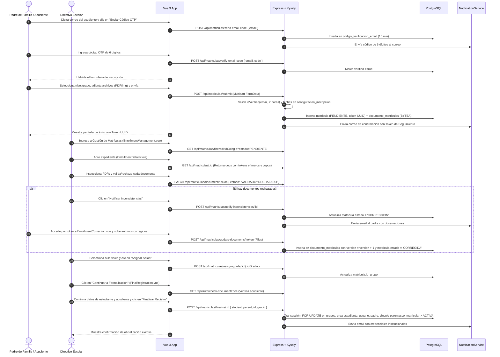
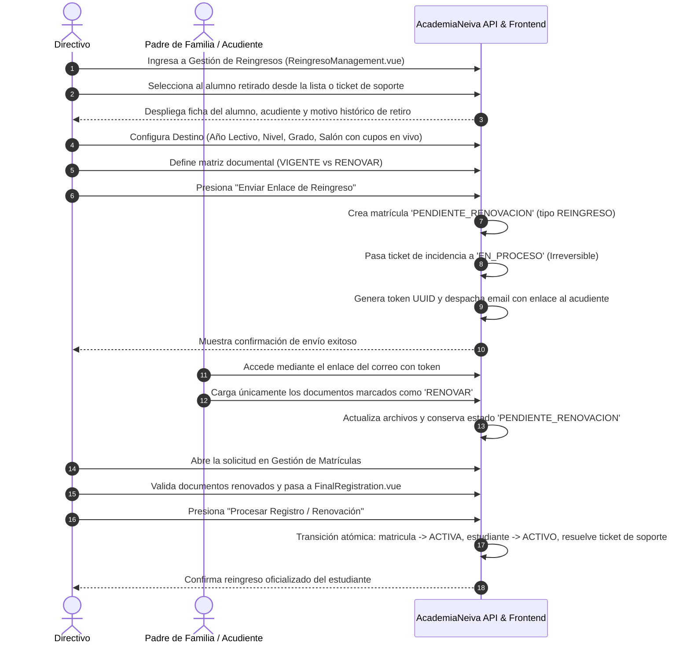
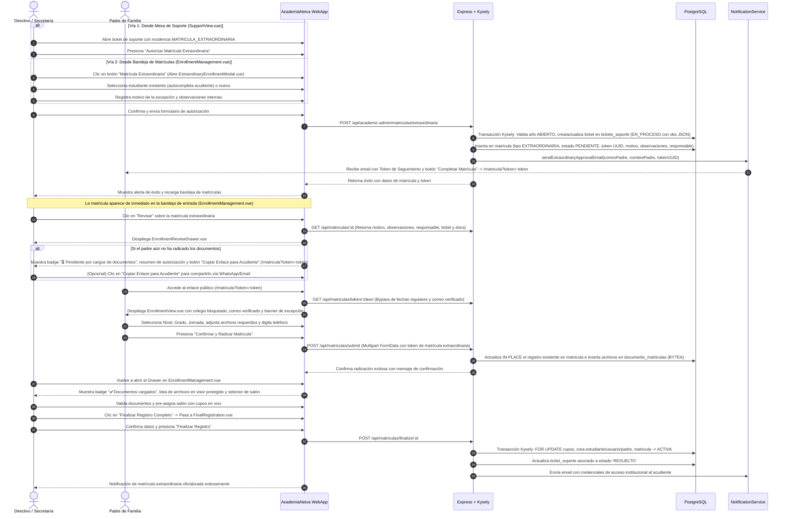

# Casos de Uso — Matrículas e Inscripciones

Este documento describe los flujos de interacción y diagramas de secuencia paso a paso del módulo de **Matrículas e Inscripciones** de AcademiaNeiva.

---

## Caso de Uso 1: Proceso de Matrícula Regular (Flujo Ordinario con OTP)

### Actores
- **Padre de Familia / Acudiente** (Público)
- **Directivo Escolar** (Coordinador de Admisiones / Rector)

### Precondiciones
- El colegio cuenta con un Año Lectivo activo en estado `ABIERTO`.
- La fecha actual se encuentra dentro del rango `[fecha_inicio, fecha_cierre]` configurado en `configuracion_inscripcion` con `habilitada = true`.
- Existen grupos y cupos configurados.

### Diagrama de Secuencia

### Paso a Paso Detallado
1. **Verificación Previa OTP:** El acudiente ingresa a `EnrollmentView.vue`, digita su correo y solicita el código OTP de 6 dígitos. Una vez validado el código, se desbloquean los campos de selección escolar.
2. **Envío de Solicitud:** El acudiente selecciona el colegio, nivel, tipo de grado y grupo de preferencia, adjunta los archivos solicitados (máx 5MB) y envía la solicitud. El backend valida la verificación previa del correo (`isVerified`), almacena los archivos binarios en `documento_matriculas` (`BYTEA`) e inserta la matrícula en estado `PENDIENTE`.
3. **Revisión Directiva:** El directivo ingresa a `EnrollmentManagement.vue` y abre el expediente en `EnrollmentDetails.vue`. El visor carga los archivos protegidos mediante tokens efímeros firmados (`verifyDocumentToken`). El directivo valida o rechaza individualmente cada documento.
4. **Subsanación por el Acudiente:** Si hay documentos rechazados, el directivo presiona "Notificar Inconsistencias", pasando la matrícula a `CORRECCION`. El acudiente ingresa por su token a `EnrollmentCorrection.vue`, sube los archivos corregidos y el sistema los inserta con `version = max_version + 1`, pasando la matrícula al estado `CORREGIDA`.
5. **Asignación de Aula:** El directivo selecciona el salón definitivo con base en los cupos en tiempo real y presiona "Asignar Salón".
6. **Formalización Final:** En `FinalRegistration.vue`, el directivo valida la información personal del estudiante y acudiente (con autocompletado y detección de rol docente si aplica) y presiona "Finalizar Registro". El backend ejecuta la transacción atómica con bloqueo `FOR UPDATE`, crea al estudiante con código institucional, crea la cuenta del padre en `usuario_colegio`, activa la matrícula (`ACTIVA`) y despacha las credenciales por correo electrónico.

---

## Caso de Uso 2: Proceso de Reingreso de Estudiante Retirado

### Actores
- **Directivo Escolar** (Coordinador / Rector)
- **Padre de Familia / Acudiente**

### Precondiciones
- El estudiante se encuentra en estado `RETIRADO` en el sistema (alumnos `EXPULSADO` o `GRADUADO` están bloqueados).
- Existe un Año Lectivo activo habilitado con grupos y cupos creados.

### Diagrama de Secuencia

---

## Caso de Uso 3: Proceso de Matrícula Extraordinaria (Desde Autorización hasta Bandeja Directiva y Formalización)

### Actores
- **Directivo Escolar / Secretaría**
- **Padre de Familia / Acudiente**

### Precondiciones
- El colegio cuenta con un Año Lectivo activo en estado `ABIERTO`.
- El período ordinario de inscripción regular se encuentra cerrado o se requiere una excepción institucional formal.
- La solicitud puede ser iniciada a petición de un ticket en la Mesa de Ayuda (`SupportView.vue`) o directamente por secretaría en la bandeja de matrículas (`EnrollmentManagement.vue` mediante `ExtraordinaryEnrollmentModal.vue`).

### Diagrama de Secuencia

### Paso a Paso Detallado:
1. **Autorización Institucional:** El directivo autoriza el cupo extraordinario desde `SupportView.vue` (respondiendo a un ticket de soporte) o desde `EnrollmentManagement.vue` (mediante el modal `ExtraordinaryEnrollmentModal.vue`). Registra el motivo y las observaciones.
2. **Generación del Expediente y Token:** El backend ejecuta una transacción Kysely que pre-crea la fila en `matricula` en estado `PENDIENTE` (`tipo = 'EXTRAORDINARIA'`), emite el `token_seguimiento` UUID, vincula el ticket de soporte y despacha el correo de aprobación con el enlace `${FRONTEND_URL}/matricula?token=${token}`.
3. **Visibilidad Inmediata en Bandeja Directiva:** La matrícula aparece de inmediato en la pestaña *"Nuevas (Por Revisar)"* de `EnrollmentManagement.vue` con el badge `EXTRAORDINARIA`.
4. **Inspección en Drawer Enriquecido (`EnrollmentReviewDrawer.vue`):**
   - El directivo abre el expediente y visualiza la tarjeta con el motivo de autorización, observaciones, responsable y ticket asociado.
   - Si el acudiente aún no ha cargado los soportes, el sistema expone el indicador de espera `⏳ Pendiente por cargue de documentos` y permite copiar el enlace público de radicación (`/matricula?token=:token`) con un solo clic.
5. **Radicación Pública en Formulario Completo (`EnrollmentView.vue`):** El acudiente ingresa por el enlace con token. El formulario bloquea el colegio autorizado, marca el correo como verificado (omitiendo OTP de 6 dígitos) y aplica bypass al calendario cerrado. El acudiente selecciona el grado y jornada, sube los documentos requeridos (Paso 2) e ingresa su teléfono de contacto (Paso 3).
6. **Actualización In-Place:** El backend actualiza la fila de `matricula` existente (sin crear duplicados) e inserta los archivos en `documento_matriculas`.
7. **Validación y Formalización:** El directivo valida los documentos cargados, asigna el salón con control de aforo en tiempo real y culmina la formalización en `FinalRegistration.vue`. El sistema activa la matrícula (`ACTIVA`) y resuelve automáticamente el ticket de soporte (`RESUELTO`).

---

## Caso de Uso 4: Formalización con Detección de Múltiples Hijos / Doble Rol Docente

### Actores
- **Directivo Escolar**

### Precondiciones
- El acudiente que radicó la solicitud ya posee una cuenta en el sistema (bien sea porque tiene otros hijos matriculados previamente, o porque labora como docente/directivo en el colegio).

### Flujo Operativo Paso a Paso
1. **Detección de Candidatos a Renovación en Paso 1 (Estudiante):**
   - Al cargar `FinalRegistration.vue`, el backend retorna el objeto `renovacion.candidates` con todos los hijos registrados bajo el correo del acudiente.
   - El directivo visualiza un panel interactivo con la lista de hijos elegibles y la opción **"Registrar Nuevo Hermano"**.
   - **Bifurcación Obligatoria:**
     - Si el directivo selecciona a uno de los hijos (`selectedCandidate`), el sistema precarga sus datos y reutiliza su `id_estudiante`, preparándolo para renovación.
     - Si el directivo marca "Registrar Nuevo Hermano" (`isNewStudent`), el sistema limpia los campos del alumno para crear un nuevo estudiante independiente.
2. **Detección y Doble Rol en Paso 2 (Acudiente):**
   - Al ingresar o validar el documento del acudiente, `checkDocument` detecta que el usuario ya existe.
   - Si el acudiente labora como **Docente o Directivo** (`es_docente = true`):
     - El sistema despliega la alerta visual informativa: *"Atención: Este documento pertenece a personal institucional (Docente: Nombre Apellido). Se le vinculará también el rol de acudiente."*
     - Bloquea los campos de nombres para evitar alterar su identidad oficial.
3. **Ejecución Transaccional Segura:**
   - Al presionar "Finalizar Registro", `finalizeEnrollment` no crea un nuevo usuario para el padre: vincula el rol `padre` en `usuario_rol`, crea la relación institucional en `usuario_colegio` (`estado = 'ACTIVO'`), y conserva intactas sus asignaciones y permisos docentes.
   - Inserta la relación en `detalle_padrefamilia` vinculando al nuevo hijo con el padre existente.
