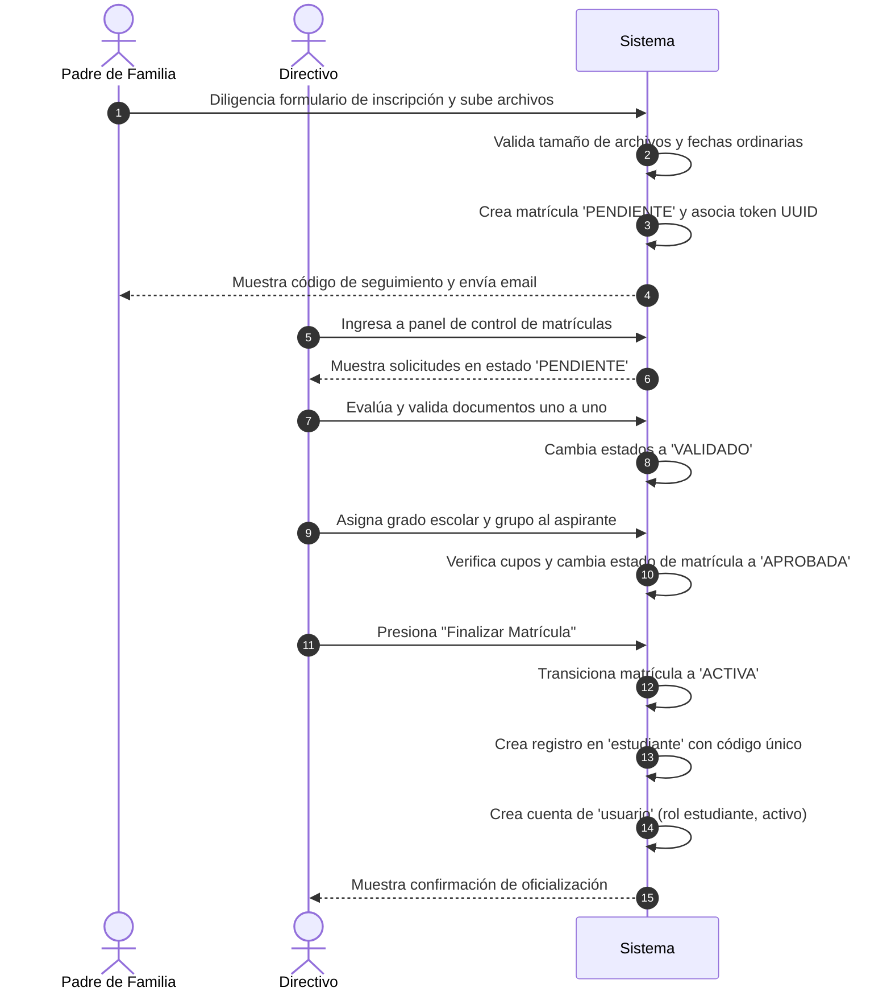

# Casos de Uso — Matrículas e Inscripciones

Este documento describe los flujos principales de interacción del módulo de Matrículas e Inscripciones de AcademiaNeiva.

---

## Caso de Uso 1: Proceso de Matrícula Regular (Flujo Ordinario)

### Actores
- **Padre de Familia / Aspirante** (Público)
- **Directivo Escolar** (Coordinador de Admisiones / Rector)

### Precondiciones
- El colegio se encuentra en el rango de fechas de inscripciones habilitado.
- El grupo de destino cuenta con cupos disponibles.

### Flujo Principal (Paso a Paso)

1. **Inscripción Pública:** El padre de familia accede al formulario de inscripción pública del colegio, ingresa los datos personales del aspirante y los suyos, adjunta los archivos PDF/imágenes obligatorios, y hace clic en "Enviar".
2. **Inicialización de Solicitud:** El sistema verifica que las inscripciones estén abiertas, valida que los archivos no superen el límite de 5MB, almacena los archivos en el servidor local, inserta el registro en la tabla `matricula` en estado `'PENDIENTE'` con un token UUID de seguimiento, y muestra en pantalla el código UUID.
3. **Revisión del Directivo:** El directivo escolar ingresa a su panel de gestión de matrículas, filtra las solicitudes por estado `'PENDIENTE'` y selecciona la ficha del aspirante.
4. **Validación de Documentación:** El directivo abre en línea cada documento (ej. Registro Civil). Tras comprobar que es legible y válido, presiona "Validar". El sistema cambia el estado del archivo a `'VALIDADO'`.
5. **Asignación de Salón:** Al estar todos los documentos validados, el directivo selecciona el Grado y el Grupo de clase (ej. Primero A) en la consola lateral y presiona "Asignar Grupo". El sistema comprueba que queden cupos en "Primero A", asocia el grupo a la matrícula, y promueve el estado de la solicitud a `'APROBADA'`.
6. **Oficialización:** El directivo presiona el botón "Finalizar Matrícula" en el panel. El sistema cambia el estado a `'ACTIVA'`, inserta automáticamente la ficha de `estudiante` activa con su código institucional único, y le crea una cuenta de ingreso en `usuario` con rol `estudiante` y estado `ACTIVO`.

### Flujos Alternativos / Excepciones
- **Excepción 4a (Documento con Inconsistencia):** Si un documento es borroso o incorrecto, el directivo presiona "Rechazar" y digita el motivo. El sistema cambia el estado del documento a `'RECHAZADO'` y el de la matrícula completa a `'CORRECCION'`. El padre de familia, al consultar su token, visualiza los campos rechazados, sube los archivos corregidos y presiona "Enviar Corrección", devolviendo la matrícula a estado `'PENDIENTE'` para una nueva validación directiva.
- **Excepción 5a (Grupo Sin Cupos):** Si el grupo de clase seleccionado ya completó su límite máximo de cupos en base a los alumnos activos matriculados, la acción de asignación del directivo se bloquea y el sistema muestra un mensaje de error indicando que debe liberar cupos o seleccionar un grupo paralelo alternativo.

### Postcondiciones
- El estudiante es dado de alta de manera oficial en la institución y cuenta con credenciales activas para el ingreso a su portal personal.
- La matrícula queda registrada como `'ACTIVA'` y vinculada permanentemente para el año lectivo en curso.
