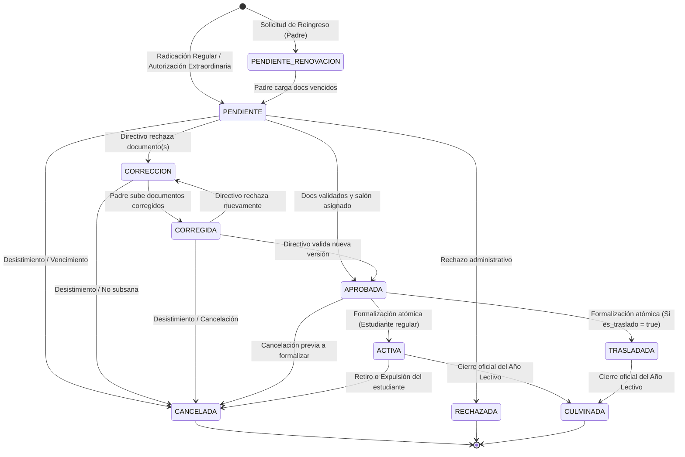

# 🏷️ Tipos, Estados y Máquina de Transiciones de Matrículas

**Sistema:** Academia Neiva  
**Módulo:** 06 - Matrículas e Inscripciones  
**Documento:** Guía de Tipos, Estados y Ciclo de Vida de Matrícula  
**Última actualización:** 2026-09-02  

---

## 1. Tipos de Matrícula (`tipo_matricula`)

El campo `tipo` en la tabla `matricula` define la modalidad y vía administrativa mediante la cual el aspirante o estudiante ingresa al proceso de matrícula en la institución:

| Tipo | Definición y Caso de Uso | Vía de Origen / Disparador | Requiere Bypass de Fechas |
|---|---|---|:---:|
| **`REGULAR`** | Inscripción ordinaria de aspirantes nuevos o procedentes de otras instituciones durante las fechas oficiales de admisión del colegio. | Formulario público de admisiones (`POST /api/matriculas/submit`) tras verificar la titularidad del correo mediante código OTP de 6 dígitos. | ❌ No (Exige calendario abierto) |
| **`EXTRAORDINARIA`** | Matrícula autorizada fuera del calendario ordinario por secretaría o rectoría, respondiendo a un caso fortuito, cupo especial o ticket de soporte. | Autorización directiva en `ExtraordinaryEnrollmentModal.vue` o Mesa de Soporte (`POST /api/academic-admin/matriculas/extraordinaria`). Emite un token UUID con precarga de correo y bypass de calendario. | ✅ Sí (Bypass automático) |
| **`REINGRESO`** | Reincorporación de un estudiante que perteneció formalmente a la institución en años anteriores pero se encuentra actualmente en estado `RETIRADO`. | Consola de Reingresos `ReingresoManagement.vue` (`POST /api/reingreso/send-parent-link`). Aplica matriz documental inteligente (conserva archivos vigentes y solicita solo los vencidos). | ✅ Sí |
| **`RENOVACION`** | Continuidad anual del estudiante activo hacia el siguiente año lectivo, o regularización de hermanos en familias con historial en la institución. | Módulo de Renovación Anual o selección de candidato familiar (`renovacion.candidates`) en `FinalRegistration.vue`. | ❌ No |
| **`TRASLADO`** | Matrícula originada por transferencia intercolegiada o cambio de sede gestionada mediante el módulo de traslados institucionales. | Activación del indicador `es_traslado = true` (`PATCH /api/matriculas/transfer-status/:id`) o formalización desde `AdminTrasladosView.vue`. | Según caso |

---

## 2. Estados de la Matrícula (`estado_matricula`)

El campo `estado` en la tabla `matricula` refleja la etapa exacta dentro del flujo de evaluación, subsanación y formalización:

### Glosario Detallado de Estados

| Estado | Significado Funcional | ¿Permite Asignar Salón? | ¿Visible para el Padre? |
|---|---|:---:|:---:|
| **`PENDIENTE`** | Solicitud radicada por el acudiente o pre-creada por el directivo. Se encuentra en cola de espera para la revisión documental o pendiente de que el padre cargue los soportes (en matrícula extraordinaria). | Sí | Sí (`⏳ En Revisión`) |
| **`PENDIENTE_RENOVACION`** | Expediente de reingreso generado por directivos. Se despachó el enlace al acudiente para que revise y cargue únicamente los documentos que perdieron vigencia. | Sí (pre-asignado) | Sí (`🔄 Pendiente Renovación`) |
| **`CORRECCION`** | El directivo rechazó al menos un documento (`RECHAZADO`) y ejecutó la notificación de inconsistencias. El trámite queda pausado esperando que el acudiente suba los reemplazos. | Bloqueado | Sí (`⚠️ Requiere Corrección`) |
| **`CORREGIDA`** | El acudiente subió nuevas versiones de los documentos rechazados mediante su token público (`version = version + 1`). El salón asignado se preserva intacto y alerta al directivo para re-evaluación. | Sí | Sí (`📩 Subsanada`) |
| **`APROBADA`** | Todos los documentos fueron validados por secretaría y el salón fue seleccionado. La matrícula está lista para el paso de formalización de cuentas y parentescos. | Sí (Confirmado) | Sí (`✅ Aprobada`) |
| **`ACTIVA`** | Matrícula formalizada en `FinalRegistration.vue`. Se creó/reactivó el estudiante en `estudiante` (`ACTIVO`), su usuario de acceso, el padre de familia, el parentesco y se consolidó el cupo en el aula. | Definitivo | Sí (`🎉 Matriculado`) |
| **`TRASLADADA`** | Estado activo específico que denota que la matrícula fue formalizada y consolidada como producto de un traslado interinstitucional. | Definitivo | Sí (`🔄 Trasladado`) |
| **`CANCELADA`** | Matrícula dada de baja. Si estaba en trámite, libera cupos y no altera el histórico del aspirante. Si estaba `ACTIVA`, exige clasificar al alumno como `RETIRADO` (reingresable) o `EXPULSADO` (inhabilitación permanente). | Liberado | Sí (`❌ Cancelada`) |
| **`RECHAZADA`** | Solicitud descartada administrativamente por incumplimiento no subsanable de requisitos de edad, procedencia o fraude documental. | Liberado | Sí (`🚫 Rechazada`) |
| **`CULMINADA`** | Estado de archivo histórico para matrículas correspondientes a años lectivos cerrados y clausurados. | Histórico | Histórico |

---

## 3. Matriz de Transiciones de Estado (Cómo se cambia de uno a otro)

A continuación se detallan las transiciones posibles, el disparador (acción de usuario/sistema), el endpoint API que lo ejecuta y los efectos en base de datos:

| Estado Origen | Estado Destino | Disparador / Acción | Endpoint / Controlador | Efectos Colaterales en el Sistema |
|---|---|---|---|---|
| *(Nuevo)* | **`PENDIENTE`** | Radicación pública ordinaria con OTP | `POST /api/matriculas/submit` ([matriculaController.ts](file:///c:/Users/alejo/Downloads/segundoProyecto/backend/src/controllers/matriculaController.ts)) | Inserta fila en `matricula`, guarda archivos binarios en `documento_matriculas` (`BYTEA`), genera `token_seguimiento` UUID y envía correo de confirmación. |
| *(Nuevo)* | **`PENDIENTE`** | Autorización directiva de matrícula extraordinaria | `POST /api/academic-admin/matriculas/extraordinaria` ([enrollmentAdminController.ts](file:///c:/Users/alejo/Downloads/segundoProyecto/backend/src/controllers/academicAdmin/enrollmentAdminController.ts)) | Crea ticket en `tickets_soporte` (`EN_PROCESO`), pre-crea fila en `matricula` (`tipo = 'EXTRAORDINARIA'`) y envía email con enlace de bypass al padre. |
| *(Nuevo)* | **`PENDIENTE_RENOVACION`** | Envío de enlace de reingreso a estudiante retirado | `POST /api/reingreso/send-parent-link` ([reingresoController.ts](file:///c:/Users/alejo/Downloads/segundoProyecto/backend/src/controllers/reingresoController.ts)) | Crea matrícula (`tipo = 'REINGRESO'`), clona documentos vigentes (`estado_renovacion = 'VIGENTE'`), marca ticket en `EN_PROCESO` y notifica por email. |
| **`PENDIENTE_RENOVACION`** | **`PENDIENTE`** | El acudiente radica los documentos vencidos solicitados | `POST /api/matriculas/submit` ([matriculaController.ts](file:///c:/Users/alejo/Downloads/segundoProyecto/backend/src/controllers/matriculaController.ts)) | Actualiza in-place la matrícula, guarda los nuevos documentos y la deja disponible para revisión directiva. |
| **`PENDIENTE`** o **`CORREGIDA`** | **`CORRECCION`** | El directivo marca documentos como `RECHAZADO` y notifica | `POST /api/matriculas/notify-inconsistencies/:id` ([matriculaController.ts](file:///c:/Users/alejo/Downloads/segundoProyecto/backend/src/controllers/matriculaController.ts)) | Cambia `matricula.estado = 'CORRECCION'`, bloquea el avance a formalización y envía correo al padre con las observaciones de cada archivo. |
| **`CORRECCION`** | **`CORREGIDA`** | El acudiente sube documentos subsanados vía Token UUID | `POST /api/matriculas/update-documents/:token` ([matriculaService.ts](file:///c:/Users/alejo/Downloads/segundoProyecto/backend/src/services/matriculaService.ts)) | Inserta archivos con `version = max + 1`, cambia estado a `CORREGIDA`, preserva intacto el `id_grupo` asignado y notifica en la bandeja directiva. |
| **`PENDIENTE`** o **`CORREGIDA`** | **`APROBADA`** | Validación completa de documentos y asignación de salón | `PATCH /api/matriculas/document/:idDoc` `POST /api/matriculas/assign-grade/:id` | Todos los documentos pasan a `VALIDADO`, se guarda el `id_grupo` en la matrícula y se habilita el botón de formalización final. |
| **`APROBADA`** | **`ACTIVA`** | Formalización atómica en 6 fases (`FinalRegistration.vue`) | `POST /api/matriculas/finalize/:id` ([matriculaService.ts](file:///c:/Users/alejo/Downloads/segundoProyecto/backend/src/services/matriculaService.ts)) | Bloqueo `FOR UPDATE` en cupos del aula, creación/reactivación en `estudiante` (`ACTIVO`), creación de credenciales en `usuario`, vinculación en `padre_familia` y `detalle_padrefamilia`, resuelve ticket asociado (`RESUELTO`) y envía credenciales al acudiente. |
| **`APROBADA`** | **`TRASLADADA`** | Formalización cuando la matrícula tiene `es_traslado = true` | `POST /api/matriculas/finalize/:id` ([matriculaService.ts](file:///c:/Users/alejo/Downloads/segundoProyecto/backend/src/services/matriculaService.ts)) | Mismos efectos que `ACTIVA`, dejando el estado explícito `TRASLADADA` para trazabilidad de traslados intercolegiados. |
| Cualquier estado en trámite | **`CANCELADA`** | Cancelación por desistimiento, fraude o vencimiento | `POST /api/matriculas/cancel/:id` ([matriculaService.ts](file:///c:/Users/alejo/Downloads/segundoProyecto/backend/src/services/matriculaService.ts)) | Pasa matrícula a `CANCELADA`, libera los cupos pre-asignados y envía notificación al padre. Si el alumno no era formal, **no se marca como retirado ni expulsado**. |
| **`ACTIVA`** o **`TRASLADADA`** | **`CANCELADA`** | Retiro voluntario o expulsión disciplinaria de alumno activo | `POST /api/matriculas/cancel/:id` ([matriculaService.ts](file:///c:/Users/alejo/Downloads/segundoProyecto/backend/src/services/matriculaService.ts)) | Cambia matrícula a `CANCELADA`, libera el cupo en el aula, actualiza `estudiante.estado` a `RETIRADO` o `EXPULSADO` e inactiva su usuario de acceso al portal. |
| **`ACTIVA`** o **`TRASLADADA`** | **`CULMINADA`** | Clausura y cierre formal del año lectivo por directivos | Proceso de Cierre de Vigencia Académica | Archiva el registro para consultas históricas y generación de certificados de años anteriores. |

---

## 4. Archivos Clave de Implementación

- **Controlador Administrativo:** [enrollmentAdminController.ts](file:///c:/Users/alejo/Downloads/segundoProyecto/backend/src/controllers/academicAdmin/enrollmentAdminController.ts)
- **Controlador Regular:** [matriculaController.ts](file:///c:/Users/alejo/Downloads/segundoProyecto/backend/src/controllers/matriculaController.ts)
- **Servicio Transaccional Kysely:** [matriculaService.ts](file:///c:/Users/alejo/Downloads/segundoProyecto/backend/src/services/matriculaService.ts)
- **Controlador de Reingresos:** [reingresoController.ts](file:///c:/Users/alejo/Downloads/segundoProyecto/backend/src/controllers/reingresoController.ts)
- **Bandeja Directiva Frontend:** [EnrollmentManagement.vue](file:///c:/Users/alejo/Downloads/segundoProyecto/frontend/src/views/admin/EnrollmentManagement.vue)
- **Drawer de Revisión y Expediente:** [EnrollmentReviewDrawer.vue](file:///c:/Users/alejo/Downloads/segundoProyecto/frontend/src/components/matriculas/EnrollmentReviewDrawer.vue)
- **Formalización Final:** [FinalRegistration.vue](file:///c:/Users/alejo/Downloads/segundoProyecto/frontend/src/views/admin/FinalRegistration.vue)
