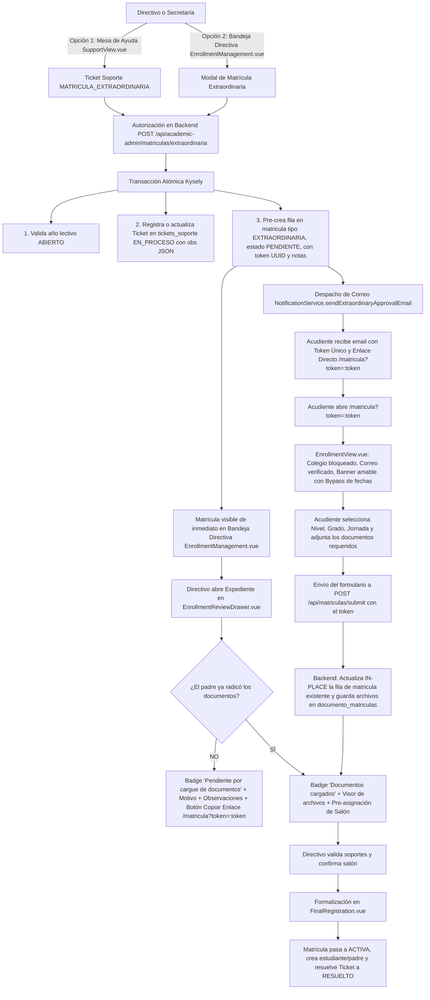

# 📋 Módulo de Matrículas e Inscripciones

**Sistema:** Academia Neiva  
**Módulo:** Gestión de Inscripciones, Matrículas de Estudiantes, Reingresos y Renovaciones  
**Última actualización:** 2026-08-29  

---

## 1. Descripción Funcional

El módulo de **Matrículas e Inscripciones** coordina el ciclo de vida completo de incorporación académica de los estudiantes a las instituciones del ecosistema AcademiaNeiva. Administra desde la postulación pública inicial con verificación de identidad por correo electrónico hasta la formalización directiva en base de datos mediante transacciones atómicas.

Abarca cuatro modalidades operativas:
1. **Inscripción Regular / Ordinaria:** Trámite público para aspirantes dentro del calendario institucional con verificación previa obligatoria mediante código OTP de 6 dígitos.
2. **Matrícula Extraordinaria (Excepción Institucional):** Trámite extemporáneo autorizado por directivos de secretaría, originado tanto desde la Mesa de Ayuda (`tickets_soporte` con incidencia `MATRICULA_EXTRAORDINARIA`) como directamente desde la bandeja directiva (`EnrollmentManagement.vue` mediante `ExtraordinaryEnrollmentModal.vue`). Emite un token único UUID que permite radicar fuera de las fechas regulares de cierre, registrando el motivo de la excepción, notas internas y trazabilidad completa de auditoría.
3. **Reingreso de Estudiantes Retirados:** Reactivación de expedientes de alumnos previamente en estado `RETIRADO` mediante matriz documental inteligente (conservando archivos vigentes y solicitando únicamente los vencidos), configuración de aula con validación de cupos y transición irreversible del ticket de soporte a `EN_PROCESO`.
4. **Renovación Anual para Familias Existentes:** Detección automática de hermanos o hijos asociados al buzón del acudiente (`renovacion.candidates`), con selector obligatorio en la consola directiva entre renovar a un hijo existente o registrar a un nuevo hijo sin duplicar la cuenta del padre.

Asimismo, implementa almacenamiento binario seguro (`BYTEA`) en PostgreSQL para los documentos adjuntos con control de versiones (`version = version + 1`), enlaces de visualización protegidos por tokens JWT efímeros (`verifyDocumentToken`), bloqueo físico de concurrencia Pessimistic `FOR UPDATE` en la asignación de cupos, y vinculación multi-rol (`usuario_colegio`) para padres que simultáneamente laboran como personal institucional (docentes/directivos).

---

## 2. Actores y Permisos

| Rol | Alcance en el Módulo |
|---|---|
| **Público / Visitante / Acudiente** | Solicitar código OTP de verificación de correo, radicar solicitud de matrícula regular o extraordinaria con archivos adjuntos mediante token UUID, consultar estado mediante token público (`token_seguimiento`), y subsanar documentos rechazados cargando versiones corregidas. |
| **Directivo (Rector / Coordinador / Secretaría)** | Autorizar matrículas extraordinarias y reingresos, filtrar y listar matrículas por año lectivo y estado (`PENDIENTE`, `CORREGIDA`, `CORRECCION`, `APROBADA`, etc.), inspeccionar expedientes en el Drawer de revisión con visor protegido, validar o rechazar archivos individuales, notificar inconsistencias por email, asignar grados y salones con control de cupos en tiempo real, copiar enlaces de radicación extemporánea para acudientes, cancelar solicitudes determinando el estado final del alumno (`RETIRADO` o `EXPULSADO`), y formalizar la matrícula creando de forma atómica al estudiante, usuario, padre y parentesco. |
| **Administrador General** | Acceso global y auditoría a expedientes de matrícula en modo supervisión extraordinaria sobre cualquier institución, con registro inmutable en `auditoria_acciones_realizadas`. |

---

## 3. Acciones Disponibles y Endpoints de la API

| Acción | Método | Endpoint | Autenticación Requerida | Parámetros / Body Requeridos |
|---|---|---|---|---|
| Listar colegios registrados | `GET` | `/api/matriculas` | Pública | Ninguno |
| Obtener configuración de inscripción de un colegio | `GET` | `/api/matriculas/school/:schoolId/enrollment-config` | Pública | `schoolId` (Parámetro URL) |
| Enviar código OTP de verificación de correo | `POST` | `/api/matriculas/send-email-code` | Pública | `{ email: string }` |
| Validar código OTP de correo de matrícula | `POST` | `/api/matriculas/verify-email-code` | Pública | `{ email: string, code: string }` |
| Radicar solicitud de matrícula (Multipart FormData) | `POST` | `/api/matriculas/submit` | Pública | Form fields + Files (`upload.fields`) |
| Listar matrículas pendientes del colegio | `GET` | `/api/matriculas/pending/:idColegio` | JWT Directivo | `idColegio` (URL), `yearId` (Query) |
| Listar matrículas filtradas por estado y año | `GET` | `/api/matriculas/filtered/:idColegio` | JWT Directivo | `idColegio` (URL), `estado` (Query), `yearId` (Query) |
| Consultar expediente completo de matrícula | `GET` | `/api/matriculas/:id` | JWT Directivo (si ID entero) / Pública (si UUID) | `id` (Entero de matrícula o Token UUID) |
| Descargar / Visualizar archivo binario de documento | `GET` | `/api/matriculas/documentos/:idDocumento/archivo` | Token Efímero (`verifyDocumentToken`) | `idDocumento` (URL), `token` (Query) |
| Validar o rechazar documento individual | `PATCH` | `/api/matriculas/document/:idDocumento` | JWT Directivo | `{ estado: 'VALIDADO' \| 'RECHAZADO' }` |
| Notificar inconsistencias en documentos | `POST` | `/api/matriculas/notify-inconsistencies/:id` | JWT Directivo | `id` (ID Matrícula en URL) |
| Subsanar documentos rechazados por token | `POST` | `/api/matriculas/update-documents/:token` | Pública (con Token UUID) | `token` (URL) + Files corregidos |
| Asignar salón / sección al aspirante | `POST` | `/api/matriculas/assign-grade/:id` | JWT Directivo | `{ idGrado: number }` |
| Finalizar y oficializar matrícula | `POST` | `/api/matriculas/finalize/:id` | JWT Directivo | `{ student, parent, id_grado, id_estudiante? }` |
| Cancelar solicitud de matrícula | `POST` | `/api/matriculas/cancel/:id` | JWT Directivo | `{ motivo: string, detalles?: string, estado_estudiante: 'RETIRADO' \| 'EXPULSADO' }` |
| Alternar indicador de traslado en matrícula | `PATCH` | `/api/matriculas/transfer-status/:id` | JWT Directivo | `{ es_traslado: boolean }` |
| **Crear / Autorizar matrícula extraordinaria** | `POST` | `/api/academic-admin/matriculas/extraordinaria` | JWT Directivo | `{ id_ticket?, correo_padre?, id_estudiante?, motivo, observaciones, tiene_discapacidad?, es_extranjero? }` |
| Aprobar excepción extraordinaria | `POST` | `/api/academic-admin/matriculas/:id/approve-extraordinary` | JWT Directivo | `{ motivo_cambio? }` |
| Cancelar excepción extraordinaria | `POST` | `/api/academic-admin/matriculas/:id/reject-extraordinary` | JWT Directivo | `{ motivo_cambio? }` |
| Crear solicitud de reingreso directivo | `POST` | `/api/academic-admin/matriculas/reingreso` | JWT Directivo | `{ id_estudiante, id_nivel, id_grupo, id_anio, motivo, observaciones? }` |
| Aprobar solicitud de reingreso | `POST` | `/api/academic-admin/matriculas/:id/approve-reingreso` | JWT Directivo | `{ motivo_cambio? }` |
| Cancelar solicitud de reingreso | `POST` | `/api/academic-admin/matriculas/:id/reject-reingreso` | JWT Directivo | `{ motivo_cambio? }` |
| Enviar reingreso a corrección | `POST` | `/api/academic-admin/matriculas/:id/correct-reingreso` | JWT Directivo | `{ observaciones }` |
| Obtener expediente de alumno retirado para reingreso | `GET` | `/api/reingreso/student-history/:id_estudiante` | JWT Directivo | `id_estudiante` (URL) |
| Obtener salones y cupos en tiempo real para reingreso | `GET` | `/api/reingreso/groups` | JWT Directivo | `idColegio`, `idAnio`, `idNivel`, `idTipoGrado` |
| Enviar enlace de reingreso al acudiente | `POST` | `/api/reingreso/send-parent-link` | JWT Directivo | `{ id_estudiante, id_colegio, id_anio, id_grupo, id_ticket, docs }` |

---

## 4. Flujo Detallado de la Matrícula Extraordinaria

### Fases Operativas Paso a Paso:

1. **Creación / Autorización Institucional:**
   - La institución educativa autoriza un cupo extraordinario para un **estudiante nuevo** o un **estudiante existente** (autocompletando automáticamente los datos y correo del acudiente).
   - Se registra obligatoriamente el **motivo de la excepción** y las **observaciones internas** de secretaría.
   - El backend genera/actualiza el ticket en `tickets_soporte` (`tipo_incidencia = 'MATRICULA_EXTRAORDINARIA'` y `estado = 'EN_PROCESO'`).

2. **Persistencia Inicial y Emisión del Token:**
   - Se inserta la fila base en `matricula` en estado `PENDIENTE` (`tipo = 'EXTRAORDINARIA'`), asociando el `id_ticket`, el `id_usuario_responsable`, el motivo y las observaciones.
   - Se genera el `token_seguimiento` UUID criptográfico de acceso exclusivo.

3. **Notificación por Correo al Acudiente:**
   - El sistema despacha el correo electrónico con el token único y el botón de acción configurado con la URL directa:  
     `${FRONTEND_URL}/matricula?token=${token}`.

4. **Experiencia del Padre en el Formulario de Matrícula ([`EnrollmentView.vue`](file:///c:/Users/alejo/Downloads/segundoProyecto/frontend/src/views/public/EnrollmentView.vue)):**
   - Al ingresar con el token, el padre encuentra el formulario estándar de matrícula pero optimizado:
     - **Colegio preseleccionado y bloqueado:** Se asegura que el aspirante radique en la institución que otorgó la autorización.
     - **Correo verificado automáticamente:** Se precarga su email y se marca como verificado, eliminando la necesidad de solicitar un código OTP de 6 dígitos redundante.
     - **Bypass de calendario:** Aunque las fechas ordinarias de inscripción del colegio estén cerradas o deshabilitadas, el token permite avanzar sin bloqueos.
     - **Banner informativo amable:** Muestra una tarjeta destacada con icono `Sparkles` explicando la excepción y guiando al acudiente paso a paso.
     - **Selección académica y cargue:** El padre elige el Nivel, Grado y Jornada, adjunta los documentos requeridos (Paso 2) e ingresa su teléfono de contacto (Paso 3).

5. **Radicación y Actualización *In-Place* (Sin Duplicados):**
   - Al pulsar "Confirmar y Radicar Matrícula", el backend detecta el token de matrícula extraordinaria.
   - **NO se inserta una nueva fila en `matricula`:** Se actualiza directamente el registro pre-creado (asignando `id_nivel`, `id_grupo`, `tiene_discapacidad`, `es_extranjero` y `correo_padre`).
   - Se persisten los archivos binarios (`BYTEA`) en `documento_matriculas` vinculados a dicho `id_matricula`.
   - Se despacha el correo de confirmación de radicación con el token al acudiente.

6. **Recepción en la Bandeja Directiva y Drawer ([`EnrollmentReviewDrawer.vue`](file:///c:/Users/alejo/Downloads/segundoProyecto/frontend/src/components/matriculas/EnrollmentReviewDrawer.vue)):**
   - En `EnrollmentManagement.vue`, la matrícula aparece en la pestaña *"Nuevas (Por Revisar)"* con su badge distintivo `EXTRAORDINARIA`.
   - Si el acudiente no ha cargado los soportes: el Drawer expone el badge `⏳ Pendiente por cargue de documentos`, la tarjeta con motivo/observaciones y el botón para **copiar el enlace directo `/matricula?token=:token`** para compartirlo vía WhatsApp/Email.
   - Una vez el acudiente radica los documentos: el Drawer cambia reactivamente a `✅ Documentos cargados`, permitiendo validar los archivos en el visor integrado y pre-asignar el salón definitivo.

7. **Oficialización y Auto-Resolución:**
   - El directivo valida los documentos y formaliza en `FinalRegistration.vue`.
   - La transacción atómica Kysely da de alta al estudiante, crea los usuarios, pasa la matrícula a `ACTIVA` y **resuelve automáticamente el ticket de soporte asociado a estado `'RESUELTO'`**.

---

## 5. Reglas de Negocio

- **RN-MAT-001 (Validación de Fechas Ordinarias y Año Lectivo Abierto):** Toda solicitud de matrícula regular exige que el colegio cuente con un año lectivo en estado `ABIERTO` en la tabla `anio_lectivo`, que exista configuración en `configuracion_inscripcion` con `habilitada = true`, y que la fecha del servidor cumpla `fecha_inicio <= now() <= fecha_cierre`.
- **RN-MAT-002 (Matrícula Extraordinaria por Autorización Directiva o Mesa de Soporte):** Una solicitud de tipo `EXTRAORDINARIA` se origina desde un Ticket de Soporte o directamente desde la consola directiva. Pre-crea la fila en `matricula` en estado `PENDIENTE` (`tipo = 'EXTRAORDINARIA'`) vinculada al `id_ticket` con su `motivo`, `observaciones` y `id_usuario_responsable`, emitiendo un `token_seguimiento`. El acudiente radica mediante este token eludiendo las fechas de cierre regular. Al formalizar o cancelar la matrícula, el ticket de soporte se resuelve automáticamente (`estado = 'RESUELTO'`).
- **RN-MAT-003 (Acceso por Token UUID y Tokens Efímeros JWT):** Los aspirantes acceden al seguimiento y corrección mediante su `token_seguimiento` de tipo UUID sin requerir credenciales de usuario. Los archivos binarios adjuntos se visualizan a través del endpoint `/documentos/:idDocumento/archivo` validado mediante un token JWT firmado de corta duración generado por `generateDocumentAccessToken`.
- **RN-MAT-004 (Bloqueo por Documento Rechazado y Transición a `CORRECCION`):** Si un directivo marca uno o más documentos como `RECHAZADO` y ejecuta `notifyInconsistencies`, la matrícula pasa a estado `CORRECCION`, se desactiva la opción de asignación de aula y se despacha un correo al acudiente detallando los archivos a subsanar.
- **RN-MAT-005 (Oficialización Atómica en 6 Pasos):** La finalización de matrícula (`finalizeEnrollment`) ejecuta una transacción Kysely indivisible con bloqueo `FOR UPDATE` en `grupos`, creación en cascada de estudiante, usuario, padre y parentesco, y resolución automática de tickets.
- **RN-MAT-006 (Persistencia Binaria `BYTEA` y Límites de Carga):** Los archivos adjuntos se procesan en memoria con Multer y se persisten directamente como buffers binarios en la columna `contenido` (`BYTEA`) de la tabla `documento_matriculas` con límite máximo de 5MB por archivo y extensiones permitidas (PDF, PNG, JPG, JPEG, SVG).
- **RN-MAT-007 (Persistencia de Salón y Transición a `CORREGIDA` tras Subsanación):** La asignación de salón (`assignGrade`) se persiste de inmediato en `matricula.id_grupo`. Cuando el acudiente sube documentos corregidos (`updateDocumentsByToken`), el sistema crea nuevos registros en `documento_matriculas` con `version = version + 1`, preserva el salón previamente asignado y transiciona la matrícula al estado **`CORREGIDA`** (no `PENDIENTE`), facilitando el filtrado directivo.
- **RN-MAT-008 (Aislamiento Multi-Tenant):** Las consultas y modificaciones directivas están estrictamente aisladas por el `id_colegio` del usuario autenticado. La excepción la constituye el `admin_general` en sesión de supervisión activa, cuyas acciones se auditan en `auditoria_acciones_realizadas`.
- **RN-MAT-009 (Elegibilidad Exclusiva de Reingreso):** Solo estudiantes con estado histórico `RETIRADO` son elegibles para reingresar. Alumnos en estado `EXPULSADO` o `GRADUADO` están totalmente vetados por el backend.
- **RN-MAT-010 (Irreversibilidad de Tickets de Reingreso):** Al promover un ticket de incidencia de reingreso al estado `EN_PROCESO`, la acción solicita confirmación, envía un correo informativo al acudiente y bloquea el retorno del ticket a `ABIERTO`.
- **RN-MAT-011 (Matriz Documental Inteligente y Auto-Clonación en Traslados):** En reingresos, los documentos vigentes se conservan (`VIGENTE`) y solo se exige actualizar los vencidos (`RENOVAR`). Si una matrícula proviene de un traslado o no posee archivos propios, `getDetails` clona automáticamente los documentos previos del estudiante.
- **RN-MAT-012 (Control de Cupos con Bloqueo Físico Pessimistic `FOR UPDATE`):** El cálculo de cupos disponibles (`cupos_totales - (activas + trasladadas)`) se verifica tanto en los selectores de la interfaz como a nivel de base de datos con bloqueo de fila SQL (`FOR UPDATE`) en el instante de formalizar, abortando la transacción si el aula se llenó concurrentemente.
- **RN-MAT-013 (Auditoría del Motivo de Retiro):** Al retirar a un estudiante, el motivo se registra obligatoriamente en `estudiante.motivo_estado` y `matricula.detalles_cancelacion`, mostrándose siempre en su expediente de reingreso.
- **RN-MAT-014 (Definición del Estado Final al Cancelar Matrícula):** Al cancelar una matrícula (`cancelEnrollment`), el directivo debe definir si el alumno queda en estado `RETIRADO` (elegible para reingreso futuro) o `EXPULSADO` (inhabilitación disciplinaria permanente).
- **RN-MAT-015 (Detección de Doble Rol de Acudiente y Preservación de Cuentas):** Al ingresar el documento del acudiente, `checkDocument` detecta si el usuario ya existe en el sistema (ej. como docente o directivo). Si existe, no sobrescribe sus nombres ni altera sus vinculaciones laborales, creando únicamente el rol `padre` en `usuario_rol` y la relación en `usuario_colegio`.
- **RN-MAT-016 (Verificación Previa OTP del Correo):** El formulario público de admisión exige validar obligatoriamente la titularidad del correo electrónico mediante código OTP de 6 dígitos (15 min de caducidad) antes de admitir el envío de la matrícula regular.
- **RN-MAT-017 (Validación Cruzada de Identidad Estudiante-Acudiente):** El backend y frontend validan que `normalizeDocument(student.documento) !== normalizeDocument(parent.documento)`, impidiendo que un estudiante sea registrado con el mismo documento del acudiente.
- **RN-MAT-018 (Bifurcación Obligatoria en Familias con Varios Hijos):** Si el correo del acudiente tiene hijos previos registrados en la institución (`renovacion.candidates`), el directivo debe seleccionar en `FinalRegistration.vue` si renueva a un hijo existente (`selectedCandidate`) o si registra a un nuevo hijo/hermano (`isNewStudent`), evitando sobreescrituras accidentales.

---

## 6. Implementación del Módulo

### Backend

| Componente | Archivo Fuente | Funcionalidad Principal |
|---|---|---|
| **Controlador de Matrícula Directiva** | [enrollmentAdminController.ts](file:///c:/Users/alejo/Downloads/segundoProyecto/backend/src/controllers/academicAdmin/enrollmentAdminController.ts) | Kysely querybuilder: `createExtraordinaryEnrollment`, `approveExtraordinaryEnrollment`, `rejectExtraordinaryEnrollment`, `createReingresoEnrollment`, `approveReingresoEnrollment`, `rejectReingresoEnrollment`, `correctReingresoEnrollment`, `lookupUserIdentity`. |
| **Controlador de Matrícula Regular** | [matriculaController.ts](file:///c:/Users/alejo/Downloads/segundoProyecto/backend/src/controllers/matriculaController.ts) | Handlers HTTP: `submitEnrollment`, `getPendingMatriculas`, `getMatriculaDetails`, `validateDocument`, `assignGrade`, `notifyInconsistencies`, `finalizeEnrollment`, `cancelEnrollment`, `downloadDocumentFile`, `sendEnrollmentEmailCode`, `verifyEnrollmentEmailCode`. |
| **Servicio de Matrícula** | [matriculaService.ts](file:///c:/Users/alejo/Downloads/segundoProyecto/backend/src/services/matriculaService.ts) | Lógica transaccional Kysely: `getDetails` enriquecido con motivo/observaciones/tickets, persistencia binaria `BYTEA`, bloqueo `FOR UPDATE`, auto-clonación documental y formalización atómica. |
| **Controlador de Reingreso** | [reingresoController.ts](file:///c:/Users/alejo/Downloads/segundoProyecto/backend/src/controllers/reingresoController.ts) | Expedientes de retirados, matriz documental y envío de enlace de reingreso al acudiente. |
| **Servicio de Notificaciones** | [notificationService.ts](file:///c:/Users/alejo/Downloads/segundoProyecto/backend/src/services/notificationService.ts) | Plantillas de email: aprobación extraordinaria (`sendExtraordinaryApprovalEmail`), confirmación de radicación, inconsistencias, credenciales de acceso y cancelaciones. |
| **Seguridad Documental** | [documentSecurity.ts](file:///c:/Users/alejo/Downloads/segundoProyecto/backend/src/middleware/documentSecurity.ts) | Emisión y validación de tokens efímeros firmados para visualización segura de archivos. |

### Frontend

| Componente | Archivo Fuente | Funcionalidad Principal |
|---|---|---|
| **Bandeja de Matrículas Directiva** | [EnrollmentManagement.vue](file:///c:/Users/alejo/Downloads/segundoProyecto/frontend/src/views/admin/EnrollmentManagement.vue) | Listado filtrado por estado (`PENDIENTE`, `CORREGIDA`, `ACTIVA`, `TRASLADADA`), año lectivo, badges informativos y disparador de creación extraordinaria. |
| **Drawer de Revisión y Expediente** | [EnrollmentReviewDrawer.vue](file:///c:/Users/alejo/Downloads/segundoProyecto/frontend/src/components/matriculas/EnrollmentReviewDrawer.vue) | Expediente enriquecido con tarjeta de motivo/observaciones de matrícula extraordinaria, badge de estado de cargue de documentos, copiado de enlace para acudiente, visor de archivos y asignador de salón. |
| **Modal de Matrícula Extraordinaria** | [ExtraordinaryEnrollmentModal.vue](file:///c:/Users/alejo/Downloads/segundoProyecto/frontend/src/components/matriculas/ExtraordinaryEnrollmentModal.vue) | Modal directo con selector de alumno existente (autocompletado de acudiente), registro de motivo, notas y despacho de token. |
| **Formulario Público de Admisión** | [EnrollmentView.vue](file:///c:/Users/alejo/Downloads/segundoProyecto/frontend/src/views/public/EnrollmentView.vue) | Interfaz pública por pasos con temporizador OTP de 15 min y bypass de fechas si recibe token extraordinario. |
| **Formalización Final** | [FinalRegistration.vue](file:///c:/Users/alejo/Downloads/segundoProyecto/frontend/src/views/admin/FinalRegistration.vue) | Paso 1 (Estudiante: selector de candidato vs nuevo alumno) y Paso 2 (Acudiente: detección de usuario existente / personal docente). |
| **Subsanación y Radicación Pública** | [EnrollmentCorrection.vue](file:///c:/Users/alejo/Downloads/segundoProyecto/frontend/src/views/public/EnrollmentCorrection.vue) | Formulario público accesible por token UUID para radicar o subsanar archivos. |
| **Seguimiento Público** | [MatriculaTrackingView.vue](file:///c:/Users/alejo/Downloads/segundoProyecto/frontend/src/views/public/MatriculaTrackingView.vue) | Consulta pública del estado del trámite mediante token UUID. |

---

## 7. Modelo de Datos

### Tabla: `matricula`

| Columna | Tipo | Descripción |
|---|---|---|
| `id_matricula` | SERIAL PK | Identificador único secuencial de la solicitud. |
| `id_estudiante` | INT FK (NULLable) | Enlace al estudiante oficializado o pre-seleccionado en reingreso/extraordinaria. |
| `id_nivel` | INT FK (NULLable) | Nivel escolar del aspirante (Preescolar, Primaria, Secundaria, Media). |
| `id_grupo` | INT FK (NULLable) | Grupo/Salón físico asignado. |
| `id_colegio` | INT FK | Institución educativa de destino. |
| `id_anio` | INT FK | Año lectivo en el que aplica la matrícula. |
| `estado` | `estado_matricula` | `PENDIENTE`, `CORRECCION`, `CORREGIDA`, `PENDIENTE_RENOVACION`, `APROBADA`, `ACTIVA`, `RECHAZADA`, `CANCELADA`, `TRASLADADA`, `CULMINADA`. |
| `tipo` | `tipo_matricula` | `REGULAR`, `RENOVACION`, `REINGRESO`, `EXTRAORDINARIA`, `TRASLADO`. |
| `motivo` | VARCHAR(255) | Motivo formal de la excepción extraordinaria o reingreso. |
| `observaciones` | TEXT | Notas u observaciones registradas por la secretaría/directivo. |
| `correo_padre` | VARCHAR(100) | Correo electrónico de contacto del acudiente. |
| `token_seguimiento` | UUID | Token criptográfico de acceso público para seguimiento, cargue y subsanación. |
| `tiene_discapacidad` | BOOLEAN | Indica si el aspirante presenta necesidades educativas especiales. |
| `es_extranjero` | BOOLEAN | Indica si el aspirante requiere documentación de extranjería (visa). |
| `motivo_cancelacion` | VARCHAR(100) | Motivo formal de cancelación o reemplazo. |
| `detalles_cancelacion` | TEXT | Explicación descriptiva del retiro o rechazo. |
| `es_traslado` | BOOLEAN | Indicador de procedencia de traslado interinstitucional. |
| `id_ticket` | INT FK (NULLable) | Ticket de soporte asociado (en reingresos o extraordinarias). |
| `id_usuario_responsable` | INT FK (NULLable) | Usuario directivo que autorizó el trámite o excepción. |
| `fecha_creacion` | TIMESTAMPTZ | Fecha y hora de radicación / autorización. |
| `fecha_aprobacion` | TIMESTAMPTZ | Fecha y hora de formalización definitiva. |

### Tabla: `documento_matriculas`

| Columna | Tipo | Descripción |
|---|---|---|
| `id_documento` | SERIAL PK | Identificador único del archivo adjunto. |
| `id_matricula` | INT FK | Matrícula a la que pertenece el documento. |
| `id_colegio` | INT FK | Colegio propietario del expediente. |
| `tipo_documento` | VARCHAR(100) | Tipo de archivo (`registroCivil`, `vacunas`, `salud`, `foto`, etc.). |
| `url` | TEXT | Nombre del archivo físico o URL descriptiva. |
| `estado` | `estado_documento` | `PENDIENTE`, `VALIDADO`, `RECHAZADO`. |
| `version` | INT | Número de versión incremental del documento (1, 2, 3...). |
| `estado_renovacion` | VARCHAR(50) | Estado en trámites de reingreso (`VIGENTE`, `RENOVAR`). |
| `contenido` | BYTEA | **Buffer binario del archivo almacenado directamente en PostgreSQL.** |
| `mime_type` | VARCHAR(100) | Tipo MIME oficial (`application/pdf`, `image/png`, `image/jpeg`, etc.). |
| `nombre_original` | VARCHAR(255) | Nombre del archivo original suministrado por el usuario. |
| `tamano_bytes` | BIGINT | Tamaño físico del archivo en bytes. |
| `fecha` | TIMESTAMPTZ | Fecha de carga del documento. |
| `fecha_expedicion` | DATE | Fecha opcional de expedición del documento. |

---

## 8. Conexiones con Otros Módulos

- **→ Autenticación y Usuarios:** Genera automáticamente el usuario estudiante con código único e integra acudientes mediante `usuario_rol` y `usuario_colegio`.
- **→ Estructura Escolar:** Consulta grupos y aforos, y ejecuta bloqueo Pessimistic `FOR UPDATE` sobre `grupos` para garantizar la reserva de cupos.
- **→ Estudiantes y Estados:** Al oficializar crea o reactiva la ficha del estudiante en estado `ACTIVO`. Al cancelar, actualiza el estado a `RETIRADO` o `EXPULSADO` con su `motivo_estado`.
- **→ Mesa de Ayuda y Tickets:** Enlaza solicitudes de tipo `EXTRAORDINARIA` y `REINGRESO`, actualizando tickets a `EN_PROCESO` de forma irreversible con observaciones en formato JSON y resolviéndolos a `RESUELTO` al culminar la matrícula.
- **→ Seguimiento y Promoción Académica:** `FinalRegistration.vue` consulta `checkAcademicWarning` para advertir al directivo si el aspirante reprobó el año anterior.
- **→ Supervisión y Auditoría:** Si la matrícula es finalizada por un Administrador General en supervisión, registra la entrada inmutable en `auditoria_acciones_realizadas`.
- **→ Flujo de Correos y OTP:** Despacha códigos de verificación de 6 dígitos mediante `EmailVerificationService` y plantillas HTML con `NotificationService`.
