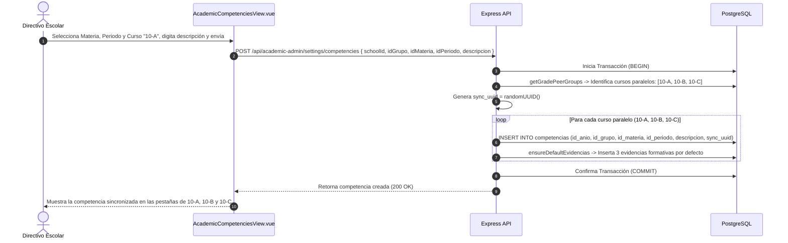
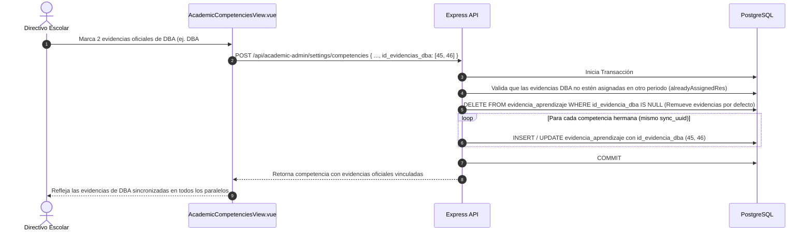
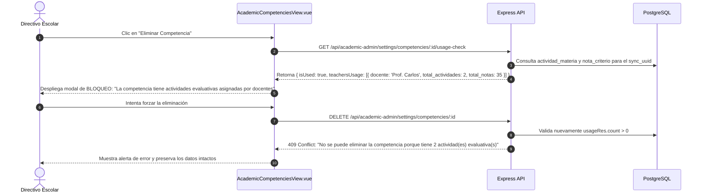
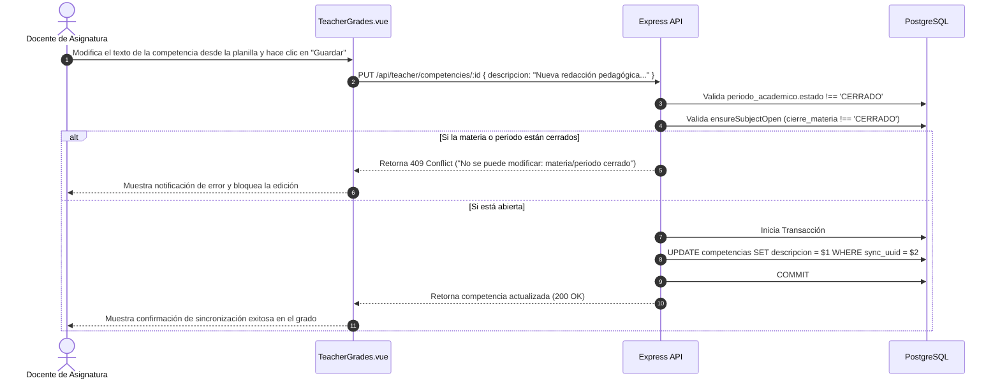

# Casos de Uso — Competencias Pedagógicas y Sincronización en Caliente

Este documento describe los flujos de interacción y diagramas de secuencia paso a paso del módulo de **Competencias y Sincronización** de AcademiaNeiva.

---

## Caso de Uso 1: Creación de Multicompetencia y Sincronización en Cursos Paralelos

### Actores
- **Directivo Escolar** (Coordinador Académico / Rector)

### Precondiciones
- El periodo académico se encuentra en estado `ABIERTO`.
- Existen cursos paralelos configurados para el grado escolar (ej. 10-A, 10-B y 10-C).

### Diagrama de Secuencia

---

## Caso de Uso 2: Vinculación de Evidencias DBA con Reemplazo de Evidencias por Defecto

### Actores
- **Directivo Escolar**

### Precondiciones
- La competencia fue creada previamente con evidencias formativas por defecto.
- El catálogo de DBA de la asignatura se encuentra configurado para el grado.

### Diagrama de Secuencia

---

## Caso de Uso 3: Intento de Eliminación con Verificación de Uso Evaluativo (`usage-check`)

### Actores
- **Directivo Escolar**

### Precondiciones
- Un docente ya ha creado actividades evaluativas o calificado notas sobre la competencia.

### Diagrama de Secuencia

---

## Caso de Uso 4: Edición de Competencia por el Docente con Validación de Cierre

### Actores
- **Docente Titular**

### Precondiciones
- El docente tiene asignada la materia en `detalle_grados`.

### Diagrama de Secuencia

