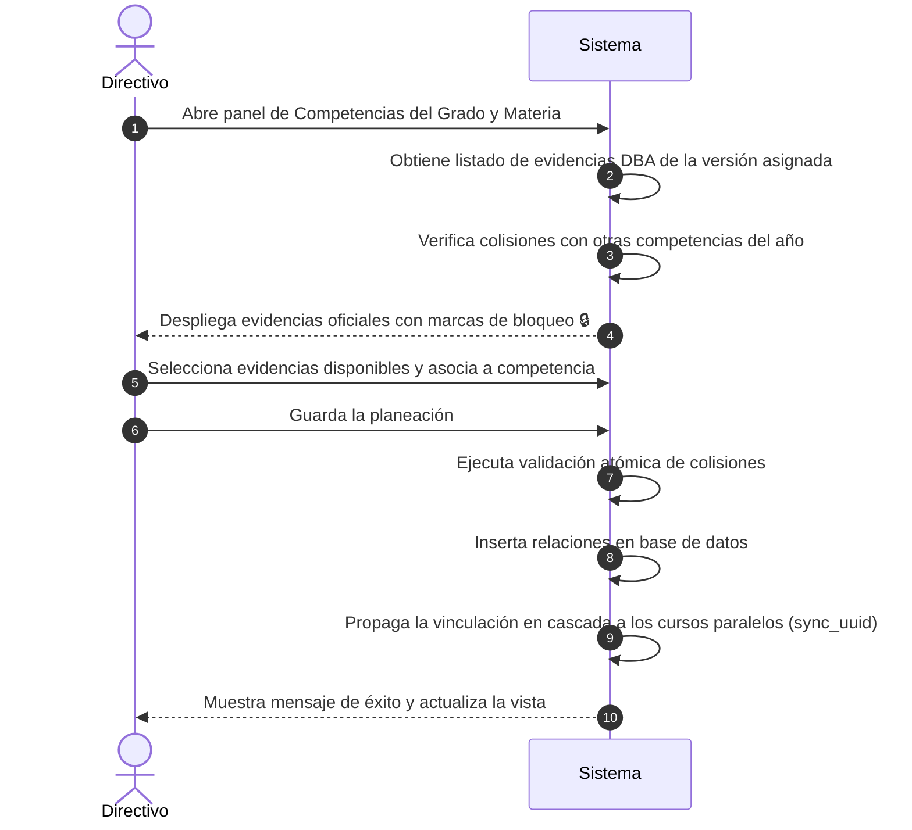

# Casos de Uso — Catálogo DBA

Este documento describe los flujos principales de interacción del módulo de Catálogo DBA de AcademiaNeiva.

---

## Caso de Uso 1: Vinculación e Integración de Evidencias DBA en Planeación Curricular

### Actores
- **Directivo Escolar** (Coordinador Académico o Rector)

### Precondiciones
- El Administrador General ha asignado la versión curricular correspondiente (ej. V2 2016) al grado y materia de la institución.
- El periodo académico se encuentra abierto o pendiente (no cerrado).

### Flujo Principal (Paso a Paso)

1. **Consulta de Catálogo:** El directivo escolar ingresa a la configuración de competencias, selecciona un grado y asignatura, y abre el modal de edición de evidencias DBA.
2. **Obtención y Bloqueo:** El sistema consulta las evidencias oficiales asignadas a la materia y grado del colegio. Identifica cuáles ya han sido vinculadas a otras competencias en el mismo año lectivo y las renderiza en formato inhabilitado con un ícono de candado 🔒.
3. **Selección y Guardado:** El directivo selecciona las evidencias deseadas de la lista disponible y presiona "Guardar Planeación".
4. **Validación y Propagación:** El backend intercepta la solicitud, ejecuta la validación de colisiones a nivel de base de datos en una sola transacción, guarda las relaciones y las propaga de manera automática a todos los grupos paralelos que comparten el `sync_uuid` de la competencia.
5. **Confirmación:** El sistema actualiza la vista del plan de estudios del directivo y de las planillas de los docentes de los cursos involucrados.

### Flujos Alternativos / Excepciones
- **Excepción 4a (Colisión de Evidencias):** Si una de las evidencias seleccionadas ya fue asociada a otra competencia en la base de datos (por modificaciones simultáneas o fallas del cliente), el backend aborta la transacción y responde con error `400 Bad Request` indicando la colisión y qué materias/periodos causaron el conflicto. La UI restaura el estado anterior y muestra la alerta de error.

### Postcondiciones
- Las evidencias DBA oficiales quedan vinculadas al plan de estudio del grado y asignatura, y se habilitan para la evaluación de los docentes.

---

## Caso de Uso 2: Auditoría del Progreso Escolar (Reporte de Coherencia Curricular)

### Actores
- **Directivo Escolar** (Rector)

### Precondiciones
- Los docentes han registrado actividades evaluativas y calificado a los estudiantes en el periodo lectivo en curso.

### Flujo Principal (Paso a Paso)
1. **Acceso al Tablero:** El directivo ingresa a la pestaña de "Reportes DBA" en su panel de administración.
2. **Generación del Reporte:** Selecciona el periodo y presiona "Consultar Coherencia". El sistema recopila de forma asíncrona la lista de evidencias planificadas, verifica las actividades asociadas registradas por los docentes, y calcula los porcentajes de progreso.
3. **Visualización de Cumplimiento:** La interfaz renderiza las evidencias marcando en color verde las que cumplen (`Cumple`), en color rojo las que están planificadas pero no tienen actividades registradas (`Pendiente`), y en amarillo las evidencias evaluadas de forma extemporánea (`Extra`).
4. **Inspección de Desvíos:** El directivo hace clic sobre la pestaña "Evidencias Extras" y revisa los justificantes escritos por los docentes en las actividades que desencadenaron los desvíos del plan de estudios.

### Postcondiciones
- El directivo obtiene una visualización fidedigna y detallada de la cobertura de la malla curricular oficial del colegio.
