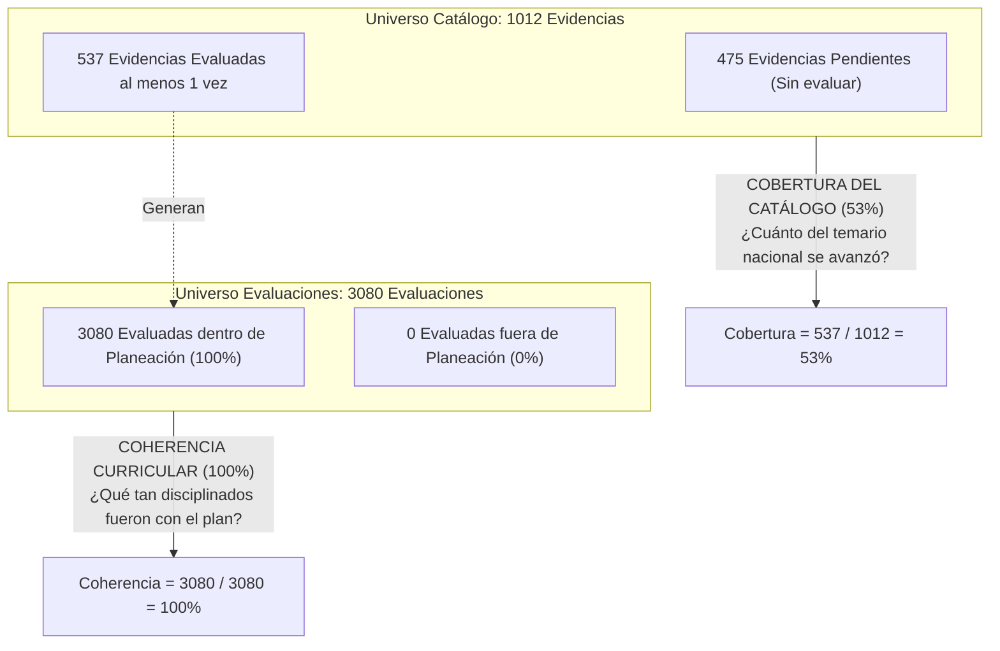

# 📚 Módulo de Catálogo DBA y Coherencia Curricular

**Sistema:** Academia Neiva  
**Módulo:** Gestión de Derechos Básicos de Aprendizaje (DBA), Cobertura y Coherencia Curricular  
**Última actualización:** 2026-07-20

---

## 1. Descripción Funcional

Este módulo integra los lineamientos de los **Derechos Básicos de Aprendizaje (DBA)** del Ministerio de Educación Nacional (MEN) de Colombia con la planeación curricular de la institución. Permite a la superadministración (Admin General) mantener el catálogo oficial nacional (materias, grados, enunciados y evidencias oficiales), importarlo masivamente desde documentos PDF y asignar las versiones curriculares vigentes a cada colegio. Por otro lado, ofrece a los directivos la planeación interactiva (vinculación a competencias) y reportes analíticos avanzados de **Cobertura** (porcentaje del catálogo oficial evaluado) y **Coherencia Curricular** (evaluación de desvíos entre lo planeado e impartido por los docentes).

---

## 2. Actores y Permisos

| Rol | Alcance |
|---|---|
| **Admin General** | Mantenedor del catálogo oficial global de DBA. CRUD completo, carga masiva desde PDF y asignación de versiones a los colegios. |
| **Directivo** | Planeación escolar: vincular evidencias oficiales del MEN a las competencias institucionales. Consulta de analíticas de Cobertura y Coherencia. |
| **Docente** | Vinculación en aula: asociar actividades evaluativas a las evidencias oficiales planeadas. Solicitar y justificar evidencias de otros periodos (Evidencias Extras). |
| **Público** | Sin acceso. |

---

## 3. Acciones Disponibles

### Gestión Global del Catálogo (Admin General)

| Acción | Método | Endpoint | Rol Requerido |
|---|---|---|---|
| Listar versiones curriculares disponibles | `GET` | `/api/admin/dba/versiones` | Admin General |
| Listar áreas curriculares registradas | `GET` | `/api/admin/dba/areas` | Admin General |
| Obtener estadísticas globales del catálogo | `GET` | `/api/admin/dba/estadisticas` | Admin General |
| Obtener combinaciones existentes de DBA | `GET` | `/api/admin/dba/existentes` | Admin General |
| Listar todos los Derechos Básicos de Aprendizaje | `GET` | `/api/admin/dba` | Admin General |
| Consultar detalle de un DBA específico | `GET` | `/api/admin/dba/:id` | Admin General |
| Registrar nuevo DBA | `POST` | `/api/admin/dba` | Admin General |
| Actualizar enunciado o metadatos de un DBA | `PUT` | `/api/admin/dba/:id` | Admin General |
| Cambiar estado (Activo/Inactivo) de un DBA | `PATCH` | `/api/admin/dba/:id/estado` | Admin General |
| Eliminar un DBA del catálogo global | `DELETE` | `/api/admin/dba/:id` | Admin General |
| Importar DBA masivamente desde archivo PDF | `POST` | `/api/admin/dba/importar` | Admin General |
| Crear evidencia oficial asociada a un DBA | `POST` | `/api/admin/dba/:id/evidencias` | Admin General |
| Actualizar descripción de evidencia oficial | `PUT` | `/api/admin/dba/evidencias/:id` | Admin General |
| Cambiar estado de evidencia oficial | `PATCH` | `/api/admin/dba/evidencias/:id/estado` | Admin General |
| Asignar versión curricular a una institución | `POST` | `/api/admin/dba/asignar-version` | Admin General |
| Listar asignaciones curriculares del colegio | `GET` | `/api/admin/dba/asignaciones/:colegioId` | Admin General |

### Integración y Planeación Escolar (Directivo y Docente)

| Acción | Método | Endpoint | Rol Requerido |
|---|---|---|---|
| Obtener evidencias DBA disponibles para planeación | `GET` | `/api/academic-admin/settings/dba-planeacion/disponibles/:schoolId` | Directivo |
| Vincular evidencias oficiales a una competencia | `POST` | `/api/academic-admin/settings/competencias/:competenciaId/vincular-evidencias-dba` | Directivo |
| Consultar Reporte de Coherencia Curricular | `GET` | `/api/academic-admin/settings/dba-reportes/coherencia/:schoolId` | Directivo |
| Consultar Reporte de Cobertura Curricular | `GET` | `/api/academic-admin/settings/dba-reportes/cobertura/:schoolId` | Directivo |
| Consultar catálogo de DBA del colegio | `GET` | `/api/academic-admin/settings/dba-catalogo/:schoolId` | Directivo |
| Obtener evidencias oficiales de una competencia | `GET` | `/api/teacher/competencies/:competenciaId/evidencias-dba` | Docente |
| Obtener evidencias oficiales asignadas a un curso | `GET` | `/api/teacher/courses/:gradeId/:subjectId/evidencias-dba` | Docente |

---

## 4. Reglas de Negocio

- **RN-DBA-001 (Regla de Exclusividad 1-to-1):** Para evitar la redundancia curricular, una evidencia oficial del catálogo nacional DBA puede estar vinculada a **máximo una única competencia** para la misma asignatura, grado (incluyendo sus cursos paralelos) y año lectivo en la institución.
- **RN-DBA-002 (Control de Colisión Curricular):** Antes de guardar cualquier vinculación en `vincularEvidenciasDbaACompetencia`, el backend realiza una validación atómica de colisiones. Si alguna de las evidencias enviadas ya fue planificada en otra competencia del mismo año, materia o grado parallel, la transacción se aborta con error `400 Bad Request` indicando qué periodos y competencias causan la duplicidad.
- **RN-DBA-003 (Evidencias Extras y Justificación Obligatoria):** Por defecto, el docente solo puede asociar sus actividades evaluativas a las evidencias oficiales planificadas para el periodo académico vigente. Si desea evaluar una evidencia planeada para otro periodo o no planificada (Evidencia Extra):
  - Debe confirmar una advertencia en la interfaz.
  - Debe ingresar un motivo predefinido del listado institucional.
  - Si el motivo es **"OTRO"**, es obligatorio redactar una justificación escrita detallada (`justificacion_extra`).
- **RN-DBA-004 (Reglas Especiales para el Grado Transición):** Para cumplir con los lineamientos pedagógicos de educación preescolar en Colombia:
  - Los DBA de grado Transición pertenecen **únicamente al área de Transición** y no pueden asociarse a materias regulares (Matemáticas, Lenguaje, etc.).
  - Los DBA de materias de primaria o secundaria (Lenguaje, Matemáticas, etc.) no pueden ser enlazados bajo ningún concepto al grado Transición.
  - Los DBA de Transición pueden ser asociados opcionalmente a las **Dimensiones Pedagógicas** oficiales de preescolar: Comunicativa, Cognitiva, Corporal, Socioafectiva, Estética, Ética y Valores.
- **RN-DBA-005 (Métrica de Coherencia Curricular):** El Reporte de Coherencia califica el estado de cada evidencia planeada como:
  - **Cumple**: Si el docente ha registrado al menos una actividad evaluativa asociada a la evidencia planeada.
  - **Pendiente**: Si la evidencia está en el plan curricular del periodo pero el docente aún no ha registrado ninguna actividad evaluativa de control para ella en el aula.
  - **Extra**: Si el docente evaluó la evidencia en un periodo en el que no fue planeada originalmente.

---

## 5. Implementación

### Backend

| Tipo | Archivo |
|---|---|
| **Controller Catálogo** | [dbaController.ts](file:///c:/Users/alejo/Downloads/segundoProyecto/backend/src/controllers/dbaController.ts) — CRUD global de DBA y carga de PDFs. |
| **Controller Reportes** | [dbaReportsController.ts](file:///c:/Users/alejo/Downloads/segundoProyecto/backend/src/controllers/dbaReportsController.ts) — Generación de consultas analíticas de Cobertura y Coherencia. |
| **Routes** | [dba.routes.ts](file:///c:/Users/alejo/Downloads/segundoProyecto/backend/src/routes/dba.routes.ts), [academicAdmin.routes.ts](file:///c:/Users/alejo/Downloads/segundoProyecto/backend/src/routes/academicAdmin.routes.ts) |

### Frontend

| Tipo | Archivo |
|---|---|
| **Vista Global (Admin)** | [DbaGlobalView.vue](file:///c:/Users/alejo/Downloads/segundoProyecto/frontend/src/views/adminGeneral/DbaGlobalView.vue) — CRUD y panel de carga del catálogo. |
| **Vista Planeación** | [AcademicCompetenciesView.vue](file:///c:/Users/alejo/Downloads/segundoProyecto/frontend/src/views/admin/AcademicCompetenciesView.vue) — Selector de evidencias DBA con lógica de bloqueo 🔒. |
| **Vista Reportes** | [DbaReportsView.vue](file:///c:/Users/alejo/Downloads/segundoProyecto/frontend/src/views/admin/DbaReportsView.vue) — Tableros interactivos de cobertura y justificaciones de extras. |

---

## 6. Modelo de Datos

### Tabla: `dba`

| Columna | Tipo | Descripción |
|---|---|---|
| `id_dba` | SERIAL PK | Identificador único del DBA. |
| `area` | VARCHAR(100) | Área de conocimiento (ej. Matemáticas). |
| `grado` | VARCHAR(50) | Grado escolar (ej. PRIMERO). |
| `numero_dba` | INT | Número de orden oficial del men. |
| `enunciado` | TEXT | Texto del Derecho Básico de Aprendizaje. |
| `version_curricular` | VARCHAR(20) | Versión del MEN (ej. V2 2016). |
| `estado` | `estado_dba` | `ACTIVO`, `INACTIVO`. |

### Tabla: `evidencias_dba`

| Columna | Tipo | Descripción |
|---|---|---|
| `id_evidencia_dba` | SERIAL PK | Identificador único de la evidencia oficial. |
| `id_dba` | INT FK | Enlace al DBA padre. |
| `descripcion` | TEXT | Enunciado de la evidencia de aprendizaje. |
| `estado` | `estado_dba` | `ACTIVO`, `INACTIVO`. |

### Tabla: `colegio_version_curricular`

| Columna | Tipo | Descripción |
|---|---|---|
| `id` | SERIAL PK | Identificador único. |
| `id_colegio` | INT FK | Colegio asignado. |
| `area` | VARCHAR(100) | Área curricular. |
| `grado` | VARCHAR(50) | Grado escolar. |
| `version_curricular` | VARCHAR(20) | Versión asignada. |

---

## 7. Conexiones con Otros Módulos

- **→ Competencias**: Las competencias de base asocian evidencias del catálogo DBA a sus planes de estudio.
- **→ Calificaciones y Actividades**: Las actividades creadas por los docentes enlazan evidencias oficiales, registrando los campos `motivo_extra` y `justificacion_extra` en caso de desvíos.
- **→ Colegios**: Las versiones curriculares se aíslan y asignan de forma independiente para cada plantel.

---

## 8. Validaciones Implementadas

### Backend
- Consulta de colisión de unicidad de evidencias DBA ante cualquier cambio en competencias.
- Validación de que los campos `motivo_extra` y `justificacion_extra` contengan texto válido cuando la evidencia enlazada a la actividad sea extraordinaria.
- Registro del campo `fecha_creacion` (de tipo `TIMESTAMPTZ` con valor por defecto `now()`) en `actividad_materia` para evitar el error histórico en la ordenación de actividades en los reportes de coherencia.

### Frontend
- Bloqueo en tiempo real (ícono de candado 🔒 y advertencia visual) en el modal de planeación de evidencias DBA que ya pertenezcan a otras competencias.
- Filtros reactivos en los tableros analíticos del directivo con visualización de badges informativas.

---

## 9. Decisiones de Diseño

| Decisión | Justificación |
|---|---|
| **Justificaciones en Tabla Principal** | Se guardan directamente en `actividad_materia` para agilizar los tiempos de carga del reporte de coherencia curricular de los directivos, evitando la necesidad de hacer joins complejos con tablas de auditoría. |
| **Filtros Independientes** | Cada pestaña del panel analítico (`filterEvidenceStatus` en Cobertura y `filterCoherenciaStatus` en Coherencia) opera de forma independiente en el frontend, permitiendo la exploración de datos cruzados sin perder contexto. |

---

## 10. 🧠 Base de Conocimiento para Desarrolladores: Fórmulas de Cálculo de KPIs y Comparativa de Sub-vistas

Esta sección detalla de forma exhaustiva la fundamentación matemática, los universos muestrales y las fuentes de datos de cada tarjeta KPI de las dos sub-vistas del módulo **Coherencia y Cobertura DBA** ([DbaReportsView.vue](file:///c:/Users/alejo/Downloads/segundoProyecto/frontend/src/views/admin/DbaReportsView.vue)).

### ⚖️ ¿Por qué los porcentajes difieren? (Coherencia vs Cobertura)

Es común observar que en un mismo año lectivo la **Coherencia Curricular arroje 100%** mientras que la **Cobertura del Catálogo marque 53%**. Esto **no es un error**, sino dos métricas pedagógicas con objetivos y universos muestrales totalmente distintos:

| Dimensión | 🎯 Sub-vista 1: Coherencia Curricular | 📊 Sub-vista 2: Cobertura del Catálogo |
|---|---|---|
| **Pregunta Clave** | *¿De lo que los profesores evaluaron en clase, qué porcentaje siguió fielmente la planeación curricular vs cuántos desvíos/extras hubo?* | *¿Del catálogo completo oficial de DBA asignado al colegio, cuánto temario ya se cubrió al menos una vez vs cuánto está pendiente?* |
| **Universo de Datos (Denominador)** | **Total de evaluaciones docentes aplicadas en el aula** (`actividad_evidencia_dba` enlazadas a `actividad_materia`). | **Total de evidencias oficiales vigentes en el catálogo nacional** (`colegio_version_curricular` ➔ `dba` ➔ `evidencias_dba`). |
| **Enfoque Pedagógico** | Adherencia, disciplina curricular y control de desvíos docentes. | Alcance, avance global temático institucional y cumplimiento de estándares del MEN. |
| **Ejemplo Numérico** | Evaluaron 3080 veces y las 3080 estaban planeadas = **100% Coherencia**. | De 1012 evidencias del catálogo, evaluaron 537 = **53% Cobertura** (quedan 475 pendientes para los siguientes periodos). |

---

### 🧮 Detalle Técnico de KPIs — Sub-vista 1: Coherencia Curricular

- **Endpoint Backend:** `GET /api/academic-admin/settings/dba-reportes/coherencia/:schoolId` ([dbaReportsController.ts](file:///c:/Users/alejo/Downloads/segundoProyecto/backend/src/controllers/dbaReportsController.ts))
- **Objeto Frontend:** `coherenciaStats` en [DbaReportsView.vue](file:///c:/Users/alejo/Downloads/segundoProyecto/frontend/src/views/admin/DbaReportsView.vue)

| Tarjeta KPI | Variable / Propiedad | Origen / Query Backend | Fórmula de Cálculo | Descripción |
|---|---|---|---|---|
| **1. Evidencias Evaluadas** | `coherenciaStats.total` | `COUNT(*)` de registros retornados por `obtenerReporteCoherenciaCurricular`. | `total = filteredCoherencia.length` | Cantidad total de evaluaciones realizadas por docentes que vinculan evidencias DBA en el rango de búsqueda. |
| **2. Evidencias Planeadas** | `coherenciaStats.planeadas` | Registros donde `estado_coherencia = 'PLANEADA'` (existe en `evidencia_aprendizaje` de la competencia para la materia/grado/periodo). | `planeadas = filter(r => r.estado_coherencia === 'PLANEADA').length` | Evaluaciones aplicadas que corresponden estrictamente al plan curricular aprobado. |
| **3. Evidencias Extras (Desvíos)** | `coherenciaStats.extras` | Registros donde `estado_coherencia = 'EXTRA'` (la evidencia evaluada no estaba en la competencia de ese periodo). | `extras = total - planeadas` | Evaluaciones registradas como desvíos o adelantos con justificación docente (`motivo_extra`, `justificacion_extra`). |
| **4. Coherencia Curricular (%)** | `coherenciaStats.pct` | Ratio matemático calculado en frontend. | $$\text{Coherencia} = \text{round}\left(\frac{\text{Planeadas}}{\text{Total Evaluadas}} \times 100\right)$$ | **Porcentaje de fidelidad curricular.** Escala: $\ge 85\%$ Alta (Verde), $\ge 60\%$ Media (Ámbar), $< 60\%$ Baja (Rojo). |

---

### 🧮 Detalle Técnico de KPIs — Sub-vista 2: Cobertura del Catálogo

- **Endpoint Backend:** `GET /api/academic-admin/settings/dba-reportes/cobertura/:schoolId` ([dbaReportsController.ts](file:///c:/Users/alejo/Downloads/segundoProyecto/backend/src/controllers/dbaReportsController.ts))
- **Objeto Frontend:** `coberturaStats` y `coberturaResumen` en [DbaReportsView.vue](file:///c:/Users/alejo/Downloads/segundoProyecto/frontend/src/views/admin/DbaReportsView.vue)

| Tarjeta KPI | Variable / Propiedad | Origen / Query Backend | Fórmula de Cálculo | Descripción |
|---|---|---|---|---|
| **1. Total Evidencias Catálogo** | `coberturaStats.total` | Suma de `total_evidencias` agrupado por área/grado desde `colegio_version_curricular` unida con `evidencias_dba` activas. | $$\text{Total Catálogo} = \sum \text{resumen.total\_evidencias}$$ | Número total de evidencias oficiales del MEN asignadas por la versión curricular activa de la institución. |
| **2. Evidencias Cubiertas** | `coherenciaStats.covered` | Suma de `evidencias_evaluadas` (evidencias oficiales que tienen al menos 1 evaluación registrada en `actividad_evidencia_dba`). | $$\text{Cubiertas} = \sum \text{resumen.evidencias\_evaluadas}$$ | Cantidad de evidencias del catálogo que ya fueron impartidas y evaluadas en el aula. |
| **3. Evidencias Pendientes** | `coberturaStats.pending` | Diferencia entre el catálogo oficial y lo evaluado. | $$\text{Pendientes} = \text{Total Catálogo} - \text{Cubiertas}$$ | Evidencias oficiales que aún no registran ninguna actividad evaluativa en el año. |
| **4. Cobertura del Catálogo (%)** | `coberturaStats.pct` | Ratio matemático global de cobertura. | $$\text{Cobertura} = \text{round}\left(\frac{\text{Cubiertas}}{\text{Total Catálogo}} \times 100\right)$$ | **Porcentaje de avance del estándar nacional.** Escala: $\ge 75\%$ Excelente (Verde), $\ge 50\%$ Regular (Ámbar), $< 50\%$ Crítica (Rojo). |

