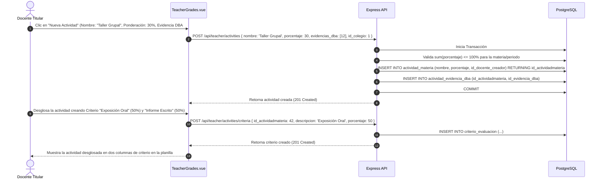
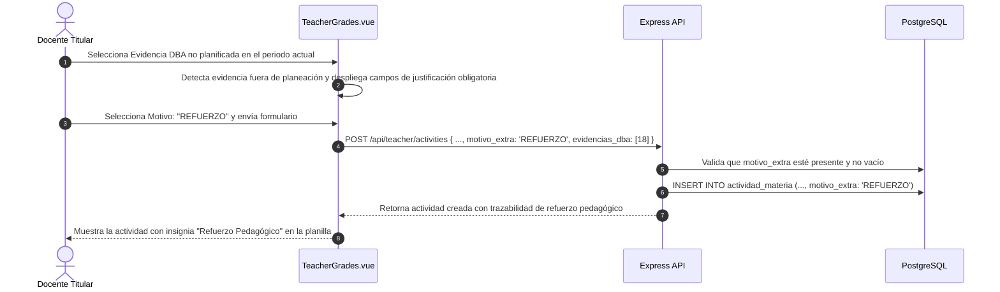
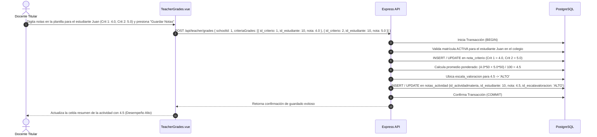
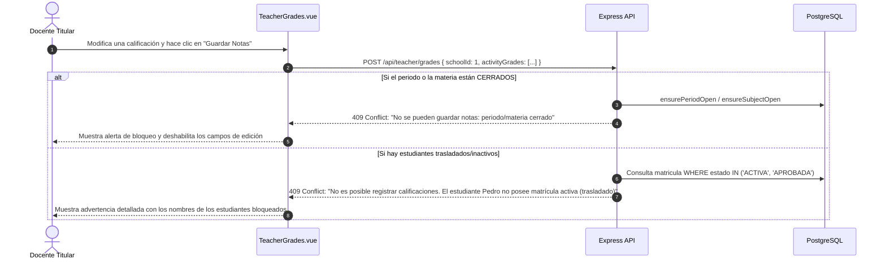

# Casos de Uso — Calificaciones, Actividades y Evaluación Curricular

Este documento describe los flujos de interacción y diagramas de secuencia paso a paso del módulo de **Calificaciones y Actividades** de AcademiaNeiva.

---

## Caso de Uso 1: Creación de Actividad con Criterios Porcentuales y Evidencias DBA

### Actores
- **Docente Titular de Asignatura**

### Precondiciones
- El docente tiene asignada la materia en `detalle_grados` para el año y curso actual.
- El periodo académico se encuentra en estado `ABIERTO`.

### Diagrama de Secuencia

---

## Caso de Uso 2: Creación de Actividad con Evidencia Extra y Justificación Pedagógica

### Actores
- **Docente Titular**

### Precondiciones
- El docente selecciona una evidencia de DBA que pertenece al grado pero fue planificada para otro periodo.

### Diagrama de Secuencia

---

## Caso de Uso 3: Registro Masivo de Calificaciones con Sincronización Automática Criterio-Actividad

### Actores
- **Docente Titular**

### Precondiciones
- La actividad cuenta con criterios configurados (ej. Criterio 1: 50%, Criterio 2: 50%).

### Diagrama de Secuencia

---

## Caso de Uso 4: Intento de Calificación sobre Estudiantes Inactivos o Periodo Cerrado

### Actores
- **Docente Titular**

### Precondiciones
- Un estudiante del listado fue transferido de colegio (estado matrícula: `TRASLADADA`) o el directivo cerró el periodo escolar.

### Diagrama de Secuencia

