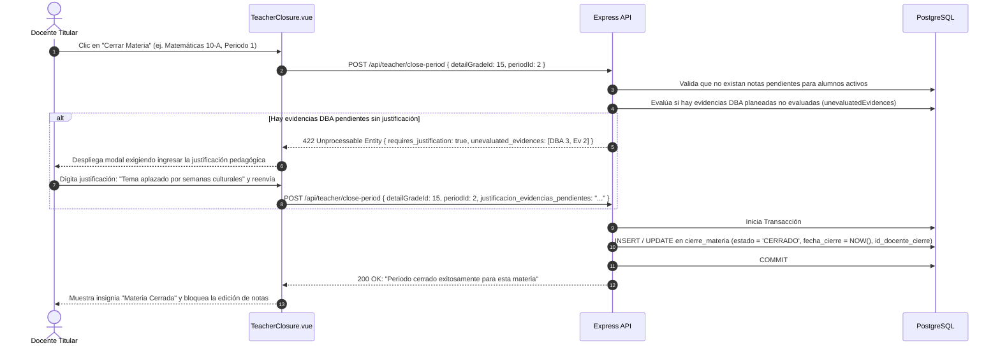
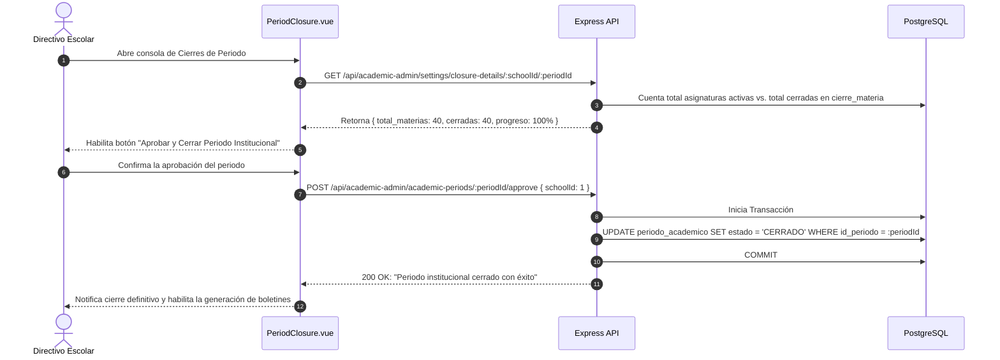
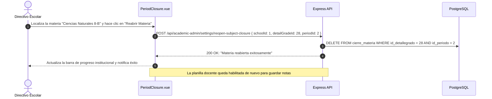
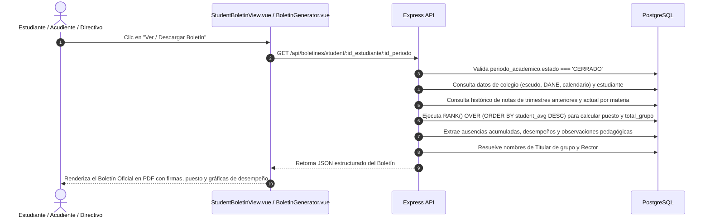

# Casos de Uso — Cierre de Periodo y Generación de Boletines

Este documento describe los flujos de interacción y diagramas de secuencia paso a paso del módulo de **Cierre de Periodo y Boletines** de AcademiaNeiva.

---

## Caso de Uso 1: Cierre de Asignatura por el Docente con Justificación de Evidencias

### Actores
- **Docente Titular de Asignatura**

### Precondiciones
- Todas las actividades evaluativas y criterios de la asignatura han sido calificados para todos los estudiantes con matrícula activa.

### Diagrama de Secuencia

---

## Caso de Uso 2: Aprobación y Cierre Institucional del Periodo

### Actores
- **Directivo Escolar** (Coordinador Académico / Rector)

### Precondiciones
- El 100% de las asignaturas en `detalle_grados` para el colegio y año están en estado `CERRADO`.

### Diagrama de Secuencia

---

## Caso de Uso 3: Reapertura Quirúrgica de Materia por Directivo

### Actores
- **Directivo Escolar**

### Precondiciones
- La materia se encuentra en estado `CERRADO` y un docente requiere corregir una nota de forma justificada.

### Diagrama de Secuencia

---

## Caso de Uso 4: Generación de Boletín Estudiantil con Cálculo de Puesto y Firmas

### Actores
- **Directivo, Estudiante o Acudiente**

### Precondiciones
- El periodo académico se encuentra en estado `CERRADO` institucionalmente.

### Diagrama de Secuencia

