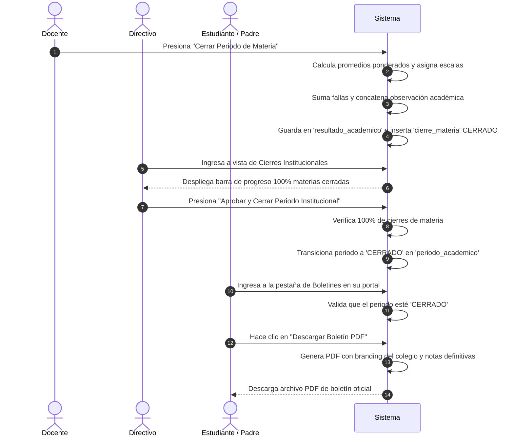

# Casos de Uso — Cierre y Boletines

Este documento describe los flujos principales de interacción del módulo de Cierre y Boletines de AcademiaNeiva.

---

## Caso de Uso 1: Consolidación Curricular y Emisión Oficial de Boletines PDF

### Actores
- **Docente**
- **Directivo Escolar** (Rector)
- **Estudiante / Padre de Familia**

### Precondiciones
- Los docentes han finalizado el registro de actividades y calificaciones en sus materias asignadas.
- El periodo escolar se encuentra en estado `ABIERTO`.

### Flujo Principal (Paso a Paso)

1. **Cierre por Materia del Docente:** El docente revisa su planilla de notas completa, presiona "Cerrar Periodo de Materia" y confirma.
2. **Consolidación de Resultados:** El backend calcula el promedio final en base a las ponderaciones de las actividades, consulta el rango descriptivo de la escala del colegio (`BAJO`, `BASICO`, `ALTO`, `SUPERIOR`), extrae la sumatoria de fallas `AUSENTE` y la observación `ACADEMICA`, guarda los datos en `resultado_academico`, e inserta una fila con estado `CERRADO` en `cierre_materia`.
3. **Control Directivo:** El directivo escolar abre la pantalla de cierres. El sistema calcula la cobertura y despliega una barra de progreso que indica que el 100% de las asignaturas han sido consolidadas.
4. **Cierre Institucional:** El directivo hace clic en "Aprobar Periodo". El sistema valida la cobertura completa y cambia el estado del periodo en `periodo_academico` a `CERRADO`.
5. **Habilitación y Descarga de Boletines:** Estudiantes, padres y directivos pueden acceder a la pestaña de boletines. Al hacer clic en "Descargar PDF", el servidor valida que el periodo esté cerrado, renderiza la plantilla PDF con el escudo y los colores de la institución, e inicia la descarga del informe académico oficial.

### Flujos Alternativos / Excepciones
- **Excepción 4a (Materias Incompletas):** Si el directivo intenta cerrar el periodo institucional cuando aún existen docentes sin cerrar materias (ej. 90% de avance), el backend bloquea la aprobación y despliega la lista con el nombre de las asignaturas y docentes pendientes por consolidar.
- **Excepción 5a (Descarga en Periodo Abierto):** Si un estudiante intenta ingresar la URL directa de descarga de boletín mientras el periodo está `ABIERTO`, la API retorna error `403 Forbidden` informando que el boletín estará disponible únicamente al finalizar y aprobar el trimestre.

### Postcondiciones
- El periodo académico queda bloqueado de forma inmutable frente a cambios futuros.
- Los boletines PDF quedan disponibles para descarga oficial por parte de la comunidad educativa.
