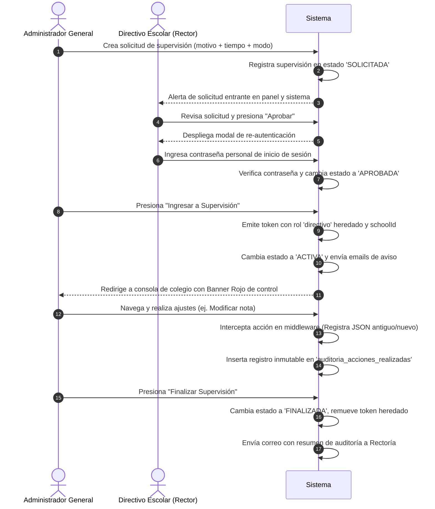

# Casos de Uso — Supervisión y Auditoría

Este documento describe los flujos principales de interacción del módulo de Supervisión y Auditoría del Administrador General en AcademiaNeiva.

---

## Caso de Uso 1: Flujo Completo de Supervisión Externa y Auditoría Inmutable

### Actores
- **Administrador General**
- **Directivo Escolar** (Rector)

### Precondiciones
- El Administrador General requiere realizar una intervención técnica en un colegio.
- El Rector del colegio cuenta con credenciales activas.

### Flujo Principal (Paso a Paso)

1. **Solicitud de Supervisión:** El Administrador General selecciona el colegio de la lista, define el modo (ej. `EDITOR`), el motivo de soporte técnico y el tiempo máximo (ej. 60 minutos), y envía la solicitud.
2. **Registro:** El sistema registra la supervisión en `auditoria_supervision` con estado `'SOLICITADA'`.
3. **Revisión y Re-Autenticación:** El Rector ingresa a su consola, abre el diálogo de aprobación de la supervisión e ingresa su contraseña de sesión personal.
4. **Autorización:** El backend valida el hash de la contraseña del Rector. Si es correcto, promueve la supervisión a `'APROBADA'`.
5. **Entrada a la Sesión:** El Administrador General presiona "Ingresar". El backend le genera un token JWT temporal con el `schoolId` del colegio y el rol heredado de Rector, transiciona el estado a `'ACTIVA'`, e inicia el conteo del temporizador en el frontend (banner rojo superior).
6. **Ejecución y Auditoría:** Durante la sesión, cualquier consulta o cambio es interceptado por `verifyToken`. Si el Administrador General modifica un registro, el middleware guarda el `valor_antiguo`, `valor_nuevo` y el `motivo_cambio` en la tabla `auditoria_acciones_realizadas` de forma automática.
7. **Cierre de Sesión:** El Administrador General presiona "Salir". El sistema pasa el estado a `'FINALIZADA'`, remueve la marca de supervisión del token JWT y notifica a los directivos del colegio con el reporte de acciones.

### Flujos Alternativos / Excepciones
- **Excepción 3a (Contraseña Incorrecta del Rector):** Si la contraseña ingresada en el modal de aprobación no coincide con la del usuario de Rectoría, el sistema bloquea la aprobación, muestra una alerta de error y mantiene la supervisión en estado `'SOLICITADA'`.
- **Excepción 6a (Modificación sin Motivo en Modo Editor):** Si el Administrador General intenta guardar un cambio en modo `EDITOR` sin enviar el parámetro `motivo_cambio`, el middleware de Express aborta la modificación y responde con error `400 Bad Request`.
- **Excepción 7a (Expiración Automática de Tiempo):** Si el Administrador General agota los 60 minutos de la sesión sin salir voluntariamente, el `schedulerService.ts` detecta el vencimiento, fuerza el cambio de estado a `'EXPIRADA'`, remueve el token heredado y notifica por email a Rectoría.

### Postcondiciones
- Todos los cambios e inspecciones quedan asentados en las bitácoras inmutables protegidas por los triggers SQL de PostgreSQL.
