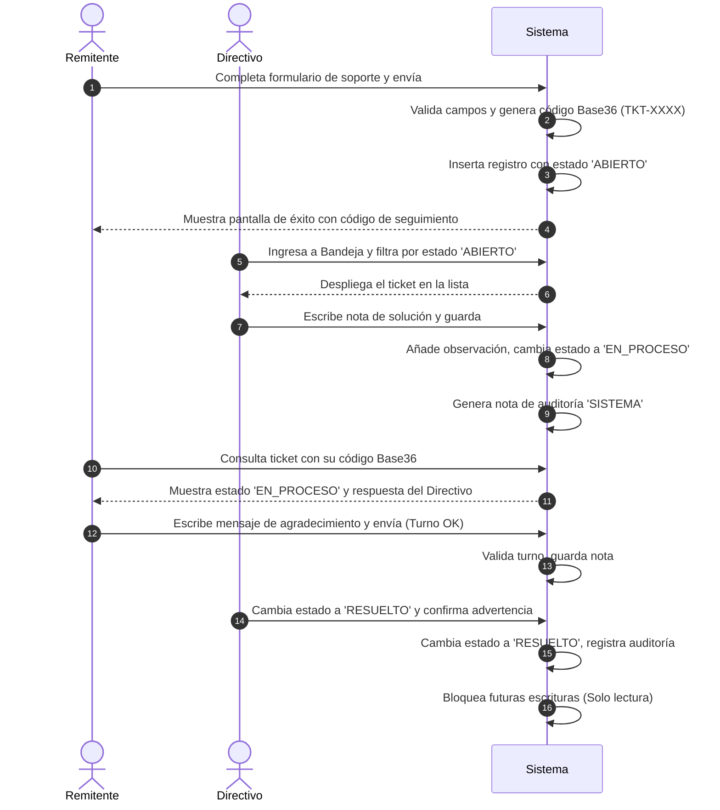

# Casos de Uso — Soporte y Tickets

Este documento describe los flujos principales de interacción del módulo de Soporte y Gestión de Tickets de AcademiaNeiva.

---

## Caso de Uso 1: Reporte y Resolución Local de Incidencia (Flujo Colegio)

### Actores
- **Remitente** (Estudiante, Docente, Padre de Familia o Visitante)
- **Directivo Escolar** (Rector o Coordinador)

### Precondiciones
- El remitente tiene acceso al formulario de soporte.
- El directivo cuenta con una sesión administrativa activa.

### Flujo Principal (Paso a Paso)

1. **Creación del Ticket:** El remitente ingresa sus datos y descripción de la falla, y presiona "Enviar".
2. **Inicialización:** El sistema valida los datos obligatorios, genera el código Base36, y persiste el registro con el estado inicial `'ABIERTO'`.
3. **Búsqueda en Bandeja:** El directivo escolar del plantel ingresa al portal de soporte, filtra los tickets en estado `'ABIERTO'` de su colegio y selecciona la solicitud.
4. **Respuesta Directiva:** El directivo digita una respuesta en la caja de texto y presiona "Guardar Observación".
5. **Transición a En Proceso:** El sistema adjunta la nota de observaciones en formato JSONB, cambia el estado a `'EN_PROCESO'`, e inserta una nota de auditoría automática tipo `'SISTEMA'`.
6. **Seguimiento del Remitente:** El remitente ingresa su código Base36 en la Landing Page, visualiza la respuesta institucional de soporte, escribe un mensaje de agradecimiento y responde.
7. **Resolución:** El directivo cambia el estado del ticket a `'RESUELTO'` en el panel lateral, acepta la advertencia del navegador y presiona "Guardar". El sistema marca el ticket como de solo lectura.

### Flujos Alternativos / Excepciones
- **Excepción 3a (Datos Inválidos):** Si el remitente ingresa un email con formato incorrecto o un mensaje de descripción con menos de 10 caracteres, el sistema aborta el registro y resalta el campo con error.
- **Excepción 6a (Turno de Mensaje Bloqueado):** Si el remitente intenta enviar una respuesta antes de recibir observaciones de soporte, la UI deshabilita los controles y el backend retorna error `400 Bad Request`.

### Postcondiciones
- El ticket queda cerrado en estado `'RESUELTO'` en formato de solo lectura.

---

## Caso de Uso 2: Escalamiento y Resolución de Ticket Crítico (Flujo Admin General)

### Actores
- **Directivo Escolar** (Rector)
- **Administrador General**

### Precondiciones
- Existe un ticket de soporte previamente creado por un docente o directivo escolar.
- El Administrador General cuenta con privilegios activos de superadministrador.

### Flujo Principal (Paso a Paso)
1. **Detección de Falla Crítica:** El directivo escolar recibe un ticket por problemas de autenticación a nivel de base de datos.
2. **Escalamiento del Ticket:** Al no contar con privilegios del sistema para corregir credenciales crudas, el directivo presiona el botón "Escalar al Administrador General".
3. **Persistencia del Escalamiento:** El sistema registra el timestamp actual en `fecha_escalado`, promueve el estado del ticket a `'EN_PROCESO'` si estaba abierto, y genera una nota de auditoría `'SISTEMA'`.
4. **Bloqueo Local:** El panel de edición de estado queda bloqueado y deshabilitado para el directivo escolar en la UI.
5. **Consulta Global:** El Administrador General ingresa a su tablero, filtra la bandeja de tickets escalados y selecciona la incidencia.
6. **Resolución de Plataforma:** El Administrador General aplica las correcciones técnicas en la cuenta de usuario afectada, agrega una observación explicando la solución y cambia el estado a `'RESUELTO'`.
7. **Consolidación:** El sistema cierra la incidencia y la inscribe en el histórico general.

### Flujos Alternativos / Excepciones
- **Excepción 2a (Ticket ya Escalado):** Si se intenta enviar una petición de escalamiento duplicada, el backend la ignora manteniendo la `fecha_escalado` original sin alterar su timestamp histórico.

### Postcondiciones
- El ticket es marcado en estado `'RESUELTO'` bajo la supervisión directa y fecha registrada de la intervención del Administrador General.
