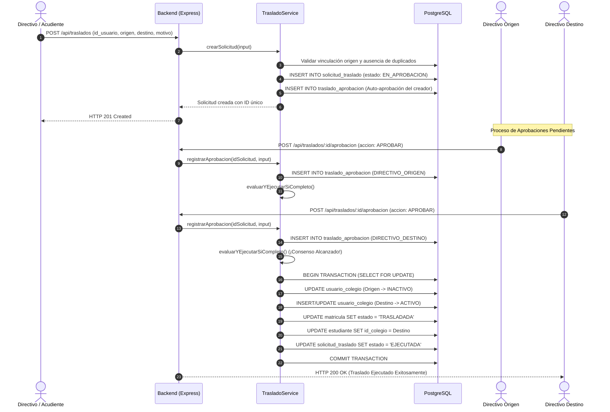

# 🎯 Casos de Uso — Módulo de Gestión de Traslados

**Sistema:** Academia Neiva  
**Módulo:** Gestión de Traslados (Interinstitucionales e Internos)  
**Última actualización:** 2026-08-10

---

## CU-TRA-01: Solicitud y Aprobación Tripartita de Traslado Interinstitucional

### Descripción
Un acudiente o directivo inicia una solicitud para trasladar a un estudiante desde una institución educativa de origen hacia una nueva institución de destino en AcademiaNeiva. El flujo requiere que las tres partes involucradas confirmen la decisión antes de aplicar los cambios en la base de datos.

### Precondiciones
- El usuario a trasladar existe en la base de datos con un vínculo activo (`ACTIVO`) en la institución de origen.
- El usuario que crea la solicitud está autenticado en la plataforma.

### Diagrama de Secuencia

### Flujo Principal
1. El creador envía los datos del traslado mediante `POST /api/traslados`.
2. El sistema valida los datos con `CreateTrasladoSchema` de Zod.
3. Se crea la solicitud en estado `EN_APROBACION` y se auto-aprueba el rol del creador.
4. Los aprobadores restantes (Directivo Origen, Directivo Destino, Acudiente) emiten sus votos en `POST /api/traslados/:id/aprobacion`.
5. Al detectar los 3 votos favorables, el sistema ejecuta la transacción atómica PostgreSQL:
   - Desactiva el vínculo con la sede origen en `usuario_colegio`.
   - Activa el vínculo con la sede destino en `usuario_colegio`.
   - Actualiza la matrícula previa a estado `TRASLADADA`.
   - Actualiza el colegio del estudiante a la sede de destino.
   - Marca la solicitud como `EJECUTADA`.

### Flujos Alternativos
- **A1. Rechazo de la Solicitud:** Si cualquiera de los 3 actores emite un voto con `accion = 'RECHAZAR'`, la solicitud cambia inmediatamente a estado `RECHAZADA` y se congela la evaluación.
- **A2. Cancelación por el Solicitante:** Si el creador envía `accion = 'CANCELAR'`, la solicitud pasa a `CANCELADA`.

---

## CU-TRA-02: Aprobación Directa por Administrador General

### Descripción
Un Administrador General revisa una solicitud de traslado interinstitucional pendiente y ejerce su facultad de aprobación ejecutiva.

### Flujo Principal
1. El Administrador General consulta la bandeja de solicitudes vía `GET /api/traslados`.
2. Selecciona una solicitud en estado `EN_APROBACION` y envía `POST /api/traslados/:id/aprobacion` con `accion = 'APROBAR'`.
3. El servicio detecta que el votante posee el rol `ADMIN_GENERAL` (`rolesAprobador.includes('admin_general')`).
4. El sistema omite la espera de los votos faltantes de origen, destino o acudiente.
5. Se desencadena inmediatamente la función `ejecutarTrasladoTransaccional(idSolicitud)` actualizando los registros en base de datos.
6. La solicitud finaliza en estado `EJECUTADA`.

---

## CU-TRA-03: Traslado Interno de Grupo Escolar y Notificación

### Descripción
Un directivo cambia de grupo a un estudiante dentro del mismo colegio e informa formalmente al acudiente.

### Flujo Principal
1. El directivo ingresa a la vista de administración de estudiantes (`StudentManagement.vue`).
2. Abre la ficha de un estudiante y hace clic en **"Trasladar de Grupo"**.
3. Selecciona el nuevo grupo de destino y escribe la justificación en el campo obligatorio *Motivo del Traslado*.
4. Presiona el botón **"Aplicar Traslado"**.
5. El frontend consume `POST /api/student/change-group`.
6. El backend actualiza `matricula.id_grupo` en la base de datos.
7. El servicio invoca `NotificationService.sendStudentTransferEmail`, enviando un correo al acudiente con la información completa del cambio.
8. La interfaz notifica éxito y refresca el listado de estudiantes.
