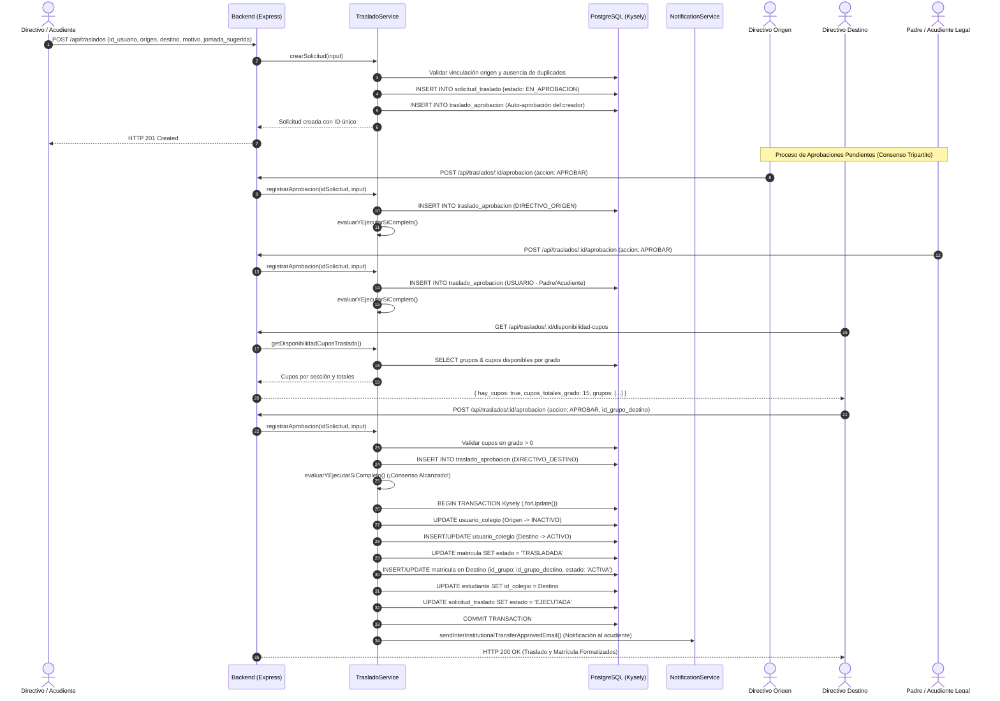

# 🎯 Casos de Uso — Módulo de Gestión de Traslados

**Sistema:** Academia Neiva  
**Módulo:** Gestión de Traslados (Interinstitucionales e Internos)  
**Última actualización:** 2026-08-14

---

## CU-TRA-01: Solicitud y Aprobación Tripartita de Traslado Interinstitucional con Validación de Cupos

### Descripción
Un acudiente o directivo inicia una solicitud para trasladar a un estudiante desde una institución educativa de origen hacia una nueva institución de destino en AcademiaNeiva. El flujo requiere verificar la disponibilidad de cupos en el grado escolar en la sede receptora, asignar el grupo/jornada de destino y obtener el consenso de las tres partes antes de formalizar el cambio.

### Precondiciones
- El usuario a trasladar existe en la base de datos con un vínculo activo (`ACTIVO`) en la institución de origen.
- El usuario que crea la solicitud está autenticado en la plataforma.

### Diagrama de Secuencia

### Flujo Principal
1. El creador envía los datos del traslado mediante `POST /api/traslados` incluyendo opcionalmente la `jornada_sugerida`.
2. El sistema valida los datos con `CreateTrasladoSchema` de Zod.
3. Se crea la solicitud en estado `EN_APROBACION` y se auto-aprueba el rol del creador.
4. El directivo del colegio destino consulta la disponibilidad de cupos en su institución (`GET /api/traslados/:id/disponibilidad-cupos`).
5. Si existen cupos, el directivo receptor emite su voto de aprobación seleccionando el grupo (`id_grupo_destino`) en `POST /api/traslados/:id/aprobacion`.
6. Los demás aprobadores (Directivo Origen y Padre/Acudiente Legal) registran su decisión.
7. Al detectar los 3 votos favorables, el sistema ejecuta la transacción atómica PostgreSQL mediante Kysely:
   - Desactiva el vínculo con la sede origen en `usuario_colegio`.
   - Activa el vínculo con la sede destino en `usuario_colegio`.
   - Actualiza la matrícula previa a estado `TRASLADADA`.
   - Genera/actualiza la matrícula en la institución receptora asignando el `id_grupo_destino` e `id_nivel`.
   - Actualiza el colegio activo del estudiante a la sede de destino.
   - Marca la solicitud como `EJECUTADA`.
   - Envía correo formal de confirmación y asignación de salón al acudiente mediante `NotificationService.sendInterInstitutionalTransferApprovedEmail`.

### Flujos Alternativos
- **A1. Grado sin Cupos en Destino:** Si `cupos_totales_grado === 0`, el botón de aprobación se inhabilita para el directivo receptor. El directivo procede a rechazar la solicitud explicando el motivo en el comentario.
- **A2. Rechazo de la Solicitud:** Si cualquiera de los 3 actores emite un voto con `accion = 'RECHAZAR'`, la solicitud cambia inmediatamente a estado `RECHAZADA` y se congela la evaluación.
- **A3. Cancelación por el Solicitante:** Si el creador envía `accion = 'CANCELAR'`, la solicitud pasa a `CANCELADA`.

---

## CU-TRA-02: Aprobación Directa por Administrador General

### Descripción
Un Administrador General revisa una solicitud de traslado interinstitucional pendiente y ejerce su facultad de aprobación ejecutiva.

### Flujo Principal
1. El Administrador General consulta la bandeja de solicitudes vía `GET /api/traslados`.
2. Selecciona una solicitud en estado `EN_APROBACION`, verifica cupos y envía `POST /api/traslados/:id/aprobacion` con `accion = 'APROBAR'` y opcionalmente `id_grupo_destino`.
3. El servicio detecta que el votante posee el rol `ADMIN_GENERAL` (`rolesAprobador.includes('admin_general')`).
4. El sistema omite la espera de los votos faltantes de origen, destino o acudiente.
5. Se desencadena inmediatamente la función `ejecutarTrasladoTransaccional(idSolicitud)` actualizando los registros en base de datos y notificando por correo al acudiente.
6. La solicitud finaliza en estado `EJECUTADA`.

---

## CU-TRA-03: Traslado Interno de Grupo Escolar y Notificación

### Descripción
Un directivo cambia de grupo a un estudiante dentro del mismo colegio e informa formalmente al acudiente.

### Flujo Principal
1. El directivo ingresa a la vista de administración de estudiantes (`StudentManagement.vue`).
2. Abre la ficha de un estudiante y hace clic en **"Trasladar de Grupo"**.
3. Selecciona el nuevo grupo de destino y escribe la justificación en el campo obligatorio *Motivo del Traslado*.
4. Presiona el botón **"Aplicar Traslado"**.
5. El frontend consume `POST /api/student/change-group`.
6. El backend actualiza `matricula.id_grupo` en la base de datos.
7. El servicio invoca `NotificationService.sendStudentTransferEmail`, enviando un correo al acudiente con la información completa del cambio.
8. La interfaz notifica éxito y refresca el listado de estudiantes.

---

## CU-TRA-04: Sincronización Multi-Institucional del Acudiente y Preservación de Roles

### Descripción
Al ejecutarse el traslado de un estudiante del Colegio A al Colegio B, el sistema administra automáticamente las vinculaciones institucionales y los roles del acudiente/padre de familia, evaluando si el padre conserva otros hijos en el colegio de origen o si desempeña roles laborales adicionales (docente/directivo).

### Escenarios de Prueba y Resolución:

#### Escenario 1: Padre con un único hijo trasladado (A -> B)
1. El estudiante se traslada al Colegio B.
2. El sistema vincula al padre en el Colegio B (`usuario_colegio` con rol `padre` en estado `ACTIVO` y `detalle_padrefamilia` con `id_colegio = Colegio B`).
3. El sistema evalúa el Colegio A y confirma que el padre no tiene más hijos con matrícula activa en dicha institución.
4. Se inactiva la relación `usuario_colegio` del rol `padre` en el Colegio A (`estado = 'INACTIVO'`, `fecha_fin = NOW()`).
5. **Resultado:** Al iniciar sesión, el acudiente accede al Colegio B para consultar el boletín y seguimiento del alumno.

#### Escenario 2: Padre con múltiples hijos en Colegio A y traslada sólo a uno (A -> B)
1. El estudiante 1 se traslada al Colegio B.
2. El sistema activa el rol de `padre` en el Colegio B para el Estudiante 1.
3. El sistema evalúa el Colegio A y detecta que el **Estudiante 2 continúa con matrícula `ACTIVA`** en el Colegio A.
4. El rol de `padre` en el Colegio A **permanece ACTIVO**.
5. **Resultado:** El padre mantiene acceso a ambos colegios mediante el selector de instituciones (`SelectSchoolView.vue`) y puede gestionar el seguimiento de ambos hijos de manera independiente.

#### Escenario 3: Padre que es Docente o Directivo en Colegio A
1. El docente traslada a su hijo al Colegio B.
2. El sistema activa la vinculación de `padre` en el Colegio B.
3. En el Colegio A, el sistema inactiva únicamente la fila `(id_usuario, Colegio A, rol_padre)`.
4. Las filas correspondientes a sus funciones laborales `(id_usuario, Colegio A, rol_docente)` o `(id_usuario, Colegio A, rol_directivo)` **permanecen 100% ACTIVAS**.
5. **Resultado:** El usuario continúa dictando sus materias y accediendo a sus cursos en el Colegio A con total normalidad, sin bloqueos en su perfil docente/administrativo.

