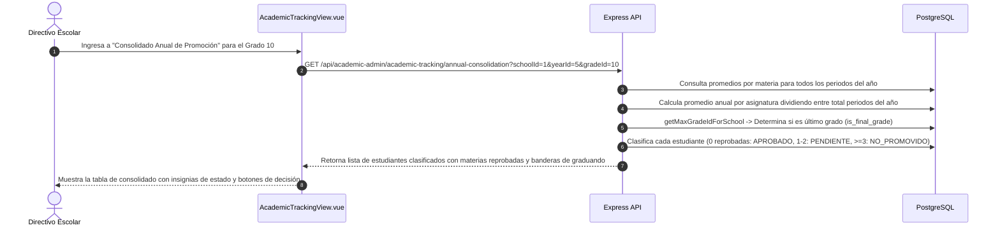
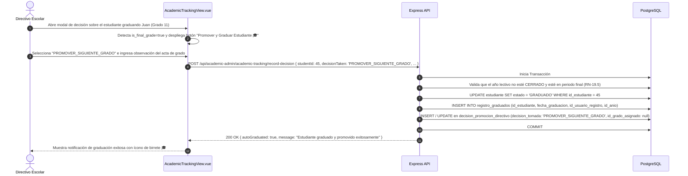
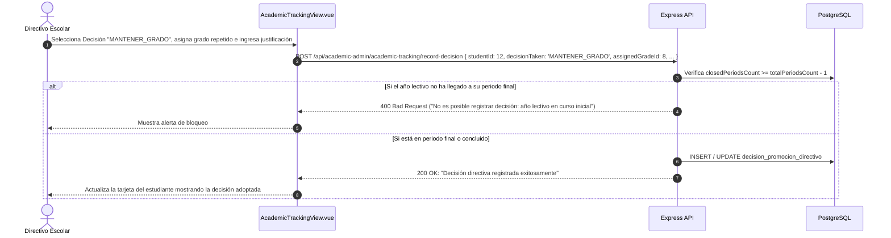
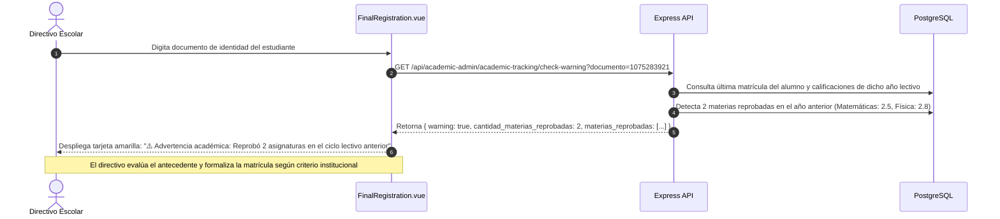

# Casos de Uso — Seguimiento Académico, Promoción y Reprobación Anual

Este documento describe los flujos de interacción y diagramas de secuencia paso a paso del módulo de **Seguimiento Académico y Promoción Anual** de AcademiaNeiva.

---

## Caso de Uso 1: Consolidación Anual y Clasificación de Promoción

### Actores
- **Directivo Escolar** (Coordinador Académico / Rector)

### Precondiciones
- El año lectivo cuenta con periodos académicos y notas registradas.

### Diagrama de Secuencia

---

## Caso de Uso 2: Promoción y Graduación Automática de Graduandos

### Actores
- **Directivo Escolar**

### Precondiciones
- El estudiante pertenece al grado superior de la institución (`is_final_grade: true`) y ha culminado el año escolar.

### Diagrama de Secuencia

---

## Caso de Uso 3: Registro de Decisión Directiva con Condición de Periodo Final

### Actores
- **Directivo Escolar**

### Precondiciones
- El estudiante presenta 3 asignaturas reprobadas (`NO_PROMOVIDO`) y el comité directivo decide mantener el grado.

### Diagrama de Secuencia

---

## Caso de Uso 4: Verificación Informativa de Advertencia en Matrícula

### Actores
- **Directivo Escolar**

### Precondiciones
- El directivo está formalizando la matrícula de un estudiante en `FinalRegistration.vue`.

### Diagrama de Secuencia

