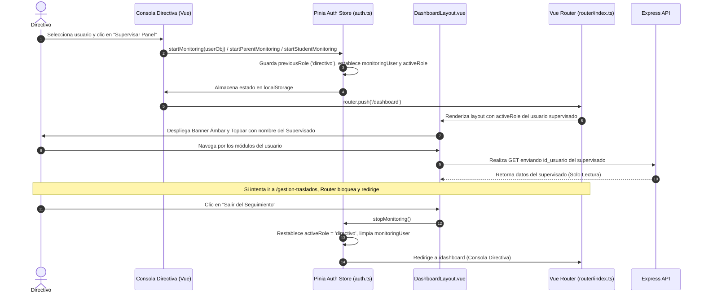

# 👁️ Módulo 20: Seguimiento Académico a Usuarios por Directivo

**Sistema:** Academia Neiva  
**Módulo:** Inspección, Acompañamiento Pedagógico y Monitoreo de Usuarios por el Directivo  
**Última actualización:** 2026-08-12  

---

## 1. Descripción Funcional

El módulo de **Seguimiento Académico a Usuarios por Directivo** permite a los rectores y coordinadores institucionales inspeccionar de primera mano los paneles de trabajo y portales de **Docentes**, **Estudiantes** y **Padres de Familia / Acudientes** registrados en su colegio.

A diferencia del modo supervisión global del Administrador General (que opera mediante tokens con permisos de superusuario interinstitucionales), el seguimiento del Directivo opera dentro del ámbito de su propio colegio. Permite al directivo asumir temporalmente la interfaz y vista de un usuario objetivo (`docente`, `estudiante` o `padre`) para verificar asistencias, calificaciones, observaciones de convivencia, matrículas activas y reportes académicos sin alterar la sesión principal ni los tokens de autenticación.

Durante la sesión de seguimiento, el sistema conmuta dinámicamente el rol activo (`activeRole`), resuelve todas las consultas de datos utilizando la identificación del usuario supervisado (`monitoringUser.id`), pero **mantiene un modo de solo lectura estricto**, deshabilitando acciones de modificación (creación de notas, toma de asistencias, cambios de perfil o tickets de soporte) y bloqueando completamente rutas sensibles como la **Gestión de Traslados** (`/dashboard/gestion-traslados`).

---

## 2. Actores y Permisos

| Rol | Alcance en el Módulo |
|---|---|
| **Directivo (Rector / Coordinador)** | Iniciar seguimiento sobre cualquier docente, estudiante o acudiente con cuenta activa de su colegio. Navegar por los módulos correspondientes en modo solo lectura y finalizar el seguimiento en cualquier momento. |
| **Docente Supervisado** | Usuario objetivo del cual se inspecciona la carga académica, cursos asignados, avance de notas, control de asistencia y diario de campo. |
| **Estudiante Supervisado** | Usuario objetivo del cual se inspecciona el rendimiento por materia, faltas de asistencia, observador del alumno y boletines. |
| **Padre de Familia / Acudiente Supervisado** | Usuario objetivo del cual se inspecciona el estado de matrícula de su hijo, hoja de observaciones familiares, boletines del acudido y asistencia. |

---

## 3. Acciones Disponibles

| Acción | Ámbito / Consola | Método Frontend / Trigger | Rol Requerido |
|---|---|---|---|
| Iniciar seguimiento de Docente | `TeacherManagement.vue` | `auth.startMonitoring(teacher)` | Directivo |
| Iniciar seguimiento de Estudiante | `StudentManagement.vue` | `auth.startStudentMonitoring(student)` | Directivo |
| Iniciar seguimiento de Padre de Familia | `ParentManagement.vue` | `auth.startParentMonitoring(parent)` | Directivo |
| Finalizar seguimiento y retornar a Consola Directiva | `DashboardLayout.vue` | `auth.stopMonitoring()` | Directivo (en monitoreo) |
| Navegación por módulos del supervisado | Vistas de Docente / Estudiante / Padre | `router.push(...)` con `activeRole` alterado | Directivo (en monitoreo) |
| Bloqueo automático de rutas no autorizadas | `router/index.ts` guard | Intercepta `/dashboard/gestion-traslados` | Directivo (en monitoreo) |

---

## 4. Reglas de Negocio

- **RN-SEG-001 (Exclusividad Institucional):** Un directivo solo puede iniciar seguimiento sobre usuarios que pertenezcan a su mismo colegio (`schoolId`).
- **RN-SEG-002 (Preservación del Objeto de Autenticación):** Al iniciar un seguimiento, `auth.user` conserva inalterada la identidad y objeto original del Directivo. No se sobrescriben credenciales ni tokens JWT.
- **RN-SEG-003 (Conmutación Dinámica de Rol Activo):** El sistema almacena el rol original del directivo en `previousRole` y cambia `activeRole` al rol del objetivo (`'docente'`, `'estudiante'`, o `'padre'`).
- **RN-SEG-004 (Resolución Ternaria de IDs):** Todas las consultas de datos en componentes de usuario resuelven el ID con la lógica:
  `const userId = (auth.isMonitoring && auth.monitoringUser) ? (auth.monitoringUser.id || auth.monitoringUser.id_usuario) : (auth.user?.id_usuario || auth.user?.id)`
- **RN-SEG-005 (Modo Solo Lectura Mandatorio):** Durante el seguimiento, los botones de escritura, guardado, edición de perfil, creación de actividades, registro de fallas y envío de observaciones quedan inhabilitados en la interfaz (`v-if="!auth.isMonitoring"` o `:disabled="auth.isMonitoring"`).
- **RN-SEG-006 (Bloqueo Estricto de Traslados):** Un directivo en modo seguimiento **no puede acceder a la Gestión de Traslados** (`/dashboard/gestion-traslados`). La opción se oculta del menú, la vista redirige al dashboard y el guard global del router bloquea la navegación.
- **RN-SEG-007 (Identidad Visual y Transparencia):** El layout principal despliega un banner superior color ámbar indicando que el monitoreo está activo y mostrando el nombre completo del usuario supervisado. El nombre y avatar en el topbar se actualizan para reflejar al supervisado.
- **RN-SEG-008 (Restauración Limpia al Salir):** Al presionar "Salir del Seguimiento", se limpia `monitoringUser`, se restablece `activeRole = previousRole` (`'directivo'`) y se redirige al Directivo a `/dashboard`.
- **RN-SEG-009 (Persistencia en LocalStorage):** Las variables `monitoringUser`, `monitoringType`, `previousRole` y `activeRole` se sincronizan en `localStorage` para evitar que una recarga de página (`F5`) rompa el estado de seguimiento.
- **RN-SEG-010 (Requisito de Cuenta Activa):** Solo se permite iniciar seguimiento sobre usuarios que tengan un ID de usuario registrado y activo (`id_usuario` existente y `usuario_activo = true`).

---

## 5. Arquitectura e Implementación

### Frontend

| Componente / Store | Ruta | Descripción |
|---|---|---|
| **Pinia Auth Store** | [auth.ts](file:///c:/Users/alejo/Downloads/segundoProyecto/frontend/src/stores/auth.ts) | Administra `monitoringUser`, `monitoringType`, `isMonitoring`, `startMonitoring`, `startStudentMonitoring`, `startParentMonitoring` y `stopMonitoring`. |
| **Layout Principal** | [DashboardLayout.vue](file:///c:/Users/alejo/Downloads/segundoProyecto/frontend/src/layouts/DashboardLayout.vue) | Renderiza el banner ámbar de monitoreo, altera el menú lateral, actualiza el topbar y filtra la ruta de traslados. |
| **Router Principal** | [index.ts](file:///c:/Users/alejo/Downloads/segundoProyecto/frontend/src/router/index.ts) | Guard de navegación `beforeEach` que redirige a `/dashboard` si se intenta entrar a `gestion-traslados` durante el seguimiento. |
| **Consola Docentes** | [TeacherManagement.vue](file:///c:/Users/alejo/Downloads/segundoProyecto/frontend/src/views/admin/TeacherManagement.vue) | Punto de origen del seguimiento a Docentes. |
| **Consola Estudiantes** | [StudentManagement.vue](file:///c:/Users/alejo/Downloads/segundoProyecto/frontend/src/views/admin/StudentManagement.vue) | Punto de origen del seguimiento a Estudiantes. |
| **Consola Padres** | [ParentManagement.vue](file:///c:/Users/alejo/Downloads/segundoProyecto/frontend/src/views/admin/ParentManagement.vue) | Punto de origen del seguimiento a Padres. |
| **Vistas Supervisadas** | `ParentDashboard.vue`, `ParentGradesView.vue`, `TeacherGrades.vue`, `StudentDashboard.vue`, etc. | Implementan la resolución ternaria de ID y deshabilitan botones de acción en monitoreo. |

---

## 6. Diagrama de Flujo del Seguimiento

