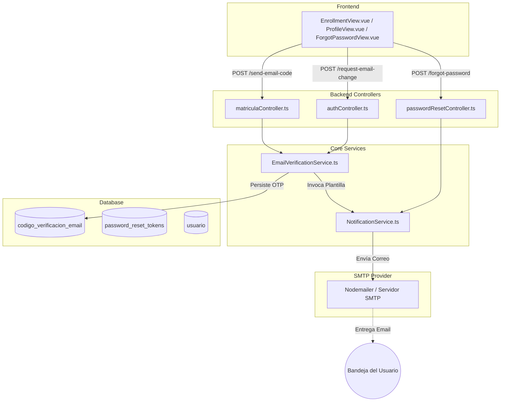

# 📧 Módulo de Flujo de Correos Electrónicos, Notificaciones y Verificaciones

**Sistema:** Academia Neiva  
**Módulo:** 21. Flujo de Correos Electrónicos, Recuperación y Verificación OTP  
**Última actualización:** 2026-08-13  

---

## 1. Descripción Funcional

Este módulo centraliza todos los procesos relacionados con el envío de correos electrónicos transaccionales, códigos de verificación OTP (One-Time Password) de un solo uso, recuperación de contraseñas, validación de existencia de emails en matrículas y notificaciones académicas/administrativas.

Proporciona una capa de seguridad y confiabilidad que garantiza:
1. **Verificación Previa a Matrícula**: Valida la existencia y posesión real del correo del acudiente mediante un código OTP de 6 dígitos antes de procesar una nueva inscripción.
2. **Actualización Segura de Perfil**: Exige validar mediante OTP cualquier solicitud de cambio de correo electrónico institucional o personal.
3. **Recuperación de Contraseñas**: Generación y entrega de tokens temporales de restablecimiento protegidos con caducidad.
4. **Notificaciones Transaccionales**: Envío automatizado de credenciales de acceso, cambios de estado de matrícula, avisos de boletines y alertas de soporte.

---

## 2. Arquitectura y Componentes Técnicos



---

## 3. Modelo de Datos Centralizado

### 3.1 Tabla `public.codigo_verificacion_email`

Reemplaza tablas fragmentadas previas en una estructura unificada y de alto rendimiento:

| Columna | Tipo | Restricciones | Descripción |
|---|---|---|---|
| `id_verificacion` | `SERIAL` | `PRIMARY KEY` | Identificador autoincremental del registro |
| `email` | `VARCHAR(255)` | `NOT NULL` | Correo electrónico destinatario en minúsculas |
| `codigo` | `VARCHAR(6)` | `NOT NULL` | Código numérico de 6 dígitos (100000 - 999999) |
| `tipo` | `tipo_verificacion_email` | `NOT NULL` | Tipo ENUM (`MATRICULA_NUEVA`, `CAMBIO_CORREO`, `RECUPERACION_PASSWORD`) |
| `id_usuario` | `INTEGER` | `NULL REFERENCES usuario(id_usuario) ON DELETE CASCADE` | ID del usuario autenticado (si aplica) |
| `expires_at` | `TIMESTAMPTZ` | `NOT NULL` | Fecha/hora límite de validez (15 minutos) |
| `verified` | `BOOLEAN` | `DEFAULT FALSE NOT NULL` | Indicador de si el código ya fue validado con éxito |
| `created_at` | `TIMESTAMPTZ` | `DEFAULT CURRENT_TIMESTAMP` | Fecha de emisión del código |

**Índice de Rendimiento:**
```sql
CREATE INDEX idx_codigo_verificacion_email ON public.codigo_verificacion_email (email, codigo, tipo);
```

---

## 4. Endpoints y Operaciones

| Acción | Método | Endpoint | Autenticación | Rol |
|---|---|---|---|---|
| Enviar OTP de matrícula | `POST` | `/api/matriculas/send-email-code` | Pública | Público |
| Validar OTP de matrícula | `POST` | `/api/matriculas/verify-email-code` | Pública | Público |
| Solicitar OTP cambio de email | `POST` | `/api/auth/profile/request-email-change` | JWT | Cualquier Rol Autenticado |
| Confirmar OTP cambio de email | `POST` | `/api/auth/profile/verify-email-change` | JWT | Cualquier Rol Autenticado |
| Solicitar reset de password | `POST` | `/api/auth/forgot-password` | Pública | Público |
| Restablecer password | `POST` | `/api/auth/reset-password` | Pública (token) | Público |

---

## 5. Implementación de Servicios

### 5.1 `EmailVerificationService` ([emailVerificationService.ts](file:///c:/Users/alejo/Downloads/segundoProyecto/backend/src/services/emailVerificationService.ts))
- **`sendCode(params)`**: Genera el número criptográficamente adecuado de 6 dígitos, establece la caducidad a 15 minutos, inserta el registro usando Kysely y despacha el correo mediante `NotificationService`.
- **`verifyCode(params)`**: Busca un registro con `email`, `codigo`, `tipo`, `verified = false` y `expires_at > now()`. Si es válido, marca `verified = true`.
- **`isVerified(params)`**: Verifica si existe una validación previa no expirada (por defecto dentro de las últimas 2 horas) antes de ejecutar la acción crítica.

### 5.2 `NotificationService` ([notificationService.ts](file:///c:/Users/alejo/Downloads/segundoProyecto/backend/src/services/notificationService.ts))
- Transportador SMTP configurado vía `nodemailer`.
- Plantillas HTML estilizadas con diseño institucional para:
  - `sendEnrollmentEmailVerificationCode(email, code)`
  - `sendEmailChangeVerificationCode(email, code, userName)`
  - `sendPasswordResetEmail(email, token, userName)`
  - `sendUserCredentials(email, password, role, name)`
  - `sendEnrollmentNotification(email, status, details)`
