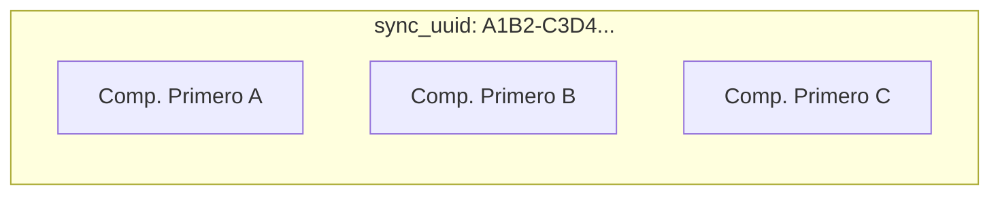

# 🔄 Sincronización Multicompetencia y Cursos Paralelos

Este módulo describe la arquitectura de sincronización de competencias académicas a través de grupos paralelos (peer groups) en **AcademiaNeiva** y la justificación técnica de la columna `sync_uuid`.

---

## 🏫 Concepto de Competencias Múltiples por Periodo

Para brindar flexibilidad curricular a los docentes, el sistema permite registrar **múltiples competencias independientes** dentro de la misma asignatura y periodo lectivo. 

> **Ejemplo**:
> Área: Ciencias Naturales — Grado Primero — Periodo 1
> - **Competencia A**: "Los Sentidos" (asociada a 3 evidencias DBA).
> - **Competencia B**: "Observación y Registro" (asociada a 2 evidencias DBA).
> - **Competencia C**: "Clasificación básica" (asociada a 1 evidencia DBA).

Cada una de estas competencias gestiona sus propias evidencias de aprendizaje, actividades académicas y calificaciones de forma aislada.

---

## ⛓️ Sincronización en Caliente y `sync_uuid`

Cuando un colegio cuenta con varios cursos paralelos para el mismo grado (por ejemplo: Primero A, Primero B y Primero C), la ley y las buenas prácticas exigen que compartan la misma planeación curricular (competencias).

Para resolver esto de forma limpia sin restringir el número de competencias, implementamos el sistema de **Identificadores de Sincronización (`sync_uuid`)**:



### 1. Eliminación de Restricciones Rígidas en Base de Datos
Eliminamos la antigua restricción de base de datos `competencias_unique_context` (que limitaba por UNIQUE a una sola competencia por combinación de año, grupo, materia y periodo).

### 2. Flujo de Creación
Cuando el directivo crea una nueva competencia para la Asignatura X, Periodo Y y Grado Z:
1. El backend genera un UUID único y aleatorio (`sync_uuid`) usando `randomUUID()` del módulo nativo `crypto` de Node.js.
2. Identifica todos los grupos paralelos (ej. Primero A, Primero B, Primero C) del grado mediante `getGradePeerGroups`.
3. Inserta un registro individual de competencia para cada grupo paralelo, todos con el mismo `sync_uuid` y descripción inicial.
4. Genera las 3 evidencias de aprendizaje por defecto para cada una de las copias insertadas.

### 3. Flujo de Edición
Cuando se edita la descripción de una competencia existente:
1. El backend consulta el `sync_uuid` del registro modificado.
2. Realiza un `UPDATE` masivo a todas las competencias de la base de datos que compartan ese mismo `sync_uuid` en una sola transacción:
   ```sql
   UPDATE public.competencias 
   SET descripcion = $1 
   WHERE sync_uuid = $2 AND id_grupo = $3
   ```
3. Esto garantiza que cualquier cambio en la descripción de la competencia realizado por el docente de Primero A se replique instantáneamente en los planes de Primero B y Primero C.

### 4. Vinculación de Evidencias DBA en Cascada
De forma similar, cuando el directivo vincula evidencias oficiales de DBA a una competencia:
1. El sistema obtiene todas las competencias que comparten el `sync_uuid`.
2. Replica la vinculación de evidencias DBA de manera idéntica para todas las competencias hermanas del grado.
