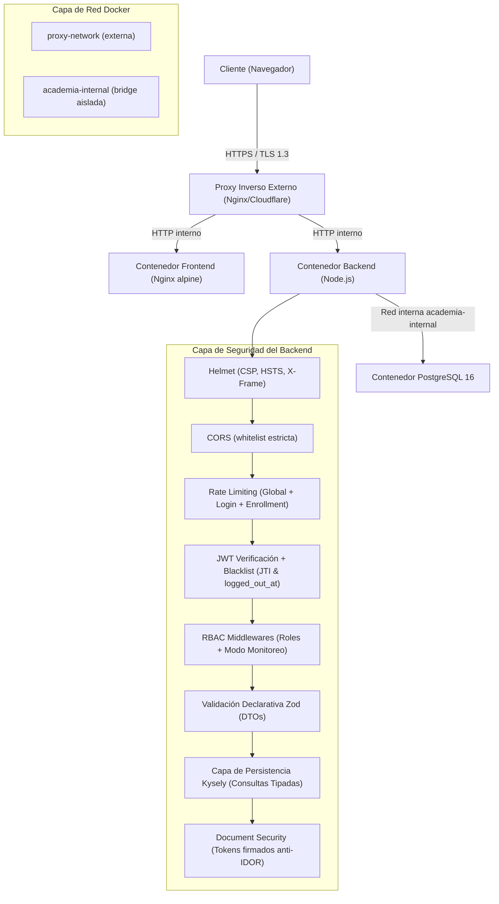
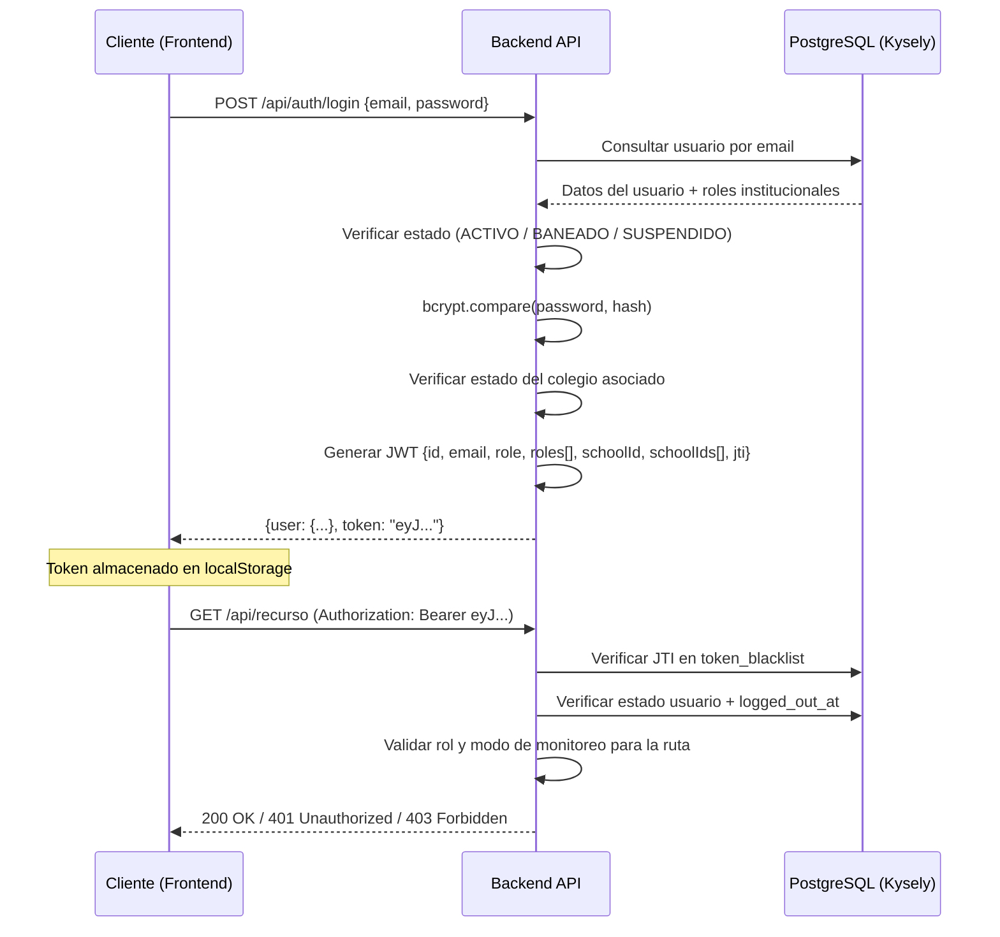
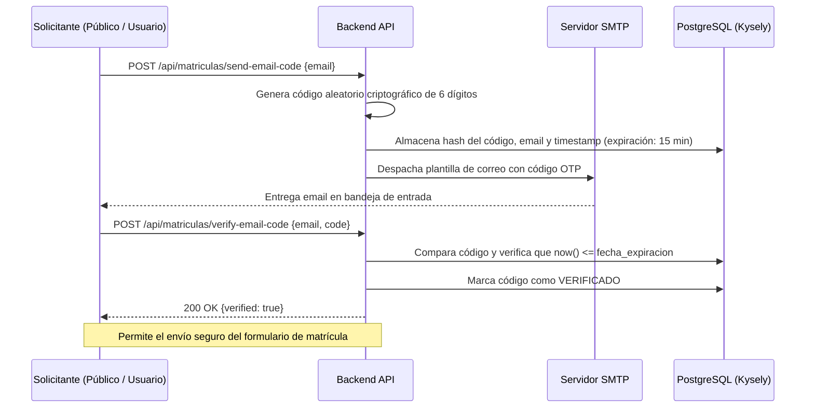

# Documento Técnico de Seguridad — AcademiaNeiva

---

## 1. Información General

| Campo | Valor |
|---|---|
| **Nombre del sistema** | AcademiaNeiva — Portal de Gestión Académica y Curricular |
| **Versión** | 2.5.0 (Producción) |
| **Fecha** | 16 de agosto de 2026 |
| **Responsable** | Equipo de Seguridad, Arquitectura e Ingeniería de AcademiaNeiva |
| **Objetivo del documento** | Documentar, evaluar y registrar el estado actual de la protección y seguridad del sistema AcademiaNeiva en todas sus capas: frontend, backend, base de datos, autenticación, validación estática Kysely/Zod, verificación transaccional OTP, infraestructura y servicios externos. |
| **Alcance** | Cubre la totalidad de los 21 módulos de la plataforma en su estado actual desplegado en producción sobre VPS con Docker. |

### 1.1 Componentes Cubiertos

| Componente | Tecnología | Descripción |
|---|---|---|
| **Frontend** | Vue 3 + Vite + TypeScript + Pinia + Vanilla CSS / Tailwind | SPA servida por Nginx dentro de contenedor Docker (`nginx:alpine`) con Route Guards de seguridad |
| **Backend / API** | Node.js + Express 5 + TypeScript + Kysely + Zod | API REST servida en contenedor Docker (`node:22-alpine`), puerto 3000 |
| **Base de datos** | PostgreSQL 16 | Contenedor Docker con volumen persistente, red interna aislada y triggers PL/pgSQL de inmutabilidad |
| **Autenticación** | JWT (jsonwebtoken) + bcrypt + Token Blacklist (`jti`) | Tokens Bearer con JTI, blacklist en BD, expiración 8h y revocación atómica por `logged_out_at` |
| **Verificación OTP** | Tabla `codigo_verificacion_email` + Nodemailer SMTP | Códigos temporales de 6 dígitos numéricos con expiración de 15 minutos para trámites críticos |
| **Infraestructura** | VPS Linux + Docker Compose + Nginx (proxy inverso) + SSH | Containerización con redes segmentadas, proxy inverso externo y headers de seguridad |
| **Servicios externos** | SMTP (Nodemailer) + Socket.io (WebSockets) | Correo transaccional, códigos OTP y notificaciones en tiempo real con autenticación JWT |

---

## 2. Objetivos de Seguridad

### 2.1 Tríada CIA + Extensiones

| Principio | Objetivo | Estado Actual |
|---|---|---|
| **Confidencialidad** | Solo usuarios autorizados acceden a la información según su rol e institución | ✅ Implementado — RBAC por JWT + middlewares de rol + aislamiento multi-tenant por `id_colegio` |
| **Integridad** | Los datos no pueden modificarse de forma indebida ni en periodos cerrados | ✅ Implementado — DTOs con Zod, consultas tipadas Kysely, transacciones SQL y triggers PL/pgSQL |
| **Disponibilidad** | El sistema permanece operativo y protegido contra abusos | ✅ Implementado — Docker restart:always, healthchecks, rate limiting diferenciado (Global, Login, Matrícula) |
| **Autenticidad** | Cada acción es rastreable a un usuario verificado | ✅ Implementado — JWT con JTI único, verificación de estado en BD y validación previa de correos vía OTP |
| **Trazabilidad** | Registro de acciones críticas para auditoría legal | ✅ Implementado — Módulo de supervisión con captura de deltas JSONB (`valor_antiguo`, `valor_nuevo`) |
| **Control de acceso** | Acceso granular basado en roles y contexto institucional | ✅ Implementado — 5 roles base + Modo Acompañamiento Pedagógico de Directivo en solo lectura |
| **Protección sensible** | Documentos de menores y credenciales protegidas | ✅ Implementado — URLs firmadas temporales, tokens anti-IDOR y aislamiento de contraseñas de terceros |

---

## 3. Arquitectura de Seguridad

### 3.1 Diagrama de Capas de Seguridad



### 3.2 Segmentación de Red Docker

| Red | Tipo | Contenedores con acceso | Propósito |
|---|---|---|---|
| `proxy-network` | Externa | Frontend, Backend | Comunicación con el proxy inverso externo |
| `academia-internal` | Bridge aislada | Backend, PostgreSQL | Aislamiento estricto de la base de datos del exterior |

> [!IMPORTANT]
> **PostgreSQL NO está expuesto a la red externa**. Solo el contenedor del backend tiene acceso a la base de datos a través de la red interna `academia-internal`. Esto previene ataques directos de fuerza bruta o escaneo de puertos sobre la base de datos.

---

## 4. Autenticación, Gestión de Sesiones y Verificación OTP

### 4.1 Flujo de Autenticación Unificado



### 4.2 Verificación OTP Transaccional de Doble Factor (One-Time Password)

Para prevenir la suplantación de identidad y el registro de correos electrónicos ficticios o mal escritos, el sistema implementa verificación OTP obligatoria:



| Caso de Uso | Endpoint de Emisión | Endpoint de Validación | Expiración |
|---|---|---|---|
| **Matrícula Pública** | `POST /api/matriculas/send-email-code` | `POST /api/matriculas/verify-email-code` | 15 minutos |
| **Cambio de Correo en Perfil** | `POST /api/auth/profile/request-email-change` | `POST /api/auth/profile/confirm-email-change` | 15 minutos |

### 4.3 Configuración JWT

| Parámetro | Valor | Archivo de referencia |
|---|---|---|
| **Algoritmo** | HS256 (con firma HMAC-SHA256) | [authController.ts](file:///c:/Users/alejo/Downloads/segundoProyecto/backend/src/controllers/authController.ts) |
| **Expiración** | 8 horas | [authController.ts](file:///c:/Users/alejo/Downloads/segundoProyecto/backend/src/controllers/authController.ts) |
| **Secreto** | Variable de entorno `JWT_SECRET` | [authMiddleware.ts](file:///c:/Users/alejo/Downloads/segundoProyecto/backend/src/middleware/authMiddleware.ts) |
| **JTI (JWT ID)** | UUID v4 único por sesión (`crypto.randomUUID()`) | [authController.ts](file:///c:/Users/alejo/Downloads/segundoProyecto/backend/src/controllers/authController.ts) |
| **Payload** | `{id, email, role, roles[], schoolId, schoolIds[], jti}` | [authController.ts](file:///c:/Users/alejo/Downloads/segundoProyecto/backend/src/controllers/authController.ts) |

### 4.4 Mecanismos de Invalidación de Sesión

| Mecanismo | Implementación | Archivo |
|---|---|---|
| **Token Blacklist (JTI)** | Tabla `token_blacklist` en PostgreSQL con índice en `expires_at` | [authMiddleware.ts](file:///c:/Users/alejo/Downloads/segundoProyecto/backend/src/middleware/authMiddleware.ts) |
| **Cierre forzado (`logged_out_at`)** | Columna `logged_out_at` en tabla `usuario`. Tokens emitidos antes de este timestamp son rechazados | [authMiddleware.ts](file:///c:/Users/alejo/Downloads/segundoProyecto/backend/src/middleware/authMiddleware.ts) |
| **Verificación de estado en BD** | En cada petición se verifica que `usuario.estado = 'ACTIVO'` | [authMiddleware.ts](file:///c:/Users/alejo/Downloads/segundoProyecto/backend/src/middleware/authMiddleware.ts) |
| **Aislamiento en Perfiles** | El módulo de "Mi Cuenta" (`ProfileView.vue`) restringe la gestión de contraseñas de terceros, delegándola a la consola administrativa de usuarios | [ProfileView.vue](file:///c:/Users/alejo/Downloads/segundoProyecto/frontend/src/views/shared/ProfileView.vue) |

---

## 5. Autorización y Control de Acceso (RBAC)

### 5.1 Matriz de Roles del Sistema

| Rol | Código interno | Alcance | Middleware protector |
|---|---|---|---|
| **Administrador General** | `admin_general` | Plataforma global multi-colegio | `requireAdminGeneral` |
| **Directivo / Rector** | `directivo` / `rector` | Colegio asignado | `requireDirectivo` |
| **Docente** | `docente` | Cursos y materias asignadas en `detalle_grados` | `requireDocente` |
| **Padre de Familia** | `padre` | Hijos asociados en `detalle_padrefamilia` | `requirePadre` |
| **Estudiante** | `estudiante` | Expediente propio y notas | `requireEstudiante` |

### 5.2 Protección por Módulo de Rutas (21 Módulos)

| Módulo de Rutas | Endpoint Base | Middleware Aplicado | Nivel de Acceso |
|---|---|---|---|
| 01. Autenticación | `/api/auth` | `verifyToken` (excepto login/OTP/reset público) | Público / Autenticado |
| 02. Gestión de Colegios | `/api/admin/colegios` | `verifyToken + requireAdminGeneral` | Admin General |
| 03. Usuarios y Directivos | `/api/admin/usuarios` | `verifyToken + requireAdminGeneral` | Admin General |
| 04. Estructura Escolar | `/api/academic-admin` | `verifyToken + requireDirectivo` | Directivo |
| 05. Docentes | `/api/academic-admin/teachers` | `verifyToken + requireDirectivo` | Directivo |
| 06. Matrículas | `/api/matriculas` | `verifyToken + requireDirectivo` (submit público con OTP) | Público / Directivo |
| 07. Estudiantes | `/api/student` | `verifyToken + requireDirectivo` (portal autenticado) | Directivo / Alumno |
| 08. Configuración Académica | `/api/academic-admin/config` | `verifyToken + requireDirectivo` | Directivo |
| 09. Competencias | `/api/academic-admin/competencias` | `verifyToken + requireDocente / requireDirectivo` | Docente / Directivo |
| 10. Catálogo DBA | `/api/admin/dba` | `verifyToken + requireAdminGeneral` (lectura docente) | Admin General / Docente |
| 11. Calificaciones | `/api/grading` | `verifyToken + requireDocente` | Docente |
| 12. Observaciones | `/api/observations` | `verifyToken + requireDocente / requireDirectivo` | Docente / Directivo |
| 13. Asistencia | `/api/attendance` | `verifyToken + requireDocente` | Docente |
| 14. Cierre y Boletines | `/api/boletines` | `verifyToken + requireDirectivo` | Directivo |
| 15. Supervisión y Auditoría | `/api/admin/supervision` | `verifyToken + requireAdminGeneral` | Admin General / Rector |
| 16. Soporte y Tickets | `/api/support` | `verifyToken` (creación y seguimiento público Base36) | Todos / Público |
| 17. Gestión de Padres | `/api/parents` | `verifyToken + requireDirectivo` | Directivo |
| 18. Gestión de Traslados | `/api/traslados` | `verifyToken + requireDirectivo / requireAdminGeneral` | Directivo / Admin |
| 19. Seguimiento y Promoción | `/api/academic-tracking` | `verifyToken + requireDirectivo` | Directivo |
| 20. Seguimiento Directivo | (Auth Store Pinia) | `verifyToken + requireDirectivo` + Bloqueo de Mutaciones | Directivo (Solo Lectura) |
| 21. Flujo de Correos y OTP | `/api/matriculas/otp`, `/api/auth/otp` | Rate Limiter de OTP + Verificación SMTP | Público / Autenticado |

---

## 6. Validación de Entradas y Protección contra Inyección SQL

### 6.1 Capa Declarativa con Zod

Todas las peticiones mutativas (`POST`, `PUT`, `PATCH`) se validan mediante esquemas Zod en `backend/src/dtos/` antes de alcanzar los controladores:

| Esquema DTO | Archivo | Validaciones Críticas |
|---|---|---|
| `SubmitEnrollmentSchema` | `matricula.dto.ts` | Email válido, OTP previo, teléfonos 7-20 dígitos, tamaño doc |
| `TeacherCreateSchema` | `teacher.dto.ts` | Documento único, teléfono 7-20 dígitos con regex, contrato |
| `ParentUpdateSchema` | `parent.dto.ts` | Teléfono de contacto, dirección, email |
| `EmailChangeSchema` | `profile.dto.ts` | Código OTP de 6 dígitos, nuevo email sin duplicidad |
| `SupportTicketSchema` | `support.dto.ts` | Categorías enum, longitud asunto/descripción, reglas ping-pong |
| `SupervisionRequestSchema`| `supervision.dto.ts` | Duración en minutos, motivo justificado, re-autenticación |

### 6.2 Capa de Persistencia Tipada con Kysely

El constructor de consultas **Kysely** (`db.types.ts`) previene la inyección SQL de forma estructural:
- Sustitución automática de parámetros (`$1, $2...`) en el driver PostgreSQL.
- Comprobación estricta de tipos en tiempo de compilación (`tsc`), impidiendo columnas o relaciones inexistentes.

---

## 7. Protección contra Ataques Comunes

### 7.1 Rate Limiting (Anti Fuerza Bruta / DDoS)

Configurado en [app.ts](file:///c:/Users/alejo/Downloads/segundoProyecto/backend/src/app.ts):

| Limiter | Ventana | Máximo | Rutas Protegidas |
|---|---|---|---|
| **Global** | 15 min | 2000 req/IP | Todas las rutas |
| **Login** | 15 min | 50 intentos fallidos/IP | `/api/auth/login`, `/api/auth/student-login` (`skipSuccessfulRequests: true`) |
| **Matrícula y OTP** | 15 min | 30 req/IP | `/api/matriculas/submit`, `/api/matriculas/send-email-code` |

### 7.2 Helmet y Cabeceras de Seguridad

Configurado en [app.ts](file:///c:/Users/alejo/Downloads/segundoProyecto/backend/src/app.ts):
- `Content-Security-Policy`: Scripts de origen propio, fuentes Google Fonts, imágenes autorizadas.
- `X-Content-Type-Options: nosniff`: Previene MIME-sniffing en documentos y descargas.
- `X-Powered-By`: Removido para ofuscar el stack backend.

### 7.3 Protección Anti-IDOR en Documentos de Menores

- Las descargas de registros civiles y documentos de identidad requieren **tokens JWT firmados de 30 minutos** vinculados al `id_documento` específico (`generateDocumentAccessToken`), denegando la manipulación de IDs en la URL.

### 7.4 Enmascaramiento de URLs y Bóveda Efímera de Tokens Públicos (URL Sanitization & Memory Vault)

Para proteger los tokens de seguimiento y autorización extraordinaria frente a vectores de fuga pasiva (*Shoulder Surfing*, historial del navegador, capturas de pantalla y cabeceras `Referer` hacia dominios externos), el sistema aplica el patrón **URL Sanitization & Memory Vault**:

1. **Ingreso y Captura Inmediata:** Cuando el aspirante o acudiente accede a una URL pública con token (`/matricula?token=:token` o `/matricula/extraordinaria/:token`), el componente [`EnrollmentView.vue`](file:///c:/Users/alejo/Downloads/segundoProyecto/frontend/src/views/public/EnrollmentView.vue) extrae y valida el token con el backend.
2. **Bóveda Efímera en `sessionStorage`:** El token se traslada a la memoria reactiva del cliente y se almacena en `sessionStorage` (`extraordinary_enrollment_token`). Esto garantiza que el trámite no se pierda si el usuario refresca la página (F5) o navega entre pestañas de su misma sesión de navegación.
3. **Sanitización Atómica de la Barra de Direcciones:** De forma instantánea en el ciclo `onMounted`, el frontend ejecuta:
   ```typescript
   if (window.history && window.history.replaceState) {
     window.history.replaceState({}, document.title, '/matricula')
   }
   ```
   **Resultado:** El token UUID desaparece inmediatamente de la barra de direcciones del navegador, dejando una URL limpia (`https://academianeiva.adsoproject.dev/matricula`).
4. **Purga Automática de la Bóveda:** Al confirmar la radicación exitosa del formulario (`POST /api/matriculas/submit`), el sistema purga el token de `sessionStorage` (`sessionStorage.removeItem('extraordinary_enrollment_token')`), cerrando el ciclo de vida del acceso temporal.

---

## 8. Auditoría y Modos de Solo Lectura

### 8.1 Auditoría de Supervisión Externa

- **Bitácora Inmutable**: Triggers PL/pgSQL impiden la ejecución de sentencias `DELETE` o `UPDATE` sobre `auditoria_acciones_realizadas`.
- **Captura de Deltas JSONB**: Cada modificación registra el objeto original en `valor_antiguo` y el modificado en `valor_nuevo`.
- **Filtro de Año Lectivo**: La visualización en la consola directiva se aísla por el `id_anio` activo para evitar mezclas históricas.

### 8.2 Acompañamiento Pedagógico (Seguimiento Directivo)

- **Modo Solo Lectura**: La interfaz inhabilita formularios de edición de notas, observador y asistencias.
- **Bloqueo de Traslados**: El Route Guard bloquea el acceso a `/dashboard/gestion-traslados` durante el seguimiento pedagógico para prevenir alteraciones institucionales.

---

## 9. Scorecard y Nivel de Madurez de Seguridad

| Área | Controles Implementados | Calificación |
|---|---|---|
| **Autenticación y Sesiones** | JWT + JTI + Blacklist + logged_out_at + bcrypt 10 rondas | ⭐⭐⭐⭐⭐ |
| **Verificación Transaccional** | OTP de 6 dígitos numéricos (15 min) en matrículas y perfil | ⭐⭐⭐⭐⭐ |
| **Autorización (RBAC)** | 5 roles base + Modo Acompañamiento Directivo + Multi-Tenant | ⭐⭐⭐⭐⭐ |
| **Validación de Datos** | Zod DTOs declarativos + Kysely Query Builder tipado | ⭐⭐⭐⭐⭐ |
| **Protección de Documentos** | Tokens anti-IDOR firmados + URLs temporales + Cabeceras anti-caché | ⭐⭐⭐⭐⭐ |
| **Auditoría e Inmutabilidad** | Deltas JSONB + Triggers PL/pgSQL + Filtro por Año Lectivo | ⭐⭐⭐⭐⭐ |
| **Rate Limiting & Headers** | Helmet CSP + CORS estricto + Limitadores por IP | ⭐⭐⭐⭐ |
| **Infraestructura Docker** | Red aislada interna para PostgreSQL + Multi-stage builds | ⭐⭐⭐⭐ |

> **Nivel de Madurez de Seguridad General: EXCELENTE (4.8 / 5.0)**  
> La incorporación de validaciones Zod universales, Kysely Query Builder, verificación transaccional OTP y aislamiento estricto en acompañamiento pedagógico consolida una postura de defensa en profundidad sólida y resiliente.

---

*Documento actualizado y verificado el 16 de agosto de 2026 bajo el estándar de ingeniería y seguridad de AcademiaNeiva.*
