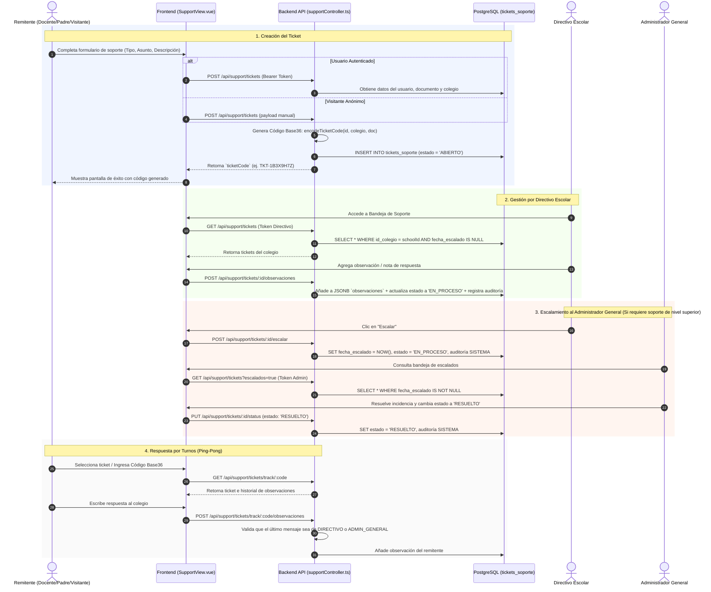

# Documentación Técnica: Módulo de Soporte y Gestión de Tickets

**Sistema:** Academia Neiva  
**Módulo:** Soporte Técnico e Incidencias (`tickets_soporte`)  
**Ubicación:** `backend/src/controllers/supportController.ts`, `backend/src/routes/support.routes.ts`, `frontend/src/views/shared/SupportView.vue`

---

## 1. Objetivo del Módulo

El **Módulo de Soporte y Gestión de Tickets** de Academia Neiva tiene como objetivo proporcionar un canal centralizado, auditable y seguro para que visitantes anónimos y usuarios autenticados (Docentes, Padres de Familia y Estudiantes) puedan reportar incidencias técnicas, académicas o administrativas. Asimismo, permite que el personal administrativo del colegio (Directivos) y la superadministración de la plataforma (Administrador General) gestionen, respondan, escalen y resuelvan las solicitudes bajo reglas de negocio estrictas de visibilidad y turnos de comunicación.

---

## 2. Descripción Funcional

El módulo opera como un sistema de tickets multi-inquilino (*multi-tenant*) articulado en dos grandes frentes:

1. **Atención al Usuario / Remitente (Vista Pública y de Usuarios Regulares):**
   - Creación de tickets de soporte indicando tipo de incidencia, asunto, descripción y datos de contacto.
   - Generación automática de un **Código de Seguimiento Base36 de alta precisión** (`TKT-XXXXX`).
   - Bandeja interactiva "Mis Tickets" en panel dividido (*split-pane*) para usuarios autenticados (`DOCENTE`, `PADRE`, `ESTUDIANTE`), permitiéndoles filtrar y seleccionar sus solicitudes creadas.
   - Búsqueda pública por código alfanumérico para visitantes anónimos.
   - Sistema de respuestas por turnos (*ping-pong*) para que el usuario responda a las observaciones registradas por el colegio o la administración.

2. **Gestión Administrativa y Soporte Institucional (Vista Staff):**
   - Bandeja de gestión para `DIRECTIVO` (filtrada automáticamente por su institución educativa) y para `ADMIN_GENERAL` (atención de casos escalados a nivel global).
   - Cambio de estado de tickets con reglas de inmutabilidad y advertencias de confirmación.
   - Escalamiento jerárquico de tickets desde el colegio hacia el Administrador General.
   - Registro de notas de observación institucional con trazabilidad de autor.
   - Generación automática de registros de auditoría del sistema ante cualquier evento crítico.

---

## 3. Actores Involucrados y Permisos

| Rol / Actor | Permisos y Alcance |
| :--- | :--- |
| **Visitante Anónimo** | - Crear tickets de soporte seleccionando la institución de la lista pública.<br>- Consultar estado de su ticket mediante el Código Base36.<br>- Responder únicamente cuando el último mensaje sea del colegio/admin. |
| **Padre de Familia / Docente / Estudiante** | - Crear tickets vinculados automáticamente a su cuenta y colegio.<br>- Consultar su historial de tickets creados en la bandeja "Mis Tickets".<br>- Filtrar sus solicitudes por estado (`ABIERTO`, `EN_PROCESO`, `RESUELTO`, `ESCALADOS`).<br>- Responder en el hilo del ticket bajo la regla de turnos. |
| **Directivo Escolar** | - Ver únicamente los tickets correspondientes a su `id_colegio`.<br>- Alternar vista entre tickets internos del colegio y tickets escalados.<br>- Cambiar estado del ticket (`ABIERTO`, `EN_PROCESO`, `RESUELTO`).<br>- Escalar tickets al Administrador General.<br>- Agregar observaciones institucionales.<br>- **Restricción:** No puede modificar el estado de tickets que ya hayan sido escalados. |
| **Administrador General** | - Ver de forma global exclusivamente los tickets que hayan sido **escalados** (`fecha_escalado IS NOT NULL`).<br>- Cambiar el estado de los tickets escalados (`EN_PROCESO`, `RESUELTO`).<br>- Agregar observaciones globales de plataforma.<br>- Atender casos críticos del sistema. |

---

## 4. Flujo Completo del Proceso



---

## 5. Reglas de Negocio Implementadas

- **RN-001. Estado Inicial:**
  Todo ticket de soporte nace en estado `'ABIERTO'` con la columna `fecha_escalado = NULL`.
- **RN-002. Restricción del Estado ABIERTO:**
  Un ticket únicamente puede permanecer o ser asignado al estado `'ABIERTO'` si **no posee observaciones** registradas y **no ha sido escalado** (`fecha_escalado IS NULL`). Si se intenta retornar un ticket con observaciones a `'ABIERTO'`, el backend rechaza la petición con error `400`.
- **RN-003. Transición Automática a EN_PROCESO:**
  Al registrar la primera observación (por parte del colegio, administración o remitente) o al escalar un ticket en estado `'ABIERTO'`, el sistema promueve automáticamente su estado a `'EN_PROCESO'`.
- **RN-004. Inmutabilidad del Registro de Escalamiento:**
  Una vez que `fecha_escalado` ha sido registrada con un timestamp, la marca de escalamiento es permanente (`IS NOT NULL`). El ticket mantendrá su trazabilidad de haber sido escalado independientemente de sus estados futuros.
- **RN-005. Bloqueo de Control para Directivos en Tickets Escalados:**
  Cuando un ticket posee `fecha_escalado IS NOT NULL`, el `DIRECTIVO` pierde el control de modificación del selector de estado en la interfaz y el backend bloquea cualquier intento de actualización por su parte (`403 Forbidden`). El botón se muestra como `"ESCALADO"` deshabilitado.
- **RN-006. Exclusividad del Administrador General en Escalados:**
  Solo los usuarios con rol `ADMIN_GENERAL` tienen autorización para cambiar el estado o responder tickets cuya `fecha_escalado` no sea nula.
- **RN-007. Inmutabilidad de Tickets RESUELTOS:**
  Un ticket en estado `'RESUELTO'` se convierte en un registro de **solo lectura**. No se permite cambiar su estado nuevamente ni agregar más observaciones por parte de directivos, administradores ni remitentes (`400 Bad Request`).
- **RN-008. Regla de Turnos en Conversaciones (Ping-Pong):**
  Un docente, padre o visitante únicamente puede responder un ticket si se cumplen dos condiciones:
  1. El ticket posee al menos una observación registrada.
  2. La última observación registrada proviene del `DIRECTIVO` o del `ADMIN_GENERAL`.
  Si la última observación fue enviada por el propio remitente, el frontend deshabilita la caja de texto y el backend rechaza cualquier intento de envío duplicado.
- **RN-009. Auditoría Automática Inalterable:**
  Todo evento administrativo (cambio de estado o escalamiento) genera un objeto de auditoría en la lista de observaciones con el tipo `'SISTEMA'`.
- **RN-010. Formato de Código Base36 Ofuscado:**
  Los códigos de ticket expuestos al público se generan mediante codificación Base36 sobre un entero de 22 dígitos derivado de: Año (4d) + ID Colegio (3d) + Documento/Teléfono (10d) + ID Ticket (5d), prefijado por `TKT-`.

---

## 6. Estados Posibles y Transiciones

### Definición de Estados (`estado`):
1. **`ABIERTO`**: Ticket recién creado, sin observaciones institucionales ni escalamiento.
2. **`EN_PROCESO`**: Ticket con observaciones en curso o atendido parcialmente por la institución / administrador general.
3. **`RESUELTO`**: Incidencia finalizada. El ticket queda en modo de solo lectura.

### Matriz de Transiciones de Estado:

| Estado Origen | Estado Destino | Desencadenante / Acción | Autorización |
| :--- | :--- | :--- | :--- |
| `ABIERTO` | `EN_PROCESO` | Directivo o Admin agrega primera observación | `DIRECTIVO`, `ADMIN_GENERAL` |
| `ABIERTO` | `EN_PROCESO` | Directivo escala el ticket | `DIRECTIVO` |
| `ABIERTO` | `RESUELTO` | Cambio manual directo de estado | `DIRECTIVO` (si id_colegio coincide) |
| `EN_PROCESO` | `RESUELTO` | Cambio manual de estado a RESUELTO | `DIRECTIVO` (si no está escalado) / `ADMIN_GENERAL` |
| `EN_PROCESO` | `ABIERTO` | **PROHIBIDO** si posee observaciones o `fecha_escalado` | Rechazado con `400 Bad Request` |
| `RESUELTO` | *Cualquiera* | **PROHIBIDO** (Estado Terminal) | Rechazado con `400 Bad Request` |

---

## 7. Modelo de Datos Utilizado

El módulo utiliza la tabla principal `tickets_soporte` de PostgreSQL.

### Tabla: `tickets_soporte`

```sql
CREATE TABLE IF NOT EXISTS tickets_soporte (
    id_ticket SERIAL PRIMARY KEY,
    id_usuario INT REFERENCES usuario(id_usuario) ON DELETE SET NULL,
    id_colegio INT REFERENCES colegio(id_colegio) ON DELETE CASCADE,
    nombre_remitente VARCHAR(150) NOT NULL,
    correo_remitente VARCHAR(150) NOT NULL,
    telefono VARCHAR(50),
    tipo_incidencia VARCHAR(50) NOT NULL,
    asunto VARCHAR(200) NOT NULL,
    descripcion TEXT NOT NULL,
    estado VARCHAR(50) DEFAULT 'ABIERTO',
    fecha_escalado TIMESTAMPTZ DEFAULT NULL,
    codigo_ticket VARCHAR(50) UNIQUE,
    observaciones JSONB DEFAULT '[]'::jsonb,
    fecha_creacion TIMESTAMPTZ DEFAULT CURRENT_TIMESTAMP,
    fecha_actualizacion TIMESTAMPTZ DEFAULT CURRENT_TIMESTAMP
);
```

### Propósito de Columnas Clave:

- `id_ticket`: Identificador numérico secuencial interno.
- `id_usuario`: FK al usuario creador (para Docentes, Padres o Estudiantes autenticados). Es `NULL` para visitantes anónimos.
- `id_colegio`: FK a la institución educativa relacionada. Permite el aislamiento multi-inquilino.
- `codigo_ticket`: Código alfanumérico público Base36 (ej. `TKT-1B3X9H7Z`). Es el token de búsqueda para visitantes.
- `fecha_escalado`: Registra la fecha y hora exacta en la que un Directivo escaló el caso al Admin General. Si es `NULL`, el ticket no ha sido escalado.
- `observaciones`: Estructura JSONB que almacena un array ordenado cronológicamente de mensajes.

#### Estructura del Objeto JSONB en `observaciones`:
```json
[
  {
    "id_usuario": 42,
    "nombre_usuario": "Carlos Alberto Ruiz",
    "tipo": "DIRECTIVO",
    "mensaje": "Se verificó el acceso del docente en la plataforma.",
    "fecha_creacion": "2026-07-20T06:15:30.000Z"
  },
  {
    "id_usuario": null,
    "nombre_usuario": "Sistema (Escalamiento)",
    "tipo": "SISTEMA",
    "mensaje": "El Directivo Carlos Alberto Ruiz escaló esta solicitud al Administrador General.",
    "fecha_creacion": "2026-07-20T06:20:00.000Z"
  }
]
```

---

## 8. Validaciones Implementadas

1. **Campos Obligatorios de Entrada (`POST /api/support/tickets`):**
   - Nombre, correo electrónico, tipo de incidencia, asunto y descripción (mínimo 10 caracteres).
2. **Validación de Identidad y Roles:**
   - Si el usuario está autenticado, el backend sobrescribe automáticamente `nombre_remitente`, `correo_remitente`, `id_usuario` e `id_colegio` desde la sesión verificada en BD.
3. **Advertencia de Confirmación Frontend (Estado `RESUELTO`):**
   - Al seleccionar el estado `RESUELTO` en el dropdown, la interfaz lanza una alerta interactiva de confirmación: *¿Está seguro de pasar el estado de este ticket a RESUELTO? Una vez resuelto, el ticket pasará a ser de solo lectura.*
   - Si el usuario cancela, el cambio de estado en red se aborta y la interfaz revierte la selección visual.
4. **Validación de Turnos de Respuesta en Backend:**
   - En `addVisitorObservation`, el servidor comprueba que `currentObs.length > 0` y que `lastObs.tipo === 'DIRECTIVO' || lastObs.tipo === 'ADMIN_GENERAL'`.

---

## 9. Auditoría y Trazabilidad

El sistema garantiza una auditoría automática sin intervención humana:

- **Cambio de Estado:** Cuando un estado cambia (ej. de `EN_PROCESO` a `RESUELTO`), el controlador inserta una entrada de tipo `'SISTEMA'` especificando el estado anterior, el nuevo estado y el nombre del usuario responsable.
- **Escalamiento:** Al presionar el botón de escalar, se genera un registro automático indicando el directivo que ejecutó el escalamiento.
- **Inmutabilidad:** Las entradas con `tipo: 'SISTEMA'` no pueden ser editadas ni removidas por ninguna interfaz del sistema.

---

## 10. Casos Especiales Contemplados

1. **Migración de Datos Históricos (Migración 018):**
   - Para resolver inconsistencias históricas de datos antiguos donde existía el valor de string `'ESCALADO'` en la columna `estado` con `fecha_escalado IS NULL`, se creó la migración `018_fix_old_escalated_tickets.sql`. Esta migración estableció `fecha_escalado = fecha_creacion` y movió el estado de esos registros a `'EN_PROCESO'`.
2. **Navegación e Interacción Pública desde la Landing Page:**
   - El acceso a soporte para visitantes anónimos está integrado en la Landing Page mediante la ruta pública `/soporte`, ocultando formularios internos administrativos.
3. **Ofuscación de Códigos Base36:**
   - El cálculo con `BigInt` evita exponer los IDs secuenciales de la base de datos a los usuarios finales.

---

## 11. Restricciones de Seguridad

- **Multi-Tenant Isolation (Aislamiento de Colegios):**
  Un `DIRECTIVO` solo puede consultar, modificar o comentar tickets cuyo `id_colegio` coincida con su colegio asignado en la tabla `usuario`.
- **Filtro de Alcance para Administrador General:**
  El `ADMIN_GENERAL` solo obtiene tickets donde `fecha_escalado IS NOT NULL`, protegiendo la autonomía operativa de los colegios.
- **Seguridad en Rutas Express:**
  - `POST /api/support/tickets`: Permite token opcional (`verifyTokenOptional`).
  - `GET /api/support/tickets`: Requiere autenticación obligatoria (`verifyToken`).
  - `PUT /api/support/tickets/:id/status` & `POST /api/support/tickets/:id/escalar`: Protegidos con `verifyToken` y validación de rol.

---

## 12. Relación con Otros Módulos del Sistema

- **Módulo de Autenticación (`authStore` / JWT):** Lee las credenciales del usuario activo para inyectar datos de sesión en los tickets creados.
- **Módulo de Colegios (`colegio`):** Relaciona los tickets con la institución correspondiente para poblar encabezados.
- **Módulo de Usuarios (`usuario`, `docente`, `padre_familia`, `estudiante`):** Consulta documentos de identificación de roles para alimentar la semilla del generador de códigos Base36.

---

## 13. Decisiones de Diseño Tomadas y Justificación

| Decisión de Diseño | Alternativa Descartada | Razón de la Elección |
| :--- | :--- | :--- |
| **Uso de columna `fecha_escalado TIMESTAMPTZ`** | Columna booleana `escalado BOOLEAN` o estado `'ESCALADO'` | La fecha entrega un valor booleano implícito (`IS NOT NULL`), además de proporcionar el registro histórico de cuándo ocurrió el escalamiento. |
| **Observaciones en columna `JSONB`** | Tabla secundaria `observaciones_tickets` | Mantiene el esquema limpio, mejora la velocidad de lectura en consultas simples y permite almacenar estructuras JSON compuestas con auditoría en una sola transacción. |
| **Código Base36 Ofuscado (`TKT-XXXX`)** | Exponer `id_ticket` secuencial numérico | Previene ataques de enumeración y scraping por parte de usuarios malintencionados. |
| **Flujo de Respuestas por Turnos (Ping-Pong)** | Chat abierto ilimitado | Evita spam de mensajes repetidos por parte de los remitentes antes de recibir respuesta del colegio. |
| **Panel Split-Pane para Usuarios Autenticados** | Vista de tabla tradicional con modales | Proporciona una experiencia de usuario moderna donde el historial y el hilo de mensajes conviven en la misma pantalla. |

---

## 14. Posibles Puntos de Extensión Futura (Sin Implementar)

- **Notificaciones por Email / WebSocket:** Envío de correos automáticos al remitente cuando el estado pase a `RESUELTO` o cuando el colegio agregue una observación.
- **Archivos Adjuntos:** Soporte para subir imágenes o PDFs descriptivos dentro del ticket.
- **Métricas y SLA de Respuesta:** Tableros estadísticos para medir el tiempo promedio de atención de tickets por colegio.
